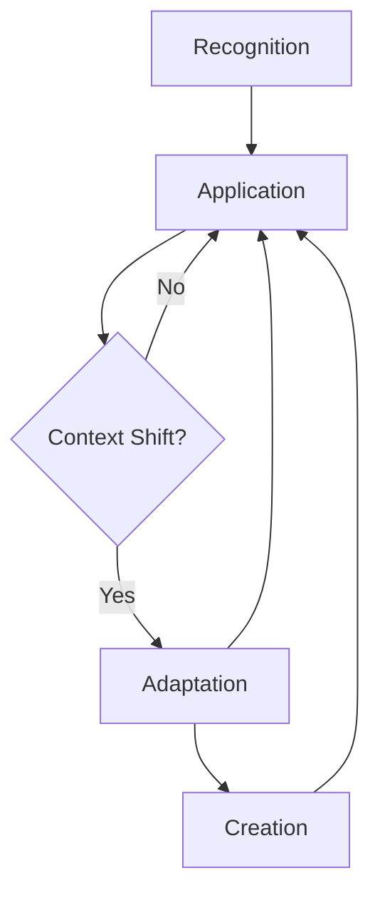

# Architecture of a Living Library

**Date:** 17 February 2026
**Authors:** higgerix, cloudsters
**Status:** v2.0

---

This document outlines the architecture of the Commons Engineering Pattern Library. Its purpose is not to be a static blueprint, but a living guide for how we cultivate this shared knowledge garden.

## 1. Vision: A Living Knowledge System

Our goal is to create a system that feels alive—one that learns, adapts, and evolves alongside the community it serves. We are not building a database of text files; we are tending a knowledge graph that helps **Cognitive Systems Builders** see the connections between problems, solutions, and each other.

This architecture is designed to support that vision through three core principles:

1.  **Write Once, Render Richly:** Separate authoring from presentation to keep the writing process clean and the user experience rich.
2.  **Machine-Readable by Default:** Structure all data in YAML frontmatter to make the graph computable, searchable, and extensible.
3.  **Community-Tended:** The system is designed to be forked, extended, and improved by the community it serves.

## 2. Core Components

-   **Jekyll:** The static site generator that transforms our Markdown files into a website.
-   **GitHub Pages:** Hosts the live site directly from the repository.
-   **YAML Frontmatter:** The structured data heart of every pattern.
-   **Markdown Body:** The narrative soul of every pattern.
-   **Liquid:** The templating language used by Jekyll to weave the data and narrative together.

## 3. The Pattern Lifecycle Engine

The true "aliveness" of the system comes from the Pattern Engine Lifecycle, which ensures that our collective knowledge is constantly tested, adapted, and renewed.

-   **Recognition:** Identifying that a recurring problem has a known solution.
-   **Application:** Deploying a proven pattern to a known problem.
-   **Adaptation:** Modifying a pattern when the context shifts.
-   **Creation:** Authoring a new pattern when no existing solution fits.

This lifecycle is not a linear process, but a continuous loop of sensing, responding, and learning.

## 4. Workflow & Validation

Our authoring workflow is designed to be simple for humans and rigorous for machines.

1.  **Create File:** `cp _templates/pattern.md _patterns/{slug}.md`
2.  **Author Content:** Fill in the YAML frontmatter and the 8 body sections, telling the story of the pattern.
3.  **Submit PR:** Open a pull request to the `main` branch.
4.  **Automated Validation:** A GitHub Action validates the file against the `PATTERN_SPEC.md`.
5.  **Community Review:** Peers review the pattern for clarity, coherence, and vitality.
6.  **Merge & Publish:** Once approved, the pattern is merged and becomes a living part of the commons.
