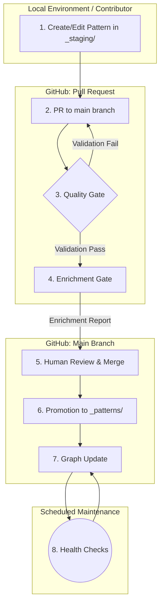
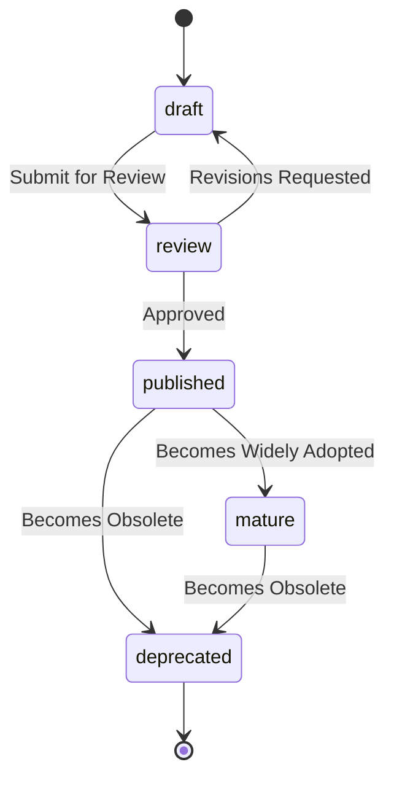

'''
# Commons OS Pattern Engine: Architecture

**Version**: 1.0
**Date**: 2026-02-01
**Author**: Manus AI

## 1. Vision & Guiding Principles

The Commons OS Pattern Engine is not a static library; it is a **living knowledge system** designed to capture, connect, and continuously improve a scalable graph of patterns and their real-world implementations (Lighthouses). Its purpose is to serve as the canonical, queryable, and machine-readable foundation for Commons Engineers—both human and AI.

### Guiding Principles

| Principle | Description |
|---|---|
| **Scalability** | The architecture must support tens of thousands of entities (Patterns, Lighthouses) without performance degradation. |
| **Durability** | Entities and their relationships must be durable over time, with stable identifiers and version history. |
| **Extensibility** | The schema must be easily extendable to accommodate new entity types, relationships, and metadata. |
| **Quality by Design** | The system must have built-in gates and workflows that ensure a high standard of quality, consistency, and completeness. |
| **Intelligence & Automation** | The system will leverage AI to automate enrichment, discover relationships, and maintain the health of the knowledge graph. |
| **Human in the Loop** | While highly automated, the system requires human oversight for final approval, ensuring contextual relevance and wisdom are applied. |

---

## 2. Core Architecture

The architecture is based on a staged, gated workflow that moves entities from creation to a canonical, published state. This ensures that no entity enters the main knowledge graph without passing validation and enrichment.

### Components

| Component | Description | Implementation |
|---|---|---|
| **Staging Area (`_staging/`)** | A dedicated directory where new or modified patterns reside before being promoted. | Git directory |
| **Quality Gate** | An automated workflow that validates the format, schema, and basic completeness of a pattern. | GitHub Action (`validate-patterns.yml`) |
| **Enrichment Gate** | An AI-powered workflow that suggests tags, discovers relationships, and scores content quality. | GitHub Action (`enrich-pattern.yml`) |
| **Promotion Workflow** | A manual or semi-automated process to move a validated and enriched pattern from `_staging/` to `_patterns/`. | GitHub Action (`promote-pattern.yml`) |
| **Knowledge Graph** | A structured representation of all entities and their relationships. | JSON files (`graph.json`), scalable to a graph database (e.g., Neo4j). |
| **Maintenance Jobs** | Scheduled tasks that check for broken links, suggest new relationships, and monitor the overall health of the graph. | GitHub Actions (cron jobs) |

---

## 3. Entity & Relationship Model

The system is built on two primary entity types: **Patterns** and **Lighthouses**.

### Entity Schema

Both entities share a common base schema and have specific fields.

**Base Schema:**
- `id`: Globally unique, immutable TypeID (`pat_...` or `lh_...`).
- `slug`: Human-readable, URL-friendly identifier.
- `title`: The official name of the entity.
- `version`: Semantic version (e.g., 1.0, 1.1).
- `status`: The current state in the quality lifecycle (`draft`, `review`, `published`, `mature`, `deprecated`).
- `created`, `modified`: ISO 8601 timestamps.
- `tags`: A flexible key-value store for metadata.

**Pattern-Specific Schema:**
- `tags.commons_alignment`: A 1-5 score.
- `tags.domain`: `governance`, `security`, `startup`, etc.
- `content`: The full Markdown body of the pattern.

**Lighthouse-Specific Schema:**
- `tags.industry`: `technology`, `agriculture`, `finance`, etc.
- `location`: Geographic location.
- `summary`: A brief description of the organization or project.

### Relationship Schema

Relationships are the core of the knowledge graph, stored with directionality.

| Relationship | Source -> Target | Description |
|---|---|---|
| `generalizes_from` | Pattern -> Pattern | "Steward Ownership" is a more general form of "Perpetual Purpose Trust". |
| `specializes_to` | Pattern -> Pattern | "Perpetual Purpose Trust" is a specialization of "Steward Ownership". |
| `enables` | Pattern -> Pattern | "Zero Trust Architecture" enables "Secure Remote Access". |
| `requires` | Pattern -> Pattern | "Secure Remote Access" requires "Zero Trust Architecture". |
| `related` | Pattern <-> Pattern | "Sociocracy" is related to "Holacracy". |
| `implements` | Lighthouse -> Pattern | "Patagonia" implements the "Steward Ownership" pattern. |
| `applied_by` | Pattern -> Lighthouse | "Steward Ownership" is applied by "Patagonia". |
| `inspired_by` | Lighthouse -> Lighthouse | "Company B" was inspired by "Company A". |
| `collaborates_with` | Lighthouse <-> Lighthouse | "Lighthouse X" collaborates with "Lighthouse Y". |

---

## 4. Quality Lifecycle

Every entity progresses through a defined lifecycle to ensure quality and relevance.

| State | Description |
|---|---|
| `draft` | Initial creation in `_staging/`. Not yet validated. |
| `review` | Submitted for review. Undergoing automated and human checks. |
| `published` | Validated, enriched, and promoted to `_patterns/`. Part of the canonical set. |
| `mature` | A published pattern that is highly connected and widely referenced. |
| `deprecated` | Outdated or superseded. Kept for historical context but flagged as no longer best practice. |

---

## 5. Tooling & Implementation

The system will be implemented using a combination of Python scripts and GitHub Actions.

### Core Scripts (`scripts/`)

| Script | Description |
|---|---|
| `generate_typeid.py` | Generates unique, stable IDs for new entities. |
| `validate_entity.py` | Validates a given entity file against the schema defined in `PATTERN_SPEC.md` and `LIGHTHOUSE_SPEC.md`. |
| `enrich_entity.py` | The AI-powered orchestrator. It runs the quality checker, tag refiner, and relationship builder. |
| `build_graph.py` | Traverses all canonical entities (`_patterns/`, `_lighthouses/`) and builds the `graph.json` file. |

### AI-Powered Enrichment Modules (used by `enrich_entity.py`)

| Module | Description |
|---|---|
| **Quality Checker** | Uses an LLM to score content for clarity, completeness, and justification of its 7 Pillars assessment. |
| **Tag Refiner** | Analyzes content to suggest relevant tags (`domain`, `category`, etc.) based on a taxonomy. |
| **Relationship Builder** | Uses embeddings (e.g., OpenAI `text-embedding-3-small`) to find semantically similar entities and suggest `related`, `enables`, etc. relationships. |

### GitHub Actions (`.github/workflows/`)

| Workflow | Trigger | Description |
|---|---|---|
| `validate.yml` | PR to `main` | **Quality Gate**. Runs `validate_entity.py` on all changed files in `_staging/`. Blocks merge on failure. |
| `enrich.yml` | PR to `main` | **Enrichment Gate**. Runs `enrich_entity.py` and posts a summary report as a PR comment. |
| `promote.yml` | Manual trigger | **Promotion**. Merges the PR and moves the validated files from `_staging/` to their canonical directories. |
| `update-graph.yml` | Push to `main` | Runs `build_graph.py` to update the knowledge graph after a promotion. |
| `health-check.yml` | Scheduled (weekly) | Runs maintenance tasks: checks for broken links, finds orphaned entities, suggests new relationships for mature patterns. |

---

## 6. Next Steps & Implementation Plan

1.  **Phase 1: Build Core Tooling**
    - Implement `generate_typeid.py` and `validate_entity.py`.
    - Create `PATTERN_SPEC.md` and `LIGHTHOUSE_SPEC.md`.
    - Set up the `validate.yml` GitHub Action.

2.  **Phase 2: Build Staging & Promotion Workflow**
    - Establish the `_staging/` directory structure.
    - Create the `promote.yml` GitHub Action.

3.  **Phase 3: Build Enrichment Pipeline**
    - Implement the AI-powered enrichment scripts (`enrich_entity.py` and its modules).
    - Create the `enrich.yml` GitHub Action.

4.  **Phase 4: Build Knowledge Graph & Maintenance**
    - Implement `build_graph.py` and the `update-graph.yml` action.
    - Create the `health-check.yml` scheduled job.

5.  **Phase 5: Process Backlog**
    - Use the complete system to process the Security and Startup patterns, moving them through the full lifecycle.
'''
