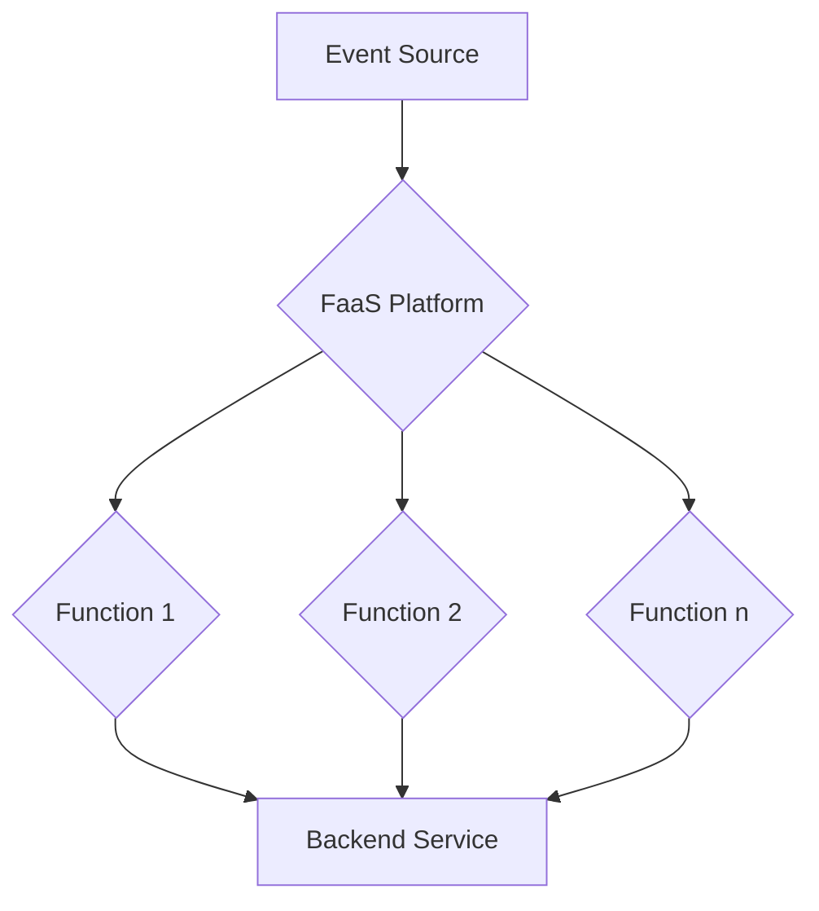

# Serverless Computing - Function as a Service

## 1. Overview

Serverless computing, and specifically Function as a Service (FaaS), represents a significant paradigm shift in how applications are designed, developed, and deployed in the cloud. It is a model where the cloud provider dynamically manages the allocation and provisioning of servers. This allows developers to focus on writing and deploying code, rather than managing the underlying infrastructure. While the name "serverless" is somewhat of a misnomer, as servers are still involved, the key distinction is that the management of these servers is entirely abstracted away from the developer. The core idea is to provide a platform where developers can execute code in response to events, without the need to provision or manage servers. This approach offers a pay-as-you-go pricing model, where users are billed only for the compute time they consume, leading to potential cost savings and increased efficiency.

Function as a Service (FaaS) is a key implementation of the serverless model. It allows developers to build applications as a collection of small, independent, and single-purpose functions. These functions are triggered by specific events, such as an HTTP request, a new message in a queue, or a file upload to a storage service. When a function is triggered, the FaaS platform automatically provisions the necessary resources to execute the code and then scales down the resources once the execution is complete. This event-driven and ephemeral nature of FaaS enables a highly scalable and cost-effective architecture for a wide range of applications.

## 2. Core Principles

The serverless FaaS model is built upon a set of core principles that differentiate it from traditional application development and deployment models. These principles are fundamental to understanding the benefits and trade-offs of adopting a serverless architecture.

**Abstraction of Infrastructure:** The most fundamental principle of serverless computing is the complete abstraction of the underlying infrastructure from the developer. This means that developers no longer need to worry about provisioning, configuring, or managing servers. The cloud provider is responsible for all aspects of the infrastructure, including the operating system, runtime environment, and scaling. This abstraction allows developers to focus solely on writing application code and business logic, leading to increased productivity and faster development cycles. [1]

**Event-Driven and Stateless Functions:** Serverless functions are designed to be event-driven and stateless. They are triggered by specific events and execute in isolated, ephemeral containers. Each function invocation is independent and does not retain any state from previous invocations. This stateless nature is crucial for enabling seamless scalability and fault tolerance. Any required state must be managed externally, typically in a database or a distributed cache. [2]

**Pay-per-Use Billing:** Serverless platforms operate on a pay-per-use billing model, where users are charged only for the actual compute time consumed by their functions. This is in contrast to traditional cloud models, where users pay for pre-provisioned resources, regardless of whether they are fully utilized. The pay-per-use model can lead to significant cost savings, especially for applications with variable or unpredictable workloads. [1]

**Automatic Scaling:** Serverless platforms provide automatic and seamless scaling of functions based on the incoming workload. As the number of events triggering a function increases, the platform automatically provisions additional function instances to handle the load. This elastic scalability ensures that the application can handle sudden spikes in traffic without any manual intervention. [2]

## 3. Key Practices

Adopting a serverless FaaS approach requires a shift in development practices. The following key practices are essential for building robust, scalable, and maintainable serverless applications.

**Single Responsibility Principle for Functions:** Each function should be designed to perform a single, well-defined task. This practice, often referred to as the Single Responsibility Principle (SRP), leads to a more modular and maintainable architecture. Small, focused functions are easier to develop, test, and debug. They also promote code reuse and independent deployment. [3]

**Event-Driven Architecture:** Serverless applications are inherently event-driven. It is crucial to design the application around events and triggers. This involves identifying the events that trigger different functions and defining the data that is passed between them. A well-designed event-driven architecture can lead to a more loosely coupled and scalable system. [4]

**Stateless Design:** As mentioned in the core principles, serverless functions should be stateless. This means that they should not store any data locally that needs to be persisted across invocations. Any required state should be managed externally in a database, cache, or other storage service. This practice is essential for enabling seamless scaling and fault tolerance. [2]

**Infrastructure as Code (IaC):** Serverless resources, such as functions, event sources, and permissions, should be defined and managed as code. This practice, known as Infrastructure as Code (IaC), allows for automated and repeatable deployments. It also enables version control and collaboration on infrastructure changes. Popular IaC tools for serverless development include the Serverless Framework, AWS CloudFormation, and Terraform. [5]

**CI/CD for Serverless:** Implementing a continuous integration and continuous delivery (CI/CD) pipeline is crucial for automating the build, test, and deployment of serverless applications. A well-defined CI/CD pipeline can significantly improve development velocity and reduce the risk of deployment errors. The pipeline should include steps for linting, unit testing, integration testing, and automated deployment to different environments. [6]

**Observability and Monitoring:** Serverless applications can be more challenging to monitor and debug than traditional monolithic applications due to their distributed and event-driven nature. It is essential to implement robust observability and monitoring practices. This includes collecting and analyzing logs, metrics, and traces from serverless functions. Tools like AWS X-Ray, Datadog, and Lumigo can provide deep insights into the performance and behavior of serverless applications. [7]

## 4. Application Context

Serverless FaaS is not a one-size-fits-all solution. It is best suited for specific types of applications and use cases where its unique characteristics can be fully leveraged. Understanding the appropriate application context is crucial for successfully implementing a serverless architecture.

**Web and Mobile Backends:** Serverless FaaS is an excellent choice for building the backend for web and mobile applications. The event-driven nature of FaaS aligns well with the request-response model of web and mobile apps. For example, a user action in a mobile app can trigger a function that processes the request, interacts with a database, and returns a response to the app. The automatic scaling of FaaS ensures that the backend can handle fluctuating user traffic without any manual intervention. [8]

**Data Processing and ETL:** Serverless functions are well-suited for data processing and ETL (Extract, Transform, Load) workloads. For example, a function can be triggered whenever a new file is uploaded to a storage service. The function can then process the file, transform the data, and load it into a data warehouse or another storage service. The parallel execution of functions allows for high-throughput data processing. [9]

**IoT and Real-time Applications:** Serverless FaaS is a natural fit for IoT (Internet of Things) applications. IoT devices can generate a large volume of events that need to be processed in real-time. Serverless functions can be triggered by these events, allowing for real-time data processing, analysis, and alerting. The pay-per-use model is also beneficial for IoT applications, as the workload can be highly variable. [9]

**Chatbots and Virtual Assistants:** Serverless functions can be used to build the backend for chatbots and virtual assistants. Each user interaction with the chatbot can trigger a function that processes the user's request, interacts with a natural language processing (NLP) service, and returns a response to the user. The stateless nature of functions is well-suited for the conversational flow of chatbots. [10]

**Scheduled Tasks and Cron Jobs:** Serverless platforms provide a simple and reliable way to run scheduled tasks and cron jobs. A function can be configured to run at a specific time or interval. This is useful for tasks such as generating daily reports, sending out email newsletters, or performing regular data backups. [9]

## 5. Implementation

Implementing a serverless FaaS architecture involves a series of steps, from choosing a cloud provider to deploying and managing the functions. The following provides a general overview of the implementation process.

**Choosing a Cloud Provider:** The first step is to choose a cloud provider that offers a FaaS platform. The major cloud providers, including Amazon Web Services (AWS), Microsoft Azure, and Google Cloud, all have mature FaaS offerings (AWS Lambda, Azure Functions, and Google Cloud Functions, respectively). The choice of provider will depend on factors such as existing cloud infrastructure, pricing, and specific features.

**Function Development:** The next step is to develop the functions. This involves writing the code for each function in a supported programming language, such as Python, Node.js, Java, or Go. It is important to follow the best practices for function development, such as the Single Responsibility Principle and stateless design. [3]

**Deployment:** Once the functions are developed, they need to be deployed to the FaaS platform. This can be done manually through the cloud provider's console or automated using an IaC tool like the Serverless Framework or AWS CloudFormation. The deployment process typically involves packaging the function code and its dependencies into a deployment package and uploading it to the platform. [5]

**Event Configuration:** After the functions are deployed, they need to be configured to be triggered by specific events. This involves creating event source mappings that link the functions to event sources, such as an API Gateway, a message queue, or a storage service. The event configuration defines the conditions under which the functions will be invoked.

**Testing and Debugging:** Testing and debugging serverless applications can be challenging due to their distributed nature. It is important to have a comprehensive testing strategy that includes unit tests, integration tests, and end-to-end tests. Cloud providers and third-party tools offer various services for debugging and monitoring serverless functions. [7]

**Diagram:**

## 6. Evidence & Impact

The adoption of serverless computing and FaaS has had a significant impact on the software development industry. Numerous studies and industry reports have highlighted the benefits and challenges of this paradigm shift.

**Increased Developer Velocity:** One of the most significant impacts of serverless is the increase in developer velocity. By abstracting away the infrastructure, serverless platforms allow developers to focus on writing code and delivering business value. This leads to faster development cycles and a quicker time to market for new applications and features. A survey by O'Reilly found that 55% of respondents who had adopted serverless reported increased developer velocity. [11]

**Reduced Operational Costs:** The pay-per-use billing model of serverless can lead to significant cost savings, especially for applications with variable or unpredictable workloads. A case study by Capital One found that they were able to reduce their operational costs by up to 80% by migrating to a serverless architecture. [12]

**Improved Scalability and Resilience:** Serverless platforms provide automatic and seamless scaling, ensuring that applications can handle sudden spikes in traffic without any manual intervention. This elastic scalability also improves the resilience of applications, as the platform can automatically recover from failures. A report by Datadog found that serverless applications have a lower error rate than traditional applications. [7]

**Challenges and Considerations:** Despite the numerous benefits, there are also challenges and considerations associated with adopting a serverless architecture. These include the potential for vendor lock-in, the complexity of debugging and monitoring distributed systems, and the learning curve for developers who are new to the paradigm. It is important to carefully evaluate these challenges and have a plan to address them before migrating to a serverless architecture. [4]

## 7. Cognitive Era Considerations

The cognitive era, characterized by the rise of artificial intelligence (AI), machine learning (ML), and data-driven decision-making, presents new opportunities and challenges for application development. Serverless computing, and FaaS in particular, is well-positioned to play a crucial role in this new era.

**Accelerating AI/ML Workloads:** Serverless FaaS is an ideal platform for running AI/ML workloads. The event-driven nature of FaaS allows for the seamless integration of ML models into applications. For example, a function can be triggered to perform real-time inference whenever new data is available. The automatic scaling of FaaS ensures that the ML models can handle a high volume of requests without any manual intervention. [13]

**Building Intelligent Applications:** Serverless FaaS enables the development of intelligent applications that can learn and adapt over time. By combining serverless functions with AI/ML services, developers can build applications that can understand natural language, recognize images, and make predictions. This opens up a wide range of possibilities for building innovative and personalized user experiences. [14]

**The Future of Serverless in the Cognitive Era:** As AI/ML continues to become more pervasive, the role of serverless computing is expected to grow. The combination of serverless and AI/ML will enable the development of a new generation of intelligent and autonomous applications. The future of serverless in the cognitive era will be characterized by the seamless integration of AI/ML into every aspect of the application development lifecycle, from development and testing to deployment and operations. [15]

## 8. Commons Alignment Assessment

The alignment of Serverless Computing and FaaS with the principles of a commons-based approach is a nuanced topic. While it offers significant advantages in terms of efficiency and accessibility, it also presents challenges related to centralization and vendor lock-in.

**1. Openness and Accessibility:** Serverless FaaS lowers the barrier to entry for developers by abstracting away the complexity of infrastructure management. This increased accessibility allows a wider range of individuals and organizations to build and deploy applications. However, the underlying platforms are often proprietary, which can limit openness and transparency.

**2. Decentralization and Federation:** At the architectural level, serverless promotes a decentralized approach to application design through the use of microservices and functions. However, at the infrastructure level, it leads to a greater centralization of power in the hands of a few large cloud providers. This can create a dependency on these providers and limit the potential for a truly federated ecosystem.

**3. Community and Collaboration:** The serverless ecosystem is supported by a vibrant and active community of developers, who contribute to open-source tools and share their knowledge through blogs, forums, and conferences. This collaborative spirit is a key driver of innovation in the serverless space. However, the proprietary nature of the underlying platforms can sometimes hinder community-led development and customization.

**4. Sustainability and Resourcefulness:** The pay-per-use model of serverless promotes a more sustainable and resourceful approach to computing. By only consuming resources when they are needed, serverless applications can significantly reduce energy consumption and waste. This aligns well with the commons principle of responsible resource management.

**5. Modularity and Interoperability:** Serverless FaaS encourages a modular and interoperable architecture. By breaking down applications into small, independent functions, developers can create systems that are more flexible, scalable, and easier to maintain. However, the lack of standardization across different FaaS platforms can limit interoperability and make it difficult to move applications between providers.

**6. Knowledge and Skill Sharing:** The serverless community is a rich source of knowledge and skill sharing. Developers can find a wealth of information on best practices, design patterns, and tooling. This open exchange of knowledge is essential for the growth and adoption of the serverless paradigm.

**7. Governance and Stewardship:** The governance of serverless platforms is largely in the hands of the cloud providers. While these providers have a vested interest in maintaining a healthy and vibrant ecosystem, their decisions are ultimately driven by their own business interests. This can create a tension between the needs of the community and the goals of the providers.

## 9. Resources & References

[1] [What is Serverless Computing?](https://www.cloudflare.com/learning/serverless/what-is-serverless/)

[2] [What is FaaS?](https://www.redhat.com/en/topics/cloud-native-apps/what-is-faas)

[3] [Serverless Architecture Patterns and Best Practices](https://www.freecodecamp.org/news/serverless-architecture-patterns-and-best-practices/)

[4] [The Serverless Functions Beginner's Guide](https://www.splunk.com/en_us/blog/learn/serverless-functions.html)

[5] [Serverless Deployment Best Practices](https://www.serverless.com/blog/serverless-deployment-best-practices)

[6] [Best practices for accelerating development with serverless blueprints](https://aws.amazon.com/blogs/infrastructure-and-automation/best-practices-for-accelerating-development-with-serverless-blueprints/)

[7] [Best practices for building serverless applications that are well-architected](https://www.datadoghq.com/blog/well-architected-serverless-applications-best-practices/)

[8] [What Is Function as a Service (FaaS)?](https://www.ibm.com/think/topics/faas)

[9] [Function as a Service (Faas) - System Design](https://www.geeksforgeeks.org/system-design/function-as-a-service-faas-system-design/)

[10] [Building Intelligent Cloud Applications](https://www.oreilly.com/library/view/building-intelligent-cloud/9781492052319/)

[11] [O'Reilly serverless survey 2019: Concerns, what works, and what to expect](https://www.oreilly.com/radar/oreilly-serverless-survey-2019-concerns-what-works-and-what-to-expect/)

[12] [Principles and Patterns of a Serverless First Mindset](https://www.capitalone.com/tech/cloud/serverless-first-mindset-pros-and-cons/)

[13] [Adopt serverless architecture for AI/ML workload processes](https://patterns.greensoftware.foundation/catalog/ai/serverless-model-development/)

[14] [Building serverless architectures for agentic AI on AWS](https://docs.aws.amazon.com/prescriptive-guidance/latest/agentic-ai-serverless/introduction.html)

[15] [Serverless AI: The Complete Guide to Building and Deploying AI Applications without Infrastructure](https://medium.com/aidatatools/serverless-ai-the-complete-guide-to-building-and-deploying-ai-applications-without-infrastructure-9a454cf6c48d)

---

## Navigation

- **Page URL**: [https://commons-os.github.io/patterns/domain/serverless-computing-function-as-a-service/](https://commons-os.github.io/patterns/domain/serverless-computing-function-as-a-service/)
- **Source**: [View on GitHub](https://github.com/commons-os/patterns/blob/main/_domain/serverless-computing-function-as-a-service.md)
- **Edit**: [Edit this pattern](https://github.com/commons-os/patterns/edit/main/_domain/serverless-computing-function-as-a-service.md)

---

*Commons OS Pattern Library - Distributed by [cloudsters](https://cloudsters.net)*
