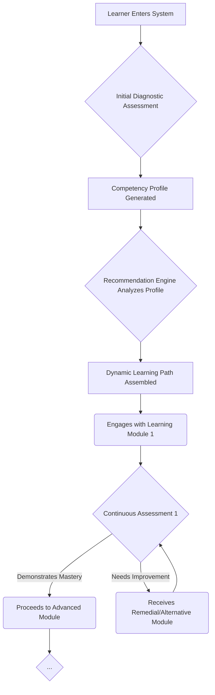

> A pattern for creating dynamic learning pathways that adjust in real-time to a learner's performance, needs, and goals, ensuring efficient and effective mastery of skills.

### 1. Context

In any evolving system—be it a multinational corporation, a municipal government, or a grassroots community initiative—the capacity to learn and adapt is paramount for survival and success. The conventional approach to education and training, however, is a relic of the industrial age, predicated on a one-size-fits-all model. A standardized curriculum is broadcast to a diverse audience of learners, each possessing a unique combination of prior knowledge, cognitive styles, and personal ambitions. This method of mass knowledge transmission is profoundly inefficient and increasingly misaligned with the volatile, uncertain, complex, and ambiguous (VUCA) nature of the modern world. Organizations grapple with rapidly expiring skill sets and the constant need for reskilling, while individuals demand more personalized, engaging, and efficient avenues for professional and personal growth. The frequent outcome is a significant disconnect between the content of learning programs and the actual competencies required for a system to thrive, resulting in squandered resources, learner disengagement, and a critical failure to cultivate necessary capabilities.

### 2. Problem

> **The core conflict is Standardized Curriculum vs. Individualized Mastery.**

This tension manifests through several competing forces that organizations and learning systems must navigate:

1.  **Force 1: Efficiency of Scale vs. Individual Relevance.** Creating and delivering standardized training programs is economically efficient, allowing for broad reach with a single effort. However, this efficiency comes at the cost of relevance. When content is not tailored, learners are forced to endure material they have already mastered or struggle with concepts for which they lack the prerequisites. This leads to boredom, frustration, and ultimately, a failure to engage with the learning process.
2.  **Force 2: Consistent Outcomes vs. Diverse Starting Points.** Standardization strives for uniform, predictable learning outcomes, which are essential for certifications, quality assurance, and maintaining a common knowledge base. Yet, learners do not begin their journey from the same starting line. They bring a wide spectrum of prior knowledge, cultural backgrounds, and learning aptitudes. A rigid, inflexible curriculum cannot effectively accommodate this diversity, often exacerbating the gap between those who grasp the material quickly and those who require additional support.
3.  **Force 3: Time-Bound Cohorts vs. Self-Paced Progression.** Traditional educational models are often organized around fixed schedules and cohort-based advancement. This structure compels all learners to proceed at an identical pace, irrespective of their individual progress in mastering the material. More advanced learners are artificially constrained, while others are prematurely advanced, leading to a superficial and fragile grasp of essential concepts and skills.

### 3. Solution

> **Therefore, implement a learning system that dynamically adjusts the content, pace, and difficulty of the learning path based on the individual’s real-time performance and demonstrated competency.**

This solution marks a fundamental shift from a linear, content-centric paradigm to a modular, learner-centric one. The essence of the Adaptive Learning pattern is a sophisticated feedback loop that continuously assesses a learner's comprehension and tailors the educational experience in response. This is operationalized through a system comprising several key components:

1.  **A Modular Content Repository:** The foundation of the system is a repository where learning materials are deconstructed into granular, tagged units (e.g., articles, video lectures, interactive simulations, case studies, practice exercises). Each unit is meticulously mapped to specific learning objectives and competency levels within a broader framework.
2.  **A Competency Framework:** A clearly articulated model of the skills, knowledge, and abilities to be acquired is essential. This framework provides the underlying structure for designing learning paths and serves as the benchmark for all assessment activities.
3.  **An Assessment Engine:** This engine is the diagnostic heart of the system. It continuously evaluates learner progress through a rich variety of methods, including diagnostic quizzes, interactive challenges, peer reviews, and project-based evaluations. The assessments are designed to precisely identify areas of strength and weakness.
4.  **A Recommendation Engine:** Functioning as the system's intelligence, this engine analyzes the data from the assessment engine to select and present the most suitable learning units to the individual. If a learner is struggling with a concept, the engine might offer alternative explanations, foundational materials, or a different instructional modality. Conversely, if a learner demonstrates mastery, the engine can provide more advanced challenges or allow them to bypass certain modules entirely.

This adaptive cycle ensures that each learner navigates a unique, optimized pathway through the educational material. The primary goal shifts from merely 'covering the content' to verifiably 'achieving mastery,' fostering a more profound, durable, and efficient learning process.

### 4. Implementation

1.  **Define the Competency Framework:** The initial and most critical step is to meticulously map the domain of knowledge or skill. Identify the core competencies and decompose them into a granular, hierarchical structure, from foundational principles to advanced applications. This framework is the blueprint for the entire system.
2.  **Create or Curate Modular Content:** Develop a rich and diverse library of learning assets. For each competency in your framework, create or source multiple content objects that address it. Tag each object with its corresponding competency, difficulty level, and media type. The more varied and modular the content, the more adaptive and engaging the experience will be.
3.  **Select or Build the Adaptive Engine:** Choose a technology platform capable of executing the adaptive logic. This could range from a sophisticated off-the-shelf Learning Management System (LMS) with adaptive features to a custom-built engine. The essential capability is the system's ability to track learner interactions in detail and dynamically reconfigure the learning path based on a set of rules or algorithms.
4.  **Design a Multi-faceted Assessment Strategy:** Develop a robust assessment strategy that goes beyond simple multiple-choice questions. Incorporate performance-based tasks, simulations, and project-based work to assess the application of knowledge. Use a combination of formative assessments (to provide ongoing feedback) and summative assessments (to validate mastery).
5.  **Pilot, Analyze, and Iterate:** Launch the adaptive learning program with a representative pilot group. Collect extensive data on learner pathways, engagement patterns, and performance outcomes. Use this data to continuously refine the competency framework, the quality of the content, and the effectiveness of the adaptive algorithms. An adaptive learning system should itself be a learning system, constantly evolving and improving based on evidence.

**Key Considerations:**

*   **Data Privacy and Ethics:** Adaptive learning systems generate vast amounts of granular data on learner behavior. It is imperative to establish transparent data governance policies and robust security measures to protect learner privacy and ensure ethical use of the data.
*   **The Evolving Role of the Educator:** In an adaptive environment, the instructor's role transforms from a dispenser of information to a facilitator of learning. Educators leverage the system's data to identify at-risk learners, provide targeted one-on-one or small-group support, and focus on higher-order skills like critical thinking and collaboration.
*   **Maintaining Learner Agency and Community:** While personalization is powerful, it's crucial to avoid creating isolating 'filter bubbles.' Design the experience to include opportunities for social learning, collaborative projects, and peer-to-peer interaction to foster a sense of community and expose learners to diverse perspectives.

**Common Pitfalls:**

*   **Techno-Solutionism:** Viewing adaptive learning as a purely technological fix for a pedagogical challenge. The technology is an enabler, but the foundation must be sound instructional design.
*   **Insufficient Content Quality and Diversity:** An adaptive algorithm is only as effective as the content it has to work with. A lack of high-quality, diverse learning materials will result in a repetitive and unengaging experience.
*   **A Flawed or Incomplete Competency Model:** Without a clear, accurate, and comprehensive map of the learning domain, the system cannot generate logical or effective learning paths, leading to a disjointed and confusing experience for the learner.

### 5. Consequences

**Benefits:**

*   **Radical Efficiency:** By focusing time and attention precisely where it is needed, learners can achieve mastery more quickly. This translates to a higher return on investment for corporate training and accelerated academic progress in education.
*   **Profound Engagement:** The personalized nature of the experience makes learning more relevant, challenging, and motivating. This leads to higher completion rates, deeper understanding, and better long-term retention of knowledge.
*   **Enhanced Equity and Accessibility:** Adaptive systems can act as a powerful tool for equity, providing tailored support to learners who need it most, while simultaneously offering advanced challenges to high-flyers. This helps to close achievement gaps and allows every learner to reach their full potential.

**Liabilities:**

*   **Significant Upfront Investment:** The design of a competency framework, the creation of a modular content library, and the implementation of the technology platform require a substantial initial investment of time, resources, and expertise.
*   **The Risk of a Pedagogical 'Filter Bubble':** Over-personalization can lead to learners becoming isolated in their individual pathways, missing out on the serendipitous learning and diverse viewpoints that arise from group interaction and shared struggle.
*   **Implementation Complexity:** Designing, managing, and iterating on an adaptive learning system is a complex undertaking that requires a multidisciplinary team with expertise in instructional design, subject matter, data science, and software engineering.

**When NOT to use this pattern:**

*   When the primary learning objective is social, such as team building, acculturation, or developing a community of practice. In these cases, a cohort-based, collaborative model is superior.
*   For very small, intimate learning groups where a skilled facilitator can provide manual personalization more effectively and with greater nuance than an automated system.
*   When the subject matter is highly abstract, philosophical, or creative, and does not easily lend itself to decomposition into a structured competency framework.

### 6. Known Uses

*   **Higher Education: Arizona State University (ASU):** ASU is a globally recognized leader in the large-scale implementation of adaptive learning. Through its partnership with technology providers like Knewton and DreamBox Learning, ASU has integrated adaptive courseware into high-enrollment, foundational courses, particularly in mathematics. The system, known as ALEKS (Assessment and LEarning in Knowledge Spaces), uses adaptive questioning to quickly and accurately determine exactly what a student knows and doesn't know. The result has been a significant increase in pass rates, a reduction in withdrawal rates, and a more equitable learning experience for students from all backgrounds.
*   **Corporate Training: IBM:** Facing the monumental task of continuously upskilling a global workforce of hundreds of thousands, IBM developed an internal adaptive learning platform called 'Your Learning'. This AI-driven platform creates a personalized learning ecosystem for each employee. It analyzes their current role, skills profile, and stated career aspirations to recommend a unique blend of courses, articles, videos, and mentorship opportunities. This has allowed IBM to be more agile in developing critical skills in fast-evolving domains like artificial intelligence, quantum computing, and cybersecurity, directly linking learning to business strategy.
*   **Professional Certification: The College of American Pathologists (CAP):** The CAP utilizes an adaptive learning platform to help its members prepare for rigorous board certification and recertification exams. The platform, Otto, moves beyond simple practice questions by using a spaced repetition algorithm to present concepts at optimal intervals for long-term retention. It identifies each user's specific knowledge gaps and creates a personalized study plan that focuses their effort on the areas of greatest need. This data-driven approach has resulted in higher exam pass rates, increased confidence, and a more efficient and less stressful preparation process for busy medical professionals.

### 7. Cognitive Era Considerations

In the Cognitive Era, the Adaptive Learning pattern is poised for a profound evolution. AI and intelligent agents can supercharge the core feedback loop of 'assess, recommend, learn,' making it dramatically more nuanced, responsive, and effective. AI can analyze a far richer stream of data to inform the adaptive process, moving beyond simple quiz scores to include sentiment analysis of written responses, engagement levels inferred from interaction patterns, and even biometric data (with appropriate ethical safeguards). AI-powered agents can function as sophisticated, personalized tutors, providing real-time, Socratic feedback, generating novel practice problems on the fly, and adapting their communication style to match the learner's emotional state. However, this amplification of capability also introduces significant new risks. The data collected becomes intensely personal, magnifying concerns around privacy, surveillance, and ethical use. The potential for algorithmic bias is also a major concern; the system could inadvertently perpetuate existing societal biases, steering certain demographic groups toward or away from particular fields of study. The human role, therefore, becomes more critical than ever. Educators must evolve into learning architects, mentors, and ethical overseers. Their focus will shift from content delivery to designing the learning ecosystem, coaching students on metacognitive skills, fostering collaboration and critical thinking, and ensuring the AI serves the holistic development of the human learner, not just the optimization of a narrow set of metrics.
