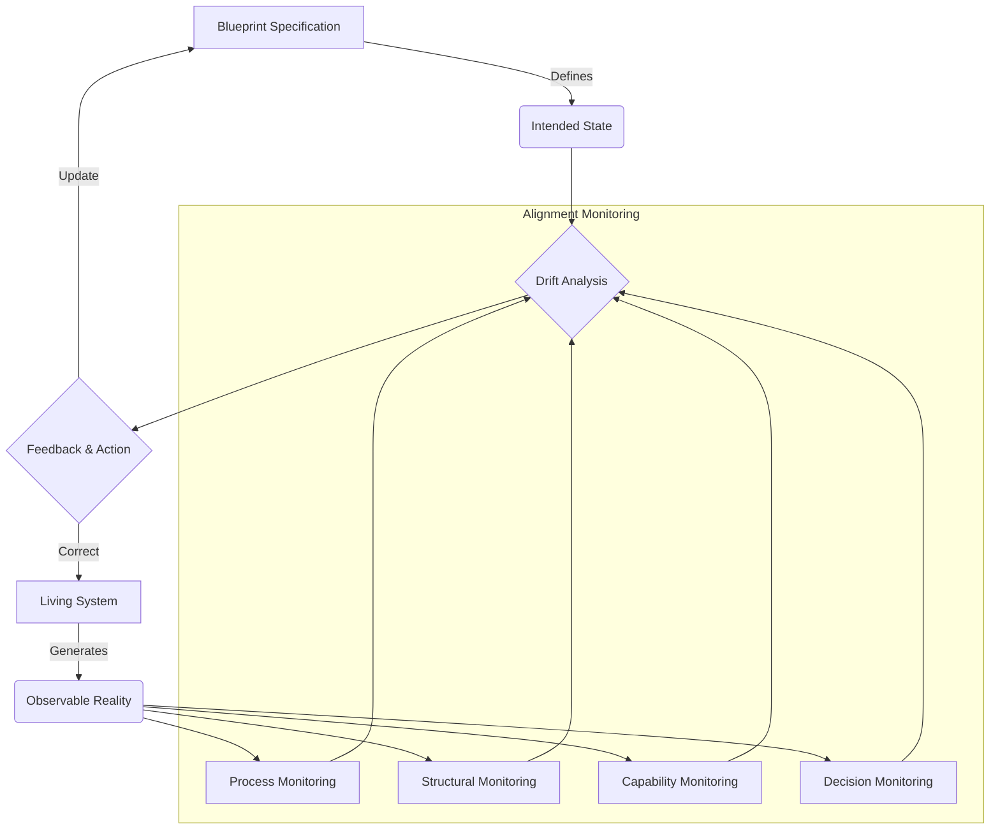

> A continuous process of detecting and analyzing divergence between a system's documented specification and its real-world behavior to maintain strategic alignment and operational integrity.

### 1. Context

In any complex organization, a gap inevitably forms between the intended design and the operational reality. This isn't a sign of failure, but a natural consequence of entropy and adaptation. Plans are made, processes are documented, and organizational charts are drawn, but day-to-day work is a messy, adaptive, and evolving human activity. People discover shortcuts, informal networks emerge to get work done more efficiently, and new tools are adopted without formal approval. The documented system—the map—begins to diverge from the territory of actual practice. For decades, this drift was managed through human intuition and adaptation. An experienced manager knows the "real" process, not just the one in the manual. However, as we enter an era of increasing automation and agent-driven systems, this reliance on tacit knowledge becomes a critical vulnerability. When autonomous agents and automated workflows execute based on an outdated or inaccurate specification, they can produce outcomes that are technically correct according to the map, but disastrously wrong in the territory. The quiet, unmonitored drift that was once a source of resilience can become the root of catastrophic failure.

### 2. Problem

> **The core conflict is Specified System vs. Actual System.**

This tension manifests through several competing forces that pull the organization out of alignment:

1.  **Force 1: The Illusion of Control vs. The Reality of Emergence.** Leadership and management functions strive to create order and predictability through specifications, plans, and controls. However, the frontline of any organization is a complex adaptive system where emergent, informal solutions constantly arise to meet immediate needs. Suppressing this emergence stifles innovation, but allowing it to run unchecked leads to a chaotic and fragmented operational landscape.

2.  **Force 2: The Need for Stability vs. The Imperative of Adaptation.** A stable, well-defined system is efficient and scalable. It provides a clear framework for action and decision-making. Yet, the external environment is in constant flux, demanding continuous adaptation. The very structures that create stability can become rigid barriers to necessary change, causing the organization to fall out of sync with its market, its customers, and its own strategic goals.

3.  **Force 3: Beneficial vs. Harmful Drift.** Not all drift is negative. Some deviations from the specification represent genuine process innovations or creative workarounds that should be captured and formalized. Other forms of drift, however, represent a degradation of capability, a lapse in compliance, or an increase in operational risk. The challenge is to distinguish between productive evolution and harmful entropy without creating a bureaucratic system of oversight that stifles both.

4.  **Force 4: The Signal and the Noise.** In a flood of operational data, identifying the faint signals of strategic drift is incredibly difficult. Key Performance Indicators (KPIs) may remain stable for a time, masking underlying issues. Communication breakdowns, resource misallocations, and the gradual erosion of shared context are subtle indicators that are easily lost in the day-to-day noise of running the organization.

### 3. Solution

> **Therefore, implement a continuous, multi-layered system to monitor and interpret the variance between the documented specification and the observable reality of the living system.**

This solution moves beyond periodic audits and static compliance checks to a dynamic, ongoing process of alignment monitoring. It treats the organization's specification not as a rigid command, but as a hypothesis that is constantly being tested against the data of its actual performance. The core of the solution is to instrument the system to make its operations observable and then to establish feedback loops that compare this observed reality to the intended state. This comparison happens across four distinct dimensions of potential drift:

*   **Process Drift:** Are workflows being executed as designed? Are steps being skipped, added, or reordered? Are handoffs occurring as specified?
*   **Structural Drift:** Is the actual pattern of communication and collaboration aligned with the formal organizational structure? Are informal teams and networks supplanting the org chart?
*   **Capability Drift:** Are the organization's capabilities performing at the specified level? Are there signs of degradation or, conversely, of emergent capabilities that exceed the specification?
*   **Decision Drift:** Are decisions being made according to the established governance processes? Are the outcomes of those decisions consistent with the organization's stated purpose and values?

This multi-dimensional approach provides a holistic view of organizational alignment. A Mermaid diagram illustrating this process is below:

### 4. Implementation

Implementing a robust Alignment Monitoring system is a significant undertaking that requires a phased approach. The following steps provide a practical roadmap:

1.  **Define the Specification:** The first and most critical step is to have a clear, coherent, and accessible specification to monitor against. This is the role of the Commons Blueprint. It must define the organization's purpose, value streams, structure, capabilities, and governance processes in a machine-readable format.

2.  **Instrument for Observability:** You cannot monitor what you cannot see. Instrument the organization's core processes and platforms to generate data about their execution. This can include:
    *   **Event Logs:** Capturing key events from software systems, IoT devices, and other digital platforms.
    *   **Communication Data:** Analyzing anonymized metadata from communication platforms (like Slack or Teams) to map informal networks.
    *   **Performance Metrics:** Collecting data from operational systems on throughput, cycle time, error rates, and other performance indicators.
    *   **Decision Records:** Creating a structured log of key decisions, the rationale behind them, and the authority under which they were made.

3.  **Establish Comparison Logic:** For each dimension of drift, define the logic for comparing the observed data to the specification. For example:
    *   **Process Drift:** Use process mining algorithms to compare event logs against the specified business process models (BPMN).
    *   **Structural Drift:** Use organizational network analysis (ONA) to compare communication patterns against the formal org chart.
    *   **Capability Drift:** Compare performance metrics against the service level objectives (SLOs) defined in the capability specification.
    *   **Decision Drift:** Audit decision records against the governance protocols and authority matrices.

4.  **Define Drift Thresholds:** Not all deviation is significant. Define clear thresholds for what constitutes normal variance versus meaningful drift. This is not a one-size-fits-all decision; the thresholds will vary depending on the criticality of the process or capability. For example, a minor deviation in an internal administrative process might be acceptable, while any deviation in a safety-critical system would trigger an immediate alert.

5.  **Classify and Route Drift:** When significant drift is detected, it must be classified and routed to the appropriate feedback loop. A simple classification scheme is:
    *   **Beneficial Drift:** An innovation or improvement that should be analyzed and potentially incorporated into the specification.
    *   **Harmful Drift:** A degradation or risk that requires corrective action.
    *   **Neutral Drift:** A minor deviation that should be monitored but does not require immediate action.

6.  **Close the Loop:** The final step is to act on the insights generated by the monitoring system. This can involve updating the Blueprint to reflect a beneficial innovation, initiating a project to correct a harmful deviation, or simply continuing to monitor a neutral drift.

### 5. Consequences

**Benefits:**

*   **Enhanced Resilience:** By making drift visible, the organization can proactively address misalignments before they escalate into crises. This creates a more resilient and adaptive system.
*   **Accelerated Learning:** The system provides a constant stream of feedback on the effectiveness of the organization's design, enabling rapid learning and evolution.
*   **Improved Governance:** Alignment Monitoring provides the objective data needed for honest and effective governance, ensuring that decisions are based on reality, not on an outdated map.
*   **Safe AI Integration:** In the cognitive era, this pattern is a prerequisite for the safe and effective deployment of autonomous agents. It ensures that agents are operating against a specification that is grounded in reality.

**Liabilities:**

*   **Surveillance Concerns:** The instrumentation required for Alignment Monitoring can be perceived as invasive by employees. It is crucial to implement this pattern with a strong ethical framework, focusing on processes and systems rather than individuals, and maintaining transparency about what is being monitored and why.
*   **Implementation Complexity:** Building a comprehensive Alignment Monitoring system is a complex technical and organizational challenge. It requires a significant investment in technology, data science expertise, and change management.
*   **The Risk of Over-Correction:** There is a danger of creating a system that is too rigid and attempts to correct every minor deviation. This can stifle innovation and create a culture of fear. The focus should be on identifying and acting on significant, strategic drift.

**When NOT to use this pattern:**

This pattern is less applicable in very small, early-stage organizations where informal communication and ad-hoc processes are sufficient. It is also not a priority during periods of radical transformation or crisis, where the focus is on survival and rapid, top-down change rather than the fine-tuning of an existing system.

### 6. Known Uses

*   **DevOps and Configuration Management:** The entire DevOps movement is a powerful example of Alignment Monitoring. Tools like Terraform and Ansible are used to define the desired state of infrastructure as code (the specification). These tools then continuously monitor the actual state of the infrastructure and can automatically correct any drift, ensuring that the reality matches the specification.

*   **Machine Learning Model Monitoring:** In the field of machine learning, "model drift" is a well-known problem where the performance of a model degrades over time as the statistical properties of the data it receives in production diverge from the data it was trained on. Companies like Google and Amazon have built sophisticated systems to continuously monitor their models for drift and trigger alerts when retraining is needed.

*   **Strategic Execution with OKRs (Intuit):** Intuit, the company behind TurboTax and QuickBooks, uses the Objectives and Key Results (OKR) framework to maintain strategic alignment. The OKRs serve as a clear specification of the company's goals. Progress against these OKRs is tracked continuously, and quarterly briefings are used to review progress and make course corrections. This creates a tight feedback loop between strategy and execution. [1]

*   **Process Mining in Manufacturing (Siemens):** Siemens has used process mining technology to analyze the event logs from its manufacturing execution systems. By comparing the actual process flows to the ideal, specified process, they have been able to identify bottlenecks, compliance issues, and opportunities for improvement, leading to significant cost savings and efficiency gains.

### 7. Cognitive Era Considerations

The rise of AI and autonomous agents makes Alignment Monitoring not just a useful pattern, but an essential one for safety and success. In the cognitive era, the nature of drift and its consequences are fundamentally altered:

*   **Amplified Risk of Misalignment:** When a human employee operates against a slightly outdated process, they can use their judgment to adapt. When an AI agent operates against that same outdated process, it will execute it flawlessly but incorrectly, potentially at massive scale and speed. Alignment Monitoring is the primary defense against this new class of failure mode.

*   **AI-Powered Monitoring:** The good news is that AI is also a powerful tool for implementing this pattern. AI agents can be deployed to perform many of the monitoring and analysis tasks, such as:
    *   **Automated Process Mining:** AI can analyze vast event logs to detect subtle patterns of process drift.
    *   **Network Analysis:** AI can analyze communication data to identify emerging informal structures and compare them to the formal org chart.
    *   **Predictive Drift Detection:** AI models can be trained to predict when and where drift is likely to occur based on historical data, allowing for proactive intervention.

*   **The Meta-Drift Problem:** A new and challenging problem arises: who monitors the monitoring agents? An AI agent tasked with detecting drift is itself operating against a specification. If that specification drifts, the entire monitoring system can be compromised. This creates a need for a higher-level auditing process, potentially involving human oversight or a separate, independently specified set of auditing agents.

*   **Human-in-the-Loop Governance:** Ultimately, the cognitive era will require a sophisticated model of human-AI collaboration in governance. AI agents can be responsible for the continuous monitoring and detection of drift, but humans must remain in the loop to interpret the significance of that drift, to distinguish between beneficial and harmful deviations, and to make the final decisions about when and how to intervene.

### References

[1] [Organizational Alignment: 8 Companies Got Strategy-Execution](https://linkedxl.com/organizational-alignment-examples/)
