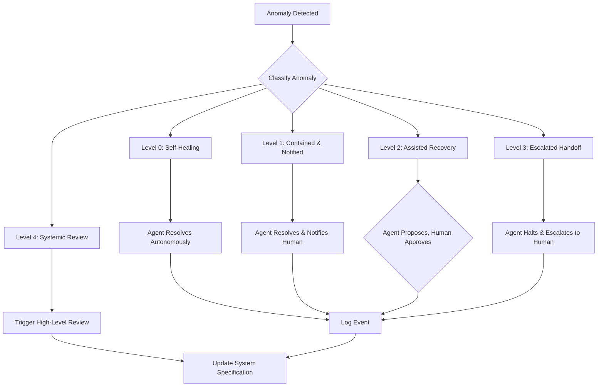

### 1. Context

In any living system, whether a business, a city, or a software application, the unexpected is inevitable. Standard operating procedures and automated workflows are designed for the ninety-nine percent of cases where things go as planned. But what about the one percent? In traditional, human-centric operations, this is the domain of the seasoned expert—the factory floor supervisor, the veteran air traffic controller, or the senior engineer who has "seen it all before." Their experience provides an intuitive, often undocumented, ability to diagnose a novel problem, improvise a solution, and keep the system running. This reliance on individual heroics is both a strength and a critical vulnerability. It creates a system that is resilient only as long as the hero is present. When that expert knowledge is not codified, the system is brittle. As we increasingly delegate operational control to automated agents, this implicit, unarticulated knowledge of exception handling becomes a glaring gap in the specification. An agent without a clear protocol for the unexpected is a liability, a ghost in the machine lacking the living memory to handle novelty, capable of either halting helplessly or, far worse, making an uninformed guess that could cascade into catastrophic failure.

### 2. Problem

> **The core conflict is Autonomous Recovery vs. Safe Escalation.**

When an anomaly occurs, the system faces a fundamental dilemma. On one hand, there is a need for a swift, automated response to minimize disruption and maintain performance. On the other hand, an incorrect autonomous action can amplify the initial problem, leading to greater damage. This tension manifests through several competing forces, the push and pull of a system striving to maintain its integrity:

1.  **Speed vs. Safety:** The pressure to restore normal operations quickly is immense. Downtime can mean lost revenue, reputational damage, or even physical danger. Autonomous recovery promises the fastest possible response. However, a hasty, ill-conceived automated action can be more dangerous than the initial anomaly itself. The system must balance the need for speed with the imperative to act safely and correctly.
2.  **Known Unknowns vs. Unknown Unknowns:** Some anomalies, while infrequent, are predictable. We can anticipate certain types of failures (e.g., a server becoming unresponsive) and script a response. These are "known unknowns." But many of the most critical incidents arise from situations that were never anticipated—the "unknown unknowns." A robust anomaly response system must handle both scripted responses for common issues and a safe, default pathway for genuinely novel events.
3.  **Local Containment vs. Systemic Response:** An anomaly might be a localized issue, affecting a single component or value stream. In this case, the ideal response is to contain and resolve it locally to avoid disrupting the wider system. However, what appears to be a local fault could be the first symptom of a deeper, systemic problem. Overly aggressive local containment might mask a critical issue that requires a system-wide response or even a fundamental change in the system's design.
4.  **Efficiency vs. Redundancy:** Operating at peak efficiency often means trimming away redundant resources. However, those very redundancies (e.g., backup servers, duplicate personnel) are often the primary tools for responding to anomalies. An over-emphasis on efficiency can leave the system with no slack or capacity to absorb shocks and recover from failure, making it brittle and fragile.

### 3. Solution

> **Therefore, establish a multi-layered exception handling framework that classifies anomalies by severity and novelty, routing them through a spectrum of responses from fully autonomous recovery to full human-led escalation.**

This solution moves beyond a simple binary choice between automation and human intervention. It creates a graduated response system that matches the nature of the anomaly. The core of this pattern is an **Exception Taxonomy**, a classification system that categorizes potential failures and maps them to pre-defined response protocols. This taxonomy typically has several levels:

*   **Level 0 (Self-Healing):** These are minor, well-understood deviations where the autonomous agent can take corrective action with full confidence. The action is logged, but no human notification is required. *Example: A transient network error that is resolved by a simple retry.* 
*   **Level 1 (Contained & Notified):** The agent handles the anomaly autonomously but notifies a human operator that the event occurred. This keeps humans in the loop and helps detect patterns of repeated, minor failures. *Example: A software service automatically restarts after a crash and sends an alert.*
*   **Level 2 (Assisted Recovery):** The agent detects the anomaly and proposes one or more solutions, but a human must approve the action. This combines the speed of machine analysis with the judgment of a human expert. *Example: An e-commerce system detects a fraudulent order pattern and flags it for a manager to approve the cancellation.*
*   **Level 3 (Escalated Handoff):** The anomaly is too complex or novel for the agent to diagnose. The agent's role is to safely halt the process, preserve all relevant context (logs, state, sensor readings), and escalate to a human operator for manual intervention. *Example: An autonomous vehicle encounters an unrecognizable obstacle and pulls over, handing control back to the driver.*
*   **Level 4 (Systemic Review):** A Level 3 event, or a pattern of lower-level events, that indicates a fundamental flaw in the system's design or specification. This triggers a high-level review process, often involving multiple stakeholders, to consider changes to the system's core logic. *Example: Repeated inventory shortages in a supply chain trigger a strategic review of the entire forecasting and logistics model.*

This framework ensures that the response is always proportional to the risk, allowing the system to breathe. It empowers agents to act decisively when appropriate, while guaranteeing that human oversight is engaged for high-stakes or ambiguous situations, ensuring the system's soul remains intact.

### 4. Implementation

Implementing a robust Anomaly Response framework is a systematic process of cataloging risks and designing layered defenses. It requires a shift from a purely reactive, incident-based mindset to a proactive, resilience-oriented one.

1.  **Form a Cross-Functional Anomaly Working Group:** This is not a task for a single department. Assemble a team that includes system architects, senior operators, domain experts, and business stakeholders. Their first task is to brainstorm and catalog potential anomalies based on historical data, near-misses, and expert judgment.

2.  **Develop the Exception Taxonomy:** Using the Level 0-4 framework as a starting point, classify the cataloged anomalies. For each anomaly, define:
    *   **Detection Criteria:** What specific, measurable signals indicate this anomaly is occurring? (e.g., latency > 500ms for 1 minute).
    *   **Response Level:** Assign a level (0-4) based on its potential impact and the confidence in an automated response.
    *   **Containment Action:** What is the immediate, automated first step to prevent the problem from spreading? (e.g., isolate the affected database).
    *   **Resolution Steps:** What is the full procedure to resolve the issue and restore normal service?
    *   **Escalation Path:** Who is notified or takes control at each stage?

3.  **Specify the "Unknown Anomaly" Protocol:** This is the most critical step. Define the default safe state for any event that does not match a known anomaly signature. In most cases, this should be a Level 3 response: halt the process, preserve state, and escalate to a human with maximum context. **Under no circumstances should the default be to improvise or guess.**

4.  **Instrument the System:** Deploy the monitoring, logging, and alerting tools necessary to detect the defined anomaly signatures. Ensure that when an escalation occurs, the system automatically gathers and presents all relevant contextual data to the human operator. This minimizes the time spent on diagnosis.

5.  **Build the Feedback Loop:** The goal is not just to fix incidents, but to learn from them. Every anomaly, regardless of level, should generate a record. Level 3 and 4 events must trigger a formal post-mortem or root cause analysis (RCA). The output of this analysis should be a concrete proposal for improving the system's specification, potentially creating a new Level 0-2 response for a previously unknown anomaly.

6.  **Simulate and Drill:** Do not wait for a real crisis to test the system. Regularly run drills and simulations (sometimes called "Game Days" or "Chaos Engineering") to test both the automated responses and the human escalation paths. This builds collective muscle memory and reveals weaknesses in the protocol before they cause a real outage, allowing the organization to develop a felt sense of its own resilience.

**Common Pitfalls:**
*   **Over-reliance on Autonomous Recovery (Level 0/1):** A common mistake is to be overly optimistic and classify too many anomalies as suitable for fully autonomous response before sufficient data and trust have been established.
*   **Neglecting the Feedback Loop:** Fixing the immediate problem without analyzing the root cause means the same anomaly will inevitably recur. The learning process is the most important part of the pattern.
*   **Alert Fatigue:** If the criteria for lower-level responses are too strict, the system can overwhelm human operators with a flood of minor alerts, leading to alert fatigue and potentially causing them to miss a critical event.
*   **The "Boiling Frog" Problem:** A series of seemingly minor, self-healing (Level 0) events might be masking a slow-burning, systemic issue. The system needs a mechanism to detect patterns of low-level failures and escalate them for review.

### 5. Consequences

Adopting a formal Anomaly Response pattern has profound effects on a system's resilience, efficiency, and capacity to learn.

**Benefits:**
*   **Increased Resilience and Predictability:** The system behaves more predictably during failure modes, reducing the likelihood of catastrophic cascades. It can absorb shocks and recover gracefully, often without human intervention for minor issues. Practitioners feel a sense of confidence and flow, knowing the system has their back.
*   **Enhanced Auditing and Learning:** Every incident becomes a learning opportunity. The explicit logging and classification create a rich dataset for understanding system weaknesses and driving continuous improvement. This audit trail is also invaluable for compliance and accountability.
*   **Improved Human-Agent Collaboration:** By clearly defining the roles of both humans and automated agents, the pattern reduces ambiguity and stress. Human operators can focus their expertise on the most complex issues, trusting the automation to handle the routine failures.

**Liabilities:**
*   **Maintenance Overhead:** The exception taxonomy is not static. It must be continuously updated as the system evolves and new failure modes are discovered. This requires an ongoing commitment of resources.
*   **Risk of Over-Escalation:** If the criteria for lower-level responses are too strict, the system can overwhelm human operators with a flood of minor alerts, leading to alert fatigue and potentially causing them to miss a critical event.
*   **Risk of Under-Escalation (The "Boiling Frog" Problem):** A series of seemingly minor, self-healing (Level 0) events might be masking a slow-burning, systemic issue. The system needs a mechanism to detect patterns of low-level failures and escalate them for review.

**When NOT to use this pattern:**
This pattern is less applicable in the earliest stages of a system's life, during pure exploration or prototyping. When the operational domain is so novel that almost every event is an exception, forcing a rigid classification scheme is counterproductive. In such a context, it is better to have every event default to a Level 2 or 3 response ("Assisted Recovery" or "Escalated Handoff") to maximize learning, until stable operational patterns begin to emerge. The goal in this early phase is not to automate responses, but to rapidly understand the problem space with a human-in-the-loop for every event.

### 6. Known Uses

This pattern is a cornerstone of modern resilient systems, acting as a distributed nervous system. It is implemented across a wide range of industries, from heavy industry and high-tech to critical public services.

1.  **Manufacturing and Industrial IoT (Siemens):** In the manufacturing sector, Siemens deploys AI-driven anomaly detection on its industrial equipment. By analyzing real-time data from sensors on machinery, their system can predict equipment failure before it happens. For example, a change in the vibration frequency of a motor might be flagged as a Level 1 anomaly (Contained & Notified), automatically scheduling maintenance. This proactive approach prevents costly unplanned downtime and is a classic example of moving from a reactive to a predictive operational model.

2.  **Construction Tech (Doxel):** The construction industry uses this pattern to prevent costly errors and improve safety. The startup Doxel uses robots and drones to scan construction sites, creating a 3D model that is compared against the building plans (the specification). When the system detects a deviation—such as a wall being built in the wrong location—it flags it as an anomaly. This is a Level 2 (Assisted Recovery) response; the system identifies the problem and proposes a correction to the human project manager, who then approves the rework, preventing small errors from becoming major structural issues.

3.  **Healthcare (Google DeepMind):** In healthcare, anomaly detection is used for early disease detection. Google's DeepMind Health has developed AI models that can analyze medical images, such as retinal scans, to detect signs of diabetic retinopathy far earlier than human experts. When the AI detects the tell-tale signs of the disease, it flags the scan for a human ophthalmologist to review. This is a perfect example of a Level 2 (Assisted Recovery) or Level 3 (Escalated Handoff) response, where the AI acts as a powerful diagnostic assistant to a human expert, leading to earlier treatment and better patient outcomes.

### 7. Cognitive Era Considerations

The rise of sophisticated AI and autonomous agents dramatically raises the stakes for the Anomaly Response pattern. An AI-driven system operates at a speed and scale that makes manual intervention impossible for most events. The specification of this pattern is no longer just good practice; it is a prerequisite for safe autonomous operation.

*   **Automation of the Feedback Loop:** In the cognitive era, the entire lifecycle of anomaly response can be accelerated. AI agents can perform initial root cause analysis, correlating logs and metrics to identify the likely source of a problem. They can then automatically generate a patch or a configuration change, test it in a sandboxed environment, and propose it to a human for approval. This transforms the Level 4 feedback loop from a multi-day human process into a minutes-long, machine-assisted workflow.

*   **The Challenge of Opaque Models:** A significant new risk arises with deep learning and other opaque AI models. When such a model produces an anomalous output, it can be extremely difficult to determine the "why." The internal logic is not inspectable in the way that traditional code is. This makes the "Unknown Anomaly" protocol even more critical. The system must be designed to distrust the outputs of opaque models and subject them to external validation and common-sense checks before acting on them. The response to a model-generated anomaly is almost always a Level 3 escalation, as human judgment is required to understand the context.

*   **Human's Role as Supervisor and Ethicist:** As agents take over more of the direct operational work, the human role shifts from operator to supervisor. The key human tasks become: defining the ethical boundaries and risk tolerances (i.e., setting the error budgets), auditing the performance of the autonomous systems, and handling the novel, high-stakes edge cases that the agents cannot. The Anomaly Response framework becomes the primary interface for this human-agent collaboration, defining exactly when and how the human expert is brought into the loop to steward the soul of the machine.

*   **Predictive Anomaly Detection:** AI offers the potential to move from reactive to predictive anomaly detection. By analyzing vast amounts of historical data, machine learning models can identify subtle precursor signals that indicate a failure is likely to occur in the near future. This allows the system to trigger a response *before* the anomaly impacts service, for example, by proactively shifting traffic away from a server that is showing signs of stress. This is the next frontier of resilience engineering.

### 8. Vitality: The Quality Without a Name

When the Anomaly Response pattern is truly alive in a system, it feels less like a set of rules and more like a shared consciousness. There is a palpable sense of awareness, a quiet confidence that the system can handle whatever comes its way. Practitioners don't operate in a state of fear, constantly bracing for the next failure. Instead, they feel a sense of agency and partnership with the automated parts of the system. The system breathes. When a novel event occurs, there isn't panic, but a focused curiosity. The handoff from agent to human is a moment of collaboration, not crisis. The system doesn't just report data; it presents a story, offering context and history that allows the human to make a wise decision. This creates a virtuous cycle: the more the system learns from human intervention, the more trustworthy it becomes, and the more humans can focus on higher-order challenges. The whole organization develops a kind of metabolic health, efficiently processing disruptions and turning them into fuel for growth and adaptation.

Conversely, the decay of this pattern manifests as a creeping brittleness. The system becomes rigid and fragile, a house of cards waiting for a gust of wind. Small, unhandled errors start to accumulate, creating a kind of operational debt. The human operators become firefighters, lurching from one crisis to the next, their time consumed by manual overrides and workarounds. There is a feeling of being haunted by ghosts in the machine—recurring problems that are never truly solved. Alert fatigue sets in, and the signals get lost in the noise. The organization loses its capacity to learn; post-mortems become blame sessions rather than opportunities for growth. The system feels lifeless, a void where its soul should be, and the people within it feel a growing sense of helplessness and burnout. The early warning signal is often a rise in "near misses" and a growing reliance on the heroic efforts of a few key individuals to keep things from falling apart.
