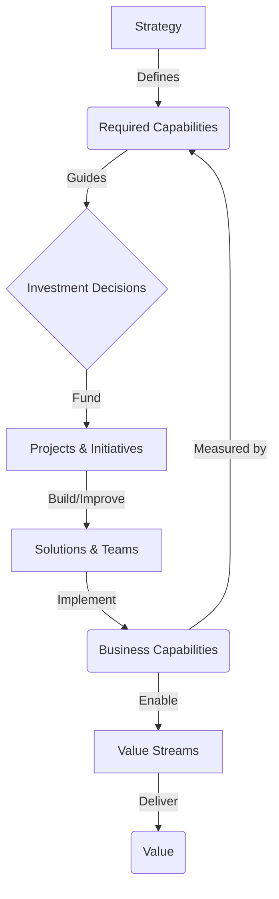

### 1. Context

Any organization, from a multinational corporation to a local community group, is a complex system designed to create value. To do so, it relies on a set of underlying abilities—what it can *do*. These abilities are often implicit, embedded within software applications, team structures, and individual expertise. For instance, the ability to "manage customer relationships" might be partially handled by a CRM system, partially by the sales team's informal networks, and partially by the support desk's ticketing software. As organizations grow and evolve, this ad-hoc implementation of capabilities leads to a tangled web of redundant systems, duplicated effort, and critical gaps. Without a clear, implementation-agnostic inventory of its abilities, an organization cannot effectively align its resources, technology, and structure with its strategic goals. It becomes difficult to answer fundamental questions like: What are we truly good at? Where are we wasting resources on redundant functions? What new abilities must we develop to thrive in the future? Lacking this living memory of its own potential, the organization becomes a brittle machine, unable to gracefully handle novelty.

### 2. Problem

> **The core conflict is the ghost in the machine: What We Do vs. What We Can Do.**

This tension manifests through several competing forces that pull an organization in different directions, hindering its ability to adapt and execute its strategy effectively. The organization's soul, its very capacity for coherent action, is caught in the crossfire.

1.  **Force 1: Solution-Centric vs. Capability-Centric Planning.** Organizations naturally gravitate towards thinking in terms of the concrete tools and systems they have (e.g., "we need a new CRM") rather than the abstract abilities they need to possess (e.g., "we need to improve our ability to manage customer data"). This solution-first mindset leads to a portfolio of disconnected applications and a technology landscape that drives strategy, rather than serving it, creating a void where the system's soul should be.
2.  **Force 2: Organizational Silos vs. Cross-Functional Value Streams.** Capabilities are rarely confined to a single department. The ability to "fulfill an order" might involve sales, logistics, finance, and customer service. However, organizations are typically structured in vertical silos. This creates a disconnect where no single department owns the end-to-end capability, leading to redundancy, inefficiency, and a fragmented customer experience that lacks a sense of wholeness.
3.  **Force 3: Short-Term Operations vs. Long-Term Strategy.** The immediate pressures of day-to-day operations often overshadow the need for strategic planning. Without a stable model of required capabilities, investment decisions are often reactive, driven by the most urgent operational fire rather than a deliberate plan to build the abilities needed for future success. This results in a cycle of short-term fixes that create long-term architectural debt and sap the system's vitality.

### 3. Solution

> **Therefore, create a stable, implementation-agnostic model of the organization's capabilities, and use it as the central artifact for aligning strategy, technology, and organizational design, allowing the organization to breathe.**

A capability specification, often visualized as a capability map, serves as a blueprint of the organization. It decomposes the enterprise into a set of modular, stable, and clearly defined abilities. Each capability represents *what* the business does, not *how* it does it. For example, a capability is "Process Payments," not "Use Stripe to Process Payments." This abstraction is the key to its power and its ability to foster a living architecture.

By separating the *what* from the *how*, a capability model provides a stable reference point against which to measure change. The need to "Process Payments" will likely exist for the life of the organization, but the specific technologies and teams used to implement it will evolve. This model becomes the bridge connecting strategic intent with operational execution. It allows leaders to:

*   **Align Investments:** Analyze which capabilities are most critical to strategic goals and direct funding accordingly.
*   **Identify Redundancies:** Map existing applications and teams to the capability model to reveal areas where the same ability is being delivered by multiple, overlapping systems.
*   **Analyze Gaps:** Compare the current state of capabilities against the future state required by the strategy, highlighting areas for development and innovation.

### 4. Implementation

Developing and maintaining a capability specification is an iterative process, not a one-time project. It requires a cross-functional effort involving business and technology stakeholders, fostering a sense of shared ownership and collective intelligence.

1.  **Establish Scope and Governance:** Define the scope of the capability model (e.g., enterprise-wide, a specific business unit). Establish a governance process for how the model will be maintained and updated over time. Assign ownership for the model to a dedicated role, such as an enterprise architect. This ensures the model remains a living document, not a static artifact.
2.  **Draft the Initial Capability Map:** Start by identifying the highest-level capabilities, often called Level 1 capabilities. These should be stable and represent the core functions of the organization. A common approach is to derive them from the primary value streams. For example, a manufacturing company might have Level 1 capabilities like "Develop Product," "Market & Sell," "Fulfill Orders," and "Manage Customer Service."
3.  **Decompose to Lower Levels:** Decompose the Level 1 capabilities into more granular Level 2 and Level 3 capabilities. For example, "Fulfill Orders" might decompose into "Manage Inventory," "Process Shipments," and "Handle Returns." Avoid going too deep; three levels of decomposition are typically sufficient to provide clarity without creating unnecessary complexity.
4.  **Map Implementations:** For each capability in the model, identify the people, processes, and technology that currently implement it. This involves mapping business units, teams, applications, and data sources to the capability hierarchy. This step is crucial for identifying redundancies and assessing the health and vitality of the current landscape.
5.  **Assess and Prioritize:** Assess each capability against various dimensions, such as its strategic importance, its current performance or maturity, and its cost. This analysis will reveal which capabilities are underperforming, over-funded, or missing entirely. Use this assessment to create a roadmap for investment and improvement, giving practitioners a sense of agency in shaping the organization's evolution.

**Key Considerations:**
*   **Business-Led, IT-Supported:** The development of the capability model must be led by business stakeholders to ensure it accurately reflects the needs of the organization. IT plays a critical supporting role in mapping technology and providing architectural guidance.
*   **Start Small and Iterate:** Don't try to boil the ocean. Start with a single business unit or value stream and build out the model over time. The goal is to create a useful tool that enhances organizational aliveness, not a perfect academic exercise.

**Common Pitfalls:**
*   **Analysis Paralysis:** Spending too much time debating the perfect hierarchy and naming conventions. The model should be a living artifact that evolves with the organization.
*   **Solution-Specific Naming:** Defining capabilities in terms of specific software or teams (e.g., "Manage Salesforce Contacts" instead of "Manage Customer Contacts"). This defeats the purpose of an implementation-agnostic model and traps the organization in a rigid, lifeless structure.
*   **Lack of Governance:** Creating a capability map as a one-time project and then failing to maintain it. Without ongoing governance, the model will quickly become outdated and irrelevant, a ghost of a past intention.

### 5. Consequences

**Benefits:**
*   **Improved Strategic Alignment:** Provides a clear line of sight from strategic objectives to the operational capabilities required to achieve them, ensuring that investments are directed towards what matters most for the system's health.
*   **Reduced IT Complexity and Cost:** By identifying redundant applications and systems, organizations can consolidate their IT landscape, leading to significant cost savings and reduced complexity.
*   **Increased Business Agility:** A modular, capability-based architecture allows organizations to swap out implementations (e.g., replace an old CRM with a new one) without disrupting the entire business process. The organization can shed old skins and grow new ones in response to a changing environment.

**Liabilities:**
*   **Risk of Abstraction:** If not grounded in the reality of how the business operates, the capability model can become an abstract architectural exercise that has little impact on decision-making, a beautiful but lifeless map.
*   **Maintenance Overhead:** A capability model is not a static artifact. It requires ongoing effort to keep it up-to-date as the organization and its technology landscape evolve. This is the cost of maintaining a living system.

**When NOT to use this pattern:**
*   For very small or early-stage organizations where the entire business model is in flux and the overhead of creating a formal capability model would outweigh the benefits. In these cases, a lighter-weight approach to strategic planning is more appropriate to nurture the fragile spark of a new venture.
*   In highly dynamic and exploratory contexts, such as a skunkworks project or a rapid prototyping initiative, where the focus is on speed of execution and learning, and a formal architectural model would be a hindrance to the creative chaos required for breakthrough innovation.

### 6. Known Uses

*   **The Open Group Architecture Framework (TOGAF):** Capability-Based Planning is a cornerstone of TOGAF, one of the most widely adopted frameworks for enterprise architecture. TOGAF provides a detailed methodology for defining, assessing, and planning the evolution of business capabilities as part of the Architecture Vision and Business Architecture phases. It is used by thousands of organizations worldwide to link IT to business strategy, helping them behave less like machines and more like living systems.
*   **Berliner Verkehrsbetriebe (BVG):** As Germany's largest public transport company, BVG faced a sprawling and complex IT landscape with over 10,000 applications. By creating a comprehensive business capability map, they were able to rationalize their application portfolio, identify redundancies, and prioritize investments. This capability-driven approach enabled them to modernize their technology stack and improve the efficiency of their operations, ultimately leading to better, more life-affirming service for the citizens of Berlin.
*   **Large-Scale Mergers and Acquisitions:** During a merger or acquisition, a capability map is an invaluable tool for understanding the overlapping and unique abilities of the two combining organizations. By mapping the capabilities of both companies, leaders can make informed decisions about which systems to keep, which to retire, and how to integrate the two organizations with minimal disruption. This approach helps to accelerate the realization of synergies and avoid the common pitfall of inheriting a tangled and redundant technology landscape, ensuring the new, combined entity has a coherent and vital core.

### 7. Cognitive Era Considerations

The rise of AI and autonomous agents fundamentally changes how organizations think about and manage their capabilities. The capability specification pattern becomes even more critical in this new era, but it also evolves in its application, presenting both the promise of generative vitality and the peril of rigid, algorithmic control.

*   **AI as a Capability Implementation:** AI and machine learning models are no longer just tools; they are implementations of capabilities. An organization's capability map must now include AI-driven abilities, such as "Predict Customer Churn" or "Automate Invoice Processing." This allows for a holistic view of both human and machine capabilities, and a conscious choice about which to cultivate.
*   **Automated Capability Discovery:** Agents can be deployed to analyze application logs, process documentation, and communication patterns to automatically discover and map the de facto capabilities of an organization. This bottom-up discovery process can be compared with the top-down, strategically defined capability map to identify discrepancies and "shadow IT" capabilities, revealing the organization's hidden life.
*   **Dynamic Capability Orchestration:** In the future, an organization's capabilities may not be static. Autonomous agents could dynamically assemble and orchestrate new capabilities on the fly by combining existing services and AI models in novel ways. The capability specification provides the semantic layer needed for agents to understand what capabilities are available and how they can be composed into new, adaptive wholes.
*   **New Risks and Ethical Considerations:** As more capabilities are automated, new risks emerge. The capability model must be used to assess the ethical implications and failure modes of AI-driven abilities. For example, a capability for "Automated Candidate Screening" must be carefully scrutinized for bias. The model provides a framework for governing these new types of risk and ensuring that automation serves life, rather than diminishing it.

### 8. Vitality: The Quality Without a Name

When this pattern is working well, the organization feels coherent and purposeful. There is a palpable sense of clarity that permeates from the executive suite to the front lines. Practitioners feel a sense of agency and belonging, understanding how their work contributes to the larger whole. The system breathes. When faced with unexpected challenges or opportunities, the organization can respond with grace and agility. It can reconfigure its resources, swap out technologies, and adapt its processes because it has a stable, shared understanding of its core abilities. This isn't just about efficiency; it's about a felt sense of wholeness and adaptive capacity. The organization is not a brittle, complicated machine, but a complex, living system capable of learning and evolving. It has a memory of what it can do, and a vision for what it can become.

Conversely, when this pattern is failing, the organization feels fragmented and chaotic. A sense of lifelessness pervades the culture. Meetings are filled with confusion as different departments use different language to describe the same thing. Redundant projects are funded while critical gaps in ability are ignored. The technology landscape is a tangled mess of legacy systems and one-off solutions, a digital ghost town. Practitioners feel disempowered, trapped in rigid silos and fighting against the very systems that are meant to support them. The organization is brittle, slow to react, and seems to lack a soul. The early warning signs are a rising sense of cynicism, a proliferation of workarounds, and a growing gap between the official strategy and the lived reality of daily work. The system is not dying, but it is slowly suffocating under the weight of its own incoherence.
