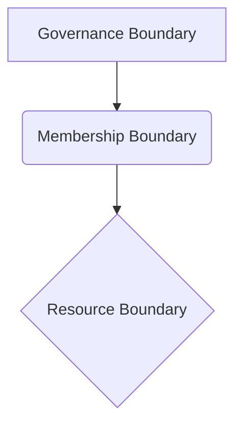

> To create a commons is to create a community, and every community has its limits. This pattern is about drawing those lines with intention and care, giving the system a skin so it can breathe.

### 1. Context

Any group of people attempting to manage a shared resource, whether it be a physical pasture, a digital knowledge base, or a collaborative brand, will inevitably face the question of who is part of the commons and who is not. This is not an abstract philosophical question; it is a deeply practical one that arises the moment a resource is created or claimed. In a world of finite resources and infinite potential users, the dream of a completely open, boundary-less commons often collides with the reality of overuse, free-riding, and the eventual degradation of the very resource the commons was created to protect. This is the classic "tragedy of the commons," a scenario where individual self-interest leads to collective ruin. The problem of boundaries is therefore not a secondary concern, but a primary one, foundational to the very possibility of a sustainable commons. It is in the act of defining the boundary that a group of individuals becomes a community of commoners, a living entity with shared rights, responsibilities, and a collective stake in the future of their shared resource.

### 2. Problem

> **The core conflict is Open Access vs. Resource Preservation.**

Every commons must navigate the tension between the desire for inclusivity and the need for sustainability. This tension manifests as a set of competing forces, a dynamic interplay that determines whether the commons will thrive or wither.

1.  **The Force of Universalism vs. The Force of Scarcity:** On one hand, there is a powerful ethical and practical drive to make the commons as open and accessible as possible. This is particularly true for digital commons, where the cost of reproduction is near zero. On the other hand, even digital commons are not immune to scarcity. They require maintenance, moderation, and governance—the metabolic processes of the system—all of which are finite resources. Physical commons, of course, face hard limits of carrying capacity.

2.  **The Force of Community vs. The Force of Anonymity:** A strong sense of community is the lifeblood of a commons. This requires trust, reciprocity, and a shared sense of identity. Anonymity, while sometimes desirable, can undermine this by making it easier for individuals to act in self-interested ways without fear of social consequences, slowly poisoning the well of collective trust.

3.  **The Force of Autonomy vs. The Force of Interdependence:** Commoners need the autonomy to govern their own affairs and make decisions about their shared resources, to feel a sense of agency. However, no commons exists in a vacuum. They are all interdependent with other systems, and their boundaries are often contested and negotiated with outside actors, including states and markets. The boundary is a membrane, not a wall, mediating the exchange of energy and information with the wider ecosystem.

4.  **The Force of Clarity vs. The Force of Flexibility:** Clear, unambiguous boundaries are essential for effective governance. They make it possible to identify members, monitor resource use, and enforce rules. However, boundaries that are too rigid can stifle growth and adaptation, leading to a brittle system. A living commons needs to be able to evolve its boundaries in response to changing circumstances, demonstrating adaptive capacity.

### 3. Solution

> **Therefore, explicitly define the boundaries of the commons, but design them to be porous and adaptable, like a living membrane.**

The solution is not to eliminate boundaries, but to make them a conscious and explicit part of the design of the commons. This involves a multi-layered approach that addresses both the "what" and the "who" of the commons, creating a coherent whole:

*   **Resource Boundaries:** Clearly define the resource that is being managed. What is included in the commons, and what is not? For a community garden, this might be the physical plot of land. For a software project, it is the codebase. For a brand commons, it is the set of trademarks and design assets. This clarity provides the stable ground upon which the community can stand.

*   **Membership Boundaries:** Define who has the right to access and use the resource, and what the different levels of membership are. This can range from a simple distinction between members and non-members to a more complex system of tiered access and permissions. The key is to make the criteria for membership explicit and transparent, so that belonging feels earned and meaningful.

*   **Governance Boundaries:** Define the scope of the commons' authority. What decisions can the commoners make for themselves, and where do they need to negotiate with outside actors? This includes defining the rules for using the resource, the process for making and changing those rules, and the sanctions for violating them. This is the system's capacity for self-regulation and self-preservation.

This can be visualized as a set of nested containers:

The key to making this work is to design the boundaries to be **porous**. This means creating mechanisms for people and ideas to move across the boundary in a controlled way, allowing the system to breathe. For example, a community garden might have "open days" where the public is invited in. A software project might have a process for non-members to submit bug reports and feature requests. A brand commons might have a licensing system that allows outside organizations to use the brand under certain conditions. The goal is to create a system that is both clearly defined and open to the world, balancing integrity with exchange.

### 4. Implementation

1.  **Identify the Core Resource:** The first step is to clearly identify the resource that the commons is built around. This may seem obvious, but it is often a source of confusion. Is it the land, the software, the data, the brand, or something else? Be as specific as possible to give the commons its essential form.

2.  **Map the Stakeholders:** Identify all the individuals and groups who have a stake in the resource. This includes not only the current users, but also potential future users, as well as those who may be affected by the use of the resource. This mapping reveals the social ecosystem the commons inhabits.

3.  **Define Membership Criteria:** Based on the stakeholder map, define the criteria for membership in the commons. This could be based on geography, contribution, shared values, or some other factor. The key is to make the criteria explicit and to have a clear process for becoming a member, creating a welcoming and understandable path to belonging.

4.  **Establish Governance Structures:** Design a system of governance for the commons. This should include a process for making and enforcing rules, resolving disputes, and adapting the boundaries of the commons over time. Elinor Ostrom's eight principles for managing a commons provide a useful starting point here, offering a blueprint for a system that can learn and endure.

5.  **Design for Porosity:** Intentionally design mechanisms for interacting with the outside world. This could include guest access, licensing agreements, ambassador programs, or other ways of sharing the value of the commons with a wider audience. This ensures the commons does not become an isolated artifact, but remains a vital part of its environment.

**Key Considerations:**

*   **The Cost of Exclusion:** Be mindful of the costs of excluding people from the commons. Exclusion can breed resentment and conflict, and it can also cut the commons off from valuable new ideas and contributions, starving it of essential nutrients.
*   **The Danger of Rigidity:** Boundaries should be treated as living things that can evolve over time. Build in a process for regularly reviewing and revising the boundaries of the commons in response to changing circumstances. A system that cannot adapt is already dying.
*   **The Role of Technology:** Technology can be a powerful tool for defining and enforcing boundaries, particularly in digital commons. However, it is important to remember that technology is only a tool. The real work of boundary definition is social and political, a matter of human connection and agreement.

**Common Pitfalls:**

*   **Invisible Boundaries:** Failing to make boundaries explicit is a recipe for conflict and misunderstanding, creating a void where the system's soul should be.
*   **Fortress Mentality:** Creating boundaries that are too rigid and impermeable can lead to stagnation and isolation, cutting the system off from the fresh air of new perspectives.
*   **Ignoring the Outside World:** No commons is an island. Failing to engage with the wider world can lead to irrelevance and eventual collapse, like a plant severed from its roots.

### 5. Consequences

**Benefits:**

*   **Sustainability:** Clearly defined boundaries are essential for the long-term sustainability of a commons. They prevent the "tragedy of the commons" by ensuring that the resource is not overused or degraded, allowing the system to maintain its health over generations.
*   **Community:** The act of defining and defending a boundary can be a powerful force for community building. It creates a shared sense of identity and purpose, and practitioners feel a deeper sense of agency and belonging.
*   **Autonomy:** Clear boundaries are a prerequisite for self-governance. They give commoners the power to manage their own affairs without outside interference, fostering a sense of collective empowerment.

**Liabilities:**

*   **Exclusion:** By their very nature, boundaries create an inside and an outside. This can lead to the exclusion of individuals and groups who might otherwise benefit from and contribute to the commons, creating a sense of otherness.
*   **Conflict:** Boundaries can be a source of conflict, both internally (as members debate the rules) and externally (as the commons negotiates its relationship with the outside world). This friction is a natural part of a living system, but it must be managed constructively.
*   **Stagnation:** If boundaries are too rigid, they can stifle innovation and prevent the commons from adapting to changing circumstances, leading to a kind of systemic sclerosis.

**When NOT to use this pattern:**

*   **Early-Stage Exploration:** In the very early stages of a project, it may be more important to foster open-ended exploration and experimentation than to define clear boundaries. A "let a thousand flowers bloom" approach can be more productive in the ideation phase, allowing for serendipity and emergence.
*   **Public Goods:** For true public goods, where the cost of providing the good to one more person is zero and it is impossible to exclude anyone (e.g., clean air), the concept of a bounded commons may not be applicable. These require a different kind of stewardship.

### 6. Known Uses

*   **Wikipedia:** The online encyclopedia is a classic example of a digital commons with a well-defined set of boundaries. Anyone can edit, but all contributions are subject to a set of core principles, including Neutral Point of View, Verifiability, and Notability. This social and editorial boundary, enforced by a global community of volunteer editors, has allowed Wikipedia to become the largest and most comprehensive reference work in human history, while still maintaining a remarkable degree of accuracy and coherence. It has a living immune system that defends its integrity.

*   **Community Land Trusts (CLTs):** CLTs are non-profit, community-based organizations that acquire and hold land for the benefit of the community. The boundary of the commons is the land owned by the trust. Membership is typically open to residents of a particular geographic area. By taking land off the speculative market, CLTs are able to provide permanently affordable housing and other community amenities, creating a pocket of stability and shared wealth in an otherwise extractive landscape. The Dudley Street Neighborhood Initiative in Boston is a well-known example of a successful CLT that has demonstrably revitalized its community.

*   **Open Source Software Projects:** Projects like Linux or Python have clear boundaries. The codebase is the core resource. Membership is tiered, from core developers with commit rights to casual contributors who submit patches. Governance is managed through explicit processes like RFCs and benevolent dictators or technical committees. These boundaries allow a global, distributed network of developers to collaborate on a highly complex, evolving system, creating immense value that is shared by all.

### 7. Cognitive Era Considerations

The rise of AI and autonomous agents introduces a new set of challenges and opportunities for the Commons Boundary Definition pattern. Agents can be powerful tools for managing and enforcing boundaries, but they also raise new questions about who—or what—is a member of the commons, blurring the lines between tool and participant.

*   **Automated Governance:** AI agents can be used to automate many of the tasks of commons governance, such as monitoring resource use, detecting violations of rules, and even facilitating decision-making processes. This could dramatically reduce the cost of managing a commons, making it possible to create and sustain commons at a much larger scale. The system could develop a kind of automated nervous system.

*   **Algorithmic Boundaries:** The boundaries of a commons could themselves be defined and managed by algorithms. For example, an AI could dynamically adjust the membership criteria for a digital commons based on the current level of resource use and the health of the community. This could lead to more adaptive and resilient forms of governance, but it also raises concerns about transparency and accountability. We must ensure these algorithms don't become a ghost in the machine, operating on a logic opaque to the members themselves.

*   **The Agent as Commoner:** As AI agents become more autonomous, we may need to consider whether they can be members of a commons in their own right. If an agent is a net contributor to a commons, should it have a say in its governance? This raises profound questions about the nature of community, life, and the rights and responsibilities of non-human actors.

*   **New Risks:** The use of AI in commons governance also introduces new risks. Algorithmic bias could lead to the unfair exclusion of certain individuals or groups. The automation of governance could disempower human commoners and make the system more opaque and less accountable. And the use of AI for surveillance and control could undermine the very values of autonomy and self-determination that the commons is meant to embody, creating a technically functional but spiritually dead system.

In the cognitive era, the work of defining and managing the boundaries of a commons will become both more complex and more critical. It will require a new level of technical sophistication, as well as a renewed commitment to the ethical principles of transparency, accountability, and democratic control to keep the commons alive.

### 8. Vitality: The Quality Without a Name

When the Commons Boundary Definition pattern is implemented with care, the commons feels alive and coherent. There is a palpable sense of "us" and "ours," a shared identity that fuels collective action. Members feel a sense of belonging and agency, knowing they are part of a system they can understand, shape, and protect. The boundaries are not rigid walls but a semi-permeable membrane, allowing for healthy exchange with the outside world. New members are welcomed through clear pathways, and the commons can gracefully interact with other systems without losing its identity or being consumed. The system breathes; it can respond to stress and surprise with flexibility, not brittleness. When a threat appears, the community can mobilize to defend its shared resources because it is clear what is at stake and who is responsible for its defense. There is a living memory within the group, a shared story that allows it to learn and adapt its boundaries over time, tightening them in response to threats and loosening them to embrace new opportunities for flourishing.

Conversely, when this pattern is failing, the commons feels fragmented and lifeless. A void exists where the system's soul should be. There is no clear sense of who is in and who is out, leading to confusion, mistrust, and a pervasive sense of anxiety. The resources are either plundered by unaccountable free-riders or locked down so tightly that no one can benefit from them. The community lacks the living memory to handle novelty; it either reacts with rigid hostility or dissolves into chaos. Early warning signs of this decay include endless debates about who belongs, a growing number of "ghosts in the machine" (users who take but never give back), and a general feeling of powerlessness among members. The system becomes brittle, unable to adapt, and slowly bleeds its value and purpose until it is either abandoned or enclosed by outside forces.

### References

[1] Dulong de Rosnay, M., & Stalder, F. (2020). Digital commons. *Internet Policy Review*, 9(4). https://doi.org/10.14763/2020.4.1530

[2] Ruiz Cayuela, S., & Tornaghi, C. (2019, October 15). Building the urban commons: links between (non)bounded communities, common spaces and social reproduction. *Undisciplined Environments*. https://undisciplinedenvironments.org/2019/10/15/building-the-urban-commons-links-between-nonbounded-communities-common-spaces-and-social-reproduction/

[3] Ostrom, E. (1990). *Governing the Commons: The Evolution of Institutions for Collective Action*. Cambridge University Press.
