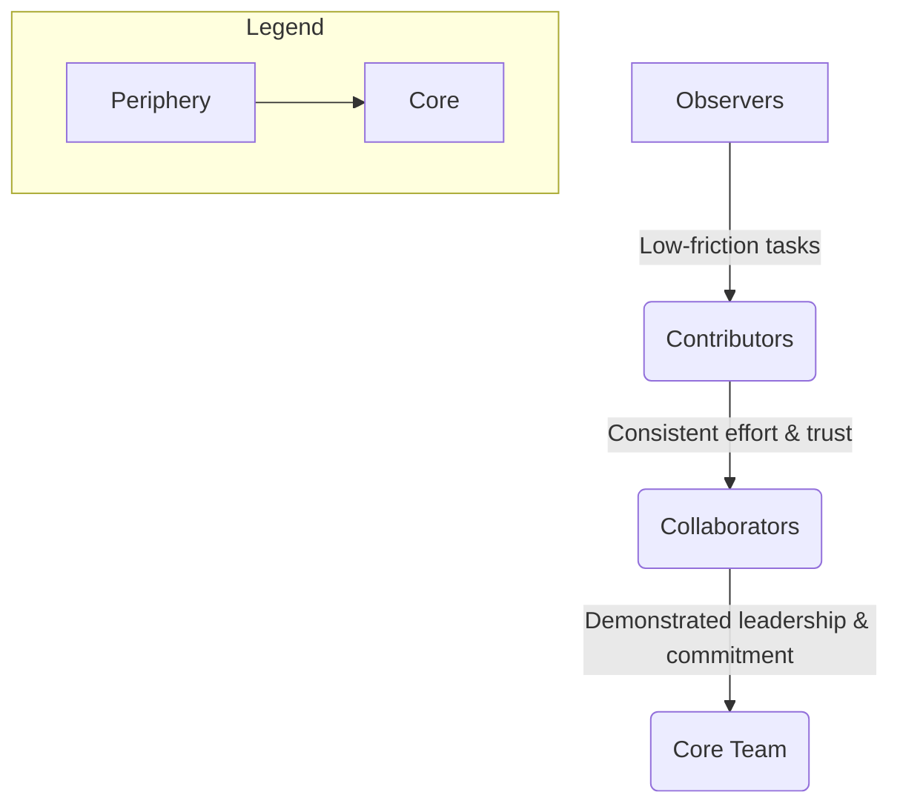

### 1. Context

A commons, regardless of its domain, is fundamentally a social structure with a life of its own. It is brought into being and sustained by a group of people united by a shared purpose and a dependency on a common resource. Whether this resource is a codebase, a neighborhood garden, a knowledge repository, or a business ecosystem, its long-term viability does not depend solely on its quality or utility, but on the vibrancy and aliveness of the community that stewards it. In the initial stages, a founding group often provides the energy and direction. However, for the commons to scale and endure, it must evolve beyond this core team. It encounters the challenge of integrating new members, each with varying levels of skill, motivation, and available time. Without a clear and intentional structure for engagement, a community risks stagnating, its vital signs fading. The enthusiasm of early adopters wanes, potential contributors are unsure how to help, and the majority of members drift into a state of passive consumption, placing the burden of maintenance on an ever-shrinking group of active participants. This is the critical juncture where a deliberate model for community and participation becomes not just beneficial, but essential for the system to breathe and grow.

### 2. Problem

> **The core conflict is Passive Consumption vs. Active Contribution.**

A community that fails to intentionally design pathways for participation will invariably default to a state where a small, overburdened core of creators serves a large, passive audience of consumers. This imbalance is not sustainable and creates a set of predictable, recurring tensions that drain the system's energy and undermine the health and longevity of the commons.

1.  **The Need for Growth vs. the Friction of Onboarding.** Every commons needs a steady stream of new, active members to replace those who depart and to bring in fresh energy and ideas. However, for potential contributors, the path from interested observer to active participant is often fraught with friction, creating a feeling of being an outsider. They don't know who to talk to, what tasks are available, or how their skills might fit in. This ambiguity acts as a barrier, leaving valuable potential untapped and reinforcing the divide between the core team and the wider community.

2.  **The Value of Openness vs. the Risk of Incoherence.** A core tenet of many commons is openness and inclusivity. The goal is to lower the barrier to entry, welcoming diverse perspectives and skills. Yet, this very openness creates a tension with the need to maintain quality, focus, and coherence. Without clear roles, standards, and review processes, a flood of low-quality or misaligned contributions can overwhelm the system, creating more work for the core maintainers and degrading the value of the shared resource for everyone. The system can feel chaotic and fragmented, lacking a clear, unifying pulse.

3.  **The Motivation of the Few vs. the Apathy of the Many.** In any group, a minority of members will be significantly more active than the majority. While natural, this dynamic becomes corrosive when the active minority feels that their efforts are taken for granted by a majority that only consumes. This can lead to burnout, resentment, and the eventual departure of the most valuable contributors, triggering a downward spiral in the commons' vitality and leaving a void where the system's soul should be.

### 3. Solution

> **Therefore, create a structured participation model that defines clear roles, responsibilities, and graduated levels of engagement, moving members from the periphery to the core.**

The solution is to replace the implicit, ad-hoc approach to community involvement with an explicit, designed system that functions as the community's circulatory system. This system acts as a ladder of engagement, providing clear and visible pathways for members to increase their level of contribution and responsibility over time. It acknowledges that not all members will participate at the same level, and instead of treating this as a failure, it leverages this reality by creating value at each stage of involvement. A well-designed participation model typically includes several distinct levels, such as:

*   **Observers/Consumers:** The outermost circle, consisting of users who benefit from the commons but do not actively contribute. The goal here is not to force contribution but to ensure they have a positive experience and understand that pathways to deeper engagement exist, feeling the pull of the community's heartbeat.
*   **Contributors:** Members who have taken the first step to active participation. This could be through simple acts like reporting a bug, fixing a typo, or answering a question in a forum. The key is to make this first step as low-friction as possible, a welcoming handshake into the community's life.
*   **Collaborators/Maintainers:** A smaller, more dedicated group of individuals who take on regular responsibilities. They review contributions, manage project areas, and actively shape the development of the resource. They have earned a degree of trust and are granted more authority, becoming the stewards of the system's health.
*   **Core Team/Stewards:** The innermost circle, responsible for the overall strategic direction, governance, and long-term health of the commons. This group typically emerges from the ranks of the most dedicated and trusted collaborators, acting as the heart of the community.

This tiered structure makes the process of engagement legible and alive. Newcomers can see a clear path forward, understanding what is required to move from one level to the next. It provides a framework for mentorship, as those at higher levels can guide and support those at lower levels. Crucially, it distributes the workload, alleviating the burden on the core team and making the entire system more resilient, adaptive, and scalable.

### 4. Implementation

Implementing a community and participation model is an iterative process of social architecture. It requires careful thought and continuous adaptation based on the community's specific context, goals, and its evolving sense of self. The following steps provide a general framework for putting this pattern into practice.

1.  **Define the Levels of Participation:** Start by identifying the distinct roles and levels of engagement that make sense for your commons. For each level, clearly define the associated responsibilities, privileges, and the criteria for entry. This documentation should be a living document, evolving with the community. This could be documented in a `CONTRIBUTING.md` file, a community handbook, or a dedicated section of your website.

2.  **Create Low-Friction On-ramps:** The transition from passive consumer to active contributor is the most critical step in the life cycle of a community member. Identify and promote simple, high-value tasks that new members can undertake. This could include a curated list of "good first issues" in a software project, a template for submitting new ideas, or a welcoming committee that personally guides newcomers, making them feel seen and valued from day one.

3.  **Establish Clear Communication Channels:** Different levels of participation require different communication channels, acting as the nervous system of the community. Public forums, mailing lists, or Discord/Slack channels are excellent for the wider community. More focused, private channels may be necessary for collaborators and the core team to coordinate their work effectively. Ensure these channels are well-moderated and that community norms for healthy interaction are clearly articulated and enforced.

4.  **Implement a System of Recognition and Mentorship:** As members increase their contributions, their efforts should be recognized to nurture their growth. This can range from simple public thank-yous and badges to granting specific permissions or inviting them to join a higher level of participation. Pair experienced members with newcomers to provide guidance and support, accelerating their journey up the ladder of engagement and weaving a strong social fabric.

5.  **Develop Transparent Governance Processes:** The core team should not operate in a black box. The processes for making decisions, resolving conflicts, and evolving the participation model itself should be transparent and, where appropriate, open to input from the wider community. This builds trust and reinforces the sense that the commons is a shared, living endeavor.

**Key Considerations:**

*   **Don't Over-Engineer:** Start with a simple model (e.g., three levels) and add complexity only as needed. An overly bureaucratic system can be just as off-putting as no system at all, stifling the very life it is meant to organize.
*   **Automate Where Possible:** Use bots and other automation to handle routine tasks like welcoming new members, labeling issues, or granting permissions based on activity levels. This frees up human time for more valuable mentorship and community-building work that requires a human touch.
*   **The Model is a Guide, Not a Straitjacket:** The defined levels should be seen as typical pathways, not rigid castes. Allow for flexibility and recognize that individuals may move between levels or contribute in ways that don't fit neatly into the defined structure. The goal is to support organic growth, not to enforce a rigid machine.

**Common Pitfalls:**

*   **Invisible Pathways:** Creating a model but failing to make it visible and accessible to the community. The pathways to participation must be clearly signposted and feel inviting.
*   **The "Hero" Mentality:** A core team that is unwilling to delegate or trust new contributors, effectively keeping the door to deeper participation closed and creating a bottleneck that suffocates growth.
*   **Ignoring the Social Element:** Focusing solely on the technical or work-related aspects of contribution while neglecting the social bonds and sense of belonging that truly sustain a community and make it a place where people want to be.

### 5. Consequences

Implementing a structured participation model fundamentally changes the dynamics of a commons, shifting it from an ad-hoc group to a more intentional and scalable organization. This shift brings both significant benefits and potential liabilities that must be managed to keep the system healthy and adaptive.

**Benefits:**

-   **Increased Resilience and Scalability:** By distributing responsibility and creating pathways for new leaders to emerge, the commons becomes less dependent on a small group of founders. This makes the project more resilient to the departure of key individuals and allows it to scale its activities without collapsing under its own weight. The system develops a collective immune response.
-   **Improved Contributor Experience:** A clear participation model demystifies the process of getting involved. Newcomers feel welcomed and guided, rather than lost and ignored. This positive initial experience is crucial for converting casual interest into long-term commitment and fostering a sense of agency and belonging.
-   **Higher Quality Contributions:** As members move up the ladder of engagement, they gain a deeper understanding of the project's goals and standards. This leads to higher-quality, more coherent contributions, reducing the review burden on the core team and improving the overall quality of the shared resource. The community develops a shared intelligence.

**Liabilities:**

-   **Risk of Bureaucracy and Elitism:** If not carefully managed, a participation model can become a rigid hierarchy, a kind of sclerosis setting into the community's structure. The levels can feel like exclusive clubs, and the process for advancement can be perceived as political or arbitrary. This can stifle the very bottom-up energy the pattern is meant to encourage.
-   **The "Gamification" Trap:** If the focus shifts too heavily toward the mechanics of advancement (e.g., earning points or badges), members may start to optimize for the metrics rather than for making meaningful contributions. The model becomes a game to be won rather than a framework for collaboration, and the intrinsic motivation that is the lifeblood of a commons can be lost.

**When NOT to use this pattern:**

-   This pattern is likely overkill for very small, early-stage projects where the founding team is still defining the core mission and the number of participants is low enough to be managed through direct, personal relationships. In such cases, the informal, high-bandwidth communication between a small, tight-knit group is more efficient and alive. Introducing a formal model too early can create unnecessary friction and stifle the creative chaos of the initial discovery phase.

### 6. Known Uses

This pattern of creating structured pathways for participation is a hallmark of successful, large-scale collaborative projects across numerous domains. The specific implementations vary, but the core principle of a graduated ladder of engagement remains constant, acting as a fractal pattern for organizational life.

-   **Technology (Open Source): The Kubernetes Project.** The cloud-native computing platform Kubernetes manages its massive, distributed community of developers through a well-documented "contributor ladder." [1] Newcomers start as general members, and with sustained, quality contributions, they can advance to become Reviewers, then Approvers, and ultimately Subproject Owners. Each level comes with greater responsibilities and technical authority. This clear, merit-based progression is a key reason Kubernetes has been able to successfully coordinate the efforts of thousands of developers from hundreds of companies to build a highly complex and reliable living system.

-   **Science (Citizen Science): Zooniverse.** Zooniverse is a platform that enables millions of volunteers to participate in real scientific research, from classifying galaxies to transcribing historical records. [2] While many participants remain at the initial level of classifying data (the "contributor" stage), the platform is designed to foster deeper engagement. Volunteers can interact with researchers and each other in forums, collaborate on difficult classifications, and some of the most dedicated volunteers have gone on to co-author scientific papers. This layered approach allows the platform to harness the power of the crowd for data processing while also identifying and cultivating individuals with a deeper interest and aptitude for the research, creating a vibrant ecosystem of inquiry.

-   **Business (Platform Cooperativism): Up & Go.** Up & Go is a digital platform for booking home cleaning services in New York City, but with a critical difference: it is cooperatively owned by the cleaners themselves. [3] The participation model extends beyond just using the platform to find work. Cleaners are not just users; they are worker-owners. This means they participate in the governance of the platform, collectively setting pay rates, service standards, and business strategy. This represents a deep form of participation where the users are also the core stewards, directly shaping the evolution of the resource (the platform) upon which their livelihood depends, ensuring the business has a soul.

### 7. Cognitive Era Considerations

The rise of AI and autonomous agents introduces powerful new possibilities and significant new challenges for community participation models. These technologies can act as both accelerators and disruptors, and integrating them effectively requires a thoughtful evolution of the pattern to ensure the community remains fundamentally human.

-   **Automation of Onboarding and Mentorship:** AI agents can dramatically reduce the friction for new contributors. An AI-powered "onboarding buddy" could analyze a new member's skills (e.g., from their GitHub profile) and proactively recommend "good first issues" that match their expertise. These agents could also provide instant answers to common questions, guide newcomers through the contribution process, and even perform initial code reviews for style and syntax, freeing up human mentors to focus on the more relational, conceptual guidance that breathes life into the community.

-   **AI as a New Class of Contributor:** As AI agents become more capable, they will increasingly act as direct contributors to the commons. They might write code, draft documentation, or create designs. This necessitates a new, non-human track in the participation model. How do we grant trust to an AI agent? What does it mean for an agent to become a "maintainer"? This requires developing new protocols for validating the reliability and alignment of autonomous agents and defining their rights and responsibilities within the community's governance structure, lest they become a ghost in the machine.

-   **Human Judgment as the Core Value:** In a world where AI can automate many routine contributions, the role of human participants will shift toward tasks that require judgment, creativity, and strategic oversight—the very essence of human aliveness. The participation model of the future may have tracks specifically for roles like "AI Ethics Reviewer," "System-level Architect," or "Community Health Mediator." The most valuable human contributions will be in setting the goals, defining the ethical boundaries, and making the complex trade-off decisions that cannot be easily delegated to an algorithm.

-   **New Risks: Algorithmic Bias and Inauthentic Participation:** A significant new risk is the potential for AI to be used to simulate grassroots support or to inject biased contributions at scale. A poorly designed system could be manipulated by a small number of actors using bots to create the illusion of a thriving community or to push a particular agenda. The participation model must therefore include new mechanisms for detecting and mitigating this kind of inauthentic activity, ensuring that the voices of genuine human participants are not drowned out by a manufactured consensus.

### 8. Vitality: The Quality Without a Name

When this pattern is working well, the community feels palpably alive. There is a buzz, a sense of forward momentum that is both invigorating and welcoming. Newcomers don't feel like they are shouting into a void; they are met with guidance and encouragement, quickly finding small but meaningful ways to contribute. Practitioners feel a sense of agency and belonging, knowing that their efforts are seen and that pathways to deeper involvement are clear and attainable. The system breathes. Information flows freely, feedback loops are tight, and the community demonstrates a remarkable capacity to adapt to unexpected challenges. Leadership is not concentrated in a few individuals but is distributed and emergent, with members stepping up to guide initiatives and then stepping back, creating a fluid and resilient social fabric. There is a shared story, a collective identity that provides coherence without imposing rigid control. This is the felt sense of a healthy commons: a place of purpose, growth, and mutual support.

Conversely, decay sets in when the pathways to participation become blocked or invisible. The community feels stagnant and brittle. Newcomers arrive with enthusiasm but are met with silence or bureaucracy, and their energy quickly dissipates. The same few people are making all the decisions and doing all the work, their voices echoing in empty forums. A sense of resentment simmers between the overburdened core and the passive periphery. The system loses its ability to self-organize and respond to change, becoming rigid and defensive. Early warning signs include a decline in "first-time" contributors, an increase in unresolved issues or unanswered questions, and a shift in community tone from collaborative to transactional or cynical. This is the ghost in the machine: the structure exists, but the spirit that gave it life has departed, leaving behind a hollow shell.

### References

[1] [Kubernetes Community Membership](https://github.com/kubernetes/community/blob/master/community-membership.md)
[2] [Zooniverse](https://www.zooniverse.org/)
[3] [Up & Go](https://www.upandgo.coop/)
