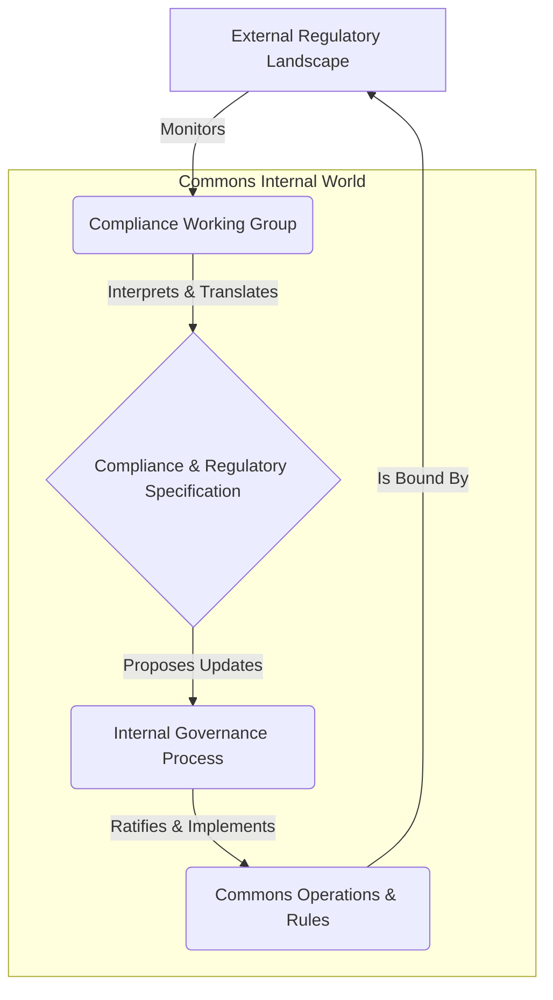

> A pattern for systematically defining, tracking, and integrating external legal and regulatory requirements into a commons' operational and governance frameworks.

### 1. Context

Any commons, regardless of its domain, does not exist in a vacuum. It operates within a complex web of legal jurisdictions, industry standards, and societal expectations. A tech cooperative building a new platform must navigate data privacy laws like GDPR. An urban garden commons must adhere to local zoning ordinances and environmental regulations. A financial commons is subject to strict anti-money laundering (AML) and securities laws. This external legal and regulatory landscape is not static; it is constantly evolving. New laws are passed, existing ones are amended, and judicial interpretations shift. For a commons to endure and thrive, it cannot afford to be ignorant of these powerful external forces. Ignoring them can lead to legal challenges, financial penalties, loss of legitimacy, and even the dissolution of the commons itself. Therefore, every practitioner and steward of a commons faces the challenge of understanding this landscape and ensuring the organization's activities remain within its bounds.

### 2. Problem

> **The core conflict is External Constraint vs. Internal Autonomy.**

A commons is founded on the principle of self-governance and autonomy, allowing its members to define their own rules and operational logic. However, it must simultaneously coexist with and adhere to external, non-negotiable rules imposed by state actors and regulatory bodies. This creates a fundamental tension between the desire for internal freedom and the necessity of external compliance. The specific forces at play are:

1.  **Force 1: The Need for Legitimacy.** To be taken seriously and to operate without interference, a commons must be perceived as a legitimate and law-abiding entity by external authorities, partners, and the public. This requires demonstrating a clear commitment to compliance.
2.  **Force 2: The Burden of Complexity.** The regulatory landscape is often vast, fragmented, and written in specialized language that is inaccessible to non-experts. A single commons may be subject to dozens of regulations from local, national, and international bodies, creating a significant cognitive and administrative burden.
3.  **Force 3: The Risk of Obsolescence.** Laws and regulations change. A compliance strategy that is robust today may be inadequate tomorrow. The commons needs a dynamic process to track these changes and adapt its internal rules and processes accordingly, without constantly overhauling its core structure.
4.  **Force 4: The Desire for Mission Focus.** The primary purpose of a commons is to create value for its members, not to become a legal-auditing entity. Over-investing in compliance can divert precious resources—time, money, and attention—away from the core mission.

### 3. Solution

> **Therefore, create a formal and living Compliance & Regulatory Specification that acts as a bridge between the external legal landscape and the internal governance of the commons.**

This specification is not merely a static document but a dynamic system. It translates abstract legal requirements into concrete, actionable rules and operational parameters that can be understood and implemented by the members of the commons. It functions as a continuously updated map of the legal territory the commons must navigate. The core mechanism involves establishing a dedicated working group or role responsible for maintaining the specification. This group monitors the regulatory environment, interprets changes, and proposes updates to the specification. These updates are then ratified through the commons' established governance process, ensuring that compliance remains aligned with the collective will.

This solution resolves the conflicting forces by creating a dedicated interface for the problem. It isolates the complexity of the legal world into a specialized function (the working group), which then produces a clear, structured output (the specification) that the rest of the commons can easily consume. This allows the commons to maintain its internal autonomy and focus on its mission, while ensuring that its operations remain legitimate and resilient to external shocks.

### 4. Implementation

Implementing a Compliance & Regulatory Specification requires a systematic approach. The goal is to create a process that is both rigorous and adaptable, without creating unnecessary bureaucracy.

1.  **Establish a Compliance Working Group:** The first step is to identify a small, dedicated group of individuals (or a single individual in a smaller commons) responsible for this pattern. This group does not need to be composed of lawyers, but should include members with strong analytical skills, attention to detail, and the ability to translate complex text into clear language. Their mandate is to own and maintain the specification.

2.  **Conduct an Initial Regulatory Audit:** The working group's first task is to map the commons' current regulatory landscape. This involves identifying all relevant jurisdictions (local, national, international) and the key pieces of legislation, regulation, and standards that apply to the commons' specific activities. This audit will form the baseline for Version 1.0 of the specification.

3.  **Structure the Specification Document:** The specification should be a clear, well-structured document. A good practice is to organize it by regulatory domain (e.g., Data Privacy, Financial Reporting, Employment Law). For each regulation, the specification should include:
    *   A plain-language summary of the regulation's core requirements.
    *   The specific operational activities within the commons that are affected.
    *   The concrete rules or procedures the commons must follow to ensure compliance.
    *   The person or role responsible for overseeing compliance with that specific rule.
    *   A link to the original legal text for reference.

4.  **Integrate with Governance:** The specification is not a standalone policy; it must be woven into the fabric of the commons' governance. Create a formal process for the working group to submit proposed changes to the specification. These changes should be reviewed and ratified by the appropriate decision-making body within the commons, ensuring democratic oversight.

5.  **Establish a Monitoring Process:** The working group must establish a system for monitoring regulatory changes. This can involve subscribing to legal newsletters, using regulatory intelligence services, or simply setting calendar reminders to periodically review government and agency websites. The key is to make this a proactive, recurring process, not a reactive one.

**Common Pitfalls:**
*   **Over-engineering:** The specification should be as simple as possible while still being effective. Avoid creating a complex bureaucratic maze that no one can navigate.
*   **Lack of Buy-in:** If the members of the commons do not understand or respect the specification, it will be ignored. The integration with the governance process is crucial for building legitimacy.
*   **Stagnation:** The specification must be a living document. If the monitoring process fails and the document becomes outdated, it becomes worse than useless—it creates a false sense of security.

### 5. Consequences

**Benefits:**
*   **Enhanced Resilience:** By systematically tracking and adapting to the legal environment, the commons dramatically reduces its risk of legal challenges, fines, or shutdowns. It can anticipate changes and adapt proactively, rather than reacting in a crisis.
*   **Increased Legitimacy:** A formal, transparent compliance process demonstrates maturity and trustworthiness to external partners, funders, and regulatory agencies, opening up new opportunities for collaboration and growth.
*   **Improved Focus:** By isolating the complex work of compliance within a dedicated function, the broader community is freed to focus on the core mission of creating value. It reduces the cognitive overhead for the average member.

**Liabilities:**
*   **Risk of Centralization:** The Compliance Working Group, by virtue of its specialized knowledge, can become a powerful bottleneck or a source of centralized authority. It is crucial to ensure they are accountable to the broader governance process and that their role is one of translation, not dictation.
*   **Bureaucratic Drag:** If not managed carefully, the process of updating and ratifying the specification can become slow and cumbersome, hindering the commons' ability to adapt quickly.

**When NOT to use this pattern:**
This pattern is likely overkill for a very small, informal commons with minimal external interaction (e.g., a neighborhood book-sharing club). In such cases, an informal understanding of the rules is sufficient. However, as soon as a commons begins to handle money, manage personal data, employ people, or own property, the risk of non-compliance becomes significant, and a more formal approach is warranted.

### 6. Known Uses

1.  **Stripe (Fintech):** As a global payment processor, Stripe operates in one of the most complex regulatory environments in the world, covering financial services, data privacy, and international trade law. Stripe's solution is a textbook example of this pattern. They maintain a massive, dedicated legal and compliance team that creates and continuously updates a detailed internal specification. This specification is then translated into the automated rules and logic of their platform. For example, their KYC (Know Your Customer) and AML (Anti-Money Laundering) obligations are not just policies; they are hard-coded into the user onboarding and transaction monitoring systems, a direct implementation of a living regulatory specification.

2.  **Siemens Healthineers (Medical Technology):** In the medical device industry, compliance with bodies like the U.S. Food and Drug Administration (FDA) is paramount. Siemens Healthineers, a leading manufacturer of medical imaging and diagnostic equipment, implements this pattern through a rigorous Quality Management System (QMS). Their QMS is a detailed specification that translates FDA regulations (such as 21 CFR Part 820) into concrete design controls, manufacturing processes, and post-market surveillance procedures. This specification is a living document, constantly updated to reflect new guidance and regulations, ensuring that every device they produce meets the highest standards of safety and efficacy.

3.  **Mondragon Corporation (Cooperative Federation):** Mondragon, a federation of worker cooperatives in Spain, operates across numerous industries, from manufacturing to finance to retail. Their compliance is managed through a combination of a central legal team and the autonomy of individual cooperatives. The central body provides a baseline specification of Spanish and EU law (labor law, tax law, environmental regulations). Each member cooperative then adapts and implements this specification within its own unique governance structure, as defined by its own bylaws. This demonstrates a fractal application of the pattern, where a high-level specification is adapted and implemented by autonomous, self-governing units.

### 7. Cognitive Era Considerations

In the cognitive era, the Compliance & Regulatory Specification pattern is poised for a radical transformation from a human-driven process to a human-AI hybrid system. The manual, labor-intensive aspects of the pattern can be largely automated, freeing up human capacity for higher-level judgment and strategic decision-making.

AI agents can be deployed to continuously scan the global regulatory landscape in real-time. These agents can monitor government gazettes, court rulings, and regulatory agency updates across multiple jurisdictions, far exceeding the capacity of any human team. Using Natural Language Processing (NLP), they can parse complex legal text, identify changes, and perform an initial impact analysis, flagging which parts of the commons' operations are likely to be affected. For example, an AI could detect a change in a data residency law and automatically identify the specific data storage systems and processes that need to be reviewed.

The specification document itself can become a dynamic, machine-readable object. Instead of a text file, it could be a knowledge graph where regulations, rules, and operational controls are represented as interconnected nodes. When an AI detects a regulatory change, it can automatically propose an update to the graph, showing the new dependencies and potential conflicts. This allows the Compliance Working Group to visualize the impact of changes instantly, rather than manually tracing dependencies through a static document.

The future of this pattern lies in a sophisticated human-AI partnership. AI agents will handle the exhaustive work of monitoring and initial analysis. The human working group will then validate the AI's findings, handle the edge cases and ambiguities that require human judgment, and, most importantly, facilitate the social and political process of integrating the necessary changes into the commons. The role of the human becomes that of the "auditor of the automaton," the ethical backstop, and the bridge between the logic of the code and the values of the community.
