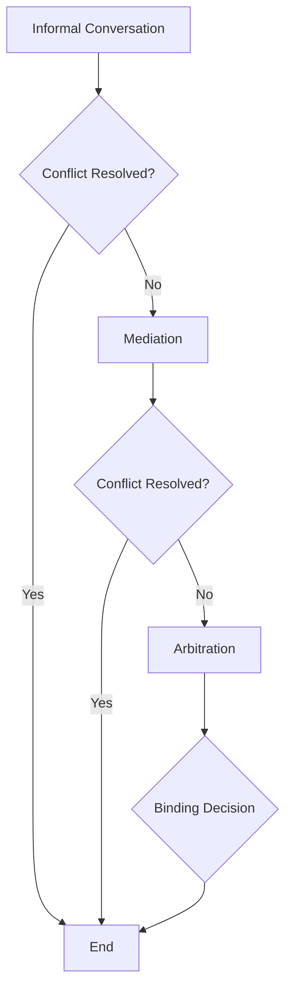

### 1. Context

Any collaborative endeavor, from a small startup to a sprawling digital commons, is a network of relationships. When individuals with diverse perspectives, motivations, and goals come together, disagreements are not a possibility, but an inevitability. These conflicts can be as minor as a misunderstanding over project requirements or as significant as a fundamental clash of values. In the modern workplace, employees spend an average of 2.1 hours per week involved in conflict, which translates to a staggering annual cost of $359 billion in the US alone in lost productivity [1]. In online communities, the lack of non-verbal cues and the potential for misinterpretation can amplify disagreements, quickly turning a simple dispute into a major disruption. Without a clear, trusted, and accessible process for resolving these issues, they can fester, leading to decreased morale, project failure, and a breakdown of community cohesion. The health, resilience, and very aliveness of any commons, therefore, depends not on the absence of conflict, but on its ability to metabolize it constructively, turning friction into fuel for growth.

### 2. Problem

> **The core conflict is Unresolved Disputes vs. Community Cohesion.**

When conflicts are left to fester, they become a toxic sludge in the system's arteries, eroding the trust and psychological safety that are the lifeblood of any healthy commons. The challenge is not simply to stop arguments, but to navigate the underlying tensions in a way that reinforces the community's values and strengthens its social fabric. This is made difficult by several competing forces:

1.  **The Desire for Harmony vs. The Need for Authentic Disagreement:** Most people are conflict-averse and prefer to maintain a sense of harmony. However, avoiding difficult conversations and suppressing genuine disagreements can lead to the buildup of resentment and the creation of an artificial, fragile peace. True community cohesion is not a static, conflict-free state, but a dynamic capability—the ability for the system to breathe through disagreement and navigate it openly and honestly.

2.  **The Need for a Fair and Formal Process vs. The Desire for a Quick and Informal Resolution:** Establishing a formal, transparent, and impartial process is crucial for ensuring that all parties feel heard and that the resolution is just. However, such processes can be time-consuming and bureaucratic, and there is often a strong desire to resolve disputes quickly and informally. Rushing to a resolution without due process can lead to perceptions of unfairness and further erode trust.

3.  **The Emotional Toll of Conflict vs. The Need for Rational Problem-Solving:** Conflicts are inherently emotional. They can trigger feelings of anger, frustration, and betrayal, making it difficult for those involved to engage in rational problem-solving. A purely procedural approach that ignores the emotional dimension of the conflict is unlikely to lead to a lasting resolution. The challenge is to create a process that acknowledges and addresses the emotional needs of the participants while guiding them toward a rational and mutually acceptable outcome.

4.  **The Risk of Escalation vs. The Risk of Suppression:** Unchecked, a minor disagreement can quickly escalate into a major conflict that polarizes the community and causes lasting damage. On the other hand, suppressing conflict by shutting down conversations or punishing dissent can create a culture of fear and silence, driving problems underground where they can continue to grow and fester. The goal is to find a middle ground that allows for constructive disagreement while preventing destructive escalation.

### 3. Solution

> **Therefore, establish a multi-tiered, transparent, and restorative conflict resolution process that is accessible to all members.**

Instead of viewing conflict as a pathology, this pattern reframes it as a vital sign—an opportunity for growth and a catalyst for strengthening the commons' immune response. The solution is not a single action, but a system designed to handle disputes with increasing levels of formality and intervention, always aiming for restoration over retribution. This system is built on the principles of transparency, impartiality, and accessibility.

At its core, the mechanism provides a clear and predictable pathway for any member to raise a grievance and have it addressed fairly. This process typically involves several stages, allowing for resolution at the lowest possible level while providing a clear escalation path for more complex or entrenched disputes.

This multi-tiered approach ensures that the response is proportional to the severity of the conflict. It empowers members to resolve disputes amongst themselves whenever possible, while providing the structure and support necessary for more difficult cases. The emphasis is on restorative practices, which focus on repairing harm, rebuilding relationships, and addressing the root causes of the conflict, rather than simply assigning blame and meting out punishment. This approach not only resolves the immediate dispute but also enhances the community's collective intelligence, contributing to a more resilient, adaptive, and living system in the long term.

### 4. Implementation

Breathing life into a conflict resolution mechanism requires more than just careful planning; it demands a deep-seated commitment to fairness, transparency, and the cultivation of trust. The following steps provide a roadmap for establishing such a system:

1.  **Define the Scope and Principles:** Clearly articulate the types of conflicts the mechanism is designed to address and the principles that will guide the process. These principles should include impartiality, confidentiality, transparency, and a commitment to restorative justice.

2.  **Establish a Multi-Tiered Structure:** Design a process with multiple stages of intervention, starting with informal resolution and escalating to more formal procedures as needed. A typical structure might include:
    *   **Tier 1: Informal Conversation:** Encourage parties to resolve disputes directly and informally whenever possible. Provide resources and guidance on effective communication and negotiation.
    *   **Tier 2: Mediation:** If informal resolution fails, provide access to a trained, neutral mediator who can facilitate a constructive conversation and help the parties reach a mutually acceptable agreement. The mediator does not impose a solution but rather guides the process.
    *   **Tier 3: Arbitration:** For disputes that cannot be resolved through mediation, establish a formal arbitration process. An arbitrator or a panel of arbitrators will hear both sides of the dispute and make a binding decision. This should be the final step in the process.

3.  **Recruit and Train Mediators and Arbitrators:** Identify and train a diverse group of individuals from within the community to serve as mediators and arbitrators. They should be respected members of the community who are known for their impartiality, discretion, and communication skills. Provide them with comprehensive training in conflict resolution techniques, mediation, and the specific procedures of your organization.

4.  **Create Clear and Accessible Documentation:** Develop clear and concise documentation that explains the conflict resolution process in detail. This documentation should be easily accessible to all members of the community and should include information on how to initiate the process, what to expect at each stage, and the rights and responsibilities of all parties involved.

5.  **Promote Awareness and Trust:** Actively promote the conflict resolution mechanism throughout the community. Emphasize its purpose, principles, and accessibility. Building trust in the process is the essential soil from which its vitality will grow; without it, the most elegant procedures are just dead letters on a page. This can be achieved through regular communication, transparency, and by ensuring that the process is consistently applied in a fair and impartial manner.

**Key Considerations:**

*   **Cultural Context:** Adapt the conflict resolution mechanism to the specific cultural norms and values of your community. What works in one context may not be appropriate in another.
*   **Power Imbalances:** Be mindful of power imbalances between the parties involved in a dispute. The process should be designed to ensure that all voices are heard and that no one is at a disadvantage.
*   **Confidentiality:** Establish clear guidelines on confidentiality to ensure that all parties feel safe sharing their perspectives openly and honestly.

**Common Pitfalls:**

*   **Lack of Buy-in:** If the community does not trust the process or the people involved, it will not be used.
*   **Inadequate Training:** Poorly trained mediators and arbitrators can do more harm than good.
*   **Inconsistent Application:** If the process is not applied consistently and fairly, it will lose its legitimacy.

### 5. Consequences

Implementing a conflict resolution mechanism has far-reaching consequences for the health and resilience of a commons. While the benefits are significant, there are also potential liabilities to consider.

**Benefits:**

*   **Increased Trust and Psychological Safety:** A living, breathing process for resolving disputes fosters a palpable sense of psychological safety, where members feel not just comfortable but empowered to express their authentic opinions and concerns without fear of retribution. This, in turn, builds trust in the community and its leadership.
*   **Improved Communication and Relationships:** The process of mediation and restorative justice can help individuals develop better communication skills and a deeper understanding of different perspectives. By working through conflicts constructively, members can strengthen their relationships and build a more cohesive community.
*   **Reduced Costs and Disruption:** By resolving conflicts early and effectively, organizations can avoid the significant costs associated with unresolved disputes, including lost productivity, employee turnover, and legal fees. In the UK, the annual cost of conflict to employers is estimated to be £28.5 billion [2].
*   **Enhanced Legitimacy and Governance:** A formal conflict resolution mechanism is a key component of good governance. It demonstrates a commitment to fairness and due process, which enhances the legitimacy of the organization and its decision-making processes.

**Liabilities:**

*   **Bureaucracy and Formalism:** If not designed with care for the human element, a conflict resolution mechanism can become a rigid, bureaucratic exoskeleton, stifling the very life it was meant to protect and discouraging its use. It is important to strike a balance between structure and flexibility.
*   **Potential for Misuse:** A conflict resolution process can be misused by individuals who are not acting in good faith. It is important to have safeguards in place to prevent the process from being used to harass or intimidate others.
*   **Emotional Labor:** Participating in a conflict resolution process, whether as a party to the dispute or as a mediator, can be emotionally draining. It is important to provide support for all those involved.

**When NOT to use this pattern:**

*   **For Trivial Disagreements:** This pattern is not intended for every minor disagreement. It is important to encourage informal resolution whenever possible and to reserve the formal process for more serious disputes.
*   **In Bad Faith Negotiations:** If one or more parties are not genuinely interested in resolving the conflict, the process is unlikely to be successful. In such cases, other interventions may be necessary.
*   **As a Substitute for Good Management:** A conflict resolution mechanism is not a substitute for good management and clear communication. It is a tool for addressing disputes that arise despite best efforts to prevent them.

### 6. Known Uses

This pattern has been implemented in various forms across a wide range of domains, from corporate boardrooms to online gaming communities. Here are a few examples:

*   **Workplace Mediation at a Tech Company:** A fast-growing tech company was experiencing significant friction between its engineering and product marketing teams. The teams had different priorities and communication styles, which led to project delays and a tense work environment. The company implemented a conflict resolution program that included training for managers in mediation and a formal process for escalating disputes. In one instance, a trained manager mediated a dispute between a lead engineer and a product manager over the scope of a new feature. By facilitating a structured conversation, the manager helped them find a compromise that met both of their needs and got the project back on track. The program has since been credited with breathing new life into cross-functional collaboration and staunching the loss of talent.

*   **Community Mediation in a Neighborhood Association:** A neighborhood association in a diverse urban area was struggling with ongoing disputes between residents over issues such as noise, parking, and property maintenance. The association established a community mediation program, training a group of resident volunteers to serve as neutral mediators. When a dispute arose between two neighbors over a barking dog, they were able to resolve the issue through a mediated conversation rather than involving the police or courts. The program has helped to weave a stronger social fabric, providing a constructive, living outlet for resolving neighborhood conflicts.

*   **Restorative Justice in the Criminal Justice System:** Many jurisdictions have adopted restorative justice practices as an alternative to traditional criminal prosecution, particularly for juvenile offenders. In these programs, the focus is on repairing the harm caused by the crime and reintegrating the offender into the community. A young person who has committed an act of vandalism, for example, might participate in a restorative justice conference with the property owner and other community members. The goal is to help the offender understand the impact of their actions and to agree on a plan for making amends. These programs have been shown to reduce recidivism and to provide a more satisfying sense of justice for victims.

### 7. Cognitive Era Considerations

The rise of AI and autonomous agents introduces new complexities and opportunities for conflict resolution. The principles of this pattern remain relevant, but their application must be adapted to this new technological landscape.

**Automation and Augmentation:**

*   **AI-Powered Triage and Intake:** AI agents can be used to triage incoming disputes, gathering initial information from the parties involved and providing them with relevant resources and information about the conflict resolution process. This can help to streamline the intake process and to ensure that disputes are directed to the appropriate level of intervention.
*   **Sentiment Analysis and Early Warning Systems:** AI can be used to monitor online communications for signs of escalating conflict. Sentiment analysis tools can detect rising tensions and alert community managers to potential problems before they get out of hand. This allows for early intervention and can prevent minor disagreements from escalating into major disputes.
*   **AI-Assisted Mediation:** AI-powered tools can assist human mediators by providing real-time analysis of communication patterns, identifying areas of common ground, and suggesting potential solutions. These tools can also help to ensure that the mediation process is fair and that all parties have an equal opportunity to be heard.

**Human-AI Collaboration:**

While AI can be a powerful tool for conflict resolution, it is not a substitute for human judgment and empathy. The most vital and effective conflict resolution systems in the cognitive era will be those that create a symbiotic partnership between human and machine, combining the computational power of AI with the irreplaceable wisdom of human empathy and embodied experience. AI can handle the data-driven aspects of the process, such as information gathering and analysis, while humans can provide the emotional intelligence, creativity, and ethical judgment that are essential for resolving complex disputes.

**New Risks and Ethical Considerations:**

*   **Algorithmic Bias:** AI systems are only as good as the data they are trained on. If the training data reflects existing biases, the AI system may perpetuate or even amplify those biases in its decision-making. It is crucial to ensure that AI-powered conflict resolution systems are designed and tested to be fair and impartial.
*   **Privacy and Data Security:** Conflict resolution processes often involve the sharing of sensitive personal information. It is essential to have robust privacy and data security protocols in place to protect this information from unauthorized access or misuse.
*   **The Black Box Problem:** The decision-making processes of some AI systems can be opaque, making it difficult to understand how they arrived at a particular conclusion. This lack of transparency is a critical vulnerability, a potential 'ghost in the machine' that can fatally undermine the trust necessary for an AI-powered system to be perceived as a legitimate and living part of the community. It is important to use AI systems that are transparent and explainable, so that their decisions can be understood and challenged if necessary.

### References

[1] CPP Inc. (2008). *Workplace Conflict and How Businesses Can Harness It to Thrive*. [https://shop.themyersbriggs.com/en/topic/conflict-management.aspx](https://shop.themyersbriggs.com/en/topic/conflict-management.aspx)

[2] Acas. (2021). *Estimating the costs of workplace conflict*. [https://www.acas.org.uk/estimating-the-costs-of-workplace-conflict](https://www.acas.org.uk/estimating-the-costs-of-workplace-conflict)

### 8. Vitality: The Quality Without a Name

When a Conflict Resolution Mechanism is truly alive, it acts as the immune system of the commons. There's a palpable sense of resilience, a collective confidence that the community can handle whatever internal frictions arise. Practitioners don't just follow a procedure; they feel a sense of agency and trust in the process. Disagreements, when they surface, are not met with fear or avoidance, but with a calm assurance that the system has the capacity to process them. The air is clear of the stale resentment that characterizes systems lacking this vitality. Instead, there's a dynamic tension, a sign that diverse perspectives are actively engaging, not being suppressed. The system breathes. It adapts. When an unexpected conflict emerges, it doesn't shatter the community's cohesion; it triggers a known, trusted response that channels the disruptive energy into constructive dialogue and strengthens the relational fabric. You can feel the group's metabolism at work, processing dissent and turning it into a source of renewal.

Conversely, the decay of this pattern manifests as a creeping lifelessness. The formal process may still exist on paper, but it becomes a ghost in the machine, a hollow set of rules that no one truly trusts or turns to. Early warning signs include the proliferation of back-channel gossip and passive-aggressive behavior, as members lack a living, functional pathway to address grievances directly. Conflicts are either suppressed into a fragile, artificial harmony or they erupt in sudden, destructive ways, bypassing the formal mechanism entirely. The system feels brittle, rigid, and incapable of learning. There's a void where the system's soul should be, a lack of the living memory to handle novelty. A sense of learned helplessness sets in; members feel that their voices don't matter and that the system is incapable of just outcomes. This is the slow death of a commons, not with a bang, but with the quiet, accumulating weight of unresolved hurts and the gradual erosion of trust.
