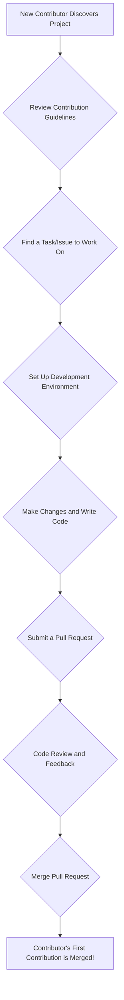

# Contributor Onboarding Pattern

## 1. Intent

Streamline the process for new contributors to join a project, ensuring they have all the necessary information and resources to become productive members of the community.

## 2. Motivation

Open source projects thrive on community contributions. However, the initial experience for a new contributor can be daunting. A clear and efficient onboarding process is crucial for converting interested individuals into active, long-term contributors. This pattern aims to reduce the barrier to entry, improve the initial contributor experience, and ultimately foster a healthy and growing community.

## 3. Applicability

Use the contributor onboarding pattern when:

*   You want to grow your project's contributor base.
*   You notice a drop-off between initial interest and actual contributions.
*   You want to ensure a consistent and positive experience for all new contributors.
*   Your project is complex and requires specific setup or knowledge before contributing.

## 4. Structure

## 5. Participants

*   **New Contributor:** The individual who wants to contribute to the project.
*   **Project Maintainers:** The core team responsible for reviewing contributions and guiding new contributors.
*   **Community:** The existing contributors and users of the project.

## 6. Collaboration

The contributor onboarding process is a collaborative effort. The new contributor takes the initiative to follow the documented steps. Project maintainers provide timely and constructive feedback during the code review process. The broader community can also help by answering questions and providing support in communication channels.

## 7. Consequences

*   **Advantages:**
    *   A smoother and more welcoming experience for new contributors.
    *   Increased number of active contributors.
    *   Improved quality of contributions due to clear guidelines.
    *   Reduced workload for maintainers in the long run as the community grows.
*   **Disadvantages:**
    *   Requires an initial investment of time and effort to create and maintain onboarding documentation.
    *   May require dedicated community managers for larger projects.

## 8. Implementation

1.  **Create a `CONTRIBUTING.md` file:** This file should be in the root of your repository and provide a comprehensive guide for new contributors. It should include:
    *   A link to your code of conduct.
    *   Instructions on how to set up the development environment.
    *   Guidelines for finding issues to work on (e.g., "good first issue" labels).
    *   Coding standards and style guides.
    *   The process for submitting a pull request.
2.  **Label beginner-friendly issues:** Use labels like `good first issue` or `help wanted` to identify tasks that are suitable for new contributors.
3.  **Provide clear and concise issue descriptions:** Ensure that issues have enough context for a new contributor to understand the problem and potential solutions.
4.  **Automate checks:** Use continuous integration (CI) to automate style checks, tests, and other quality gates. This provides instant feedback to the contributor and reduces the burden on maintainers.
5.  **Be responsive and welcoming:** Acknowledge new contributors, thank them for their interest, and provide timely and constructive feedback on their pull requests.

## 9. Known Uses

This pattern is widely used in successful open source projects, including:

*   **Kubernetes:** The [Kubernetes contributor guide](https://www.kubernetes.dev/docs/guide/) is a comprehensive resource for new contributors.
*   **Rust:** The [Rust project](https://www.rust-lang.org/community/contribute) has a strong focus on mentorship and a well-defined onboarding process.
*   **First Contributions:** A project that helps beginners to make their first open-source contribution.

## 10. Related Patterns

*   **Code of Conduct:** A code of conduct is essential for creating a welcoming and inclusive community.
*   **Issue Triage:** A well-defined issue triage process helps to ensure that issues are properly labeled and prioritized.
*   **Mentorship:** Pairing new contributors with experienced mentors can significantly improve their onboarding experience.
