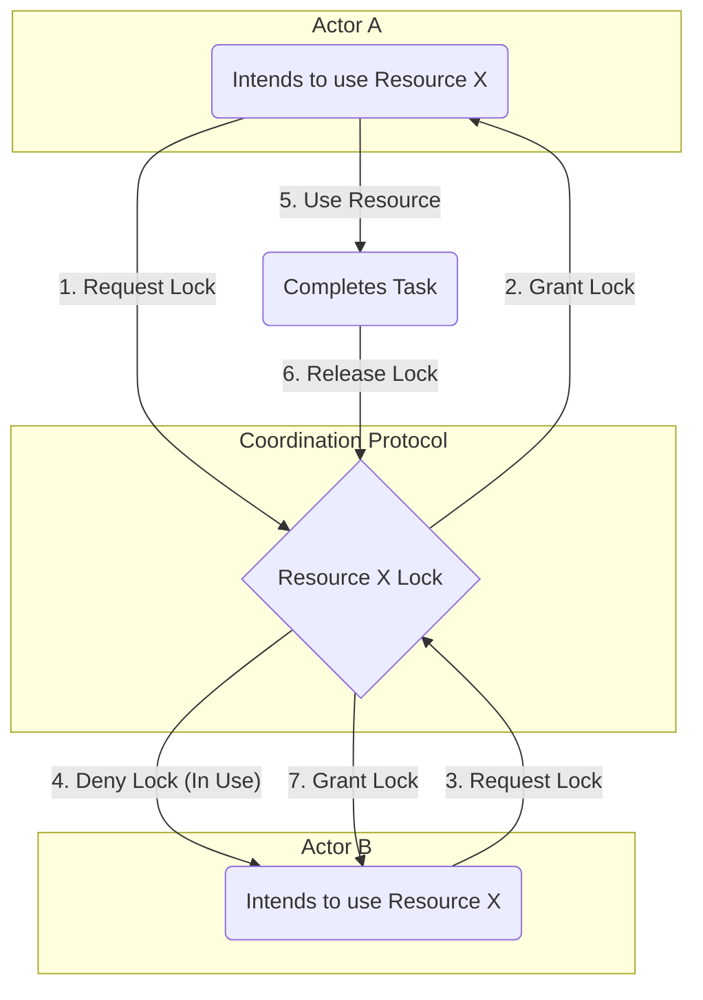

### 1. Context

In any system with more than one actor—be it a software architecture with multiple microservices, a company with various departments, or a city with diverse communities—the potential for friction is immense. These independent actors often operate with their own goals, information, and resources. While this autonomy can foster speed and specialization, it also creates a complex environment where actions can inadvertently conflict. A software team might deploy a new feature that consumes a database resource another team was relying on. A logistics department might change a delivery schedule without informing the sales team, leading to missed commitments. A community group might organize an event in a public park, unaware that another group has booked the same space. These are not instances of malice, but of uncoordinated autonomy. The actors are operating within their local contexts, blind to the broader interdependencies of the system. Without a shared framework for signaling intent and negotiating access to resources, the system’s overall effectiveness is compromised by chaos, contention, and duplicated effort.

### 2. Problem

> **The core conflict is Autonomy vs. Coherence.**

Achieving a collective goal requires a degree of coherence, yet the actors within the system are often designed or incentivized to act autonomously. This fundamental tension manifests through several forces:

1.  **Resource Contention:** Multiple actors need to access the same limited resources (e.g., a database connection, a physical meeting room, a piece of machinery, a financial budget). Uncoordinated access leads to deadlocks, race conditions, or depletion, where no actor can proceed effectively.
2.  **Information Asymmetry:** Actors possess different information about the state of the system. One actor may make a decision based on outdated or incomplete data, invalidating the work of another actor who had more current information. This leads to errors, rework, and a lack of shared reality.
3.  **Divergent Rhythms:** Different actors operate on different timelines and cadences. A fast-moving development team may clash with a slower, more deliberate legal review process. This mismatch in operational speed can create bottlenecks and frustration, hindering the flow of value through the system.
4.  **Goal Misalignment:** While actors may share a high-level objective, their local interpretations and priorities can diverge. This leads to them working at cross-purposes, optimizing for their own metrics at the expense of the global objective, resulting in wasted effort and systemic sub-optimization.

### 3. Solution

> **Therefore, establish a formal protocol for communication and decision-making that governs interactions between autonomous agents.**

This protocol is not a central controller but a set of shared rules—a social and technical contract—that all actors agree to follow. It provides a standardized way for actors to signal their intentions, query the state of other actors, and reserve resources, enabling them to coordinate their behavior without sacrificing their autonomy. The protocol resolves the core tension by making the cost of uncoordinated action explicit and providing a clear, low-friction path to coherence.

A coordination protocol typically defines a few key primitives:

*   **State Declaration:** A mechanism for an actor to broadcast its current state (e.g., "I am processing task X," "I am idle").
*   **Intent Signaling:** A way for an actor to announce its future actions (e.g., "I intend to write to the database in 50ms").
*   **Resource Locking:** A mechanism to request and gain exclusive access to a shared resource for a specific period (e.g., a semaphore, a mutex, or a meeting room booking).
*   **Negotiation/Acknowledgement:** A handshake process where actors confirm they have received signals and agree to the proposed coordination (e.g., a two-phase commit in databases, or a simple RSVP for a meeting).

By using these primitives, actors can build a dynamic, shared model of the system's state and their place within it, allowing them to see and navigate interdependencies.

### 4. Implementation

Implementing a coordination protocol requires moving from implicit assumptions to explicit agreements. It is a socio-technical process that involves defining the rules and embedding them into the operational fabric of the system.

1.  **Identify Points of Contention:** Begin by mapping the system and identifying the key shared resources, critical dependencies, and recurring points of conflict. Where do teams or services most often block each other? These are the areas that will benefit most from an explicit protocol.
2.  **Define the Protocol Primitives:** For each point of contention, define the simplest possible set of rules. Start with the basics: How is state declared? How is intent signaled? How are resources locked? Avoid over-engineering; the goal is to provide just enough structure to prevent chaos. For a software system, this might be a set of API endpoints (e.g., `/lock`, `/release`). For a human system, it might be a specific Slack channel and message format for announcing deployments.
3.  **Choose a Coordination Mechanism:** Select the appropriate technology or process to enforce the protocol. This could range from optimistic locking in a database, to a distributed consensus algorithm like Paxos or Raft for critical infrastructure, to a simple calendar-based booking system for meeting rooms. The mechanism must match the stakes of the coordination; don't use a heavyweight distributed lock for a non-critical resource.
4.  **Implement and Socialize the Protocol:** Embed the protocol into the tools and workflows actors already use. If it's a software protocol, build it into the client libraries or service templates. If it's a human protocol, document it clearly, automate it where possible (e.g., with bots or integrations), and train the relevant teams. The protocol must be easier to use than the old, chaotic alternative.
5.  **Monitor and Iterate:** Observe the protocol in action. Is it reducing conflicts? Is it introducing new bottlenecks? Use metrics (e.g., lock contention time, number of failed deployments) and qualitative feedback to refine the rules. Protocols are not static; they must evolve with the system.

**Key Considerations:**
*   **Granularity:** Be precise about what is being locked. Locking an entire database table is much more costly than locking a single row.
*   **Timeouts:** Locks should always have a timeout to prevent a failed actor from blocking the entire system indefinitely.
*   **Liveness vs. Safety:** Some protocols prioritize safety (ensuring no two actors can conflict), while others prioritize liveness (ensuring the system can always make progress). Understand the trade-offs for your specific context.

**Common Pitfalls:**
*   **Centralization:** Avoid creating a single, central coordinator that becomes a bottleneck and single point of failure. The protocol should enable decentralized coordination.
*   **Over-Engineering:** Don't design a complex protocol for a simple problem. A shared calendar is often a better solution than a distributed lock.
*   **Ignoring the Social Layer:** A protocol that is technically perfect but culturally rejected is useless. The protocol must be seen as a helpful agreement, not a bureaucratic imposition.

### 5. Consequences

**Benefits:**
*   **Increased System Throughput:** By reducing conflicts, retries, and deadlocks, the protocol allows actors to complete their work more efficiently, increasing the overall flow of value through the system.
*   **Enhanced Resilience:** The protocol makes the system more predictable and robust. It prevents cascading failures caused by resource contention and allows the system to degrade gracefully when actors fail.
*   **Improved Evolvability:** With clear coordination interfaces, individual actors can be modified, replaced, or added without causing unforeseen side effects, making the entire system easier to change and scale.

**Liabilities:**
*   **Coordination Overhead:** The act of signaling, negotiating, and waiting introduces a performance cost. This overhead can slow down the system if the protocol is too chatty or the contention for resources is consistently high.
*   **Reduced Local Optima:** The protocol may prevent an actor from taking the most locally efficient action in order to preserve global coherence. This can feel constraining to individual teams or services.
*   **Complexity:** Implementing and debugging coordination protocols, especially in distributed systems, is notoriously difficult. The protocol itself can become a source of bugs if not carefully designed and tested.

**When NOT to use this pattern:**
*   This pattern is overkill for systems where there are no shared resources or interdependencies between actors. If actors can operate in complete isolation, the overhead of a coordination protocol is unnecessary.
*   In situations where a central planner or scheduler is more efficient and the cost of a single point of failure is acceptable, a direct command-and-control approach may be simpler than a decentralized coordination protocol.

### 6. Known Uses

1.  **Air Traffic Control (ATC):** This is a classic, high-stakes example. The sky is a shared resource. The ATC protocol involves flight plans (intent signaling), clearances (resource locking for airspace and runways), and constant position reporting (state declaration). This protocol allows thousands of autonomous agents (pilots) to operate safely in a dense, dynamic environment, preventing collisions and ensuring efficient flow. The outcome is one of the safest transportation systems in the world.

2.  **Git (Distributed Version Control):** In software development, the codebase is a shared resource. Git acts as a coordination protocol. `git pull` updates an actor's local state. `git commit` creates a proposed change. `git push` signals intent to merge the change into the shared state (the remote repository). The protocol includes mechanisms for conflict resolution (merge conflicts) when two actors try to modify the same part of the resource. This allows thousands of developers to work on the same code asynchronously without constantly overwriting each other's work.

3.  **The Transmission Control Protocol (TCP):** In computer networking, the network itself is a shared resource. When two computers communicate over the internet, they use TCP's three-way handshake (SYN, SYN-ACK, ACK) to establish a connection. This is a coordination protocol to lock the 
connection, ensuring both parties are ready to exchange data. It includes mechanisms for flow control and acknowledgement to ensure reliable, ordered delivery of data packets, preventing network congestion and data loss. This protocol enables reliable communication between billions of devices on a chaotic, best-effort network.

### 7. Cognitive Era Considerations

The rise of AI agents, both as individual actors and as system-level coordinators, profoundly impacts this pattern. The core conflict between autonomy and coherence remains, but the speed and complexity at which it occurs are amplified.

An AI-powered coordination protocol can operate at a scale and speed impossible for humans. Autonomous agents can use the protocol to negotiate resource access in milliseconds, optimizing resource utilization in real-time for complex systems like city-wide autonomous vehicle fleets or smart power grids. For example, an agent representing a self-driving car could use a coordination protocol to negotiate with other vehicles at an intersection, reserving a time slot to pass through, eliminating the need for traffic lights. This moves coordination from a human-centric process (traffic engineering) to a dynamic, machine-to-machine negotiation.

However, this also introduces new risks. A bug in the coordination protocol or a malicious agent could cause systemic deadlocks or cascading failures at an unprecedented scale. If the protocol relies on machine learning models for decision-making (e.g., predicting resource needs), adversarial attacks could manipulate the system for gain. The "liveness vs. safety" trade-off becomes even more critical; a protocol that is too focused on safety might be too slow for dynamic environments, while one that prioritizes liveness could lead to catastrophic failures.

Human judgment remains essential for designing the protocol's fundamental rules and ethical boundaries. Humans must define the objective function the agents are optimizing for and the constraints they must operate within. For instance, in a smart grid, while agents might coordinate to optimize energy distribution, a human must set the rule that critical infrastructure like hospitals always has priority, even if it's not the most economically efficient outcome. The role of the human shifts from being an actor within the system to being the designer and overseer of the system's coordination logic.
