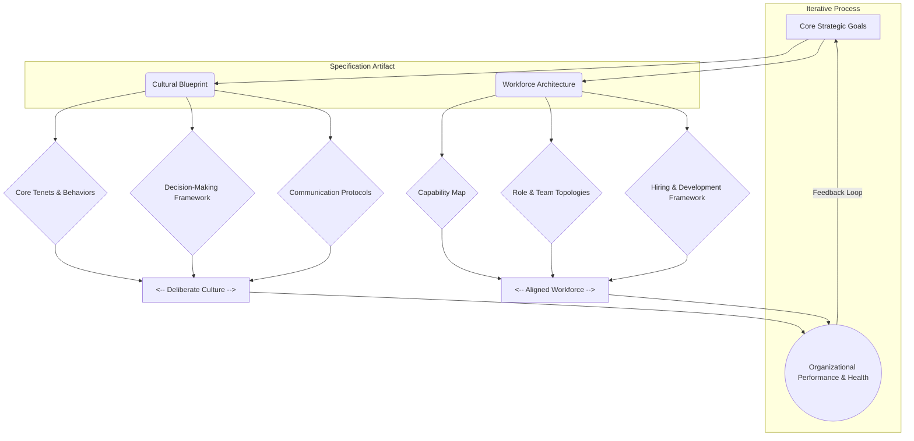

> A pattern for deliberately defining the desired organizational culture and specifying the workforce capabilities, roles, and composition required to enact it.

### 1. Context

In any collaborative endeavor, from a startup to a city administration, a default culture emerges. This culture, an aggregation of shared behaviors, values, and assumptions, dictates how people interact, make decisions, and execute work. When left to chance, this emergent culture is often suboptimal, shaped by the loudest voices, historical accidents, or the unexamined habits of its initial members. This can lead to a disconnect between the organization's stated goals and its actual operational reality. For instance, a company may claim to value innovation, but its culture may implicitly punish failure, leading to risk-averse behavior. Similarly, a community group may aspire to be inclusive, but its informal communication styles may alienate newcomers. The problem is not a lack of intention, but the absence of a deliberate, specified framework that translates aspirational values into concrete, observable behaviors and a corresponding workforce strategy. Without this specification, there is no reliable mechanism to hire, develop, and manage the very people who are meant to embody and perpetuate the desired culture.

### 2. Problem

> **The core conflict is Prescriptive Culture vs. Emergent Behavior.**

An organization is a complex adaptive system where culture is an emergent property. However, to achieve its strategic objectives, an organization must also be prescriptive about its values and the capabilities it needs. This creates a fundamental tension between top-down intention and bottom-up reality. The challenge is to create a cultural and workforce framework that is clear and intentional, without being so rigid that it stifles the very creativity, autonomy, and adaptability that are often key components of the desired culture itself. The key forces at play are:

1.  **Strategic Alignment vs. Individual Autonomy:** The organization needs to ensure that its culture and workforce directly support its strategic goals. This requires a degree of prescription in defining roles, skills, and values. However, talented individuals thrive on autonomy and the freedom to bring their unique perspectives to their work. Overly prescriptive specifications can disempower individuals, reduce engagement, and stifle innovation.
2.  **Consistency vs. Adaptability:** A clearly specified culture provides a consistent employee experience and a predictable operational environment. This is crucial for scaling and maintaining identity. Yet, the external environment is constantly changing. A culture that is too rigid cannot adapt to new market conditions, technological shifts, or social changes, making the organization brittle and slow to respond.
3.  **Measurement and Accountability vs. Serendipity and Trust:** To manage and shape culture, you must be able to measure it. This involves defining key performance indicators (KPIs) for cultural alignment and workforce composition. However, the most valuable aspects of culture—trust, psychological safety, and spontaneous collaboration—are difficult to quantify and can be damaged by a purely metrics-driven approach. An overemphasis on measurement can lead to a culture of 
distrust and gaming the system.
4.  **Hiring for Fit vs. Hiring for Diversity:** Organizations naturally want to hire people who “fit” the existing culture, as this reduces friction and speeds up onboarding. However, this can lead to a homogenous workforce, groupthink, and a lack of diverse perspectives that are critical for innovation and resilience. A workforce specification must balance the need for cultural alignment with the imperative to build a diverse and inclusive team.

### 3. Solution

> **Therefore, create a living specification that explicitly defines the core cultural tenets and the corresponding workforce architecture, treating it as a design artifact that is co-created and continuously iterated upon.**

The solution is to approach culture and workforce as a deliberate design problem. Instead of a static, top-down mandate, the Culture & Workforce Specification is a dynamic document that serves as a shared reference point for everyone in the organization. It translates abstract values into observable behaviors and connects them to the specific capabilities, roles, and team structures needed to bring them to life. The key is to make the implicit explicit.

This specification has two primary components:

1.  **The Cultural Blueprint:** This part articulates the “why” and “how” of the culture. It goes beyond generic values like “integrity” or “innovation.”
    *   **Core Tenets:** 3-5 non-negotiable principles that define the organization's character. For each tenet, provide a clear definition and, crucially, a set of “Observable Behaviors.” For example, for a tenet of “Radical Transparency,” observables might include: “All non-personal company data is open by default,” “Decisions are documented and shared publicly within 24 hours,” and “Leaders actively solicit and address dissenting opinions in public forums.”
    *   **Decision-Making Framework:** How are decisions made? Is it consensus, consent, or delegated authority? Who has the authority to make what kinds of decisions? This clarifies power and reduces ambiguity.
    *   **Communication Protocols:** What are the norms for communication? Synchronous vs. asynchronous? What tools are used for what purposes? This prevents communication chaos and ensures information flows effectively.

2.  **The Workforce Architecture:** This part specifies the “who” and “what” of the workforce.
    *   **Capability Map:** What are the core competencies the organization needs to succeed? This is not just about technical skills but also about relational and sense-making skills. This map should be forward-looking, anticipating future needs.
    *   **Role & Team Topologies:** Based on the capability map, define the key roles and how they are organized into teams. This might use a framework like Team Topologies (stream-aligned, enabling, platform, etc.) to clarify how teams interact and deliver value.
    *   **Hiring & Development Framework:** How do you hire for the specified capabilities and cultural alignment? This includes structured interview processes, onboarding rituals, and continuous learning programs that reinforce the culture.

This specification is not a one-time document. It is a living artifact, reviewed and updated regularly (e.g., quarterly) in a participatory process involving a cross-section of the organization. It becomes the basis for hiring, performance management, and leadership development, creating a coherent and self-reinforcing system.

### 4. Implementation

Implementing a Culture & Workforce Specification is a change management process that requires commitment, clarity, and participation, led from the top and owned by everyone. The process begins with establishing a cross-functional design team, including not just leaders but also influential contributors and managers from various departments to ensure the specification is grounded in reality and gains early buy-in. This team then conducts a cultural audit to understand the current state through surveys, focus groups, observation, and analysis of existing artifacts. With this baseline, the team works with leadership to define 3-5 strategic priorities, asking what culture and capabilities are needed to achieve them.

The core of the implementation is the iterative drafting of the specification itself. The design team workshops core tenets and their observable behaviors, and codifies decision-making frameworks like RACI. Simultaneously, they map the workforce architecture by defining a high-level capability map and key organizational roles. This initial draft is then socialized across the organization for feedback through town halls and other channels, ensuring the final document is a shared and owned artifact. The final and most critical step is to deeply integrate the specification into all core talent processes: hiring criteria and interview questions are updated; onboarding is redesigned to immerse new hires in the culture; and performance management is adapted to assess both results and cultural alignment. Leadership development is also crucial, as leaders must be trained to model and coach the specified behaviors.

**Key Considerations:**

*   **Leadership Modeling:** The single most important factor for success is the visible, consistent modeling of the specified culture by the organization's leaders. Any hypocrisy will undermine the entire effort.
*   **Start Small and Iterate:** Don’t try to boil the ocean. Start with a “minimum viable culture” and iterate. It’s better to have a simple, well-understood specification that is actually used than a complex one that is ignored.
*   **Budget for It:** This work takes time and resources. Allocate a budget for the design process, training, and any necessary changes to systems or processes.

**Common Pitfalls:**

*   **“Aspirational” Posters:** Creating a list of generic, feel-good values that have no connection to the daily work and are not reinforced by systems and leadership. This breeds cynicism.
*   **Lack of Accountability:** Failing to hold people, especially leaders, accountable for behaviors that are inconsistent with the specification.
*   **One-Time Project:** Treating the specification as a project with a start and end date. It must be a continuous process of refinement and adaptation.
*   **Ignoring Subcultures:** Assuming a monolithic culture exists. Large organizations will always have subcultures. The specification should define the core, non-negotiable tenets while allowing for local variation.

### 5. Consequences

Applying the Culture & Workforce Specification pattern creates a powerful, self-reinforcing system that aligns an organization's people with its purpose. However, this process of making culture explicit is not without its challenges and trade-offs.

**Benefits:**

*   **Increased Strategic Alignment and Coherence:** By directly linking culture and workforce to strategic goals, the organization ensures that its human capital is focused on what matters most. This reduces wasted effort and internal friction, leading to more effective and efficient execution.
*   **Improved Talent Management:** A clear specification provides an objective framework for hiring, development, and performance management. It reduces bias in hiring by focusing on defined capabilities and observable behaviors, and it clarifies expectations for employees, leading to higher engagement and retention.
*   **Enhanced Scalability and Resilience:** A well-defined culture acts as a distributed management system. As the organization grows, the shared understanding of “how we do things here” allows for greater autonomy and faster decision-making without constant central oversight. It provides a stable core that can weather external changes and internal reorganizations.

**Liabilities:**

*   **Risk of Rigidity and Groupthink:** If the specification is treated as a rigid set of rules rather than a living document, it can stifle creativity and dissent. The emphasis on “cultural fit” can lead to a homogenous workforce, reducing the diversity of thought necessary for innovation and robust problem-solving.
*   **Implementation Overhead:** The process of creating, implementing, and maintaining the specification requires significant time, effort, and resources. It is a major change initiative that can be met with resistance if not managed carefully. There is a risk of it becoming a bureaucratic exercise that is disconnected from the real work.
*   **Potential for a “Surveillance” Culture:** If the measurement of cultural alignment is not handled with care, it can feel like a form of surveillance. An overemphasis on metrics can lead to employees focusing on appearing to be aligned rather than genuinely embracing the culture, creating a climate of distrust.

**When NOT to use this pattern:**

This pattern is less suitable for very early-stage ventures (e.g., pre-product-market fit startups) where the strategy and team are in rapid, constant flux. In such contexts, a formal specification process can be a premature optimization that distracts from the core task of discovery. The culture in these early stages is best shaped by the direct, daily interactions of the founding team. Additionally, in purely volunteer-driven or highly decentralized, anarchic collectives, a formal specification may be rejected as an illegitimate imposition of authority. These organizations often thrive on a more fluid, emergent, and negotiated order.

### 6. Known Uses

This pattern, in various forms, is a hallmark of high-performing organizations across many domains. The degree of formality varies, but the principle of being deliberate about culture and workforce composition is consistent.

*   **Netflix (Technology & Entertainment):** Perhaps the most famous example is the “Netflix Culture Deck.” Initially an internal document, it was publicly shared and became a Silicon Valley sensation. The deck explicitly details the company’s philosophy of “Freedom and Responsibility,” defining core tenets like “Seek Excellence,” “Encourage Candor,” and “Avoid Rules.” It specifies the kind of workforce they want to attract (“stunning colleagues”) and the performance philosophy that supports it (paying top of market, and letting go of those who are not a good fit). This specification directly informs their hiring, their famously high salaries, and their minimal-oversight management style. The outcome has been a highly adaptable and innovative organization that has repeatedly disrupted the entertainment industry.

*   **Patagonia (Retail & Apparel):** Patagonia has built a powerful brand and a deeply loyal workforce by specifying a culture rooted in environmental activism. Their mission, “We’re in business to save our home planet,” is not just a slogan; it is the core of their workforce specification. They hire people who are passionate about the outdoors and environmental causes. This is reflected in their HR policies, such as providing paid time off for employees to participate in environmental activism. They design their roles and teams around sustainability, from supply chain to product design. The result is a highly engaged workforce, a powerful brand identity, and a profitable business that demonstrates that purpose and profit can be aligned.

*   **The Bridgewater Associates (Finance):** The hedge fund Bridgewater Associates, founded by Ray Dalio, operates on a principle of “Radical Truth and Radical Transparency.” This is codified in a detailed document known as “The Principles.” These principles are a highly specific guide to behavior, decision-making, and interaction within the firm. All meetings are recorded and made available for review, and employees are expected to constantly give and receive candid feedback using a proprietary app. This creates an intense and demanding culture that is not for everyone, but it is explicitly designed to produce the best possible investment decisions by eliminating hidden agendas and unexamined assumptions. It is a prime example of a highly specified, albeit controversial, culture and workforce model.

*   **Buurtzorg Nederland (Healthcare):** This Dutch home-care organization has achieved remarkable results by specifying a culture of professional autonomy and client-centricity. They dismantled the traditional, bureaucratic healthcare management model and replaced it with a network of small, self-managing teams of nurses (10-12 members). The “specification” is a simple one: nurses are empowered to do whatever is necessary to meet the needs of their clients. There are very few managers. The workforce architecture is flat and decentralized, and the culture is one of trust and professional accountability. The outcome has been higher patient satisfaction, lower costs, and dramatically improved employee morale in a sector notorious for burnout.

### 7. Cognitive Era Considerations

The rise of AI and autonomous agents profoundly impacts the Culture & Workforce Specification pattern, acting as both an accelerator and a source of new challenges. The specification itself becomes more critical as a tool for governing human-agent collaboration.

**Automation and Augmentation:**
AI can significantly augment the implementation of this pattern. AI-powered tools can analyze internal communications (e.g., Slack, Teams) and survey data to provide real-time insights into the actual, lived culture, highlighting gaps between the specified culture and reality. During hiring, AI can help screen for specific capabilities identified in the workforce architecture, and even analyze video interviews for behavioral cues that align with cultural tenets (though this must be done with extreme caution to avoid algorithmic bias). For the workforce, AI agents can act as personalized coaches, providing employees with feedback and learning resources to help them develop the skills and behaviors outlined in the specification.

**Human-Agent Teaming:**
As AI agents become more capable, they will increasingly function as teammates rather than just tools. The Workforce Architecture will need to be expanded to include not just human roles, but also the roles and responsibilities of AI agents. The specification must define the protocols for human-agent handoffs, decision-making authority, and communication. For example, if a cultural tenet is “Bias for Action,” the specification might need to define when an AI agent is empowered to take autonomous action versus when it must seek human confirmation. The culture itself will need to evolve to foster trust and effective collaboration with non-human partners.

**New Risks and Ethical Considerations:**
An AI-augmented approach to culture specification introduces new risks. The use of AI to monitor culture could lead to an oppressive, “Big Brother” environment if not implemented with transparency and strict ethical guidelines. Algorithmic bias in hiring and performance management could inadvertently filter out neurodiverse or unconventional talent, reinforcing homogeneity rather than fostering diversity. The specification must therefore include explicit principles for the ethical use of AI in all talent processes, ensuring fairness, transparency, and human oversight.

**The Role of Human Judgment:**
In the Cognitive Era, the uniquely human aspects of the specification become even more important. While AI can analyze data and automate processes, it cannot define the organization’s purpose or set its core values. The process of debating and defining the Cultural Blueprint remains a fundamentally human endeavor. Human judgment is critical in interpreting the outputs of AI systems, resolving complex ethical trade-offs, and making the final call on strategic decisions. The specification, therefore, becomes a key document for delineating the boundary between what is delegated to machines and what is reserved for human reason and intuition. It ensures that as we integrate AI into our organizations, we do so in a way that is aligned with our fundamental human values.
