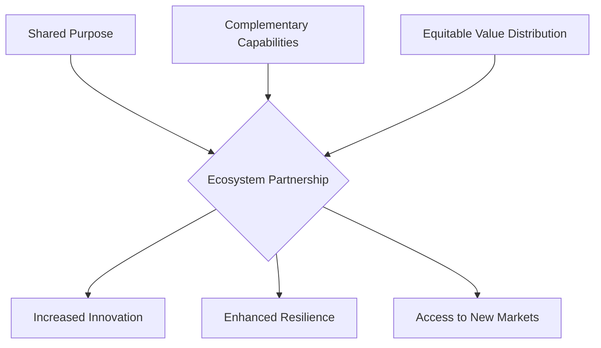

### 1. Context

In today's increasingly interconnected and complex world, no single organization can possess all the necessary capabilities to address multifaceted challenges and opportunities. The traditional, inward-looking model of organizational strategy is insufficient for navigating a landscape characterized by rapid technological change, shifting market dynamics, and systemic problems like climate change and social inequality. Organizations across all sectors—corporate, government, non-profit, and community—are realizing that their success is inextricably linked to the health and dynamism of their surrounding ecosystem. This environment demands a shift from a purely competitive mindset to a more collaborative one, where value is co-created through networks of relationships. The problem arises when an organization recognizes the need to engage with external actors to achieve its goals, but lacks a systematic approach for designing, building, and managing these crucial relationships. This is the space where Ecosystem Partnership Design becomes essential, breathing life into the connections that form the very fabric of a healthy, adaptive ecosystem.

### 2. Problem

> **The core conflict is Organizational Autonomy vs. Collective Value Creation.**

Organizations are driven by a fundamental need to maintain control over their own destiny—their strategy, resources, and brand. However, the pursuit of ambitious, system-level goals requires a level of collaboration that inherently involves ceding some degree of this autonomy. This creates a tension between the desire for independent action and the necessity of collective effort. This core conflict manifests through several competing forces, creating a dynamic tension that can either lead to stagnation or generative growth:

1.  **Desire for Control vs. Need for External Capabilities:** Organizations naturally want to maintain tight control over their operations, intellectual property, and strategic direction. However, the complexity of modern challenges often requires specialized knowledge, resources, or market access that lies outside their internal grasp. Partnering provides access to these capabilities but necessitates a level of trust and shared governance that can feel like a loss of control.

2.  **Short-Term Competition vs. Long-Term Ecosystem Health:** The immediate pressures of the market often incentivize organizations to engage in zero-sum competition, focusing on capturing existing value rather than creating new value. This can overshadow the long-term, compounding benefits of investing in the health and resilience of the broader ecosystem, which ultimately provides the foundation for sustainable success.

3.  **Risk of Exploitation vs. Opportunity for Synergy:** Entering into a partnership opens an organization up to risks, including the potential for partners to act opportunistically, misappropriate intellectual property, or damage the organization's reputation. This fear of exploitation is a significant barrier to collaboration, yet it stands in direct opposition to the immense opportunity for creating synergistic value—outcomes that are impossible for any single actor to achieve alone.

### 3. Solution

> **Therefore, intentionally design and structure ecosystem partnerships based on shared purpose, complementary capabilities, and equitable value distribution.**

Instead of viewing partnerships as ad-hoc, tactical arrangements, this pattern advocates for a strategic and architectural approach. It involves creating a coherent framework that allows an organization to systematically identify, cultivate, and manage a portfolio of relationships to achieve a shared vision. This moves beyond simple transactional relationships to building a resilient and adaptive value web. The core of the solution is to create a governance structure that balances the need for individual autonomy with the requirements of collective action. This involves establishing clear principles for engagement, transparent decision-making processes, and fair mechanisms for distributing the value that is co-created. By doing so, the partnership can build the trust necessary to overcome the fear of exploitation and unlock synergistic potential, allowing the system to breathe and evolve.

This diagram illustrates how the foundational elements of a shared purpose, complementary capabilities, and equitable value distribution form the basis of a strong ecosystem partnership, leading to positive outcomes for the participants and the ecosystem as a whole.

### 4. Implementation

Implementing Ecosystem Partnership Design requires a systematic and iterative approach. The following steps provide a practical guide for practitioners:

1.  **Ecosystem Mapping and Opportunity Analysis:** Begin by developing a deep understanding of your operating environment. Identify the key actors (organizations, communities, individuals), the resources and information that flow between them, and the existing relationships. Look for value gaps, unmet needs, and opportunities where collaboration could create significant new value. This analysis will reveal potential areas for partnership and help to define a shared purpose, giving practitioners a felt sense of agency and belonging in the co-creation of their shared future.

2.  **Partner Identification and Alignment:** Based on the opportunity analysis, develop a clear set of criteria for selecting potential partners. These criteria should go beyond purely financial or technical considerations to include alignment on values, culture, and long-term vision. Engage in exploratory conversations with potential partners to gauge their interest and willingness to collaborate. The goal is to find partners who not only possess complementary capabilities but also share a commitment to the partnership's purpose.

3.  **Co-Design of Governance and Value Logic:** This is the most critical and often most challenging step. Work collaboratively with your selected partners to design the “rules of the game.” This includes defining roles and responsibilities, establishing decision-making processes, and creating transparent mechanisms for tracking contributions and distributing the co-created value. This process should be guided by principles of fairness and equity to build a strong foundation of trust. The resulting governance framework should be formalized in a partnership agreement or charter.

4.  **Pilot and Iterate:** Rather than attempting to launch a large-scale, complex partnership from the outset, start with a small, well-defined pilot project. This allows the partners to test their assumptions, refine their collaborative processes, and build mutual trust in a lower-risk environment. The lessons learned from the pilot can then be used to iterate on the partnership design before scaling up.

5.  **Scale and Evolve:** Once the pilot has demonstrated success and the partnership model has been validated, you can begin to scale the collaboration. This may involve expanding the scope of the initial project, adding new partners to the ecosystem, or replicating the partnership model in different contexts. It is crucial to build in mechanisms for ongoing monitoring, evaluation, and adaptation, as the ecosystem and the needs of the partners will inevitably evolve over time.

### 5. Consequences

**Benefits:**
-   **Increased Innovation:** By bringing together diverse perspectives, capabilities, and resources, ecosystem partnerships can foster a rich, living environment for innovation, leading to the development of novel solutions, products, and services that feel alive and responsive to user needs.
-   **Enhanced Resilience:** A well-designed partnership ecosystem creates a network of support that can help individual organizations weather economic downturns, market disruptions, and other external shocks. This collective resilience is a significant advantage in an unpredictable world.
-   **Access to New Markets and Resources:** Partnerships can provide a gateway to new customer segments, geographic markets, and sources of funding or expertise that would be difficult or impossible to access alone.

**Liabilities:**
-   **Increased Coordination Overhead:** Managing a network of relationships requires a significant investment of time and resources. The coordination costs can be substantial, particularly in the early stages of a partnership.
-   **Potential for Conflict:** Disagreements over strategy, resource allocation, or value distribution are inevitable in any collaboration. If not managed effectively, these conflicts can damage trust and derail the partnership.
-   **Risk of Dependency:** Over-reliance on a single partner or a small group of partners can create vulnerabilities. It is important to maintain a degree of strategic autonomy and to cultivate a diverse portfolio of relationships.

**When NOT to use this pattern:**
-   This pattern is not appropriate when the core business model is not dependent on external collaboration for success. If an organization can achieve its strategic objectives more efficiently and effectively on its own, the overhead of partnership design may not be justified.
-   In situations that demand extremely rapid, unilateral decision-making, the consensus-building process inherent in this pattern can be a hindrance.
-   If the risk of intellectual property theft is unacceptably high and cannot be mitigated through legal agreements or other safeguards, this pattern should be avoided.

### 6. Known Uses

1.  **Salesforce (Technology):** Salesforce has built one of the most successful partner ecosystems in the technology industry. Its AppExchange marketplace features thousands of applications from independent software vendors (ISVs) that extend the functionality of its core CRM platform. This ecosystem of partners provides customers with a vast array of specialized solutions, while driving growth and adoption for Salesforce. The success of this ecosystem is built on a foundation of clear incentives, robust technical support, and a strong community of developers and users, creating a living memory of successful collaboration that allows the system to handle novelty and adapt to change.

2.  **CityArchRiver Project (Urban Development):** The redevelopment of the Gateway Arch National Park in St. Louis is a powerful example of a public-private partnership. The project was funded through a combination of public funds from a small tax increase and private donations raised by the Gateway Arch Park Foundation. This collaboration between the city, the county, and a private foundation enabled a large-scale urban regeneration project that has had a significant positive economic impact on the region, demonstrating how partnership can be used to achieve civic goals.

3.  **UK Beaver Reintroduction (Ecology):** The reintroduction of the Eurasian beaver to the United Kingdom is a compelling case of an ecological partnership. This initiative involves a coalition of conservation organizations, government agencies, and private landowners working together to restore a keystone species to its native habitat. The beavers, in turn, act as “ecosystem engineers,” creating wetlands that provide a host of ecological benefits, including flood mitigation, carbon sequestration, and increased biodiversity. This example highlights how partnerships can be used to address complex environmental challenges.

### 7. Cognitive Era Considerations

In the Cognitive Era, the vitality of an ecosystem is amplified by the integration of AI and other cognitive technologies.

The rise of AI and autonomous agents is poised to profoundly transform the landscape of ecosystem partnerships. These technologies can both augment human collaboration and introduce new models of automated, agent-driven partnerships. AI can serve as a powerful tool for identifying potential partners by analyzing vast datasets to find organizations with complementary capabilities and aligned values. During the partnership, AI-powered platforms can monitor the health of the collaboration in real-time, tracking key performance indicators and flagging potential issues before they escalate. Autonomous agents could be empowered to execute certain operational tasks within the partnership, such as managing resource allocation or processing transactions, freeing up human partners to focus on more strategic issues. In the future, we may see the emergence of fully autonomous partnerships, where AI agents representing different organizations negotiate agreements, co-create value, and distribute rewards without direct human intervention. However, this introduces new risks. The algorithms that govern these agents must be designed to be transparent, fair, and robustly aligned with human values to prevent unintended negative consequences. The question of accountability in a world of autonomous partnerships is a complex ethical and legal challenge that will require careful consideration.

### References

[1] Salesforce. "What is a Partner Ecosystem? Importance + Examples." [https://www.salesforce.com/sales/partner-ecosystem-management/guide/](https://www.salesforce.com/sales/partner-ecosystem-management/guide/)

[2] Planetizen. "How Public-Private Partnerships Shape Urban Development." [https://www.planetizen.com/blogs/126342-how-public-private-partnerships-shape-urban-development](https://www.planetizen.com/blogs/126342-how-public-private-partnerships-shape-urban-development)

[3] One Earth. "Six global success stories on how rewilding key species can rebalance ecosystems." [https://www.oneearth.org/six-successful-rewilding-stories-from-around-the-world/](https://www.oneearth.org/six-successful-rewilding-stories-from-around-the-world/)

### 8. Vitality: The Quality Without a Name

When Ecosystem Partnership Design is truly alive, it feels less like a rigid, contractual arrangement and more like a flourishing garden. Practitioners within the ecosystem experience a profound sense of agency and belonging. They are not just cogs in a machine but active participants in a co-creative process. There's a palpable buzz of energy, a sense of shared purpose that transcends individual organizational goals. The system breathes. Information flows freely, like water, nourishing all parts of the network. When faced with unexpected challenges—a sudden market shift, a new competitor, a global crisis—the ecosystem doesn't break; it adapts. New connections form, resources are reallocated, and novel solutions emerge organically. This adaptive capacity is the hallmark of a vital system. It possesses a living memory of what works, allowing it to not only respond to change but to learn and evolve from it, becoming more resilient and generative over time.

Conversely, the decay of this pattern manifests as a creeping lifelessness. The initial spark of shared purpose fades, replaced by a transactional, tit-for-tat mentality. The system becomes rigid and brittle. Information is hoarded, and trust erodes, replaced by suspicion and turf wars. Practitioners feel constrained, their agency diminished. They become disengaged, going through the motions without any real sense of ownership or commitment. The ecosystem becomes a ghost in the machine, a hollowed-out structure lacking the soul it once had. Early warning signs include an increase in formal disputes, a slowdown in innovation, and a growing sense of fragmentation. The once-vibrant network becomes a collection of isolated silos, each pursuing its own narrow interests, blind to the larger whole. The system loses its ability to adapt, and when faced with the unexpected, it shatters.
