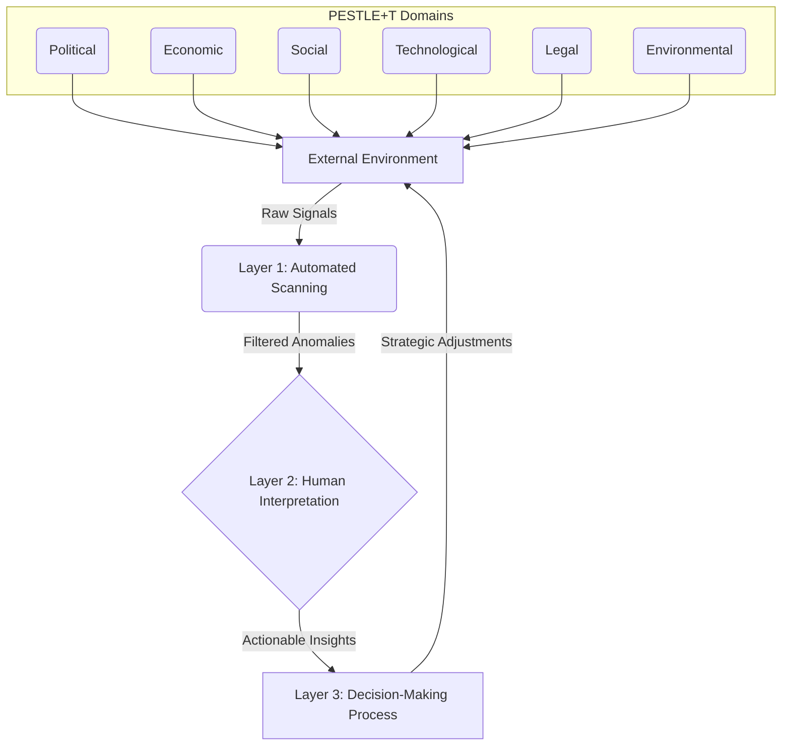

### 1. Context

No system, whether a business, a city, or an ecosystem, exists in a vacuum; each is a living entity breathing within a larger whole. All are embedded in a dynamic and complex environment characterized by constant change. Markets shift due to new technologies and consumer preferences, regulations are enacted and repealed, competitors launch new products and strategies, and social values evolve. For any organization to survive and thrive, it must be able to perceive and understand these external changes, to feel the pulse of the world around it. In traditional organizations, this function is often distributed and informal, a ghost in the machine. Market analysts track economic trends, legal departments monitor regulatory changes, and sales teams bring back anecdotal evidence from the field. The synthesis of this information typically occurs in leadership meetings, where individuals attempt to assemble a coherent picture from disparate and often conflicting signals. This ad-hoc approach is often slow, incomplete, and prone to biases, leaving the organization vulnerable to unforeseen threats and missed opportunities, lacking the living memory to handle novelty. The increasing velocity and complexity of the modern world, however, are rendering these traditional, informal methods of environmental sensing obsolete. The sheer volume of information, the interconnectedness of global systems, and the accelerating pace of technological change demand a more systematic, rigorous, and responsive approach to understanding the world outside the organization's walls—a true sensory nervous system.

### 2. Problem

> **The core conflict is Breadth of Scanning vs. Depth of Interpretation.**

The fundamental challenge in sensing the environment is managing the tension between casting a wide net to capture all potentially relevant signals and having the capacity to analyze and understand the implications of those signals, to find the life within the data. This core conflict manifests through several competing forces:

-   **Force 1: Signal vs. Noise.** The modern environment is a firehose of information. An organization can monitor thousands of data streams, from financial markets and social media to scientific publications and political news. The vast majority of this data is noise, irrelevant to the organization's specific context. The difficulty lies in filtering this deluge to identify the true signals—the pieces of information that indicate a meaningful, vital change in the environment.
-   **Force 2: Known Unknowns vs. Unknown Unknowns.** It is relatively straightforward to set up monitoring for anticipated changes, such as a pending piece of legislation or a competitor's announced product launch. These are the "known unknowns." However, the most significant disruptions—the moments that truly test a system's aliveness—often come from "unknown unknowns"—events or trends that were not on anyone's radar, such as a novel technology emerging from a completely different field or a sudden geopolitical crisis. A robust sensing system must be able to detect both, to remain open to the unexpected pulse of the world.
-   **Force 3: Speed vs. Accuracy.** The earliest signals of a change are often weak, ambiguous, and contradictory. Waiting for a clear and unambiguous signal often means it is too late to act effectively. Acting on early, noisy signals, however, risks overreacting to false alarms and wasting resources. The challenge is to find the right balance, developing a tolerance for ambiguity while still being able to act decisively when necessary, to dance with uncertainty.
-   **Force 4: Centralization vs. Decentralization.** Sensing can be centralized in a dedicated team of analysts, which ensures consistency and depth of analysis. However, this can create a bottleneck and distance the sensing function from the operational parts of the organization, creating a void where the system's soul should be. Alternatively, sensing can be decentralized, with individuals and teams across the organization responsible for monitoring their specific parts of the environment. This increases the breadth of scanning and the speed of response, allowing the system to breathe through many pores, but can lead to a fragmented and incoherent overall picture.

### 3. Solution

> **Therefore, operationalize a multi-layered sensing system that combines broad, automated scanning with deep, expert-led interpretation, and connects signals to a structured decision-making process, allowing the organization to feel and respond as a whole.**

This solution resolves the tension between breadth and depth by creating a system with distinct layers, akin to the nested layers of a living organism. The first layer is a wide-aperture, automated scanning system that continuously monitors a vast array of pre-defined signal sources across different domains (e.g., PESTLE: Political, Economic, Social, Technological, Legal, Environmental). This layer is optimized for breadth and speed, using algorithms to filter out noise and flag anomalies. The second layer consists of human experts and analysts who take the flagged anomalies and weak signals from the first layer and conduct a deeper analysis. This is where the "sense-making" happens, as experts use their judgment and experience to interpret the meaning of the signals in the context of the organization's specific situation, breathing life into the data. The third layer connects the interpreted signals to a structured decision-making process, ensuring that the insights generated by the sensing system are translated into concrete actions and that the system learns from its responses.

To illustrate this, consider the following Mermaid diagram:

This layered approach allows the organization to benefit from both the scale and speed of automation and the wisdom and judgment of human experts. The key is the interface between the layers—the process by which automated systems escalate signals to humans, and the process by which human insights are fed into the decision-making machinery of the organization. This is not a linear process, but a continuous cycle of feedback and learning, a rhythmic pulse of sensing and responding. The insights from the human analysts can be used to refine the algorithms in the automated scanning layer, making it more effective at identifying relevant signals and reducing false positives. Similarly, the outcomes of the decisions made in the third layer can be used to validate and improve the interpretation models used in the second layer, allowing the entire system to evolve its intelligence.

### 4. Implementation

Implementing a robust environment sensing system is an iterative process of continuous refinement, of growing a new organ for the organization. The following steps provide a practical roadmap:

1.  **Form a Cross-Functional Sensing Team:** The first step is to assemble a team with diverse expertise from across the organization. This team should include not only analysts but also individuals from operations, strategy, technology, and other relevant domains. This diversity is crucial for interpreting the multifaceted signals from the environment, ensuring the organization senses with its whole being. The team should be given a clear mandate from leadership and the resources it needs to succeed.
2.  **Map the Environment:** Using a framework like PESTLE+T (Political, Economic, Social, Technological, Legal, Environmental, and Talent), the team should brainstorm the key factors in the external environment that could impact the organization. For each factor, identify the 3-5 most critical signal sources. These could be anything from government publications and industry reports to social media trends and patent databases. This mapping should be a living document, continuously updated as the environment breathes and changes.
3.  **Establish a Tiered Monitoring System:**
    *   **Tier 1 (Automated Scanning):** Use web scraping tools, news APIs, and other automated methods to continuously monitor the identified signal sources. Set up keyword alerts and anomaly detection algorithms to flag significant deviations from the baseline. The goal of this tier is to cast a wide net and automate the process of information gathering as much as possible, creating a sensitive digital skin.
    *   **Tier 2 (Human Analysis):** The sensing team should meet regularly (e.g., weekly) to review the flagged signals from Tier 1. Their task is to interpret these signals, connect the dots between seemingly unrelated events, and assess their potential impact on the organization. This is where the deep, contextual understanding of the human experts comes into play, where practitioners feel agency and belonging.
    *   **Tier 3 (Strategic Response):** The insights from the sensing team must be fed into the organization's strategic planning and decision-making processes. This could take the form of regular briefings to leadership, "what-if" scenario planning exercises, or direct input into the product development roadmap. The key is to ensure that the insights are not just interesting, but actionable, completing the feedback loop that allows the system to adapt.
4.  **Develop a "Sensor Network":** Encourage individuals across the organization to act as "sensors" by providing a simple mechanism for them to submit observations and insights from their daily work. This could be a dedicated Slack channel, a simple web form, or a regular agenda item in team meetings. This decentralizes the sensing function and captures valuable tacit knowledge that would otherwise be lost, tapping into the collective intelligence of the whole system.
5.  **Define a Protocol for "Unknown Unknowns":** No matter how thorough the scanning process, there will always be surprises. It is essential to have a protocol for dealing with them, a way to maintain poise in the face of novelty. This could involve periodically conducting "horizon scanning" exercises, where the team deliberately looks for weak signals and emerging trends outside of the established monitoring framework. It could also involve war-gaming exercises to test the organization's resilience to unexpected shocks.

**Common Pitfalls:**
*   **Analysis Paralysis:** Collecting too much data without a clear framework for interpretation can lead to information overload and inaction, a sign of a system that can't digest its experience.
*   **Confirmation Bias:** The sensing team may be unconsciously biased towards seeing signals that confirm their existing beliefs and ignoring those that challenge them, creating a dangerous echo chamber.
*   **Failure to Communicate:** The insights from the sensing team are useless if they are not effectively communicated to the decision-makers in a timely and compelling manner, breaking the vital connection between sense and response.

### 5. Consequences

**Benefits:**
-   **Enhanced Adaptability:** A well-implemented environment sensing system allows an organization to be more proactive and adaptable in the face of change. It provides an early warning system for potential threats and opportunities, giving the organization more time to respond with intelligence and grace.
-   **Improved Strategic Decision-Making:** By providing a richer and more nuanced understanding of the external environment, this pattern enables more robust and resilient strategic decision-making. It helps to avoid the "we didn't see it coming" syndrome, replacing reactive panic with proactive poise.
-   **Increased Resilience:** By systematically identifying and assessing a wide range of potential disruptions, the organization can develop contingency plans and build the necessary resilience to weather unexpected shocks. The system learns to bend without breaking.

**Liabilities:**
-   **Cost and Complexity:** Implementing and maintaining a comprehensive environment sensing system can be expensive and resource-intensive, requiring specialized tools and expertise. It is a significant investment in organizational vitality.
-   **Risk of False Positives:** Automated scanning systems can generate a high volume of false positives, which can overwhelm the human analysts and lead to "alert fatigue," dulling the very senses the system is meant to sharpen.
-   **Interpretation is an Art:** The interpretation of ambiguous signals is more of an art than a science. It requires a high degree of judgment and is susceptible to the biases and blind spots of the analysts. The quality of sense-making is only as good as the wisdom of the sense-makers.

**When NOT to use this pattern:**
-   For small, internal-facing teams or projects with minimal exposure to the external environment, where the cost of sensing outweighs the benefits of the added awareness.

### 6. Known Uses

-   **Royal Dutch Shell (Scenario Planning):** Shell has been a pioneer in the use of scenario planning since the 1970s. Their process involves developing a set of plausible future scenarios based on a deep analysis of global political, economic, and social trends. This is a form of environment sensing that allows the company to test its strategy against a range of possible futures and build the necessary resilience to navigate uncertainty. For example, their early recognition of the potential for a global energy crisis in the 1970s allowed them to weather the storm much better than their competitors, demonstrating a remarkable organizational prescience.
-   **The US Intelligence Community (The "Intelligence Cycle"):** The process of collecting, analyzing, and disseminating intelligence is a highly formalized and sophisticated form of environment sensing. The intelligence cycle involves identifying intelligence requirements, collecting information from a wide range of sources (human intelligence, signals intelligence, etc.), processing and analyzing that information to produce actionable intelligence, and disseminating that intelligence to policymakers. This systematic process is designed to provide decision-makers with a comprehensive and timely understanding of the global security environment, a living map of a complex world.
-   **Nike and Adidas (Competitive Strategy):** The rivalry between Nike and Adidas in the sportswear industry is a masterclass in environment sensing. Both companies continuously scan the environment for shifts in consumer preferences, fashion trends, and technological innovations, feeling the subtle shifts in the cultural zeitgeist. Nike, for instance, excels at cultural sensing, using high-profile athlete endorsements and collaborations with fashion designers to stay at the forefront of street style. Their investment in technology, such as the Nike+ ecosystem, was a direct response to the growing trend of quantifiable self. Adidas, on the other hand, has demonstrated a keen sense of the market by using a differential pricing strategy and forming strategic partnerships with major sporting events like the FIFA World Cup. Their acquisition of Reebok was a strategic move to gain a stronger foothold in the US market and leverage Reebok's fitness-oriented brand identity.
-   **Toyota (Supply Chain Management):** Toyota's renowned production system is underpinned by a sophisticated environment sensing capability focused on its supply chain. The company continuously monitors a vast array of signals, from geopolitical developments and trade policies to raw material prices and natural disaster risks. This allows them to anticipate potential disruptions and proactively adjust their supply chain strategies, creating a supply web that is both efficient and alive. For example, in response to the 2011 earthquake and tsunami in Japan, Toyota was able to quickly re-route its supply chains and minimize production downtime, demonstrating the resilience that comes from a deep understanding of the operating environment.

### 7. Cognitive Era Considerations

-   **AI-Powered Scanning and Filtering:** The rise of AI and machine learning will supercharge the "Layer 1" automated scanning capabilities of this pattern. AI agents can monitor a vastly larger and more diverse set of data sources than humans, including real-time social media feeds, satellite imagery, and the dark web. They can also be trained to identify increasingly subtle patterns and anomalies that would be invisible to human analysts, acting as a powerful extension of our collective senses.
-   **Generative AI for Scenario Development:** Generative AI models can be used to accelerate the "Layer 2" interpretation process. For example, a human analyst could feed a set of weak signals into a large language model and ask it to generate a set of plausible future scenarios. This can help to overcome human biases and broaden the range of possibilities considered, injecting creative life into strategic conversations.
-   **The "Cyborg" Analyst:** The future of environment sensing is likely to be a hybrid of human and machine intelligence. AI agents will do the heavy lifting of data collection and filtering, while human analysts will focus on the higher-level tasks of interpretation, sense-making, and strategic judgment. This "cyborg" approach will combine the scale and speed of AI with the wisdom and creativity of humans, creating a partnership that enhances the vitality of both.
-   **New Risks: Algorithmic Bias and Opaque Models:** As we rely more on AI for environment sensing, we also introduce new risks. The algorithms used to filter and interpret signals may have hidden biases, leading to a skewed or incomplete picture of the environment. The models themselves may be so complex as to be opaque, making it difficult to understand how they arrived at a particular conclusion. This makes it crucial to maintain a "human in the loop" to question and validate the outputs of the AI systems, ensuring the machine does not extinguish the human spirit of inquiry.

### 8. Vitality: The Quality Without a Name

When the Environment Sensing pattern is truly alive, the organization feels like a conscious organism, its skin tingling with information from the world around it. There's a palpable sense of awareness, a hum of quiet confidence that comes from knowing you are not flying blind. Practitioners don't just feel like cogs in a machine; they feel like sensory organs, their unique perspectives valued as vital inputs to the collective intelligence. The system breathes. It inhales raw data and exhales meaning. When confronted with the unexpected—a sudden market shift, a disruptive technology emerging from a garage—the organization doesn't panic or freeze. Instead, it leans in with curiosity, its well-practiced sensing capabilities allowing it to adapt and even thrive on surprise. There is a tangible quality of wholeness, a sense that the organization's actions are coherent and deeply connected to the reality of the world it inhabits.

Conversely, decay in this pattern manifests as a creeping numbness, a sensory deprivation that leaves the organization brittle and disconnected. The first warning sign is often a feeling of staleness, of conversations dominated by internal jargon and outdated assumptions. The organization becomes a ghost in its own machine, performing its functions with mechanical precision but lacking the living memory to handle novelty. Signals from the outside world are ignored or explained away, treated as aberrations rather than vital information. Decision-making becomes an echo chamber, reinforcing existing biases until the organization is dangerously out of sync with its environment. The felt sense is one of stagnation and anxiety, a low-grade fear that the world is changing in ways the organization can no longer understand. This is the path toward irrelevance, a slow fading of the organizational life force.
