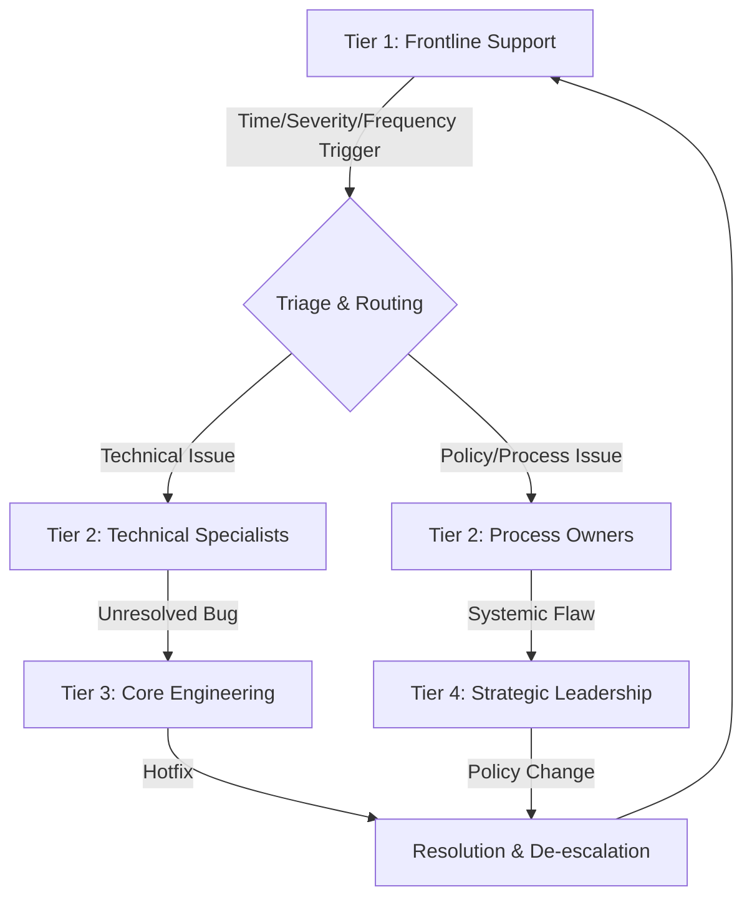

### 1. Context

In any complex system, from a multinational corporation to a local food cooperative, information and issues arise at different levels of granularity. Frontline teams are adept at handling day-to-day operational challenges, but they often lack the broader perspective or authority to address systemic problems. Conversely, strategic leadership has the global view but is disconnected from the granular details of daily operations. This creates a gap where critical information can be lost or ignored. Issues that are minor in isolation can accumulate into significant systemic risks if not properly identified, aggregated, and elevated. Without a formal mechanism to bridge this gap, organizations become either paralyzed by information overload at the top or blinded by a lack of critical feedback from the ground. The system's ability to learn, adapt, and evolve is fundamentally constrained by its ability to move information effectively between its different functional layers. This pattern addresses the need for a structured, reliable 
pathway for important signals to travel where they are needed most.

### 2. Problem

> **The core conflict is Local Autonomy vs. Systemic Coherence.**

A system must empower its components—teams, departments, individuals—to act autonomously on local information to remain agile and responsive. However, this localized action can lead to fragmentation and the emergence of systemic risks that no single component can see. The challenge is to maintain systemic coherence without stifling local initiative. This tension manifests through several forces:

1.  **Signal vs. Noise:** Frontline teams are inundated with information. Most of it is operational noise, but hidden within are critical signals of systemic issues. Without a clear filtering and aggregation mechanism, teams either escalate everything, causing alarm fatigue and overwhelming senior leadership, or they escalate nothing, allowing critical problems to fester.
2.  **Incident vs. Pattern:** A single customer complaint is an incident. A hundred complaints about the same issue is a pattern. The system needs a way to distinguish between isolated events that can be handled locally and recurring patterns that signify a deeper, structural problem requiring higher-level intervention. This requires memory and the ability to correlate seemingly disconnected events over time.
3.  **Authority vs. Responsibility:** Often, the team that identifies a problem lacks the authority or resources to solve it. For example, a customer support team may identify a critical product bug, but only the engineering team can fix it. An effective escalation process ensures that responsibility is matched with the necessary authority to act.
4.  **Urgency vs. Importance:** The most urgent issues are not always the most important. Teams tend to focus on immediate, visible problems (the squeaky wheel), while slow-burning, strategic issues are neglected. An escalation framework must provide a way to prioritize issues based on their potential long-term impact, not just their immediate visibility.

### 3. Solution

> **Therefore, design and implement a multi-level escalation framework with clear triggers, defined pathways, and explicit roles that specifies how, when, and to whom issues are elevated.**

This solution moves beyond ad-hoc, personality-driven escalation to a formal, predictable, and transparent process. The core of the solution is to treat escalation not as a failure, but as a vital function of a healthy, adaptive system. It acts as the system's nervous system, ensuring that the right information reaches the right decision-makers at the right time.

The mechanism involves several key components:

*   **Tiered Structure:** Establish multiple levels of support or response, typically from Tier 1 (frontline) to Tier 3 or 4 (specialized experts or senior leadership). Each tier has a defined scope of responsibility and the authority to resolve a specific class of issues.
*   **Clear Triggers:** Define objective criteria for when an issue should be escalated from one tier to the next. These are not based on subjective judgment alone but on measurable data. Triggers can include:
    *   **Time-based:** The issue is not resolved within a specified Service Level Agreement (SLA).
    *   **Severity-based:** The issue's impact exceeds a predefined threshold (e.g., financial loss, number of users affected, security risk).
    *   **Frequency-based:** The same issue or type of issue recurs more than N times in a given period.
    *   **Expertise-based:** The current tier lacks the required knowledge or permissions to resolve the issue.
*   **Defined Pathways:** For each trigger, there must be a clearly documented path to the next level or a specific team. This eliminates ambiguity and ensures the issue doesn't get lost in transit. The pathway should specify the communication channel (e.g., ticketing system, dedicated Slack channel) and the information to be included in the escalation package.

This diagram illustrates a typical multi-tier escalation path. An issue originates at Tier 1 and is routed by a triage function based on its nature. It progresses through the tiers until it reaches a level with the authority and capability to resolve it, at which point the resolution is communicated back down the chain.

### 4. Implementation

Implementing a robust Feedback Escalation pattern requires careful planning and clear communication. It is a socio-technical system that combines human processes with supporting technology.

1.  **Map Your Tiers and Define Scope:** Identify the distinct levels of response in your organization. This might be a formal structure like L1/L2/L3 support in a tech company, or a more informal structure in a community group (e.g., member -> facilitator -> steering committee). For each tier, clearly document its responsibilities, decision-making authority, and the types of problems it is expected to solve independently.

2.  **Develop Objective Escalation Triggers:** For each boundary between tiers, define the specific, measurable conditions that trigger an escalation. Avoid vague guidelines like "escalate when necessary." Instead, use concrete rules:
    *   *Example (Time):* "If a Tier 1 agent cannot resolve a customer issue within 60 minutes, it must be escalated to Tier 2."
    *   *Example (Severity):* "Any security incident involving customer data must be immediately escalated to the Incident Response Team."
    *   *Example (Frequency):* "If the same bug is reported by more than 5 customers in a 24-hour period, it is automatically escalated to the engineering backlog for prioritization."

3.  **Design the Escalation Workflow:** Document the end-to-end process. Use a ticketing system (like Zendesk, Jira, or even a shared Trello board) to create a formal record of the escalation. The workflow should specify:
    *   **Who:** The specific role or team that receives the escalation.
    *   **What:** The information that must be included in the "escalation package" (e.g., summary of the issue, steps already taken, customer impact, relevant logs or data).
    *   **How:** The channel for escalation (e.g., `@-mention` in a specific Slack channel, assigning a ticket).
    *   **When:** The expected response time (SLA) for the receiving tier.

4.  **Automate Where Possible:** Use tools to automate the mechanical parts of the process. Ticketing systems can automatically escalate tickets that breach an SLA. Monitoring tools can create alerts based on performance thresholds. This frees up humans to focus on the diagnosis and resolution, rather than the process itself.

5.  **Define De-escalation and Communication:** Resolution is not the end of the process. The solution must be communicated back to the tier that originated the escalation, and most importantly, to the affected stakeholders (customers, users, community members). This closes the feedback loop and builds trust. The de-escalation path should be as clearly defined as the escalation path.

6.  **Train and Empower Your Team:** The best-designed process will fail if the team is not trained on how to use it or is not empowered to make decisions. Ensure everyone understands their role, the escalation triggers, and the importance of the process. Empower frontline teams to resolve issues within their scope without fear of reprisal for making a mistake.

7.  **Monitor and Calibrate:** An escalation process is not static. Regularly review its performance. Are too many issues being escalated (indicating a need for better training or resources at lower tiers)? Are too few being escalated (indicating a fear of escalation or unclear triggers)? Use data from your ticketing and monitoring systems to identify bottlenecks and areas for improvement. Calibrate your triggers and SLAs as the system evolves.

### 5. Consequences

**Benefits:**
-   **Improved Responsiveness:** Critical issues are identified and addressed more quickly, reducing their potential negative impact. This leads to higher customer satisfaction and system stability.
-   **Systemic Problem Solving:** The pattern provides a mechanism for moving beyond firefighting individual incidents to addressing the root causes of recurring problems, leading to long-term improvements.
-   **Clarity and Reduced Stress:** A clear process reduces ambiguity and stress for team members, who know exactly what to do when they encounter a problem they cannot solve. It provides psychological safety.
-   **Organizational Learning:** The data generated by the escalation process provides invaluable insight into the health of the system, highlighting areas of friction, knowledge gaps, or resource shortages.

**Liabilities:**
-   **Bureaucratic Overhead:** If poorly designed, the process can become overly bureaucratic and slow, hindering rather than helping resolution. The focus must remain on effective resolution, not process for its own sake.
-   **Gaming the System:** Team members may be incentivized to "pass the buck" by escalating issues to avoid responsibility, or conversely, avoid escalating to meet performance metrics (e.g., "first-call resolution rate").
-   **Loss of Context:** As an issue is passed from one team to another, important context can be lost, forcing the receiving team to re-investigate from scratch and frustrating the stakeholder who reported the issue.

**When NOT to use this pattern:**
-   In very small, flat organizations (e.g., a 3-person startup) where all information is shared implicitly and everyone has a global view of the system. In this context, a formal process would be unnecessary overhead.
-   For creative or exploratory work that is not problem-oriented. The structure of an escalation process can stifle the ambiguity and experimentation required for innovation.

### 6. Known Uses

1.  **Zendesk Customer Support:** Zendesk is a prime example of a company that both uses and provides tools for this pattern. Within their own customer support, they use a tiered model. A customer query first goes to a Tier 1 agent. If the issue is complex, requires technical knowledge, or is a bug, the agent escalates it to a Tier 2 (technical support) or Tier 3 (engineering) team using their own Zendesk software. The software automates the process with SLAs, ensuring tickets don't get lost and are resolved within a target timeframe. This has allowed them to scale their support operations to handle millions of customers effectively.

2.  **The US National Transportation Safety Board (NTSB):** When an aviation incident occurs, a highly structured escalation process is triggered. Local authorities (airport, airline) provide the initial response. However, based on the severity of the incident (e.g., fatalities, substantial aircraft damage), the NTSB is immediately notified and takes lead jurisdiction. The NTSB's "Go Team" is a pre-defined group of specialists who are deployed to the scene. This represents a clear escalation from a local operational response to a national-level strategic investigation aimed at identifying systemic causes to prevent future accidents. The findings of the NTSB are then de-escalated as safety recommendations to the entire aviation industry.

3.  **Valve Corporation's Flat Hierarchy:** Valve, the video game company, is famous for its flat organizational structure. However, even in a system that prizes autonomy, a form of this pattern exists. While any employee can start a project, to get it shipped, they need to build consensus and attract a critical mass of colleagues to work on it. If a project is failing or causing problems, that becomes a signal that is implicitly "escalated" through peer-to-peer feedback. If an employee is consistently causing issues, a group of peers can come together to address the problem, and in extreme cases, decide to terminate their employment. It's a decentralized, peer-driven form of escalation, but it follows the same principle of elevating a problem to a group with the authority to resolve it.

### 7. Cognitive Era Considerations

The introduction of AI and autonomous agents profoundly transforms the Feedback Escalation pattern, shifting the burden of mechanical tasks to machines while elevating the importance of human judgment.

-   **Automated Triage and Signal Detection:** AI agents can monitor vast streams of data—support tickets, server logs, social media mentions, community forum posts—in real-time. Using natural language processing and anomaly detection, they can perform initial triage with superhuman speed and accuracy. An agent can identify that 15 seemingly unrelated support tickets and a spike in error logs all point to the same underlying database issue, a pattern a human might miss. This automates the "Signal vs. Noise" and "Incident vs. Pattern" filtering.

-   **Predictive Escalation:** Instead of waiting for an SLA to be breached, agents can predict which issues are *likely* to require escalation. By analyzing the text of a support ticket and comparing it to millions of historical cases, an agent can calculate a "resolution probability" for the current tier. If the probability is low, it can pre-emptively escalate the issue or recommend escalation to the human agent, saving valuable time.

-   **Augmented Human Judgment:** The role of the human shifts from process operator to strategic decision-maker. When an agent flags a pattern for escalation, it can present a summarized dossier to a human expert. This dossier would include the detected pattern, a list of all affected systems and users, a probable root cause analysis, and a set of recommended actions. The human's role is to apply contextual understanding, business priorities, and ethical judgment to decide on the final course of action. For example, is this technical issue also a public relations crisis?

-   **New Risks: Algorithmic Bias and Opaque Decisions:** A new set of risks emerges. The AI agent may be trained on biased historical data, learning to de-prioritize issues from certain user demographics. Its decision-making process might be a black box, making it difficult to understand *why* it chose to escalate one issue and ignore another. The implementation of AI in escalation workflows must include mechanisms for auditability, transparency, and human oversight to mitigate these risks and ensure the process remains fair and effective.
