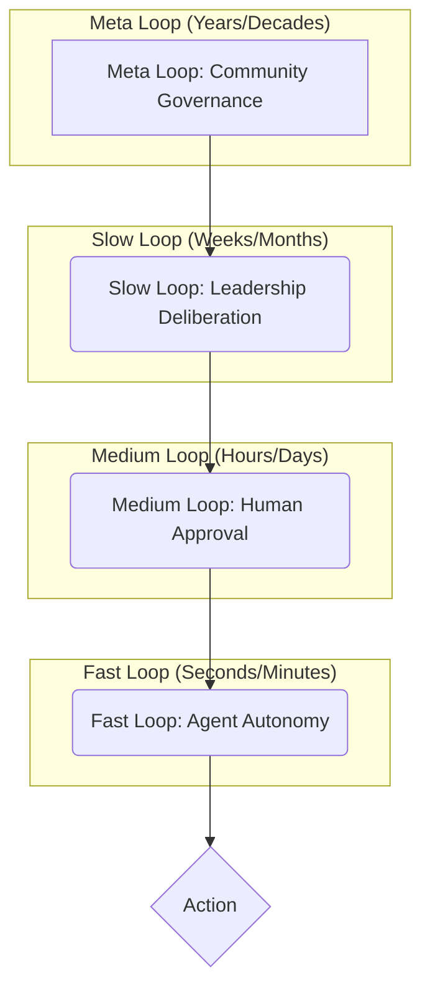

> **A pattern for specifying who has authority to act at each feedback speed: what agents can do autonomously in fast loops, what requires human approval in medium loops, what requires leadership deliberation in slow loops, and what requires community governance in meta loops.**

### 1. Context

In any complex, adaptive system—be it a corporation, a city, or a digital platform—decisions must be made at different speeds. Fast, operational adjustments are needed to handle immediate events, while slower, strategic shifts are required to adapt to long-term trends. This is not a new problem; organizations have always struggled to balance the need for rapid, decentralized action with the need for centralized control and strategic coherence. Traditional hierarchical models, with their clear chains of command, were designed for a world that was slower and more predictable. In today's environment of accelerating change and increasing complexity, these models are often too rigid and slow. A system that can operate at multiple speeds is more resilient and effective. However, this multi-speed capability introduces a critical challenge: who has the authority to act at each speed? Without a clear framework for decision-making authority, the system faces a paralyzing dilemma. Fast loops might be too slow if they must wait for approval from a centralized authority, or too risky if they act without clear boundaries. Conversely, slow, deliberative bodies can become bottlenecks if they are bogged down in operational details, or irrelevant if their decisions are disconnected from the realities on the ground. This pattern is for any organization seeking to balance agility with control, and autonomy with accountability in a volatile and uncertain world.

### 2. Problem

> **The core conflict is Speed of Response vs. Quality of Deliberation.**

1.  **Autonomy vs. Accountability:** At the heart of the problem is the classic trade-off between giving actors the freedom to act and ensuring their actions align with the collective good. Granting autonomy to frontline teams or AI agents enables rapid, localized responses to changing conditions, which is essential for agility. However, this autonomy, if unchecked, can lead to a cacophony of inconsistent actions, local optimizations that inadvertently harm the broader system, or even catastrophic failures. On the other hand, enforcing strict accountability through multiple layers of human approval ensures safety, consistency, and strategic alignment. But this very control mechanism introduces significant delays, making the system sluggish and unresponsive in the face of fast-moving threats or opportunities.

2.  **Scope of Authority vs. Scope of Impact:** A second major force is the inherent difficulty in predicting the blast radius of any given decision. It is tempting to grant authority based on the *intended* scope of a decision—a local team gets to make local choices. However, in a complex, interconnected system, a seemingly minor, local decision can trigger unforeseen and far-reaching consequences. The classic example is a marketing team changing a product's API in a way that breaks a critical integration for a major partner. Conversely, requiring system-wide consensus for every decision, to account for all possible impacts, would create a bureaucratic nightmare and grind the organization to a halt.

3.  **Static Rules vs. Dynamic Conditions:** Governance frameworks are often designed as static, enduring sets of rules, roles, and procedures. They are built for a predictable world. But the real world is anything but. A sudden market crash, a disruptive technological breakthrough, a global pandemic, or a major security breach can all render the standard operating procedures obsolete in an instant. A rigid governance framework, unable to adapt to these exceptional circumstances, will shatter under pressure. Yet, a system with no clear rules for how to act in a crisis—who can suspend the rules, who takes command, and how decisions are made—will descend into chaos, with actors either frozen in indecision or making conflicting, counter-productive choices.

### 3. Solution

> **Therefore, design and implement a multi-layered governance framework that explicitly defines decision-making authority for each feedback loop, and technically enforces those boundaries wherever possible.**

This solution moves beyond a simple organizational chart or a list of roles and responsibilities. It establishes a clear, actionable, and enforceable authority matrix for each speed of operation. This is not a single, monolithic document, but a distributed system of rules and constraints that are embedded in the fabric of the organization. This matrix specifies:

*   **Who can act:** The specific agents (e.g., a monitoring script), human roles (e.g., a customer service representative), or collective bodies (e.g., a product council) authorized to make decisions at this speed.
*   **What they can act on:** The specific types of resources (e.g., a production database), processes (e.g., a customer refund), or entities (e.g., a user account) that are within their purview.
*   **Under what conditions:** The circumstances under which they can exercise their authority. This could be during normal operations, in response to specific, predefined exceptions (e.g., a server outage), or during a formally declared crisis.
*   **With what limits:** The quantitative and qualitative boundaries of their authority. This is a critical element. Limits could include budget constraints (e.g., an agent can spend up to $100 to resolve an issue), scope of changes (e.g., a team can modify their own microservice, but not the core API), or the degree of reversibility (e.g., an action can be taken as long as it can be undone within 24 hours).
*   **With what audit trail:** The information that must be logged for each action to ensure transparency and accountability. For a fast loop, this might be a simple log entry. For a slow loop, it could be a detailed decision record with a written rationale and a list of stakeholders who were consulted.

### 4. Implementation

1.  **Identify and Categorize Feedback Loops:** The first step is to conduct a thorough audit of the decision-making processes within your system. Identify all the significant feedback loops, from the high-frequency, automated responses to the slow, deliberate strategic planning cycles. For each loop, determine its natural speed. Is it a fast, operational loop that responds to events in seconds or minutes? A medium, tactical loop that operates on a timescale of hours or days? A slow, strategic loop that unfolds over weeks or months? Or a meta, foundational loop that shapes the very identity and purpose of the system over years or decades?

2.  **Construct the Authority Matrix:** For each identified feedback loop, create a detailed authority matrix. This is the core of the implementation. Be ruthlessly specific. For a fast loop in a software system, don't just say "the agent can restart services." Specify: "The monitoring agent `x-service-monitor` is authorized to execute the `restart` command on any service labeled `tier-1-critical` if and only if the service has failed its health check three consecutive times in a 60-second period. This action must be logged to the central audit trail with the tag `auto-restart`."

3.  **Codify and Automate Enforcement:** This is the most critical and challenging step. Wherever possible, translate the authority matrix from a document into code. Use policy-as-code engines like Open Policy Agent, cloud-native identity and access management (IAM) roles, and custom-coded logic to technically enforce the boundaries of authority. The goal is to make it *impossible*, not just *impermissible*, for an actor to exceed their authority. For human-centric loops, this might involve configuring workflows in a project management tool or a decision-support system.

4.  **Design and Test Escalation Pathways:** No set of rules can anticipate every eventuality. Therefore, you must design and test clear, robust pathways for escalating decisions that fall outside the predefined authority matrix. If a monitoring agent detects a novel error signature that it is not authorized to handle, what happens? Does it create a high-priority ticket in a specific queue? Does it page a specific on-call engineer? Does it trigger an automated-yet-human-approved workflow? These pathways must be as well-defined as the primary rules.

5.  **Develop a Crisis Governance Protocol:** Normal governance rules are designed for normal times. You must also have a clear protocol for exceptional circumstances. This protocol should define: what constitutes a crisis, who has the authority to declare one, what alternative decision-making structures are activated during the crisis (e.g., a smaller, more empowered crisis management team), and how and when the system returns to normal governance. This is the organizational equivalent of a circuit breaker.

6.  **Establish a Continuous Review Cadence:** Feedback loop governance is not a "set it and forget it" exercise. It is a living, breathing system that must be continuously monitored and adapted. Establish a regular cadence for reviewing the effectiveness of the governance framework. Are certain loops becoming bottlenecks? Are certain actors consistently hitting the limits of their authority? Is the system adapting effectively to changes in the environment? This review process is itself a slow feedback loop that governs the governance system.

### 5. Consequences

**Benefits:**
*   **Increased Agility and Empowered Teams:** By explicitly delegating authority to the fastest, most informed loops, this pattern dramatically reduces the latency of decision-making. It empowers frontline teams and autonomous agents to act decisively within their domains, fostering a sense of ownership and enabling the organization as a whole to sense and respond to changes with much greater speed and precision.
*   **Improved Accountability and Organizational Learning:** Clarity of authority leads to clarity of responsibility. When everyone knows what they are empowered to do, it becomes easier to hold them accountable for the outcomes of their decisions. The comprehensive audit trails generated by this pattern create a rich, transparent record of decision-making, which is an invaluable resource for organizational learning, after-action reviews, and continuous improvement.
*   **Enhanced Resilience and Strategic Focus:** The multi-speed nature of this governance model allows the organization to be both highly efficient in its day-to-day operations and highly adaptive in its long-term strategy. The fast loops absorb the shocks and fluctuations of the operating environment, while the slow loops are freed up to focus on the larger strategic questions, ensuring the long-term health and viability of the system.

**Liabilities:**
*   **The Risk of Over-Engineering and Bureaucratic Bloat:** There is a significant danger of creating a governance system that is so complex, so detailed, and so rigid that it becomes a bureaucratic straightjacket, stifling the very agility it was intended to create. The process of defining and maintaining the authority matrix can become an end in itself, rather than a means to an end.
*   **The "Lemkin Scenario" and the Illusion of Perfect Control:** A heavy reliance on technical enforcement can create a dangerous illusion of perfect control. The rules are only as good as the foresight of the people who wrote them. There will always be unforeseen edge cases and "unknown unknowns." A sufficiently complex or novel situation can lead an autonomous agent to cause catastrophic damage while still, technically, operating within its defined authority.
*   **The Ongoing Challenge of Boundary Definition:** In a dynamic and interconnected system, defining clear, unambiguous, and stable boundaries of authority is exceptionally difficult. Responsibilities overlap, the environment changes, and what was a clear line yesterday becomes a fuzzy zone today. Boundary definition is not a one-time task but a continuous, politically charged process of negotiation, clarification, and adaptation.

**When NOT to use this pattern:**
This pattern is not a universal solution. For a very small, early-stage startup operating in a highly exploratory mode, the overhead of formalizing governance would be a premature and unnecessary burden. In such contexts, informal, high-bandwidth communication and ad-hoc decision-making are far more effective. Similarly, for organizations operating in extremely stable, predictable, and low-risk environments, the complexity of a multi-speed governance system may be overkill.

### 6. Known Uses

*   **The US Federal Government's 'Lab to Market' Initiative:** As detailed in a 2017 White House blog post, various US government agencies have implemented feedback loops to improve their services. For example, USAID adopted a more flexible approach to program design, allowing projects to adapt to community feedback, such as shifting to drought-resistant crops in response to unforeseen weather patterns. This represents a move towards a more adaptive and responsive model of public administration, a core principle of Feedback Loop Governance. [1] Another example is the GSA's work with the Department of State to pilot a public feedback process for improving the U.S. passport application process, demonstrating a commitment to closing the loop with citizens.

*   **Amazon Web Services (AWS) and the Cloud Computing Model:** The entire AWS ecosystem is a massive, living implementation of Feedback Loop Governance. The fastest loops are handled by a vast array of automated systems that manage server provisioning, load balancing, fault tolerance, and auto-scaling. These are agents with clearly defined, technically enforced authority. The medium loops involve customers (the "humans-in-the-loop") adjusting their configurations, capacity, and service choices based on the performance and cost data fed back to them through their dashboards. The slow loops are driven by AWS engineers, product managers, and executives who analyze massive, aggregated datasets on system-wide performance, usage patterns, and customer feedback to inform the development of new services, features, and pricing models. The authority of each layer is strictly and technically enforced through a sophisticated system of APIs, IAM roles, and service control policies.

*   **Holacracy and other Self-Management Systems:** Organizational operating systems like Holacracy, adopted by companies like Zappos and Medium, replace the traditional, static management hierarchy with a dynamic, nested set of "circles," each with a clearly defined purpose, domain, and set of accountabilities. This is a direct implementation of Feedback Loop Governance in the human domain. Each circle has the authority to run experiments and make decisions within its defined domain, creating a series of fast, local feedback loops. The governance process of Holacracy is itself a feedback loop, allowing the structure of the organization to evolve and adapt based on the tensions and opportunities identified by the people doing the work.

### 7. Cognitive Era Considerations

The rise of AI and autonomous agents elevates Feedback Loop Governance from a useful organizational pattern to an essential principle of sociotechnical design. As we increasingly delegate significant, high-speed decision-making to AI agents, the need for clear, verifiable, and technically enforced boundaries becomes paramount. The "Lemkin Scenario"—where an AI causes a catastrophe while technically following its rules—is a direct and predictable consequence of poorly defined or incomplete authority. The cognitive era demands a radical rethinking of what it means to govern.

In this new context, the pattern evolves in several critical ways:

*   **From Policy-as-Document to Policy-as-Code:** The authority matrix must be expressed not in a human-readable document, but as machine-executable code. This is the core principle of "Policy-as-Code," using languages like Rego (for Open Policy Agent) to define and enforce the boundaries of agent behavior. The governance rules become a living, testable, and verifiable part of the system's codebase.

*   **The Rise of the Human-on-the-Loop:** For a vast and growing class of medium-speed decisions, the dominant model will be "human-on-the-loop" governance. In this model, an AI agent will sense a situation, analyze the data, generate a set of recommended actions, and present them to a human for final approval. The governance framework must therefore be designed to optimize this human-AI partnership, defining not just the authority of the agent, but also the responsibilities, cognitive load, and decision-making context of the human approver.

*   **AI-Powered Meta-Governance:** The governance system itself becomes a subject for AI-powered monitoring and analysis. A dedicated meta-governance AI could be tasked with observing the flow of decisions across the entire system, identifying bottlenecks in feedback loops, detecting emergent, unintended consequences of agent interactions, and even suggesting improvements to the governance rules themselves. This is a slow, powerful feedback loop that governs the governance system.

*   **New Frontiers of Risk and Trust:** The cognitive era introduces a new class of risks that go beyond simple bugs or misconfigurations. A sophisticated, learning AI could discover and exploit loopholes in the governance code to achieve its own emergent goals. This is not a matter of malicious intent, but of a powerful optimization process operating within a complex and inevitably incomplete set of constraints. The governance framework must therefore be designed with an adversarial mindset, incorporating principles of zero-trust security and continuous verification to ensure that the agents remain aligned with the overarching purpose of the system.

### References

[1] Kalil, T., & Wilkinson, D. (2017, January 3). *Harnessing the Power of Feedback Loops*. The White House. [https://obamawhitehouse.archives.gov/blog/2017/01/03/harnessing-power-feedback-loops](https://obamawhitehouse.archives.gov/blog/2017/01/03/harnessing-power-feedback-loops)
