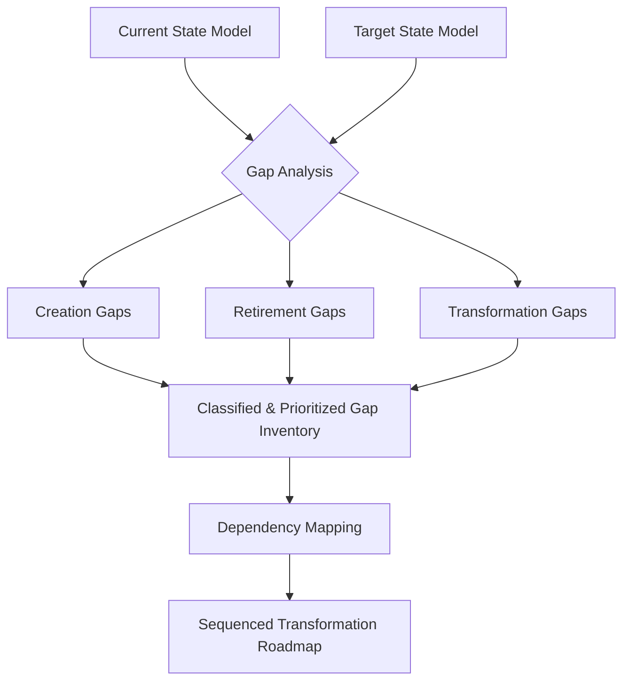

### 1. Context

In any endeavor involving growth, adaptation, or transformation, the fundamental challenge is navigating from a known present to a desired future. This is true for a corporation restructuring its business model, a city government implementing a new sustainability policy, a community organization scaling its services, or a software team migrating to a new architecture. The path forward is rarely a straight line. It is a complex landscape of interconnected systems, processes, capabilities, and cultural norms. Without a structured approach to understanding the distance and nature of the required change, strategic initiatives often falter. They become a series of disjointed projects, driven by departmental politics, anecdotal evidence, or the crisis of the day. The result is wasted resources, organizational fatigue, and a failure to achieve the intended strategic outcomes. The system remains stuck, unable to bridge the chasm between its current reality and its future potential. This pattern provides the map and compass needed to cross that chasm with intention and clarity.

### 2. Problem

> **The core conflict is Current State Comfort vs. Transformation Necessity.**

The imperative to transform is often met with the powerful inertia of the existing system. This inertia is not simply resistance to change; it is a complex interplay of competing forces that make a clear path forward difficult to discern.

-   **Force 1: Comprehensiveness vs. Actionability.** A truly comprehensive analysis of all the gaps between the current and future state can generate a list so long and detailed that it becomes paralyzing. The sheer volume of information overwhelms decision-makers, making it impossible to prioritize and act. Conversely, a highly selective analysis, focused only on a few obvious gaps, risks missing critical interdependencies and underlying issues, leading to failed or incomplete transformations.
-   **Force 2: Structural vs. Cultural.** Gaps are not monolithic. Some are structural, such as outdated technology, inefficient processes, or missing organizational capabilities. These are often easier to identify and address. Others are cultural, rooted in mindsets, behaviors, skills, and the unwritten rules of the organization. These cultural gaps are harder to quantify but are often the primary determinants of a transformation's success or failure. Ignoring them in favor of purely structural changes is a common and costly mistake.
-   **Force 3: Local Optimization vs. Global Transformation.** Individual departments or teams, when asked to identify gaps, will naturally focus on their own areas of responsibility. This can lead to a list of locally optimized solutions that do not add up to a coherent, system-wide transformation. Closing a gap in one area may inadvertently create a new problem in another. Without a holistic view, the organization risks improving the parts while degrading the whole.

### 3. Solution

> **Therefore, systematically compare two defined states of a system (e.g., 'current' and 'future'), entity by entity, to create a comprehensive, classified, and dependency-mapped inventory of gaps that can be sequenced into a prioritized transformation roadmap.**

The Gap Analysis pattern overcomes the forces of inertia and confusion by providing a structured, evidence-based methodology. It shifts the conversation from opinions and assumptions to a shared, objective understanding of the work to be done. The core mechanism involves comparing two distinct, well-defined models of the system, often referred to as "time slices" (e.g., Now vs. Next, or Baseline vs. Target).

Because both models are based on the same underlying structure or ontology, the comparison can be performed systematically. For each component or entity in the system model, the analysis identifies three types of gaps:

1.  **Creation Gaps:** Elements that exist in the target state but not in the current state. These represent new capabilities, technologies, roles, or processes that must be built or acquired.
2.  **Retirement Gaps:** Elements that exist in the current state but are absent in the target state. These represent legacy systems, outdated processes, or roles that must be decommissioned or phased out.
3.  **Transformation Gaps:** Elements that exist in both states but differ in their attributes, relationships, or performance. These represent existing capabilities that need to be improved, reconfigured, or repurposed.

Once identified, these gaps are not treated as a simple to-do list. They are classified by type (e.g., technology, process, skill, policy) and, crucially, their interdependencies are mapped. This reveals the critical path and prevents the common pitfall of trying to solve problems in the wrong order. The final output is not just a list of problems, but a sequenced, prioritized, and actionable roadmap for transformation.

### 4. Implementation

Implementing a successful Gap Analysis requires discipline and a commitment to a structured process. It is not a one-off workshop but a cycle of analysis, planning, and execution.

1.  **Define the States:** The first and most critical step is to have clear, detailed, and agreed-upon models of both the 'current' (Baseline) and 'future' (Target) states. These models must use a consistent language and structure to be comparable. This often involves significant work in architectural modeling or strategic planning before the gap analysis can even begin.
2.  **Perform the Comparison:** Go through the models systematically, element by element. This can be a manual process for smaller systems or automated with software tools for large, complex enterprise architectures. For each element, identify if it represents a Creation, Retirement, or Transformation gap.
3.  **Describe and Classify Each Gap:** For every identified gap, write a clear, concise description. What is the specific difference between the two states? Then, classify the gap using a consistent typology (e.g., People, Process, Technology; or Structural, Cultural, Capability). This helps in routing the gap to the right team for resolution.
4.  **Map Dependencies:** This is where the analysis becomes a powerful strategic tool. For each gap, ask: "What other gaps must be closed before this one can be addressed?" and "What other gaps does closing this one enable?" Visualize these relationships in a dependency graph. This reveals the critical path and prevents wasted effort.
5.  **Prioritize and Sequence:** With the dependency map in hand, prioritize the gaps. Use a multi-factor scoring model that includes criteria like strategic impact, business value, urgency, cost to implement, and risk. This allows for a data-driven approach to sequencing the transformation, focusing on foundational gaps first.
6.  **Develop Action Plans:** Convert the prioritized and sequenced gaps into concrete projects or initiatives. Each initiative should have a clear owner, a budget, a timeline, and success metrics. This is the handoff from analysis to execution.

**Common Pitfalls:**
-   **Analysis Paralysis:** Getting stuck in the process of identifying and classifying gaps without ever moving to action. Set a timebox for the analysis phase.
-   **Ignoring Cultural Gaps:** Focusing only on the tangible technology and process gaps because they are easier to define and measure. Cultural change must be planned and resourced with equal rigor.
-   **One-Time Effort:** Treating the gap analysis as a static report. In a dynamic environment, the gap analysis must be a living document, continuously updated as the current state evolves and the target state is refined.

### 5. Consequences

Applying the Gap Analysis pattern fundamentally changes how an organization approaches transformation, leading to significant benefits but also introducing new challenges.

**Benefits:**
-   **Clarity and Shared Understanding:** It replaces ambiguity and opinion with a clear, evidence-based picture of the required changes. This creates alignment across stakeholders and focuses effort on a common goal.
-   **Effective Prioritization:** By making dependencies and relative importance explicit, it enables leaders to make strategic choices about where to invest limited resources for the greatest impact.
-   **Reduced Risk:** By identifying and sequencing dependencies, the pattern helps to avoid costly rework and project failures caused by addressing symptoms instead of root causes.

**Liabilities:**
-   **Initial Overhead:** The process requires a significant upfront investment in modeling and analysis. For organizations not accustomed to this rigor, it can feel slow and bureaucratic at the start.
-   **Reveals Uncomfortable Truths:** A thorough gap analysis can expose deep-seated organizational dysfunctions, capability shortfalls, and sacred cows that are politically difficult to address.
-   **Potential for Rigidity:** If the resulting plan is treated as an unchangeable artifact, it can stifle agility and prevent the organization from adapting to new information or changing market conditions. The roadmap must be a living guide, not a rigid blueprint.

**When NOT to use this pattern:**
-   For small, incremental changes where the path forward is obvious and the dependencies are minimal. In such cases, the overhead of a formal gap analysis is unnecessary.
-   In a crisis situation that requires immediate, rapid response. Gap analysis is a strategic planning tool, not a crisis management technique.
-   When there is no leadership commitment to resource the resulting transformation plan. A gap analysis without the will to act is a purely academic exercise.

### 6. Known Uses

Gap Analysis is a foundational business and technology practice, found in countless methodologies and real-world transformations across diverse domains.

-   **Enterprise Architecture (The TOGAF® Standard):** The TOGAF framework, one of the most widely adopted methods for enterprise architecture, has Gap Analysis as a core technique in its Architecture Development Method (ADM). In Phase E (Opportunities and Solutions) and Phase F (Migration Planning), architects compare the Baseline and Target Architectures to identify gaps, which then form the basis of the Implementation and Migration Plan. Global consultancies like **Capgemini** and **Deloitte** have built entire practices around using this TOGAF-based approach to guide large-scale digital transformations for Fortune 500 companies.

-   **Public Sector Policy Implementation (The World Bank):** When developing and implementing large-scale development projects, organizations like the **World Bank** use a form of gap analysis to assess a country's existing infrastructure, legal framework, and institutional capacity against the requirements of a new policy or program. For example, when promoting renewable energy, they would analyze the gap between the existing electrical grid's capabilities and what is required to handle intermittent power sources, leading to targeted investments in grid modernization.

-   **Software Development (Technical Debt Assessment):** In the tech world, **Spotify** famously introduced the concept of tracking and managing "technical debt." A technical debt assessment is a form of gap analysis where the 'current state' is the existing codebase with its compromises and shortcuts, and the 'target state' is a clean, maintainable, and scalable architecture. By identifying and quantifying these gaps (e.g., outdated libraries, monolithic services that should be microservices), engineering teams can prioritize refactoring work and make the case for investment in non-functional improvements, preventing future outages and slowdowns.

### 7. Cognitive Era Considerations

The advent of AI and autonomous agents promises to transform the practice of Gap Analysis from a periodic, human-intensive process into a continuous, automated, and predictive capability.

-   **Continuous, Real-Time Analysis:** AI agents can be tasked with continuously monitoring the 'current state' of a system by tapping into real-time operational data streams (e.g., performance metrics, user behavior, financial transactions). They can then compare this live picture against the 'target state' model, detecting drifts and new gaps as they emerge, rather than waiting for a quarterly review. This turns gap analysis into a dynamic sensing mechanism for the organization.

-   **Automated Dependency Mapping and Simulation:** While humans can map dependencies, AI excels at this on a massive scale. An AI agent could analyze thousands of components and their relationships in a complex system to build a comprehensive dependency graph. Furthermore, it could run simulations: "What is the probable impact on our strategic goals if we close Gap A before Gap B?" This allows for what-if scenario planning on a level of complexity that is impossible to achieve manually.

-   **Human Judgment Remains Critical:** While agents can automate the 'what' and 'how' of gap analysis, the 'why' remains a fundamentally human domain. Defining the target state is a strategic choice that requires human foresight, values, and stakeholder negotiation. Prioritizing gaps based on qualitative factors like brand impact or employee morale requires human judgment. The role of human leaders shifts from performing the analysis to interpreting the results, making the strategic trade-offs, and leading the cultural change that the analysis reveals is necessary.

-   **New Risks:** The primary new risk is over-reliance on automated analysis without critical human oversight. An AI might identify a 'gap' based on a flawed metric or a biased dataset, leading the organization to 'solve' the wrong problem with ruthless efficiency. Ensuring the transparency and explainability of the AI's analysis is paramount. The models themselves become a new critical infrastructure that must be governed and maintained. 
