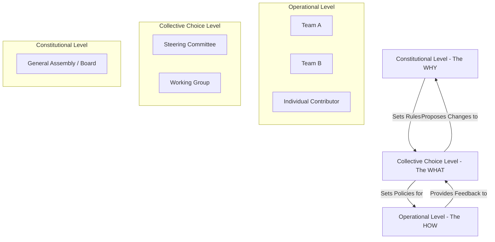

> A pattern for establishing robust, fair, and adaptable decision-making structures that ensure a commons serves its purpose and balances the needs of all stakeholders.

### 1. Context

Every collaborative endeavor, from a small community garden to a global technology platform, must make decisions. It must decide how to allocate resources, who to include or exclude, how to set priorities, and how to resolve inevitable conflicts. The structures, rules, and processes for making these decisions constitute the system's **governance**. In their absence, decisions are made chaotically, based on informal power, or not at all, leading to drift, capture by special interests, or collapse. This is especially critical in a commons, where the explicit goal is to create and distribute value to a diverse set of stakeholders, including those who may not have a direct voice, such as the environment or future generations. Without intentional governance design, the logic of the market or the state tends to dominate, undermining the commons' purpose and concentrating power and value in the hands of a few. The challenge is to create a framework that is both effective and legitimate.

### 2. Problem

> **The core conflict is Decision Speed vs. Stakeholder Inclusion.**

Designing effective governance requires navigating a series of fundamental tensions. These forces pull the system in opposing directions, and a failure to balance them results in a dysfunctional and illegitimate system.

1.  **Force 1: Agility vs. Legitimacy.** In a rapidly changing world, organizations need to be agile and make decisions quickly to seize opportunities and respond to threats. However, rapid, centralized decisions often exclude the voices of those most affected, undermining the legitimacy of the decisions and leading to resistance, disengagement, and a failure to capture distributed intelligence.

2.  **Force 2: Centralization vs. Distribution.** Centralized governance can be highly efficient, ensuring coherence and clear lines of accountability. However, it also creates single points of failure, bottlenecks, and a system vulnerable to capture by a small elite. Distributed governance, by contrast, is more resilient and adaptable, but it can be slow, fragmented, and struggle to achieve strategic coherence across the system.

3.  **Force 3: Stability vs. Adaptability.** For a system to be predictable and for participants to feel secure, the rules of the game must be stable. Contracts and investments rely on this predictability. Yet, the world is not static. The environment, technology, and stakeholder needs all change, requiring the rules themselves to evolve. Governance that cannot adapt becomes brittle and irrelevant, while governance that changes too easily creates uncertainty and erodes trust.

### 3. Solution

> **Therefore, design governance as a multi-level, polycentric system where decisions are made at the smallest competent level (subsidiarity), with clear escalation paths, explicit representation for all stakeholder classes, and built-in mechanisms for constitutional evolution.**

This pattern rejects a one-size-fits-all approach. Instead of a single, monolithic governance body, it proposes a nested system of interconnected decision-making centers, each with its own defined scope and authority. This approach, known as polycentric governance, allows for both local autonomy and system-wide coherence. The key is to match the scale of the decision to the scale of its impact.

-   **Subsidiarity:** Operational decisions should be pushed to the edges, to the teams and individuals closest to the action and the information. This increases speed and responsiveness.
-   **Escalation:** Issues that cannot be resolved at a lower level, or that have system-wide implications, are escalated to higher-level bodies with broader perspective and authority.
-   **Representation:** The composition of these bodies must reflect the stakeholder architecture of the commons. This is not just about voting; it's about ensuring that the values and perspectives of all legitimate stakeholders—including users, producers, investors, the community, and the ecosystem—are actively brought into the decision-making process.
-   **Evolution:** The governance structure itself is not set in stone. It includes a clear process for amending the rules, the 'constitution' of the commons, ensuring the system can learn and adapt over time.

This model, inspired by the work of Elinor Ostrom, creates a dynamic and resilient governance framework capable of managing complex systems for long-term shared benefit.

### 4. Implementation

Implementing a robust governance design is a foundational act of constitutional creation. It requires careful thought and an iterative process.

1.  **Map Stakeholders and Define Boundaries:** Begin by using the **Stakeholder Architecture** and **Commons Boundary Definition** patterns. You cannot govern what you have not defined. Who has a legitimate stake in the commons? What resources and processes are being governed? Be exhaustive in this mapping.

2.  **Inventory Decisions:** Create a comprehensive list of the types of decisions the commons will need to make. Group them by domain (e.g., financial, technical, membership, policy) and by frequency (daily, weekly, quarterly, annually, rarely).

3.  **Apply the Subsidiarity Principle:** For each decision type, determine the smallest, most local level at which it can be competently made. Assign decision rights (propose, decide, execute, veto) to specific roles or bodies at that level. Default to distribution unless there is a compelling reason for centralization.

4.  **Design Deliberative Bodies:** For decisions requiring collective choice, design the necessary councils, committees, or working groups. For each body, define its:
    *   **Mandate:** What is its specific jurisdiction and scope of authority?
    *   **Composition:** How are members selected? How do you ensure representation of the relevant stakeholder groups?
    *   **Decision-Making Method:** Will decisions be made by consensus, consent, majority vote, or an advice process? The method should match the gravity of the decision.

5.  **Define Escalation and Conflict Resolution Paths:** What happens when a decision cannot be made at a lower level, or when conflicts arise? Design clear, transparent processes for escalating issues to a higher-level body. This is where a **Feedback Escalation** mechanism becomes critical.

6.  **Establish the Constitutional Level:** Define the highest level of authority. This body is responsible for holding the purpose, protecting the core principles, and overseeing the process for changing the governance rules themselves. Define how this body is constituted and how amendments to the 'constitution' are proposed, deliberated, and ratified.

**Common Pitfalls:**
*   **Ignoring Informal Power:** A beautiful governance design on paper can be completely undermined by pre-existing informal power structures. The design process must acknowledge and address these realities.
*   **Over-engineering:** Don't create a complex bureaucracy for a simple commons. The complexity of the governance should match the complexity of the system being governed.
*   **Designing in a Vacuum:** Governance design must be a participatory process. Those who will be subject to the rules must have a voice in shaping them to ensure **Legitimacy & Consent**.
*   **Forgetting Evolution:** Building a governance system without a clear process for amending it is like building a house with no doors or windows. It will become a prison.

### 5. Consequences

**Benefits:**
*   **Legitimacy and Buy-in:** When stakeholders are included in the design and execution of governance, they see the system as fair and are more likely to contribute to it and uphold its rules.
*   **Resilience and Adaptability:** A polycentric system is more resilient than a centralized one. Failure in one part does not bring down the whole system, and local adaptations can be tested before being scaled.
*   **Higher Quality Decisions:** By involving diverse perspectives and local knowledge, the system makes more informed and effective decisions, avoiding the blind spots of a remote, centralized authority.

**Liabilities:**
*   **Increased Complexity:** Polycentric governance is inherently more complex to design and manage than a simple hierarchical structure. It requires a higher level of 'governance literacy' among participants.
*   **Slower Deliberation:** Inclusive decision-making processes can be slower than top-down directives, especially in the initial stages. This is the price of legitimacy.
*   **Potential for Gridlock:** Without well-designed escalation paths and clear decision-making rules, distributed governance can lead to fragmentation and an inability to make coherent, system-wide decisions.

**When NOT to use this pattern:**
*   In a very early-stage startup or project where a small, unified team is operating under a founder's singular vision. In this context, formal governance can be premature overhead.
*   In a true crisis situation that requires immediate, unified, and decisive action. In such cases, a temporary shift to a centralized 'command and control' structure may be necessary, with a clear sunset clause to return to the designed governance model.

### 6. Known Uses

1.  **The IETF (Internet Engineering Task Force):** The IETF is the body responsible for developing and maintaining the core protocols of the Internet (like TCP/IP and HTTP). It operates on a principle of "rough consensus and running code." It is a highly decentralized, polycentric system. Decisions are made in hundreds of specialized Working Groups, each focused on a specific technical problem. There is a clear escalation path to Area Directors and the Internet Engineering Steering Group (IESG) for cross-cutting issues. This governance model has enabled the Internet to evolve and scale for decades in a remarkably stable and innovative fashion, without central ownership.

2.  **Buurtzorg Nederland:** A Dutch home-care organization with over 15,000 nurses and no managers. Governance is radically decentralized to self-managing teams of 10-12 nurses. Each team is responsible for all aspects of its work, from patient care to scheduling and budgeting. A small central back office provides IT and administrative support, but has no directive power. This model of extreme subsidiarity has resulted in dramatically higher patient satisfaction, higher employee satisfaction, and lower costs compared to traditional, centrally-managed home-care providers.

3.  **The Swiss Cantonal System:** Switzerland's political structure is a prime example of polycentric governance. It is a federation of 26 cantons (states), which are themselves composed of municipalities. Significant power over taxation, education, and law enforcement is held at the cantonal and municipal levels. This allows for a high degree of local autonomy and policy experimentation that reflects local values and needs, while the federal government handles matters of national defense, currency, and foreign policy. This nested structure is a key factor in Switzerland's long-term political stability and economic prosperity.

### 7. Cognitive Era Considerations

The rise of AI and autonomous agents profoundly impacts governance design, introducing both powerful new tools and significant new risks.

**Augmentation and Automation:**
*   **Information Synthesis:** AI agents can monitor the vast flow of information within a commons, providing decision-makers at all levels with tailored, context-aware briefings. This reduces cognitive load and enables more informed deliberation.
*   **Monitoring and Enforcement:** Agents can be tasked with monitoring compliance with the rules of the commons, from resource usage quotas to code of conduct violations. They can automatically flag deviations and even trigger the initial stages of a **Graduated Sanctions** process, ensuring rules are applied consistently and impartially.
*   **Modeling and Simulation:** Before implementing a change to the governance rules, AI can be used to model the likely second- and third-order effects on the system. This allows the commons to test constitutional amendments in a simulated environment before deploying them, reducing the risk of unintended negative consequences.

**New Risks and Challenges:**
*   **Algorithmic Bias:** If the agents used in governance are trained on biased data, they will perpetuate and even amplify those biases in their monitoring and recommendations. Governance design must include rigorous processes for auditing and mitigating algorithmic bias.
*   **Concentration of Power:** The entities that design and control the AI agents wield a new and potent form of power. Governance must explicitly address the question: who governs the agents? The control of the AI infrastructure itself becomes a critical governance domain.
*   **Loss of Human Judgment:** Over-reliance on automated governance can atrophy the capacity for human judgment, empathy, and ethical reasoning. The system can become brittle and inhumane. The design must therefore clearly delineate which decisions are suitable for automation and which must always require meaningful human oversight and final say. The goal is a human-AI partnership, not an abdication of responsibility to the machine.

Ultimately, in the cognitive era, the **Governance Design** pattern must be extended to include the governance of autonomous agents as first-class participants in the system. Their rights, responsibilities, and constraints must be as clearly defined as those of the human participants.
