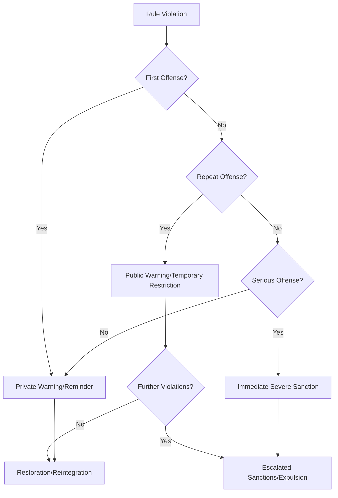

### 1. Context

In any community or organization that relies on shared resources or collaborative effort, the potential for rule-breaking is an unavoidable reality. Whether it's a software development team managing a shared codebase, a co-working space with community guidelines, or a decentralized autonomous organization (DAO) governing a digital commons, rules are established to ensure fairness, sustainability, and productive collaboration. However, when a member of the community deviates from these established norms—either intentionally or unintentionally—the group faces a critical challenge. How should it respond? A heavy-handed, zero-tolerance approach can breed resentment, stifle experimentation, and create a culture of fear. Conversely, a complete lack of enforcement can lead to the erosion of trust, the depletion of shared resources, and the eventual collapse of the commons itself. The community needs a way to uphold its standards without alienating its members, a method for course correction that is seen as both fair and effective.

### 2. Problem

> **The core conflict is Rigid Enforcement vs. Adaptive Governance.**

This tension highlights the struggle between the need for consistent, predictable consequences for rule-breaking and the desire for a more flexible, context-aware approach to governance. This conflict is driven by several underlying forces:

1.  **The Need for Fairness vs. the Need for Mercy:** A rigid system of enforcement ensures that everyone is treated equally, which is a cornerstone of fairness. However, it can fail to account for the nuances of individual situations, such as a newcomer's unintentional mistake or a long-standing member's momentary lapse in judgment. A purely merciful approach, on the other hand, risks being perceived as arbitrary or biased, undermining the legitimacy of the rules.

2.  **The Desire for Simplicity vs. the Complexity of Human Behavior:** Simple, black-and-white rules are easy to understand and enforce. However, human behavior is rarely simple. People make mistakes, they have bad days, and their motivations are complex. A system that fails to account for this complexity is likely to be perceived as unjust and may fail to achieve its ultimate goal of fostering a cooperative environment.

3.  **The Goal of Deterrence vs. the Goal of Rehabilitation:** A primary purpose of sanctions is to deter future rule-breaking. However, overly punitive measures can alienate offenders, making them less likely to reintegrate into the community and contribute positively. A rehabilitative approach, which focuses on education and restoration, can be more effective in the long run but may not provide a sufficient deterrent for some individuals.

### 3. Solution

> **Therefore, implement a system of graduated sanctions where the severity of the response is proportional to the severity and frequency of the offense.**

This pattern, famously articulated by Nobel laureate Elinor Ostrom, resolves the tension between rigidity and adaptability by creating a flexible framework for enforcement. Instead of a binary choice between punishment and inaction, the community develops a spectrum of responses. The system is designed to be both forgiving of initial missteps and firm in the face of persistent non-compliance. A first-time, minor infraction might be met with a simple warning or a gentle reminder of the rules. A subsequent offense would trigger a more significant consequence, such as a temporary suspension of privileges. A pattern of repeated violations could ultimately lead to expulsion from the community. The key is that the process is transparent, predictable, and perceived as fair by the community members.

This graduated approach allows the community to calibrate its response to the specific context of each violation. It provides a mechanism for learning and adaptation, both for the individual offender and for the community as a whole. By starting with low-cost, low-impact interventions, the system encourages self-correction and minimizes the need for more costly and disruptive forms of enforcement.

### 4. Implementation

1.  **Define the Rules:** The first step is to clearly articulate the rules and norms of the community. These should be easily accessible and written in a clear, unambiguous language. This process should be a collective effort, involving as many members of the community as possible to ensure buy-in and legitimacy.

2.  **Develop a Sanctioning Ladder:** Create a 
clear and predictable ladder of sanctions, starting with the mildest response and escalating to more severe consequences. For example:
    *   **Level 1 (The Gentle Nudge):** A private, informal reminder from a community moderator or fellow member.
    *   **Level 2 (The Public Notice):** A formal, public warning, and perhaps a temporary restriction of certain privileges.
    *   **Level 3 (The Time-Out):** A temporary suspension of all privileges or access to the commons.
    *   **Level 4 (The Exile):** Permanent removal from the community.

3.  **Establish a Monitoring System:** Define how rule violations will be identified and reported. This could be the responsibility of designated moderators, or it could be a collective responsibility of all community members. The process for reporting a violation should be clear and straightforward.

4.  **Create a Conflict Resolution Mechanism:** There must be a clear and accessible process for individuals to appeal a sanction they believe is unjust. This mechanism, as Ostrom noted, should be low-cost and rapid, ensuring that disputes can be resolved efficiently and fairly.

5.  **Document and Communicate:** The rules, the sanctioning ladder, and the conflict resolution process must be documented and made easily accessible to all members of the community. This transparency is crucial for building trust and ensuring that the system is perceived as legitimate.

6.  **Review and Adapt:** The system of graduated sanctions should not be set in stone. The community should regularly review its effectiveness and make adjustments as needed. This adaptive approach allows the system to evolve along with the community it serves.

### 5. Consequences

**Benefits:**

*   **Increased Fairness and Legitimacy:** By ensuring that the response is proportional to the offense, graduated sanctions are generally perceived as more fair than a zero-tolerance approach. This increases the legitimacy of the rules and the governing body.
*   **Enhanced Trust and Cooperation:** A fair and predictable enforcement system fosters trust among community members. When people believe that rule-breakers will be dealt with appropriately, they are more likely to cooperate and contribute to the commons.
*   **Reduced Enforcement Costs:** By starting with low-cost interventions, the system minimizes the time and resources that need to be dedicated to enforcement. The majority of issues can be resolved without resorting to more costly and confrontational measures.
*   **Opportunities for Learning and Redemption:** The graduated nature of the system provides individuals with the opportunity to learn from their mistakes and correct their behavior without being permanently ostracized. This can help to retain valuable community members.

**Liabilities:**

*   **Potential for Bureaucracy:** A formal system of graduated sanctions can become overly bureaucratic and slow to respond, especially in large or complex communities.
*   **Risk of Leniency:** If the initial sanctions are too lenient, they may not be sufficient to deter repeated offenses. The community must find the right balance between forgiveness and firmness.
*   **Subjectivity in Application:** Despite the goal of objectivity, there is always a risk of subjectivity in the application of sanctions. This can lead to perceptions of bias or favoritism.

**When NOT to use this pattern:**

*   **For Critical Safety Rules:** In situations where a rule violation could lead to immediate and severe harm (e.g., safety protocols in a factory, security rules in a data center), a zero-tolerance policy may be more appropriate.
*   **In Very Small, High-Trust Groups:** In small, tight-knit communities where social norms are strong and informal communication is frequent, a formal system of graduated sanctions may be unnecessary and overly rigid.

### 6. Known Uses

1.  **Wikipedia:** The online encyclopedia is a massive, global commons of knowledge. It uses a well-defined system of graduated sanctions to deal with vandalism and disruptive editing. A first-time offender might receive a simple warning on their user talk page. Repeated offenses lead to temporary blocks of increasing duration, and persistent vandals are eventually blocked indefinitely.

2.  **Stack Overflow:** This popular question-and-answer site for programmers relies on a community-driven system of quality control. Users who post low-quality questions or answers receive feedback in the form of downvotes and comments. If a user consistently posts poor content, their ability to ask or answer questions may be temporarily restricted. This system encourages users to improve the quality of their contributions.

3.  **Community Gardens:** Many community gardens operate as a commons, with shared resources and a set of rules for all members. A member who neglects their plot might first receive a friendly reminder from the garden coordinator. If the neglect continues, they might receive a formal warning. Ultimately, if the member fails to meet their obligations, they may lose their plot for the following season, allowing another person on the waiting list to take their place.

### 7. Cognitive Era Considerations

In the age of AI and autonomous agents, the pattern of Graduated Sanctions takes on new dimensions. Cognitive technologies can both enhance and challenge this model of governance.

*   **Automated Monitoring and Initial Sanctions:** AI agents can be deployed to monitor for a wide range of rule violations in digital commons. They can detect spam, plagiarism, code that violates style guidelines, or trading bots that engage in manipulative behavior. These agents can automatically issue the initial, low-level sanctions, such as warnings or temporary rate-limiting, freeing up human moderators to focus on more complex cases.

*   **Data-Driven Adjudication:** When a human moderator needs to intervene, an AI can provide a comprehensive summary of the alleged violation, including the offender's history, the context of the offense, and any relevant precedents. This can help to ensure that sanctions are applied more consistently and fairly.

*   **New Risks and Challenges:** The use of AI in sanctioning systems also introduces new risks. The algorithms used to detect violations could be biased, leading to the disproportionate punishment of certain groups. Malicious actors could use AI to generate a high volume of low-level infractions, attempting to overwhelm the system or to get innocent users banned. The transparency and explainability of these AI systems become critical for maintaining the legitimacy of the commons.

*   **Human-in-the-Loop Governance:** The most effective approach in the cognitive era is likely to be a human-in-the-loop model. AI can serve as a powerful tool for monitoring and enforcement, but the ultimate decisions about sanctions, especially the more severe ones, should remain in the hands of accountable human beings. The role of the community is to govern the AI, not to be governed by it. This means setting the rules that the AI enforces, regularly auditing its performance, and ensuring that there are always clear and accessible mechanisms for appealing its decisions.
