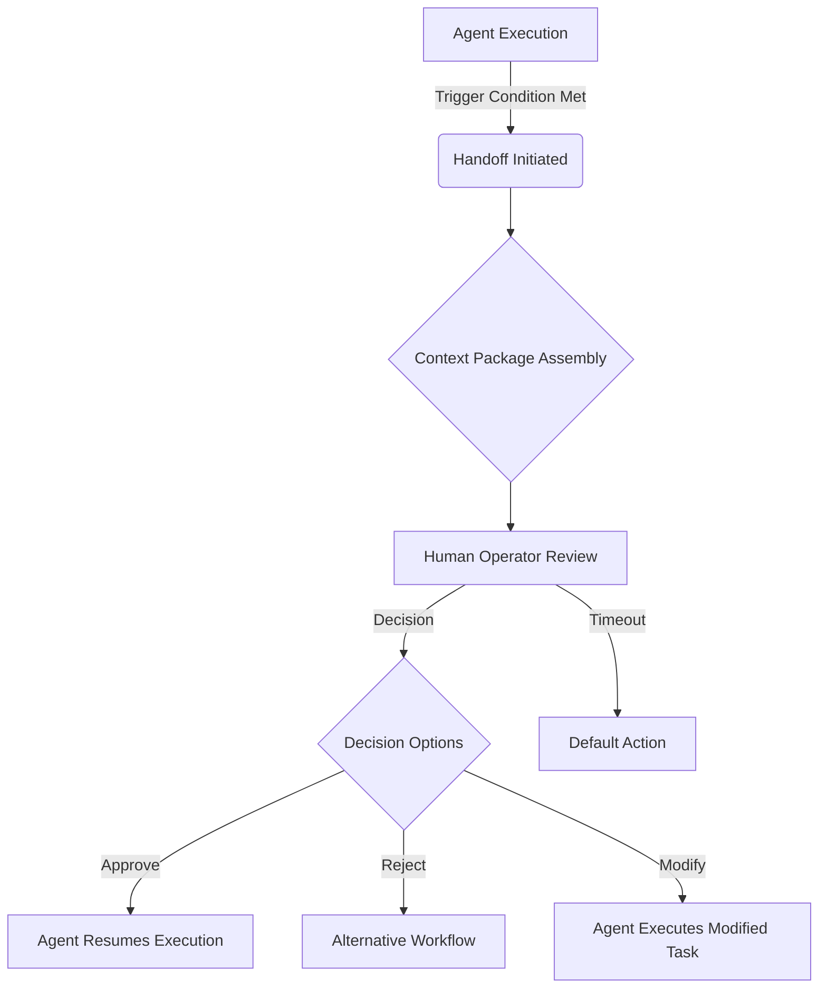

### 1. Context

In any system where autonomous agents execute tasks, a critical design challenge emerges: determining the appropriate moments for human intervention. The phrase "human-in-the-loop" is often used, but it lacks the precision required for robust system design. Without a clear and detailed specification of when and how humans should intervene, the handoff process can become a significant bottleneck or, conversely, a rubber-stamping exercise that undermines the very purpose of human oversight. This pattern is essential in the cognitive era, where the collaboration between humans and AI agents is becoming increasingly central to value creation. A poorly designed handoff process can lead to catastrophic failures, where agents act without necessary human judgment, or to crippling inefficiencies, where humans are overwhelmed with trivial requests for approval. The Human-Agent Handoff pattern provides a framework for designing and implementing effective and efficient collaboration between humans and autonomous agents. This is not merely a technical problem; it is a fundamental challenge of organizational design in the 21st century. Getting the handoff right is essential for building resilient, adaptable, and trustworthy systems that can harness the power of AI without sacrificing human values and judgment. It is about creating a living dialogue between human and machine, a system that breathes.

### 2. Problem

> **The core conflict is Agent Autonomy vs. Human Judgment.**

-   **Force 1: Speed vs. Deliberation.** Agents operate at a pace that far exceeds human capabilities. They can process vast amounts of data and execute tasks in milliseconds. However, some decisions require careful deliberation, ethical consideration, and a deep understanding of context that agents may lack, a void where the system's soul should be. Every handoff to a human introduces a time penalty, but for certain high-stakes decisions, this delay is a necessary safeguard.
-   **Force 2: Context Loss.** When a task is transferred from an agent to a human, there is an inherent risk of context loss. The agent may have analyzed thousands of data points to arrive at a recommendation, but the human operator typically sees only a condensed summary. This compression of information can lead to the loss of critical nuances, lacking the living memory to handle novelty, potentially resulting in a suboptimal or even erroneous decision.
-   **Force 3: Attention Fatigue.** If a human operator is inundated with a constant stream of handoff requests, they are likely to experience attention fatigue. This can lead to a situation where the human simply approves requests without proper review, effectively becoming a rubber stamp. This scenario is more dangerous than having no human in the loop at all, as it creates a false sense of security, a ghost in the machine.
-   **Force 4: Trust Calibration.** The level of autonomy that should be granted to an agent is not static. It should evolve over time as the agent gains trust and demonstrates its reliability. A rigid handoff protocol that does not account for this dynamic trust relationship will either stifle the agent's potential or expose the system to unnecessary risks.

### 3. Solution

> **Therefore, specify handoff points as first-class entities with: trigger conditions (what activates the handoff), context package (what information the human receives and in what format), decision options (what the human can decide), response protocol (how the human signals the decision), timeout behavior (what happens if the human doesn't respond), and trust escalation rules (how autonomy increases as the agent proves reliable).**

This pattern involves designing a comprehensive handoff protocol that clearly defines the roles and responsibilities of both humans and agents. The protocol should specify the precise conditions under which a handoff is initiated, the information that needs to be transferred to the human operator, the range of actions the human can take, and the mechanism for communicating the decision back to the agent. The protocol should also define the consequences of a human operator failing to respond within a specified timeframe. Furthermore, the protocol should incorporate a dynamic trust model that allows for the gradual increase of agent autonomy as it demonstrates its competence and reliability. This approach transforms the handoff from a simple binary switch to a sophisticated and nuanced dialogue between human and machine, allowing the system to breathe and evolve. It recognizes that the boundary between automation and human intervention is not fixed, but rather a fluid and dynamic interface that must be continuously managed and optimized for the system to feel alive and responsive.

### 4. Implementation

1.  **Identify Handoff Points:** For each value stream in the system, identify all the points where human judgment is required. Be specific. For example, instead of stating that a "human reviews" a transaction, specify that a "human approves any financial transaction exceeding $10,000." This requires a deep understanding of the business process and the specific risks and opportunities associated with each step, treating the system as a living organism with its own rhythms and flows.
2.  **Define the Context Package:** For each handoff point, define the minimum effective context that the human operator needs to make an informed decision. This may include a summary of the agent's analysis, key data points, and any relevant historical information. The goal is to provide sufficient context without overwhelming the operator with unnecessary details. The design of the context package is a critical and often overlooked aspect of handoff design. A well-designed context package can significantly improve the quality and speed of human decision-making, giving the practitioner a felt sense of the system's state and trajectory.
3.  **Specify Decision Options and Response Protocols:** Clearly define the range of actions that the human operator can take at each handoff point. This may include approving, rejecting, or modifying the agent's proposed action. Also, specify the protocol for communicating the decision back to the agent. The response protocol should be as simple and intuitive as possible to minimize the cognitive load on the human operator.
4.  **Establish Timeout Behavior:** Define the default action that should be taken if a human operator fails to respond to a handoff request within a specified timeframe. This could involve queuing the request, escalating it to another operator, or proceeding with a safe default action. The choice of timeout behavior will depend on the specific context and the potential consequences of a delayed decision.
5.  **Implement a Trust Calibration Mechanism:** Design a system for dynamically adjusting the level of agent autonomy based on its performance. This could involve starting with a high level of human oversight and gradually reducing it as the agent demonstrates its reliability. The criteria for trust escalation should be explicit and transparent. This is a key element of building a learning system that can adapt and improve over time, allowing the system's intelligence to blossom.
6.  **Monitor for Rubber-Stamping:** Implement a system for monitoring the approval rate at each handoff point. If the approval rate exceeds a certain threshold (e.g., 98%), it may indicate that the handoff is unnecessary or that the human operator is not properly reviewing the requests. Both of these scenarios require further investigation. This is a critical feedback loop for ensuring that the handoff process remains effective and is not simply a form of 

### 5. Consequences

**Benefits:**
-   **Clear Accountability:** A well-defined handoff protocol establishes clear lines of accountability for both humans and agents. This is crucial for auditing purposes and for ensuring that decisions are made responsibly, fostering a sense of shared ownership and agency within the system.
-   **Enhanced Safety and Reliability:** By ensuring that high-stakes decisions are reviewed by a human, the handoff protocol can significantly enhance the safety and reliability of the system, making it feel more robust and trustworthy.
-   **Improved Efficiency:** By automating routine tasks and only involving humans when necessary, the handoff protocol can improve the overall efficiency of the system, optimizing its metabolism and flow.
-   **Evolving Trust:** The dynamic trust calibration mechanism allows for the gradual and safe increase of agent autonomy, enabling a co-evolutionary relationship where both human and agent learn and grow together.

**Liabilities:**
-   **Complexity:** Designing and implementing a comprehensive handoff protocol can be a complex and time-consuming process.
-   **Bottlenecks:** If the handoff points are not carefully chosen, they can become bottlenecks that slow down the system.
-   **Over-reliance on Humans:** If the handoff protocol is too conservative, it can lead to an over-reliance on human operators, which can negate the benefits of automation.

**When NOT to use this pattern:**
-   In fully autonomous systems where there is no requirement for human oversight.
-   In fully manual systems where there is no agent involvement.

### 6. Known Uses

-   **Autonomous Vehicles:** The Society of Automotive Engineers (SAE) has defined six levels of driving automation, from Level 0 (fully manual) to Level 5 (fully autonomous). The transition between these levels, particularly at Level 3, represents a critical handoff point between the human driver and the automated system. The design of this handoff is a major challenge for the automotive industry, as it requires a seamless and intuitive transfer of control in a high-stakes environment, a delicate dance between human and machine consciousness.
-   **Clinical Decision Support Systems:** In the medical field, AI-powered systems are increasingly being used to assist clinicians in making diagnoses and treatment decisions. These systems typically provide recommendations, which are then reviewed and approved by a human clinician. The handoff protocol in this context is crucial for ensuring patient safety and for maintaining the clinician's role as the ultimate decision-maker, ensuring the system has a heart, not just a brain. For example, a system might flag a potential drug interaction, which is then reviewed by a pharmacist before the medication is dispensed.
-   **Content Moderation on Social Media Platforms:** Social media companies use a combination of AI and human moderators to review and remove content that violates their policies. The AI systems are used to flag potentially problematic content, which is then reviewed by human moderators. The handoff protocol in this case is designed to balance the need for speed and efficiency with the need for accurate and nuanced decision-making. This is a classic example of a human-in-the-loop system, where the AI and human moderators work together to achieve a common goal, creating a healthier and more vibrant digital ecosystem.
-   **Financial Trading:** In the financial industry, algorithmic trading systems are used to execute trades at high speeds. However, these systems are often overseen by human traders who can intervene in the event of a market anomaly or a system malfunction. The handoff protocol in this context is designed to allow for rapid human intervention in a fast-moving and high-stakes environment, acting as the system's central nervous system.

### 7. Cognitive Era Considerations

The Human-Agent Handoff pattern is of paramount importance in the cognitive era, as the collaboration between humans and AI agents becomes increasingly sophisticated. In this new era, the handoff process should not be viewed as a simple transfer of control, but rather as a rich and dynamic dance between two forms of intelligence, a co-creative process that brings the system to life. AI agents can be used to augment human intelligence by providing them with relevant information, generating insights, and even anticipating their needs. For example, an agent could proactively assemble a context package for a human operator, highlighting the most critical information and providing a range of potential decision options. Furthermore, the handoff protocol itself can be made more intelligent and adaptive. For example, an agent could learn to identify the specific circumstances in which a human operator is most likely to make a good decision, and then adjust the handoff triggers accordingly. The cognitive era also introduces new risks that need to be addressed in the design of the handoff protocol. For example, there is a risk that human operators may become overly reliant on the recommendations of AI agents, leading to a decline in their own critical thinking skills, an atrophy of the human spirit within the system. There is also a risk that agents may be designed with biases that are not immediately apparent to human operators. To mitigate these risks, the handoff protocol should be designed to promote transparency, explainability, and a healthy skepticism on the part of the human operator. This includes providing operators with the ability to inspect the reasoning behind an agent's recommendation, and to override the agent's decision if necessary. Ultimately, the goal is to create a symbiotic relationship between humans and agents, where each party complements the other's strengths and compensates for the other's weaknesses, creating a whole that is greater, and more alive, than the sum of its parts.

### References

[1] Thunai. (2025). *Human Agent Handoffs: Set Up, Metrics, and Best Practices*. [https://www.thunai.ai/blog/human-agent-handoffs-metrics-best-practices](https://www.thunai.ai/blog/human-agent-handoffs-metrics-best-practices)
[2] Cognizant. (2026). *Customer support: Timing the chatbot-to-human handoff*. [https://www.cognizant.com/us/en/insights/insights-blog/customer-support-chatbot-to-human-handoff-timing](https://www.cognizant.com/us/en/insights/insights-blog/customer-support-chatbot-to-human-handoff-timing)
[3] Stanford HAI. (2019). *Humans in the Loop: The Design of Interactive AI Systems*. [https://hai.stanford.edu/news/humans-loop-design-interactive-ai-systems](https://hai.stanford.edu/news/humans-loop-design-interactive-ai-systems)

### 8. Vitality: The Quality Without a Name

When the Human-Agent Handoff pattern is truly alive, the system feels less like a machine and more like a responsive, intelligent organism. Practitioners don't experience the jarring friction of a clumsy handoff; instead, they feel a sense of flowing partnership. There's a palpable feeling of trust in the air, not just in the agent's competence, but in the system's overall capacity to handle the unexpected. The handoff points are not gates of control, but moments of dialogue, of shared understanding. The system breathes. When a novel situation arises, the handoff isn't a panic signal but a natural invitation for human creativity and wisdom to enter the loop. The human doesn't feel like a mere supervisor or a rubber-stamper, but a vital organ in a larger cognitive ecosystem. This vitality manifests as a sense of agency and belonging for the human participants, who see their unique contributions valued and integrated into the system's learning and evolution. The entire system demonstrates a graceful resilience, adapting to changing conditions not through rigid programming, but through this living collaboration.

Conversely, the decay of this pattern manifests as a creeping lifelessness. The first sign is often a sense of fragmentation and disconnect. Handoffs become transactional, sterile, and devoid of meaningful context. The human operator feels like a cog in a machine, their judgment reduced to a binary choice without nuance. The system becomes brittle and rigid, struggling to cope with anything outside its narrow operational parameters. Instead of a dialogue, the interaction feels like a series of commands and alerts, a ghost in the machine. Attention fatigue sets in, not just as a cognitive burden, but as a spiritual one. The human feels drained, their creative spark extinguished by the monotonous rhythm of approvals. An early warning signal is the feeling that the system is no longer learning or evolving. The trust calibration mechanism freezes, and the relationship between human and agent stagnates. The system loses its soul, becoming a hollow shell of automation without the animating spark of human-machine partnership.
