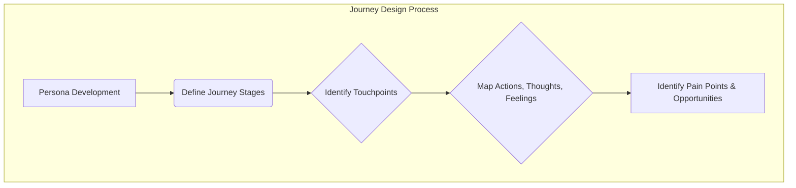

### 1. Context

In any system designed for human use—be it a digital application, a public service, or a retail environment—value is ultimately realized through the stakeholder's experience. Yet, organizations often design their processes from the inside out. They build workflows based on internal departments, legacy technologies, and operational efficiencies. The result is a fragmented and often frustrating experience for the very people the system is meant to serve. A citizen navigating a government website for a permit might be forced to interact with three different agencies, each with its own jargon and interface. A patient seeking care might be bounced between administrative staff, nurses, and specialists, repeating their story at each step. This operational focus, while logical from the organization's perspective, creates a maze for the user. They are forced to piece together a coherent path from a collection of disjointed touchpoints, leading to confusion, abandonment, and a fundamental failure to deliver the intended value.

### 2. Problem

> **The core conflict is System-Centric Process vs. Human-Centered Experience.**

This tension arises from a set of competing forces that pull the design of a system in opposing directions:

1.  **Operational Efficiency vs. Stakeholder Empathy:** Organizations are driven to optimize resources, standardize procedures, and minimize costs. This often leads to rigid, one-size-fits-all processes that ignore the diverse needs, emotional states, and contextual realities of the individuals they serve.
2.  **Siloed Functions vs. Holistic Journeys:** Systems are typically built and managed by specialized departments (e.g., marketing, sales, support, engineering). Each department optimizes its own touchpoints in isolation, creating a series of disconnected interactions rather than a single, seamless journey from the stakeholder's perspective.
3.  **Quantitative Metrics vs. Qualitative Experience:** It is easier to measure internal metrics like process time, call volume, or feature adoption than it is to measure a stakeholder's frustration, delight, or sense of trust. The organization, therefore, prioritizes what it can easily count, often at the expense of the unquantifiable but critical aspects of the human experience.
4.  **Feature-Driven Development vs. Goal-Oriented Design:** Technology teams are often incentivized to ship features quickly. This can lead to a product bloated with capabilities that don't align with the user's primary goals. The focus becomes "what can we build?" rather than "what is the stakeholder trying to achieve, and how can we best help them?"

### 3. Solution

> **Therefore, systematically map and design the stakeholder's entire journey from their perspective, orchestrating all touchpoints to create a coherent and valuable experience.**

Journey Design is a structured approach to shifting the organization's focus from internal processes to the lived experience of its stakeholders. It involves creating a visual representation—a journey map—that tells the story of a stakeholder's interaction with the system over time. This map is not a flowchart of internal processes; it is an empathy-building tool that captures the stakeholder's actions, thoughts, and feelings at each stage.

The core mechanism involves several key activities:

*   **Persona Development:** Based on research, create a detailed profile of the target stakeholder, including their goals, motivations, and pain points. This ensures the journey is designed for a specific, well-understood human being, not an abstract "user."
*   **Defining Stages:** Break down the journey into distinct, chronological phases from the stakeholder's point of view (e.g., Awareness, Consideration, Acquisition, Service, Loyalty).
*   **Identifying Touchpoints:** For each stage, identify all the points of interaction between the stakeholder and the organization (e.g., website, mobile app, call center, physical store, social media).
*   **Mapping Actions, Thoughts, and Feelings:** This is the heart of the map. Document what the stakeholder is *doing*, *thinking*, and *feeling* at each touchpoint. This reveals moments of frustration, confusion, or delight.
*   **Identifying Pain Points and Opportunities:** The completed map makes critical pain points visible. It also highlights opportunities to improve the experience, innovate, or create moments of exceptional value.

This process transforms an abstract problem into a concrete, shared artifact that the entire organization can rally around. It provides a common language and a unified vision for creating a truly human-centered system.

### 4. Implementation

Successfully implementing Journey Design requires a dedicated, cross-functional effort. It is not a one-off task but a continuous practice of seeing the world through your stakeholders' eyes. Here is a practical guide to getting started:

1.  **Secure Sponsorship and Form a Cross-Functional Team:** Journey mapping challenges organizational silos. Without executive sponsorship, the insights generated will likely die in a PowerPoint deck. The project lead needs the authority to convene a team that includes representatives from every stakeholder-facing function: marketing, sales, product, engineering, customer support, legal, and operations. This ensures a holistic view and builds buy-in from the start.

2.  **Define Scope and Select a Target Persona/Journey:** Do not try to map every journey for every stakeholder at once. Start with a single, high-impact journey for a specific, well-defined persona. This could be the onboarding journey for a new customer, the support journey for a frustrated user, or the application journey for a potential partner. The choice should be driven by strategic priorities—where is the organization experiencing the most pain or the greatest opportunity?

3.  **Gather Existing Research and Conduct New Research:** Your organization is likely already sitting on a wealth of data. Collect and synthesize existing analytics, customer support tickets, sales call notes, social media comments, and previous survey results. Then, fill the gaps with new qualitative research. Conduct interviews and observation sessions with actual stakeholders who have recently completed the target journey. The goal is to understand their motivations, context, and emotional state, not just their actions.

4.  **Hold a Collaborative Mapping Workshop:** The journey map should be created collaboratively in a workshop setting with the cross-functional team. Use a large wall, a whiteboard, or a digital collaboration tool. The process typically follows these steps:
    *   **Establish the Backbone:** Draw a timeline and plot the key stages of the journey.
    *   **Add the Stakeholder's Story:** Using a different color for each, add sticky notes for the stakeholder's *actions*, *thoughts*, and *feelings* at each stage. Use direct quotes from your research wherever possible.
    *   **Map the Touchpoints:** Below the stakeholder's story, map the organizational touchpoints and systems involved at each stage.
    *   **Identify Moments of Truth:** Circle the points in the journey that have a disproportionate impact on the stakeholder's overall experience—the peaks of delight and the valleys of frustration.

5.  **Analyze, Prioritize, and Generate Solutions:** The completed map is not the end goal; it is the beginning of the real work. As a team, analyze the map to identify the most critical pain points and the biggest opportunities. For each pain point, brainstorm potential solutions. Prioritize these solutions based on their potential impact on the stakeholder experience and their feasibility to implement.

6.  **Create an Action Plan and Assign Ownership:** Translate the prioritized solutions into a concrete action plan. For each action, define what needs to be done, who is responsible, and by when. This is where the cross-functional nature of the team becomes critical. The solutions will likely span multiple departments, and clear ownership is essential for follow-through.

7.  **Measure, Iterate, and Socialize:** Implement the changes and measure their impact on both stakeholder satisfaction (e.g., through surveys, feedback forms) and business metrics (e.g., conversion rates, retention). The journey map is a living document. It should be revisited and updated as the system evolves and stakeholder expectations change. Share the map and the results of your improvements widely across the organization to build momentum for a more human-centered way of working.

**Common Pitfalls:**
*   **Mapping from an Internal Perspective:** The most common failure is creating a process diagram and calling it a journey map. Always start with the stakeholder's experience, not your internal workflows.
*   **Lack of Research:** A journey map based on assumptions and anecdotes is a work of fiction. It must be grounded in real qualitative and quantitative data.
*   **No Action or Follow-through:** A journey map that doesn't lead to change is a waste of time and effort. The process must be tied to a clear mandate for action.

### 5. Consequences

Adopting Journey Design fundamentally shifts an organization's perspective from inside-out to outside-in. This has profound consequences, both positive and negative.

**Benefits:**
*   **Breaks Down Organizational Silos:** The journey map creates a shared understanding of the stakeholder experience that transcends departmental boundaries. It forces conversations between teams that may rarely interact, fostering a more collaborative and unified culture.
*   **Creates a Roadmap for Improvement:** By visualizing the pain points in the current state, the map provides a clear, evidence-based roadmap for where to invest resources to have the greatest impact on the stakeholder experience.
*   **Fosters Empathy and a Human-Centered Culture:** The process of creating and using a journey map is an exercise in empathy. It forces team members to step out of their operational roles and see the world from the stakeholder's perspective, leading to more thoughtful and compassionate design decisions.
*   **Drives Strategic Alignment:** The map serves as a powerful tool for aligning the entire organization around a common vision for the desired stakeholder experience. It can be used to prioritize projects, justify investments, and ensure that all initiatives are working in service of a larger goal.

**Liabilities:**
*   **Can Create Unrealistic Expectations:** The mapping process can uncover a vast number of problems and opportunities. If not managed carefully, this can lead to a sense of being overwhelmed and an inability to focus. It is crucial to prioritize ruthlessly and start with a few high-impact initiatives.
*   **Requires Sustained Effort and Investment:** Journey Design is not a quick fix. It requires a significant upfront investment in research and a sustained commitment to implementation and iteration. Without this long-term view, the initial enthusiasm will fade, and the map will become a forgotten artifact.
*   **Insights Can Be Politically Difficult:** The map may reveal uncomfortable truths about the organization's performance and expose failures in specific departments. This can lead to defensive reactions and resistance to change. Strong executive leadership is essential to navigate these political challenges.

**When NOT to use this pattern:**
*   **For Simple, Transactional Interactions:** If the interaction is extremely simple and linear (e.g., a single button press), a full journey map is likely overkill. Other methods, like a simple usability test, may be more appropriate.
*   **When There Is No Commitment to Change:** If the organization is not genuinely willing to invest in improving the stakeholder experience, the journey mapping process will be a frustrating and fruitless exercise. It will raise expectations among the team and stakeholders that cannot be met, causing more harm than good.
*   **As a Substitute for Deep User Research:** A journey map is a way of synthesizing and communicating research; it is not a substitute for it. If you don't have the time or resources to conduct real research with your stakeholders, your journey map will be based on flawed assumptions.

### 6. Known Uses

Journey Design is a versatile pattern applied across countless domains to improve the human experience.

*   **Urban Planning & Civic Services (City of New York):** The NYC Civic Service Design Studio, part of the Mayor's Office for Economic Opportunity, uses journey mapping extensively to improve the delivery of public services. For example, they mapped the journey of a low-income parent seeking childcare, identifying numerous pain points related to complex eligibility rules, fragmented information sources, and burdensome paperwork. This led to the creation of ACCESS NYC, a single online portal where residents can screen for and apply to over 30 city, state, and federal health and human services programs. The outcome was a dramatic reduction in the time and effort required for citizens to get the help they need.

*   **B2B Software (Leadfeeder):** As detailed by CXL, the B2B intelligence tool Leadfeeder maps its customer journey from initial awareness to long-term retention. They identified that a key moment of truth was the user's ability to get value from the tool during the free trial. By mapping the journey, they saw that many users were getting stuck. In response, they implemented a proactive outreach campaign using Intercom to offer a free training session at key points in the trial. This intervention, directly informed by the journey map, resulted in a 25% completion rate for the training, which strongly correlated with conversion to a paid subscription.

*   **Healthcare (A large American Health Care Insurance Plan):** As documented by SQM Group, a major health insurance provider used journey mapping to understand and improve the experience of its members. They focused on the journey of a member trying to resolve a complex claim issue. The map revealed a frustrating cycle of multiple phone calls, transfers between departments, and inconsistent information. By visualizing this fragmented experience, the company was able to redesign its call center processes, empower front-line staff with more information and authority, and create a case-management approach for complex issues. This resulted in an 86% First Call Resolution (FCR) rate and a 90% customer satisfaction score for the redesigned journey.

### 7. Cognitive Era Considerations

AI and autonomous agents are poised to radically transform the practice of Journey Design, moving it from a static, human-driven analysis to a dynamic, real-time system for experience orchestration.

*   **Automated Journey Mapping and Analysis:** Instead of manually gathering and synthesizing data, AI agents can automatically ingest vast streams of interaction data from websites, apps, call logs, and IoT devices. They can identify common paths, detect moments of friction (e.g., rage clicks, repeated actions), and even infer stakeholder emotional states from language and behavior. This allows for the creation of living, continuously updated journey maps that reflect reality in real-time, rather than a snapshot from a past research study.

*   **Predictive and Personalized Journeys:** AI can move beyond describing past journeys to predicting future ones. Based on a stakeholder's profile and real-time behavior, an agent can anticipate their next need and proactively guide them. For example, if an agent detects that a user is struggling on a checkout page, it could proactively offer help, suggest an alternative payment method, or connect them to a human support agent. This turns the journey from a passive path into a personalized, adaptive dialogue.

*   **The Agent as the Journey:** In a world of autonomous agents, the journey may not involve a human interacting with a system at all. A person might delegate a goal to their personal agent (e.g., "book a family vacation to Costa Rica"). The agent then undertakes the journey on the user's behalf—researching flights, comparing hotels, booking tours, and handling all the logistical details. In this context, the "stakeholder" is the agent itself. Organizations will need to design experiences that are optimized for machine-to-machine interaction, with clear APIs, structured data, and unambiguous protocols.

*   **New Risks and Ethical Considerations:** This automation also introduces new risks. An AI optimizing for a narrow metric (e.g., conversion rate) could learn to create manipulative or coercive journeys that exploit human psychological biases. The data collected to personalize journeys could be used in ways that violate privacy. There is also the risk of algorithmic bias, where the system provides a superior journey to some stakeholders at the expense of others. Human judgment and ethical oversight remain critical. The role of the human designer shifts from mapping the journey to designing the rules, constraints, and ethical principles that govern the AI that orchestrates the journey. The human must be the ultimate arbiter of what constitutes a "good" journey, ensuring it is not just efficient but also fair, transparent, and respectful of the stakeholder's autonomy.
