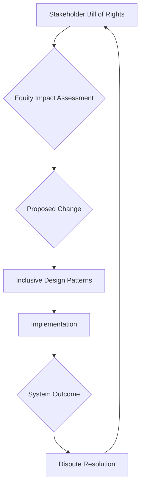

> A pattern for embedding principles of justice, fairness, and inclusion into the foundational architecture of a commons, ensuring equitable outcomes for all stakeholders.

### 1. Context

In any system involving multiple stakeholders, from a small cooperative to a global platform, there is a natural tendency for power and benefits to concentrate, often unintentionally. The default settings of our socio-technical systems frequently reflect the biases and assumptions of their creators, leading to the marginalization of already vulnerable groups. This is not necessarily born of malice, but of a failure to proactively design for equity. When we build platforms, design governance models, or structure organizations without a clear and explicit framework for justice and inclusion, we inadvertently create barriers. These barriers can manifest as inaccessible user interfaces, biased algorithms, inequitable resource distribution, or governance processes that silence minority voices. The result is a system that, while perhaps efficient for the majority, perpetuates and even amplifies existing societal inequalities. The problem arises when we treat fairness as an afterthought, a feature to be added later, rather than a fundamental, non-negotiable requirement of the system's core architecture.

### 2. Problem

> **The core conflict is Defaulting to Exclusion vs. Engineering for Inclusion.**

This tension highlights the reality that without deliberate and sustained effort, systems naturally drift towards exclusion. The path of least resistance in design and development often follows the perspectives and needs of the dominant group, creating a system that is inherently less accessible and fair to others. This core conflict is driven by several underlying forces:

1.  **The Force of Unexamined Bias:** System designers and developers, like all people, carry implicit biases. These biases, when not consciously examined and challenged, become embedded in the very logic and structure of the systems they create, leading to discriminatory outcomes.
2.  **The Force of Efficiency over Equity:** In the rush to build and scale, it is often faster and cheaper to design for a homogenous “average” user. Addressing the complex needs of diverse and marginalized groups requires more time, research, and resources, creating a tension between immediate efficiency and long-term equity.
3.  **The Force of Concentrated Power:** Governance structures often favor those who are already in positions of power. Without explicit mechanisms to distribute power and amplify marginalized voices, decision-making processes can easily become echo chambers that reinforce the status quo and ignore the needs of the less powerful.
4.  **The Force of Invisible Barriers:** Many barriers to inclusion are not obvious to those who do not experience them. For example, a reliance on text-based communication can exclude individuals with low literacy, and a complex user interface can be a major hurdle for those with cognitive disabilities. These invisible barriers are often the most insidious, as they are easily overlooked by those who are not directly affected.

### 3. Solution

> **Therefore, specify justice and inclusion as a non-negotiable, architectural-level requirement, and implement it through a set of concrete, verifiable mechanisms.**

This pattern moves beyond vague commitments to diversity and inclusion by treating them as a formal specification, akin to a technical standard. It requires that the principles of justice, fairness, and equity are not just discussed, but are actively engineered into the system's DNA. This is achieved by establishing a clear set of rules, processes, and technical components that are designed to produce equitable outcomes. The solution involves several key elements:

*   **A Bill of Rights for Stakeholders:** This is a foundational document that explicitly defines the rights and protections afforded to all stakeholders, with a particular focus on the most vulnerable. It serves as a constitution for the commons, establishing a baseline of fairness that cannot be violated.
*   **An Equity Impact Assessment Process:** Before any new feature, policy, or governance change is implemented, it must undergo a rigorous impact assessment to evaluate its potential effects on different stakeholder groups. This process should be transparent and participatory, involving representatives from the communities that will be most affected.
*   **A Set of Inclusive Design Patterns:** The commons should maintain a library of pre-approved design patterns that have been vetted for their accessibility and inclusivity. This could include everything from user interface components that are accessible to people with disabilities, to governance models that ensure minority representation.
*   **A Dispute Resolution Mechanism:** When conflicts arise, there must be a fair and accessible process for resolving them. This mechanism should be designed to be impartial and to protect the rights of the less powerful.

### 4. Implementation

Implementing a Justice and Inclusion Specification requires a systematic and iterative approach. It is not a one-time fix, but an ongoing commitment to creating a more equitable system.

1.  **Form a Cross-Functional Working Group:** Assemble a diverse team of stakeholders, including representatives from marginalized communities, to lead the implementation process. This group will be responsible for drafting the Bill of Rights, developing the Equity Impact Assessment process, and curating the library of Inclusive Design Patterns.
2.  **Draft the Stakeholder Bill of Rights:** This document should be written in clear, accessible language and should be based on universal principles of human rights. It should be ratified by the community through a participatory process.
3.  **Develop the Equity Impact Assessment (EIA) Process:** The EIA process should be a mandatory step for all significant changes to the system. It should include a checklist of potential impacts, a requirement for community consultation, and a clear process for mitigating any negative impacts.
4.  **Curate a Library of Inclusive Design Patterns:** Start by identifying and documenting existing best practices for inclusive design. This library should be a living resource, continuously updated with new patterns and examples.
5.  **Integrate the Specification into the Development Lifecycle:** The Justice and Inclusion Specification should be treated as a core requirement for all new development. This means that it should be included in project plans, user stories, and quality assurance testing.
6.  **Establish a Dispute Resolution Mechanism:** This could take the form of an ombudsman, a mediation service, or a community-based tribunal. The key is that it must be seen as fair and legitimate by all stakeholders.

**Key Considerations:**

*   **Intersectionality:** Recognize that individuals can belong to multiple marginalized groups, and that their experiences of exclusion are often compounded. The specification must be designed to address these intersecting forms of discrimination.
*   **Power Dynamics:** Be mindful of the power dynamics at play in the implementation process. Ensure that the voices of the most marginalized are not only heard, but are given real weight in decision-making.
*   **Cultural Context:** The specific mechanisms of the Justice and Inclusion Specification will need to be adapted to the cultural context in which it is being implemented.

**Common Pitfalls:**

*   **Tokenism:** Avoid the temptation to simply appoint a few representatives from marginalized groups to a committee and call it a day. True inclusion requires a deep and ongoing commitment to power sharing.
*   **Bureaucracy:** The Equity Impact Assessment process should be rigorous, but not so burdensome that it stifles innovation. Strive for a balance between accountability and agility.
*   **One-Size-Fits-All Solutions:** Do not assume that what works in one context will work in another. The specification should be a flexible framework that can be adapted to different needs and circumstances.

### 5. Consequences

**Benefits:**

*   **Increased Legitimacy and Trust:** By demonstrating a real commitment to fairness and inclusion, the commons can build trust and legitimacy with its stakeholders, leading to greater participation and engagement.
*   **Improved Decision-Making:** A more inclusive governance process leads to better decisions, as it draws on a wider range of perspectives and experiences.
*   **Enhanced Resilience:** A more equitable and inclusive commons is also a more resilient one. By ensuring that all stakeholders have a voice and a stake in the system, it is better able to adapt to change and to weather crises.

**Liabilities:**

*   **Slower Decision-Making:** A more participatory and inclusive governance process can be slower and more deliberative than a top-down one. This is a trade-off that must be managed.
*   **Increased Conflict:** Bringing a wider range of voices to the table can also lead to increased conflict. However, this conflict can be productive if it is managed in a constructive way.
*   **Implementation Costs:** There are real costs associated with implementing a Justice and Inclusion Specification, including the time and resources required for community consultation, impact assessments, and the development of inclusive design patterns.

**When NOT to use this pattern:**

This pattern is not a good fit for systems that are not genuinely committed to equity and inclusion. If the leadership of the commons is not willing to cede real power and to make the necessary investments in time and resources, then any attempt to implement this pattern will be seen as a hollow gesture and will likely do more harm than good.

### 6. Known Uses

*   **The City of Barcelona's Digital Transformation:** Barcelona has been a pioneer in the use of technology to promote social justice and inclusion. The city has developed a comprehensive digital strategy that is based on the principles of technological sovereignty, data commons, and participatory democracy. One key initiative is the Decidim platform, an open-source framework for participatory democracy that is used by over 100 cities around the world. Decidim is designed to be highly inclusive, with features such as a multilingual interface, support for different forms of participation, and a strong commitment to data privacy.
*   **The Fairphone:** Fairphone is a social enterprise that produces a modular smartphone that is designed to be more ethical and sustainable than traditional smartphones. The company is committed to fair labor practices, the use of recycled materials, and a circular economy model. The Fairphone is a great example of how the principles of justice and inclusion can be applied to the design of a physical product. The company's commitment to transparency and stakeholder engagement is a model for other businesses to follow.
*   **The Platform Cooperativism Movement:** Platform cooperativism is a growing movement to build a more equitable and democratic digital economy. Platform cooperatives are online platforms that are owned and governed by their users, rather than by a small group of investors. There are now hundreds of platform cooperatives around the world, in a wide range of sectors, from ride-sharing to freelance work. These cooperatives are experimenting with a variety of innovative governance models that are designed to be more inclusive and democratic than traditional corporate structures.

### 7. Cognitive Era Considerations

In the cognitive era, the Justice and Inclusion Specification becomes even more critical. As AI and other cognitive technologies become more powerful and pervasive, there is a growing risk that they will be used to perpetuate and even amplify existing inequalities. An AI-powered system that is trained on biased data will produce biased outcomes. A governance model that is automated by an AI will be only as fair as the rules that it is given.

To address these challenges, the Justice and Inclusion Specification must be updated to include a new set of principles for the ethical development and use of AI. These principles should include:

*   **Algorithmic Transparency:** AI systems should be designed to be as transparent as possible, so that their decisions can be understood and challenged.
*   **Data Justice:** The data that is used to train AI systems should be collected and used in a way that is fair and equitable. This means giving individuals more control over their own data and ensuring that the benefits of data are shared more widely.
*   **Human-in-the-Loop Governance:** While AI can be a powerful tool for automating certain aspects of governance, it should never be given the final say. There must always be a human in the loop to provide oversight and to make the final decision.

By incorporating these principles into the Justice and Inclusion Specification, we can help to ensure that the cognitive era is a more just and equitable one for all.
