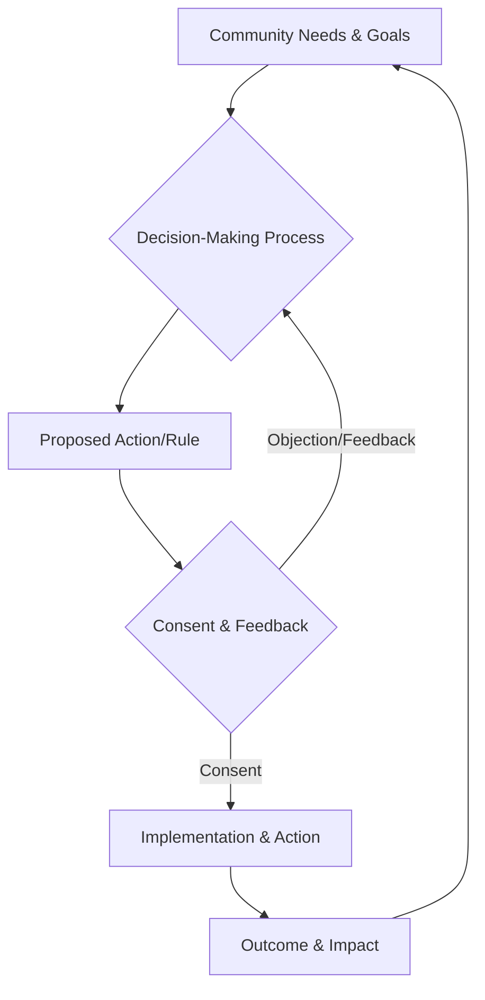

### 1. Context

Any collective endeavor, from a neighborhood watch to a multinational corporation or a digital platform, requires a system of governance to function. This system—comprising rules, roles, and decision-making processes—must be seen as valid and be accepted by those who are subject to it. Without this acceptance, the system’s lifeblood—participation—dries up. Enforcement of rules becomes a costly act of coercion, and the entire structure becomes brittle, lacking the living memory to handle novelty. The challenge arises when there is a disconnect between the governing body and the governed. This is particularly acute in systems that are designed to be decentralized, participatory, or community-owned. In such cases, traditional, top-down authority is often absent or intentionally rejected, yet the need for coordinated action and shared rules remains. The question then becomes: on what basis can decisions be made and rules be enforced? How can a group of peers, without a formal hierarchy, grant a system the authority it needs to breathe and operate effectively, ensuring that this authority serves the collective interest and not just a powerful few? This is the foundational problem of establishing and maintaining legitimacy and consent within any commons.

### 2. Problem

> **The core conflict is Effective Governance vs. Perceived Illegitimacy.**

Every commons requires a framework of rules and decision-making processes to manage shared resources and coordinate collective action. However, the very mechanisms intended to create order can become sources of conflict and alienation if they are not seen as legitimate by the community they serve. This tension creates a precarious balance that can easily tip into dysfunction, creating a void where the system's soul should be. The following forces are at play:

1.  **The Need for Decisive Action vs. The Right to Participate:** In any group, situations arise that require swift, decisive action. A crisis may emerge, a competitive threat may appear, or a fleeting opportunity may present itself. This necessitates a governance structure capable of making and executing decisions efficiently. However, members of the commons have a fundamental need to feel heard and to have agency over the rules that bind them. A purely efficiency-driven process that excludes or marginalizes participants will be perceived as autocratic and illegitimate, a ghost in the machine that erodes the very consent needed for the group to act as a cohesive, living whole.

2.  **The Requirement for Expertise vs. The Wisdom of the Crowd:** Effectively managing a commons often requires specialized knowledge—be it legal, technical, or financial. It is tempting to delegate authority to a small group of experts who can make informed decisions. Yet, the lived experience and diverse perspectives of the entire community represent a crucial form of wisdom. Over-reliance on a technocratic elite can lead to decisions that are technically sound but socially disconnected, failing to account for the real-world impacts on members and undermining the sense of collective ownership.

3.  **The Demand for Stable Rules vs. The Need for Adaptive Flexibility:** For a commons to be predictable and fair, its rules must be stable and consistently applied. Members need to trust that the system won't change arbitrarily. At the same time, the external environment and the community's needs are constantly evolving. The governance system must be able to adapt its rules and processes in response to new challenges and learnings. A system that is too rigid will become brittle and irrelevant, a lifeless automaton unable to adapt. Conversely, a system that is too fluid will feel chaotic and untrustworthy, failing to provide the stable container that living systems need to thrive.

### 3. Solution

> **Therefore, continuously earn legitimacy by designing governance systems where consent is explicitly sought, decisions are transparently made, and authority is dynamically granted and revoked by the community.**

This pattern shifts the source of authority from a static, top-down hierarchy to a dynamic, relational process, allowing the system to breathe with the rhythm of its community. Legitimacy is not a one-time grant but an ongoing state that is actively maintained through a set of interlocking mechanisms. The core of the solution is to create a system where power is not held but flows like a current, and where the community's consent is the ultimate currency of vitality.

This is achieved by implementing a multi-layered governance framework that balances participation with efficiency. Instead of treating all decisions equally, the system distinguishes between different levels of impact. Foundational, constitutional-level changes that affect the entire commons require high-threshold consensus or supermajority votes. Operational decisions, which are more frequent and less impactful, can be made by smaller, delegated working groups using consent-based methods (where a decision passes if no one has a reasoned, paramount objection). Finally, day-to-day executive tasks are handled by clearly defined roles with specific, limited authority.

Transparency is the lubricant for this entire system. All decision-making processes, meeting minutes, and financial records are made accessible to all members. This radical transparency builds trust and provides the necessary context for members to give informed consent. Authority is never permanent; it is delegated for specific purposes and for limited terms. Roles are subject to regular review, and the community retains the power to recall delegates or revoke mandates if they fail to act in the collective interest. This creates a powerful, life-giving accountability loop, ensuring that delegated power remains tethered to the will of the governed and practitioners feel a sense of agency and belonging.

This creates a continuous feedback loop, as illustrated below, where the governance system can adapt and evolve in response to the community's needs.

### 4. Implementation

Implementing a governance system rooted in legitimacy and consent is a gradual process of cultivating trust and institutionalizing the participatory practices that allow a community to come alive. It requires careful design and a commitment to transparency and accountability. The following steps provide a roadmap for practitioners.

1.  **Define the Scope of the Commons and Membership:**
    *   Clearly articulate the purpose and boundaries of the commons. What resources are being managed? Who are the stakeholders? This clarity is the fertile ground from which all subsequent governance design can grow.
    *   Establish clear criteria for membership. How does one join the commons? What are the rights and responsibilities of members? This ensures that the consent of the governed is coming from a well-defined group.

2.  **Co-create a Foundational Constitution:**
    *   Facilitate a participatory process with all initial members to draft a constitution or charter. This document should encode the commons' values, core principles, and the fundamental rights of members.
    *   Crucially, this constitution must define the process for its own amendment. This process should require a high threshold of consensus (e.g., a 75% supermajority vote), making the core rules stable but not immutable.

3.  **Design a Tiered Decision-Making Framework:**
    *   Avoid a one-size-fits-all approach. Differentiate between types of decisions based on their impact and scope.
    *   **Constitutional Decisions:** Reserve these for high-stakes changes to the foundational rules, requiring the high-threshold process defined in the constitution.
    *   **Policy Decisions:** For broad, strategic choices that affect the entire commons, use a consensus-based model like formal consensus or a consent-based process where proposals are discussed and refined until no member has a paramount objection.
    *   **Operational Decisions:** For day-to-day matters, delegate authority to smaller working groups or specific roles. These groups can operate with more agility, using simple majority votes or consent within the group, but their mandate must be clearly defined and limited by the policies of the commons.

4.  **Establish Roles with Delegated, Revocable Authority:**
    *   Define necessary roles (e.g., facilitator, treasurer, working group lead) with clear descriptions of their responsibilities and the limits of their authority.
    *   Implement a nomination and selection process that is open to all members. Terms for these roles should be limited (e.g., one year).
    *   Crucially, create a clear and accessible process for the community to recall or remove individuals from these roles if they lose the confidence of the commons. This is the ultimate backstop for accountability.

5.  **Implement Radical Transparency:**
    *   Choose an accessible, shared platform (like a wiki, a shared drive, or a dedicated governance forum) to serve as the single source of truth.
    *   All governance documents, meeting schedules, agendas, minutes, and financial reports must be published to this platform in a timely manner.
    *   Decisions, and the reasoning behind them, should be publicly recorded. This builds a living institutional memory and allows members to give informed, enthusiastic consent.

**Key Considerations:**

*   **Tooling:** The choice of tools is critical. You will need platforms for discussion (e.g., Loomio, Discourse), voting (e.g., Snapshot, Aragon), and documentation (e.g., Notion, a wiki). The tools should be user-friendly and accessible to all members.
*   **Facilitation:** Good facilitation is not a soft skill; it is a core requirement. Invest in training skilled facilitators who can guide conversations, manage conflict, and ensure that all voices are heard.
*   **Onboarding:** New members must be educated on the governance system. Create a clear onboarding process that explains how to participate, where to find information, and what their rights and responsibilities are.

**Common Pitfalls:**

*   **Participation Burnout:** If every minor decision requires a full community vote, members will quickly become exhausted. The tiered decision-making framework is essential to protect members' time and energy.
*   **Voter Apathy:** Low turnout for votes can undermine the legitimacy of the outcomes. This can be mitigated by clear communication, accessible tooling, and by ensuring that the decisions being put to a vote are meaningful.
*   **Capture by a Minority:** A small, highly-motivated group can sometimes dominate a consensus-based system. This can be countered by strong facilitation, clear processes for raising objections, and the ultimate backstop of a recall mechanism for captured roles.

### 5. Consequences

Adopting a governance model based on legitimacy and consent fundamentally alters the power dynamics within a collective, breathing life into the community and leading to a more resilient and engaged whole. However, this approach also introduces new overheads and challenges that must be carefully managed.

**Benefits:**

*   **Increased Resilience:** When members feel a genuine sense of ownership and agency, they are more invested in the long-term success of the commons. The system becomes more resilient, able to learn and adapt, because it can draw on the collective intelligence and commitment of its members to navigate challenges. Decisions are more robust because they have been vetted by a wider range of perspectives.
*   **Higher Quality Decisions:** By systematically incorporating diverse viewpoints and enabling constructive dissent, the decision-making process is less prone to groupthink. The requirement to justify proposals and address objections forces a deeper level of critical thinking, leading to more well-reasoned and sustainable outcomes.
*   **Reduced Enforcement Costs:** When rules are co-created and seen as legitimate, compliance becomes largely voluntary. The community moves from a model of external enforcement (policing) to one of shared accountability (stewardship). This dramatically reduces the financial and social costs associated with monitoring and punishing rule-breakers.

**Liabilities:**

*   **Slower Decision-Making:** The process of building consensus or consent is inherently slower than top-down, autocratic decision-making. This can be a significant disadvantage in fast-moving or highly competitive environments where the slow, deep pulse of consensus feels out of sync with the frantic pace of the market. The tiered decision framework is designed to mitigate this, but the trade-off between participation and speed is unavoidable.
*   **Process Overhead:** A well-functioning participatory governance system requires significant investment in process design, facilitation, and tooling. There is a cost to creating and maintaining the infrastructure for discussion, voting, and documentation. This overhead can be a barrier for nascent or resource-constrained communities.
*   **The Risk of Gridlock:** In a system that prioritizes consent, a single, well-placed objection can potentially halt a proposal. While this is a feature designed to protect the minority, it can be exploited by bad-faith actors or lead to gridlock if the community lacks effective conflict resolution mechanisms. This places a high premium on skilled facilitation and a culture of good-faith negotiation.

**When NOT to use this pattern:**

This pattern is not suitable for all situations. It should be avoided in contexts where there is a clear, legally-mandated hierarchy, such as in a military command structure or a publicly-traded company with a fiduciary duty to shareholders that is legally enforced through a board of directors. It is also ill-suited for early-stage, crisis-driven ventures that require a singular, dictatorial vision to survive in the short term. In these cases, the overhead of building consent outweighs the immediate need for decisive, centralized action. Furthermore, if the stakeholder group is extremely large and disengaged (e.g., the entire population of a country for a minor policy change), a more representative, rather than purely participatory, model may be more practical.

### 6. Known Uses

This pattern of earning legitimacy through active consent has been implemented in various forms across different domains, from municipal governance to cooperative enterprises and digital communities. These cases demonstrate the living adaptability of the core principles across diverse ecosystems.

*   **Municipal Governance: Participatory Budgeting in Porto Alegre, Brazil.** Starting in 1989, the city of Porto Alegre implemented a groundbreaking model of participatory budgeting. Each year, residents actively participate in neighborhood and regional assemblies to decide how a significant portion of the municipal budget is spent. This is not mere consultation; citizens have direct decision-making power over real resources. The process involves thousands of citizens in debates and voting, creating a powerful link between the government and the governed. The outcome was a dramatic increase in the legitimacy of the local government and a significant shift in investment towards poorer neighborhoods, leading to improved sanitation, infrastructure, and public services. It demonstrated that even in a large city, governance can be made legitimate by directly involving citizens in the consequential financial decisions that shape their shared life.

*   **Cooperative Enterprise: The Mondragon Corporation, Spain.** Mondragon is one of the world's largest and most successful worker cooperatives. Its governance structure is a powerful example of legitimacy and consent in a business context. The highest authority is the General Assembly, where each of the thousands of worker-owners has one vote. This body elects the Governing Council (the board of directors) and approves major strategic decisions. This democratic structure ensures that management's authority is explicitly granted by the workforce. The result is a high degree of alignment, motivation, and resilience. Because workers are owners who have consented to the governance system, the company has been able to navigate economic crises by collectively agreeing to measures like temporary pay cuts to preserve jobs, a feat unimaginable in a traditional top-down corporation.

*   **Digital Commons: Uniswap DAO.** Uniswap, a leading decentralized cryptocurrency exchange, is governed by its community through a Decentralized Autonomous Organization (DAO). Holders of the UNI governance token can propose and vote on changes to the protocol, from adjusting fee structures to funding new development initiatives. Authority is not vested in a corporate board but is distributed among the token holders. For a proposal to be enacted, it must go through a transparent, on-chain voting process where the consent of the community is explicitly registered. This model allows a complex, multi-billion dollar financial protocol to evolve and be managed without a central command structure. The legitimacy of any change rests entirely on the demonstrated consent of the token-holding community, making it a prime example of this pattern breathing life into a purely digital, global commons.

### 7. Cognitive Era Considerations

The rise of AI and autonomous agents introduces a profound shift in the landscape of governance, acting as both a powerful tool and a potential threat to legitimacy and consent. The ability of AI to process vast amounts of information and automate complex processes can either become a powerful nutrient for systemic vitality or a poison that undermines the principles of this pattern, depending on its implementation.

On one hand, AI can be a powerful enabler of legitimacy. AI-powered platforms can create more sophisticated and accessible spaces for deliberation and voting. They can analyze vast amounts of discussion from a community forum, identify key themes and points of consensus or contention, and summarize them for human participants, making it easier for members to give informed consent at scale. This can help overcome the problem of participation burnout. Furthermore, AI can facilitate models like liquid democracy, where members can delegate their voting power to trusted experts on a topic-by-topic basis. An AI agent could help a member identify the most qualified delegates based on their voting history and stated positions, making the process of representation more dynamic and meritocratic.

However, the introduction of AI also creates significant new risks. The opacity of many AI models—the "black box" problem—is in direct conflict with the principle of radical transparency. If decisions are made or influenced by algorithms that the community cannot understand or scrutinize, the basis for informed consent is eroded, and the system’s spirit is replaced by an opaque, unaccountable logic. The system becomes a technocratic black box, and legitimacy is lost. There is also a significant risk of algorithmic bias. An AI trained on historical data may perpetuate and even amplify existing inequalities, leading to decisions that are systematically unfair to certain subgroups within the commons. This would destroy the perception of fairness that is essential for legitimacy.

Human judgment remains paramount in this new era. While AI can automate the *mechanics* of governance—tallying votes, summarizing arguments, identifying experts—it cannot replace the ethical and strategic judgment of the community. Humans must be responsible for designing the governance system itself, setting the values and constraints that the AI will operate within. They must also be the ultimate arbiters in contentious cases and be responsible for interpreting the *spirit* of the law, not just the letter. The role of the community shifts from participating in every decision to governing the AI systems that help them govern. The new frontier of legitimacy is not just about consenting to rules, but about collectively animating and steering the algorithms that help create and enforce those rules, ensuring they serve the life of the commons.

### 8. Vitality: The Quality Without a Name

When legitimacy and consent form the living heart of a commons, the system feels alive. There is a palpable sense of shared ownership and collective agency in the air. Practitioners don't just follow rules; they inhabit them, feeling a sense of belonging and purpose. The governance structure is not a rigid cage but a flexible, responsive membrane that breathes with the community. It adapts to unexpected challenges not through crisis-driven commands, but through the emergent intelligence of its members. Information flows freely, like nutrients in a healthy ecosystem, enabling constant learning and renewal. The system can hold creative tension, turning dissent and conflict into sources of strength and innovation rather than signs of failure. This vitality is felt in the quality of relationships, the ease of collaboration, and the shared confidence that the community can and will navigate its future together.

Conversely, the decay of this pattern manifests as a creeping lifelessness. The first sign is often a hollowing out of participation. Meetings become poorly attended, discussions feel perfunctory, and a sense of weary resignation sets in. The system becomes brittle and rigid, losing its capacity to respond to change. Rules, once co-created, now feel like external impositions, and a subtle 'us vs. them' mentality emerges between governors and the governed. Apathy and cynicism become the dominant emotional tones. The organization may still function on a mechanical level, but it has lost its soul, becoming a ghost in the machine. The flow of information slows to a trickle, and the system's ability to self-correct withers, leaving it vulnerable to shocks and slow, inexorable decline.
