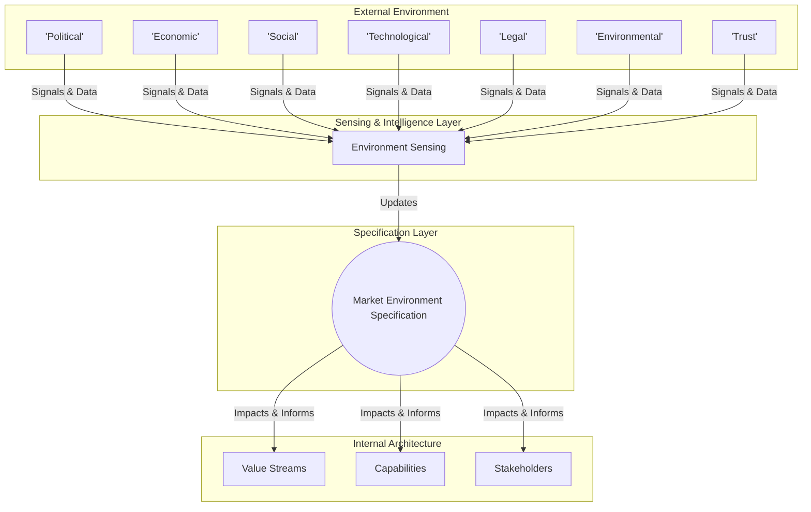

### 1. Context

No organization, commons, or project exists in a vacuum. Every entity is embedded within a complex and dynamic environment, a turbulent field of interconnected systems—markets, regulatory frameworks, technological waves, social movements, and ecological boundaries. These external forces are in constant flux, creating both powerful tailwinds that can accelerate a mission and sudden headwinds that can render a strategy obsolete overnight. Many leadership teams, however, operate with an inward focus, concentrating on internal operations and immediate deliverables. They may conduct periodic environmental scans, but these are often treated as static snapshots, performed hastily and disconnected from the daily rhythm of strategic decision-making. This reactive and unsystematic approach to understanding the outside world leaves the organization vulnerable to unforeseen shifts and unable to proactively seize emergent opportunities. The result is a strategy built on assumption rather than awareness, fragile and susceptible to being blindsided by the very world it seeks to serve.

### 2. Problem

> **The core conflict is Internal Focus vs. External Awareness.**

An organization's finite attention and resources are constantly pulled inward by the urgent demands of execution, product development, and operational management. This creates a natural tendency to neglect the systematic observation of the external world. This internal fixation clashes with the reality that long-term viability depends entirely on maintaining a dynamic alignment with the external environment. This gives rise to several conflicting forces:

1.  **Signal vs. Noise:** The external environment generates a deluge of information—market reports, news articles, social media trends, policy papers, scientific studies. The sheer volume is overwhelming, making it incredibly difficult to distinguish meaningful signals that indicate a genuine shift from the constant, distracting noise.
2.  **Breadth vs. Depth:** To be comprehensive, an environmental analysis must cover multiple dimensions: Political, Economic, Social, Technological, Legal, and Environmental (PESTLE). However, attempting to analyze all dimensions with equal rigor can lead to a superficial, checklist-driven exercise that lacks the depth needed to reveal complex interdependencies and second-order effects.
3.  **Static Analysis vs. Dynamic Reality:** The environment is not a static picture; it is a moving current. A one-time report or annual strategic review is outdated the moment it is published. The challenge is to move from a periodic, snapshot-based analysis to a continuous, real-time model that reflects the environment's fluid nature.
4.  **Known Unknowns vs. Unknown Unknowns:** It is relatively straightforward to monitor known trends and variables—the "known unknowns." The greatest disruptions, however, often arise from "unknown unknowns"—emergent phenomena that were not on anyone's radar. A purely structured approach risks missing these black swan events entirely.

### 3. Solution

> **Therefore, create and maintain a living, multi-dimensional specification of the market environment, continuously updated by sensing mechanisms and directly linked to the core components of the value creation system.**

Instead of treating environmental analysis as a periodic report, transform it into a formal **specification**. This is a dynamic model, a core artifact of the system architecture, much like a technical specification. This model is structured around a framework like PESTLE, expanded to include **Trust (T)**—the critical dimension of stakeholder, partner, and public trust dynamics. Each dimension is not merely a category in a report but a structured object within the system's knowledge graph.

Each identified external force (e.g., "new data privacy regulation," "falling cost of renewable energy," "rise of remote work") is captured as a distinct entity. This entity is then explicitly linked to the internal components it affects, such as value streams, capabilities, resources, or stakeholder groups. For example, a new privacy regulation (Legal) might directly constrain a "Personalized Marketing" capability and require the development of a new "Data Governance" capability.

This creates a causal map between the outside world and the internal architecture. The specification is not static; it is a living document, fed by a continuous **Environment Sensing** capability that actively monitors for signals and triggers updates. This transforms the analysis from a passive, descriptive exercise into an active, predictive, and integrated strategic instrument.

### 4. Implementation

Implementing a Market Environment Specification is an ongoing process, not a one-off project. It involves establishing a systematic rhythm of scanning, analyzing, and integrating external insights.

1.  **Establish the Framework:** Formally adopt a multi-dimensional framework. PESTLE+T (Political, Economic, Social, Technological, Legal, Environmental + Trust) is a robust starting point. Define the key sub-topics and questions to investigate for each dimension, tailored to your organization’s specific context.

2.  **Assign Ownership:** Designate a clear owner for the Market Environment Specification. This could be a dedicated market intelligence team, a strategic planning group, or a cross-functional council. The key is to ensure accountability for keeping the specification current and relevant.

3.  **Initial Deep Dive (Baseline):** Conduct an initial, comprehensive scan across all dimensions to establish a baseline specification. For each dimension, identify the top 5-7 most significant forces currently impacting or likely to impact your commons. Document each force with a clear description, its potential trajectory (increasing, decreasing, stable), and its anticipated impact.

4.  **Link Forces to Internal Architecture:** This is the most critical step. For each identified external force, map its potential impact onto the specific components of your organization. For example:
    *   *Force:* "Increasing regulation on gig economy workers (Legal)." *Impacts:* "Increases cost for our `On-Demand Delivery` value stream; requires changes to our `Freelancer Management` capability."
    *   *Force:* "Growing consumer demand for sustainable products (Social)." *Impacts:* "Creates opportunity for our `Eco-Friendly Product Line` value stream; requires new `Sustainable Sourcing` capability."

5.  **Set Up Continuous Sensing:** Move from periodic reviews to continuous monitoring. Leverage a mix of human and automated methods. This can include subscribing to industry newsletters, setting up alerts for keywords, using market intelligence platforms, and establishing a process for employees to submit observations from the field.

6.  **Institute a Review Cadence:** Establish a regular rhythm for formally reviewing and updating the specification. A quarterly review is a common starting point. This review should assess if existing forces have changed, if new forces have emerged, and if the mapped impacts on the internal architecture are still accurate.

**Key Considerations:**
*   **Tooling:** While this can start with a simple wiki or document, consider using a dedicated knowledge management or strategy platform to model the specification and its links to other business architecture components.
*   **Bias Awareness:** The team responsible for the specification must be conscious of its own biases (confirmation bias, availability heuristic) and actively seek out diverse and dissenting perspectives.

**Common Pitfalls:**
*   **The "Report" Trap:** The specification becomes a static document that is filed away and ignored. The link to internal architecture and continuous sensing is what makes it a living tool.
*   **Analysis Paralysis:** The team gets bogged down in researching every possible force to an exhaustive degree. Focus on the most impactful forces first (the "big rocks") and build out the detail over time.
*   **Lack of Integration:** The insights from the specification are not used to inform actual strategic decisions, budget allocation, or risk management. It must be a central input into the strategic planning and execution cycle.

### 5. Consequences

Adopting a formal Market Environment Specification fundamentally changes an organization's posture from reactive to proactive, creating significant advantages but also introducing new responsibilities.

**Benefits:**
*   **Enhanced Strategic Resilience:** By systematically identifying and monitoring external threats, the organization can anticipate shifts and develop contingency plans, reducing the risk of being blindsided by market or regulatory changes.
*   **Proactive Opportunity Seizure:** The specification acts as a radar for emerging opportunities—new technologies, underserved market segments, or favorable policy shifts—allowing the organization to mobilize resources and capture value before competitors.
*   **Improved Capital Allocation:** By linking external forces directly to internal capabilities and value streams, leadership can make more informed decisions about where to invest resources to either mitigate a threat or exploit an opportunity.
*   **Shared Strategic Context:** A well-maintained specification provides a common, evidence-based understanding of the external landscape for all decision-makers, fostering alignment and reducing time spent debating the nature of reality.

**Liabilities:**
*   **Resource Overhead:** Maintaining a high-quality, living specification requires dedicated time and resources for scanning, analysis, and updating. If not properly resourced, it can quickly become outdated and useless.
*   **Risk of Bureaucracy:** The process can devolve into a bureaucratic, check-the-box exercise if it is not tightly integrated with the core decision-making processes of the organization. The focus must remain on generating actionable insight, not just filling out a template.
*   **False Sense of Security:** A poorly executed specification can create a dangerous illusion of control. If the analysis is superficial or fails to challenge existing assumptions, it can reinforce blind spots rather than expose them.

**When NOT to use this pattern:**
This pattern may be less critical for a very early-stage startup in the pre-product-market fit phase, where the primary focus is intense, iterative engagement with a small set of initial users to validate the core problem and solution. In this stage, the "environment" is the user, and deep, broad environmental scanning can be a distraction from the immediate priority of survival and finding a repeatable business model. However, once product-market fit is achieved and the focus shifts to scaling, this pattern becomes essential.

### 6. Known Uses

This pattern, in various forms, is a cornerstone of modern strategic management, applied across vastly different domains to ensure alignment with the external world.

1.  **Nike (Global Sportswear):** Nike exemplifies a sophisticated application of this pattern by continuously scanning its environment to drive innovation and marketing. It closely monitors **social** trends (e.g., the rise of wellness culture, streetwear fashion), **technological** advancements (e.g., new materials, wearable tech), and **economic** shifts in global markets. Its collaboration with Apple for the Nike+ ecosystem was a direct response to the convergence of technology and fitness. By specifying these environmental forces, Nike doesn't just react; it shapes its product development and brand narrative to lead the market, turning external signals into a powerful competitive advantage. [1]

2.  **Google/Alphabet (Technology):** As a technology giant, Google’s survival depends on mastering this pattern. Its PESTLE analysis is a constant, high-stakes activity. The company must navigate a complex **political** and **legal** environment of antitrust lawsuits, data privacy regulations (like GDPR), and varying censorship laws across nations. It responds to **socio-cultural** concerns about data privacy by offering more user control, while simultaneously competing on the **technological** front by developing its Android ecosystem and Pixel hardware to counter Apple’s integrated model. This ongoing specification of its environment allows Google to defend its core business while placing strategic bets on future growth areas like AI and cloud computing. [2]

3.  **LEGO (Toy Manufacturing & Entertainment):** In the early 2000s, LEGO faced a near-collapse by ignoring shifts in its market environment, particularly the **technological** shift towards video games and the **social** shift in how children play. The company’s turnaround was driven by a renewed and intense focus on understanding its environment. They began rigorously studying play patterns, engaging with their adult fan community (AFOLs), and strategically licensing major entertainment properties (a **socio-cultural** and **economic** move). By creating a detailed specification of their new environment, LEGO was able to innovate its core product, expand into movies and digital games, and reconnect with its customers, leading to one of the most celebrated turnarounds in corporate history.

### 7. Cognitive Era Considerations

The advent of AI and autonomous agents radically transforms the Market Environment Specification from a human-centric analytical process into a dynamic, semi-autonomous cognitive function.

**Automation and Augmentation:**
AI agents can elevate this pattern from a periodic, labor-intensive task to a continuous, real-time process. Teams of specialized agents can be deployed to:
*   **Monitor Massively:** Continuously scan millions of sources in parallel—news feeds, academic journals, patent filings, regulatory updates, social media conversations, and even satellite imagery—across multiple languages.
*   **Detect Anomalies:** Identify emerging signals and anomalies that would be invisible to human analysts, such as a sudden spike in conversation around a niche technology or a subtle shift in consumer sentiment in a specific region.
*   **Synthesize and Summarize:** Process vast amounts of unstructured text and data to produce concise, relevant briefings, freeing human analysts from low-level information gathering and allowing them to focus on higher-order strategic interpretation.
*   **Causal Inference:** More advanced AI can begin to model the causal relationships between different environmental forces, suggesting potential second- and third-order effects of an observed change.

**Human Judgment and New Risks:**
While agents excel at data processing, human judgment remains critical for the final stages of analysis and decision-making. Humans are needed to:
*   **Interpret Context:** Understand the nuanced, culturally-specific context behind a signal that an AI might misinterpret.
*   **Validate and Question:** Challenge the AI's findings, investigate potential biases in the data sources, and avoid blindly accepting automated recommendations.
*   **Make Strategic Leaps:** Synthesize the analytical inputs into a creative and coherent strategic choice, a task that still requires human intuition, experience, and risk appetite.

**New Risks:**
*   **Algorithmic Bias:** The agents may over-index on certain types of information or inherit the biases of their training data, creating a distorted view of the environment.
*   **Information Overload 2.0:** If not properly managed, the output of the AI agents could simply create a new form of information overload, overwhelming human decision-makers with a firehose of "insights."
*   **Adversarial Information:** Malicious actors could deliberately seed the information environment with false or misleading signals to manipulate the scanning agents, leading the organization to make poor decisions based on flawed intelligence.

In the Cognitive Era, the Market Environment Specification becomes a collaborative human-AI system, where agents provide the sensing and processing power, and humans provide the critical thinking, contextual understanding, and ultimate strategic judgment.

### References

[1] IvyPanda. (2024). *Nike and Adidas Companies' Environmental Scan*. https://ivypanda.com/essays/nike-and-adidas-companies-environmental-scan/

[2] EduBirdie. (2026). *PESTLE Analysis: Google Case Study*. https://hub.edubirdie.com/examples/google-case-study-p-e-s-t-l-e-analysis-and-5-forces-model/
