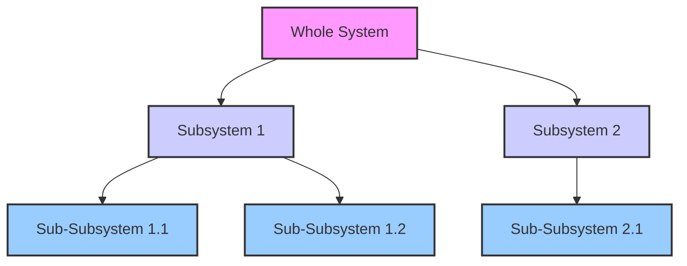

### 1. Context

In any complex endeavor, from building a multinational corporation to organizing a grassroots social movement or designing a sophisticated software platform, we face the challenge of managing complexity. As systems grow, they accumulate more parts, more connections, and more dynamic interactions. A monolithic, centrally controlled structure becomes a bottleneck, stifling innovation and slowing response times. Decision-making gets bogged down, local teams lack the agency to address their unique challenges, and the system as a whole becomes brittle and unable to adapt to a changing environment. Practitioners find themselves in a constant struggle to balance the need for local responsiveness with the need for global coherence, feeling the system's joints creak under the strain. The lifeblood of the organization—its ability to sense and respond—slows to a crawl, and a palpable sense of stagnation can set in. The desire for decentralized execution clashes with the requirement for a unified strategy, leading to either chaotic fragmentation or rigid, ineffective control.

### 2. Problem

> **The core conflict is Autonomy vs. Cohesion.**

This tension manifests through several competing forces:

1.  **Force 1: The Need for Local Adaptation.** Subsystems (teams, departments, local chapters) must be able to respond to their specific environmental conditions and challenges quickly and effectively. A one-size-fits-all approach dictated from the center is often suboptimal or even counterproductive.
2.  **Force 2: The Need for Global Coherence.** The system as a whole must maintain a consistent identity, purpose, and direction. Unfettered autonomy can lead to strategic drift, resource duplication, and a loss of collective identity and power.
3.  **Force 3: The Problem of Information Overload.** As a system scales, the central authority cannot possibly process all the information required to make every decision. This creates delays, poor decisions based on incomplete data, and a disempowered periphery.
4.  **Force 4: The Desire for Resilience.** Monolithic systems have single points of failure, like a body with a single, over-stressed organ. A crisis in one part of the system can cascade and bring down the entire structure, a systemic death from a localized wound. A more modular, decentralized architecture is needed to contain failures and allow the whole to survive, to regenerate, and to continue its living purpose.

### 3. Solution

> **Therefore, design the system as a holarchy of nested, semi-autonomous subsystems (holons), where each holon is a viable system in its own right and also a part of a larger whole.**

This pattern, inspired by Arthur Koestler's concept of the holon, resolves the tension by creating a recursive, self-similar structure. A holon is a system that is simultaneously a whole and a part. A cell in your body is a whole, with its own processes for survival, yet it is also a part of an organ. An organ is a whole, yet a part of you. You are a whole, yet a part of a community. This nested architecture allows for both autonomy at each level and integration within the larger system, creating a vibrant interplay between the parts and the whole.

The key mechanism is that each holon has a degree of autonomy and is responsible for its own internal stability and function. However, it is also accountable to the next level up in the holarchy, from which it receives direction and to which it provides resources or information. This creates a dynamic balance between the self-assertive tendency of the part (to maintain its own integrity) and the integrative tendency of the whole (to function as a cohesive unit).

This structure allows for complexity to be managed effectively. Problems can be solved at the lowest possible level (subsidiarity), preventing the central authority from becoming a bottleneck. The system as a whole gains resilience because the failure of one holon does not necessarily threaten the entire holarchy.

### 4. Implementation

Implementing a Nested Systems Architecture requires a shift in mindset from top-down control to enabling and connecting autonomous units. It is a move from mechanical engineering to systemic gardening, cultivating the conditions for life to emerge.

1.  **Define the Boundaries and Interfaces.** The first step is to clearly define the boundaries of each holon. What is its scope of responsibility? What are its inputs and outputs? Crucially, you must define the interfaces between holons. This includes communication protocols, resource exchange mechanisms, and decision-making processes for escalating issues.
2.  **Establish a Shared Purpose and Identity.** While each holon has autonomy, they must all be aligned with the overall purpose of the larger system. This is often achieved through a shared vision, a clear mission, and a strong set of values that are propagated throughout the holarchy.
3.  **Empower the Holons.** Holons must have the authority, resources, and information necessary to fulfill their purpose. This means delegating decision-making power and avoiding the temptation to micromanage. Trust is a critical component of this architecture.
4.  **Implement Feedback Loops.** Create mechanisms for information to flow up, down, and across the holarchy. This allows for continuous learning and adaptation. The higher-level holons need to receive feedback on the performance of the lower-level ones, and the lower-level holons need to understand the strategic context set by the higher levels.
5.  **Start Small and Iterate.** It is often best to start with a pilot project or a small part of the organization. Create a single, well-defined holon and then build out the holarchy from there. This allows you to learn and adapt the design as you go.

**Key Considerations:**

*   **The "Right" Level of Autonomy:** Finding the right balance between autonomy and control is a constant challenge. Too much autonomy can lead to fragmentation; too little can lead to bureaucracy.
*   **Communication Overhead:** A holarchy can sometimes increase communication overhead, as holons need to coordinate with each other. It is important to design efficient communication channels.

**Common Pitfalls:**

*   **Fake Holons:** Creating "holons" that are not truly autonomous and are still subject to top-down control. This defeats the purpose of the pattern.
*   **Ignoring the Interfaces:** Failing to clearly define the interfaces between holons, leading to confusion, conflict, and inefficiency.

### 5. Consequences

**Benefits:**

*   **Increased Resilience:** The system is more resilient to shocks and failures. The failure of one holon is contained and does not necessarily bring down the entire system.
*   **Enhanced Adaptability:** The system can adapt more quickly to changing conditions because decisions are made at the local level.
*   **Improved Scalability:** The system can scale more effectively because complexity is managed in a modular, hierarchical way.
*   **Greater Engagement:** Individuals within the holons are more engaged and motivated because they have a greater sense of autonomy and ownership. They feel a sense of belonging and purpose, knowing their actions contribute to a larger, living whole.

**Liabilities:**

*   **Potential for Sub-optimization:** A holon may optimize for its own goals at the expense of the larger system's goals. This is why a shared purpose and clear interfaces are so critical.
*   **Coordination Challenges:** As the number of holons increases, the challenge of coordinating their activities can become significant.
*   **Risk of Fragmentation:** If the cohesive forces are not strong enough, the holarchy can fragment into a collection of disconnected systems.

**When NOT to use this pattern:**

*   In very small, simple systems where a monolithic structure is more efficient.
*   In situations where tight, centralized control is absolutely essential for safety or security reasons (e.g., a nuclear power plant).

### 6. Known Uses

*   **Business: The Toyota Production System.** Toyota's production system is a classic example of a nested systems architecture. Each team on the assembly line is a holon, responsible for its own quality control and process improvement. This allows for continuous improvement (kaizen) and a high degree of flexibility, creating a learning organization that is constantly adapting and evolving.
*   **Urban Planning: The "City of Cities" Concept.** Many metropolitan regions are conceptualized as a nested system of cities, towns, and neighborhoods. Each has its own local government and identity, but they are also part of a larger regional system for things like transportation and economic development. The metropolitan area of London, with its boroughs, is a good example.
*   **Technology: The Internet.** The internet itself is a massive holarchy. It is composed of countless autonomous systems (AS), each managed by a different organization. These AS's are nested within larger internet service providers (ISPs), and they all interoperate through a set of shared protocols (TCP/IP).
*   **Cooperatives: The Mondragon Corporation.** This federation of worker cooperatives in Spain is a powerful example of a nested systems architecture in the economic sphere. Each cooperative is an autonomous enterprise, but they are all part of a larger group that provides shared services like finance, research, and social security.

### 7. Cognitive Era Considerations

In the cognitive era, AI and autonomous agents can dramatically enhance the power of Nested Systems Architecture. Agents can act as the 
"nervous system" of the holarchy, facilitating communication and coordination between holons.

*   **Automated Coordination:** AI agents can automate many of the coordination tasks that are currently done by humans. For example, an agent could be responsible for negotiating resource allocation between two holons, or for automatically escalating an issue to a higher level in the holarchy when it cannot be resolved at the local level.
*   **Enhanced Sensing and Sense-making:** Each holon can be equipped with AI-powered sensors that gather data about its internal state and its external environment. This data can then be aggregated and analyzed at higher levels of the holarchy to provide a real-time, holistic view of the entire system.
*   **Generative Design of Holarchies:** AI could be used to design and evolve the holarchy itself. For example, a generative algorithm could explore different ways of nesting systems and suggest new structures that are more resilient or adaptive.
*   **New Risks: Algorithmic Collusion and Opaque Governance:** The introduction of autonomous agents also creates new risks. Agents could learn to collude with each other to optimize for their own goals at the expense of the larger system, in ways that are difficult for humans to detect. The decision-making processes of AI agents can also be opaque, making it difficult to understand why the system is behaving in a certain way. This raises new challenges for governance and accountability.
*   **Human-AI Collaboration:** The future of nested systems will likely involve a deep collaboration between humans and AI, a symbiotic partnership. Humans will be responsible for setting the overall purpose and values of the system—its soul—while AI agents will handle much of the operational detail. The challenge will be to design holarchies that effectively leverage the unique capabilities of both humans and machines, creating a new kind of living intelligence.

### 8. Vitality: The Quality Without a Name

When a Nested Systems Architecture is truly alive, it feels less like a machine and more like an ecosystem. There is a palpable sense of wholeness and adaptive capacity. Practitioners within each holon feel a strong sense of agency and belonging, empowered to act locally while knowing their work contributes to a meaningful, larger purpose. The system breathes; information and resources flow like nutrients through a living organism, from the smallest sub-subsystem to the whole holarchy and back again. When faced with the unexpected—a market shift, a technological disruption, a community crisis—the system doesn’t break; it reconfigures. New connections form, resources are re-routed, and novel solutions emerge from the interplay of autonomous parts. There is a quality of effortless grace to its functioning, a dynamic stability that is the hallmark of a healthy, living system.

Conversely, the decay of this pattern manifests as a creeping rigidity and fragmentation. The first warning sign is often a loss of felt agency at the periphery. Local teams feel their autonomy being eroded by top-down directives, their feedback unheard. Communication, once a vibrant dialogue, becomes a series of sterile reports sent up the chain of command, with little meaningful information flowing back down. The system loses its ability to learn. Instead of adapting, it becomes brittle, clinging to outdated procedures and structures. A void forms where the system's soul should be, replaced by bureaucratic process and a sense of disengagement. The holons, no longer feeling part of a cohesive whole, begin to optimize for their own survival, hoarding resources and information. The architecture becomes a ghost in the machine, a set of boxes and lines on a chart that no longer reflects the fragmented, lifeless reality of the organization.
