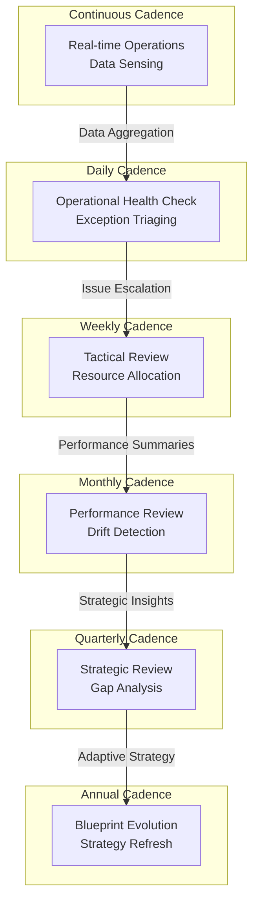

### 1. Context

Every effective system, from a living organism to a global corporation, operates on a set of nested rhythms. A heart beats, lungs breathe, and cells metabolize at different but coordinated frequencies. Similarly, organizations have their own pulses: the continuous flow of real-time data, the daily check-in, the weekly tactical meeting, the quarterly strategic review, and the annual planning cycle. In purely human-driven enterprises, these cadences are often implicit, embedded in culture and habit. Team members intuitively know the tempo of their work. However, as organizations grow in complexity and increasingly integrate autonomous agents and automated systems, this reliance on implicit, cultural understanding becomes a significant liability. Without an explicit, designed cadence, the system risks descending into chaos. Signals are missed, decisions are delayed, and the friction between high-speed automated processes and slower human cognitive cycles creates confusion and inefficiency. The need arises for a deliberately designed operational rhythm that can synchronize the work of both humans and machines across the entire system.

### 2. Problem

> **The core conflict is Continuous Flow vs. Rhythmic Synchronization.**

An operational system is pulled between the need for immediate, continuous action and the need for periodic, system-wide alignment. Optimizing for one often degrades the other, creating a set of persistent tensions that must be managed.

1.  **Force 1: Real-Time Responsiveness vs. Batched Efficiency.** Many operational tasks, like fraud detection or customer support, demand real-time processing to be effective. Conversely, other tasks, such as financial reporting or resource planning, are more efficiently handled in batches. A system that is purely continuous can become chaotic and inefficient, while a system that is purely batch-processed is unresponsive and slow.
2.  **Force 2: Local Autonomy vs. Global Coherence.** Individual teams or value streams need the autonomy to operate at their own natural tempo, optimizing their local workflow. However, the organization as a whole must maintain coherence. Without designated synchronization points, these autonomous streams can drift out of alignment, leading to resource conflicts, strategic divergence, and a breakdown of the system's integrity.
3.  **Force 3: High-Speed Automation vs. Deep Human Cognition.** Automated agents can operate and process information at near-instantaneous speeds, 24/7. Humans, however, require time for reflection, deliberation, and strategic thinking. A system dominated by machine speed can overwhelm human cognitive capacity, leading to poor decisions. A system limited by human speed fails to leverage the power of automation. The challenge is to create a rhythm that benefits from both.
4.  **Force 4: Signal vs. Noise.** A continuous stream of data provides a high-fidelity view of operations, but it can also be overwhelmingly noisy. Rhythmic synchronization points provide an opportunity to aggregate, filter, and synthesize this data into meaningful signals. Without this, decision-makers are forced to drink from a firehose, unable to distinguish critical alerts from trivial fluctuations.

### 3. Solution

> **Therefore, specify a nested cadence hierarchy where each frequency has defined activities, inputs, outputs, and participants—and where faster cadences feed into slower ones through explicit aggregation.**

The solution is to design and implement a system of nested, interlocking cadences, much like the gears of a clock. Each cadence operates at a different frequency, serving a distinct purpose, yet they are all interconnected. Faster, shorter cadences handle real-time operations and feed aggregated information upwards to slower, longer cadences, which focus on strategic reflection and adaptation. This creates a system that is both highly responsive and strategically coherent.

The hierarchy acts as a powerful information filter. The torrent of high-frequency data from continuous operations is progressively summarized and contextualized as it moves up the chain. What begins as raw data at the continuous level becomes actionable insight at the weekly level and strategic intelligence at the quarterly level. This ensures that human decision-makers are not overwhelmed by noise but are instead presented with the right level of detail at the right time.

This model explicitly defines the role of both human and machine participants at each layer. Agents typically dominate the faster cadences (continuous, daily), executing tasks, monitoring systems, and performing initial data aggregation. Humans then intervene at the slower, more reflective cadences (weekly, monthly, quarterly), using their judgment to interpret the agent-prepared insights, make complex trade-offs, and set new strategic directions. This creates a powerful human-agent partnership that leverages the strengths of both.

This nested structure resolves the core tension by creating a system that can simultaneously flow and synchronize. It allows for continuous, real-time action at the lowest levels while ensuring periodic alignment and strategic coherence at the highest levels.

### 4. Implementation

Implementing a formal operational cadence requires a systematic approach that moves from understanding the current state to building a new, more effective rhythm. It is a socio-technical process that involves changing both habits and infrastructure.

1.  **Step 1: Audit Existing Rhythms.** Before designing the future, you must understand the present. Conduct a thorough audit of all existing formal and informal cadences. This includes scheduled meetings (daily stand-ups, weekly reviews), automated reports, and even the informal, habitual check-ins that govern daily work. For each, document its purpose, participants, inputs, and outputs. A simple spreadsheet can be effective for this. The goal is to create a complete inventory of the organization's current operational pulse.

2.  **Step 2: Design the Nested Hierarchy.** Using the audit as a baseline, design the new, explicit cadence hierarchy. For each level (e.g., Continuous, Daily, Weekly, Monthly, Quarterly, Annual), create a charter. This charter must clearly define:
    *   **Purpose:** What is the primary goal of this cadence? (e.g., "Triage daily operational exceptions.")
    *   **Participants:** Who needs to be involved? Specify roles for both humans and agents.
    *   **Inputs:** What information is required for this cadence to be effective? (e.g., "Agent-generated anomaly report from the last 24 hours.")
    *   **Activities:** What happens during this cadence? (e.g., "Review exceptions, assign owners, escalate critical issues.")
    *   **Outputs:** What are the concrete deliverables? (e.g., "A prioritized list of issues for the weekly tactical review.")

3.  **Step 3: Define Aggregation and Escalation Paths.** This is the connective tissue of the system. Explicitly define how information flows from faster to slower cadences. For example, specify that the top 5 unresolved daily exceptions are automatically added to the agenda for the weekly tactical review. Similarly, define how insights from the monthly performance review are synthesized into a strategic brief for the quarterly review. This ensures that information is filtered and contextualized as it moves up the hierarchy.

4.  **Step 4: Instrument and Automate.** With the design in place, begin building the necessary technical infrastructure. This includes creating the automated dashboards for each cadence, setting up the agent-driven data collection and aggregation processes, and configuring the notification systems that alert participants to their roles. The goal is to automate the preparation and logistics of each cadence, freeing up human cognitive capacity for analysis and decision-making.

5.  **Step 5: Pilot, Iterate, and Scale.** Do not attempt a big-bang rollout. Select a single, well-contained value stream or team to pilot the new operational cadence. Run the new rhythm for several cycles, gathering feedback and making adjustments. Once the model is proven and stable, use it as a template to progressively roll out the cadence across the rest of the organization.

### Key Considerations

*   **Ruthless Simplification:** Every meeting, report, or synchronization point must justify its existence. If a cadence does not lead to concrete decisions or actions, it is waste. Be aggressive in eliminating low-value activities.
*   **Cultural Adoption:** An operational cadence is as much a cultural artifact as it is a technical one. It requires discipline and commitment from all participants. Leaders must model the desired behavior by consistently adhering to the new rhythm.
*   **Design for Evolution:** The operational cadence is not a static blueprint. It is a living system that must adapt as the organization and its environment change. Build in a periodic review (e.g., annually) to assess the effectiveness of the cadence itself and make necessary adjustments.

### Common Pitfalls

*   **Cadence for Cadence's Sake:** The most common failure mode is creating a bureaucracy of meetings and reports that consumes time without creating value. The focus must always be on the quality of decisions and actions that result from the cadence.
*   **Ignoring the Informal Network:** Formalizing the cadence should not kill the informal communication that is often the lifeblood of an organization. The new rhythm should provide a backbone, not a straitjacket.
*   **Tool-First Implementation:** Adopting a new project management tool or dashboard will not, by itself, create a coherent operational cadence. The design of the process and the cultivation of the culture must come first.

### 5. Consequences

Implementing a deliberate operational cadence has profound effects on a system’s performance, culture, and adaptability. It introduces predictability and clarity, but it also carries the risk of rigidity if not managed carefully.

**Benefits:**

*   **Increased Predictability and Reduced Cognitive Load:** A well-defined cadence makes the system’s rhythm explicit. Participants—both human and agent—know what information to expect, when to engage, and what decisions they are empowered to make. This reduces the cognitive overhead of constantly wondering what to focus on, freeing up mental bandwidth for higher-value work.
*   **Improved Signal-to-Noise Ratio:** The nested hierarchy acts as a natural filter, aggregating and synthesizing vast amounts of operational data into focused, contextualized insights. This ensures that strategic decision-makers are not swamped by low-level noise but are instead presented with the signals that truly matter.
*   **Enhanced Alignment and Coherence:** The regular synchronization points ensure that all parts of the system—across different teams, functions, and even automated services—remain strategically aligned. This prevents the kind of strategic drift that can occur when autonomous units operate without a shared pulse.

**Liabilities:**

*   **Risk of Bureaucratic Rigidity:** The most significant danger is that the cadence becomes an end in itself. If not ruthlessly pruned and kept lean, the schedule of meetings and reports can ossify into a bureaucracy that stifles agility rather than enabling it. The cadence must serve the work, not the other way around.
*   **Suppression of Serendipity:** While formalizing communication paths improves efficiency, it can also reduce the opportunities for the kind of serendipitous, cross-functional conversations that often spark innovation. The system must leave space for informal networks to thrive alongside the formal cadence.
*   **Initial Implementation Overhead:** Designing and implementing a new operational cadence is a significant undertaking. It requires a dedicated effort to audit existing processes, design the new system, build the required automation, and, most importantly, manage the cultural change.

**When NOT to use this pattern:**

*   **Early-Stage Ideation or Crisis Response:** In the chaotic, exploratory phase of a new venture or during a full-blown crisis, a rigid cadence can be counterproductive. These situations require a more fluid, ad-hoc mode of operation where the normal rhythm is suspended in favor of a swarming, highly responsive approach. The cadence is designed for stable, ongoing operations, not for moments of radical disruption or creation.

### 6. Known Uses

The concept of a structured operational cadence is a recurring pattern found in numerous domains, from software development to military strategy and large-scale corporate management. Each domain adapts the core principle to its specific context, but the underlying rhythm of nested feedback loops remains constant.

1.  **Agile Development and Scrum Ceremonies:** The Scrum framework, widely used in software development, is a prime example of a well-defined operational cadence. It consists of a series of recurring meetings, or "ceremonies," nested within a fixed-length iteration called a Sprint (typically 1-4 weeks). The cadence includes: the **Daily Stand-up** (a 15-minute daily synchronization for the development team), **Sprint Planning** (to define the work for the upcoming sprint), the **Sprint Review** (to demonstrate the completed work to stakeholders), and the **Sprint Retrospective** (to reflect on and improve the team's process). This nested rhythm of daily, weekly, and bi-weekly feedback loops provides a predictable pulse for the development process, ensuring alignment, rapid feedback, and continuous improvement.

2.  **Stafford Beer’s Viable System Model (VSM):** The VSM is a powerful organizational design model that explicitly uses nested cadences to ensure a system's viability. The model describes five interacting subsystems. **System 1** consists of the primary operational units. **System 2** provides coordination between them. **System 3** is the "inside and now," managing current operations through a regular cadence of audits and performance monitoring. **System 4** is the "outside and then," responsible for strategy and adaptation, operating on a slower, more reflective cadence of environmental scanning and future planning. **System 5** provides ultimate closure and identity. The VSM’s nested structure of operational, tactical, and strategic feedback loops is a direct implementation of the Operational Cadence pattern, designed to balance autonomy and cohesion.

3.  **HashiCorp’s Operating Cadence:** The technology company HashiCorp, known for its infrastructure automation tools, has publicly documented its corporate operating cadence. Their system is built around a six-month strategic cycle, which is then broken down into quarterly, monthly, and weekly rhythms. The annual and semi-annual cadences focus on long-term strategy and product roadmaps. The quarterly cadence involves product reviews and setting Objectives and Key Results (OKRs). The monthly cadence tracks progress against these OKRs, and the weekly cadence involves team-level tactical meetings. This multi-layered rhythm, as described by the company, creates a "drum beat that drives the business," ensuring that the day-to-day work of individual teams remains tightly aligned with the company's long-term strategic goals.

### 7. Cognitive Era Considerations

The rise of AI and autonomous agents fundamentally transforms the nature and potential of the Operational Cadence pattern. What was once a human-centric process of meetings and reports becomes a dynamic, human-agent partnership. This shift both supercharges the pattern's effectiveness and introduces new design considerations.

**Automation and Augmentation:**
AI agents can automate the vast majority of the logistical and preparatory work associated with operational cadences. They can operate the continuous and daily cadences almost entirely autonomously—monitoring real-time data streams, detecting anomalies, performing initial root cause analysis, and generating concise, prioritized summaries for human review. At the weekly and monthly cadences, agents act as tireless staff assistants, preparing pre-read documents, highlighting key trends and deviations, and modeling the potential impacts of different decisions. This frees human participants from the drudgery of data wrangling and allows them to focus their cognitive energy on the uniquely human tasks of interpretation, strategic judgment, and complex problem-solving.

**Human-AI Collaboration:**
The pattern provides a clear structure for human-agent collaboration. The nested hierarchy becomes a series of handoff points. Agents handle the high-speed, data-intensive work at the lower levels, and then present their findings to humans at the slower, more reflective synchronization points. The design of the cadence must therefore specify not just the human participants, but also the roles and responsibilities of the agent participants. The key is to design the information flow so that agents provide not just data, but context and insight, enabling a true cognitive partnership.

**New Risks and Ethical Considerations:**
This increased automation also introduces new risks. An over-reliance on agent-prepared summaries can lead to a loss of situational awareness among human leaders, who may become detached from the ground truth of operations. There is also the risk of algorithmic bias being amplified through the cadence; if the agents are trained on biased data, their summaries and recommendations will reflect and perpetuate that bias. The design of the cadence must therefore include explicit steps for human oversight, data auditing, and the contestability of agent-generated insights. The system must be designed to keep humans in the loop, not out of it.
