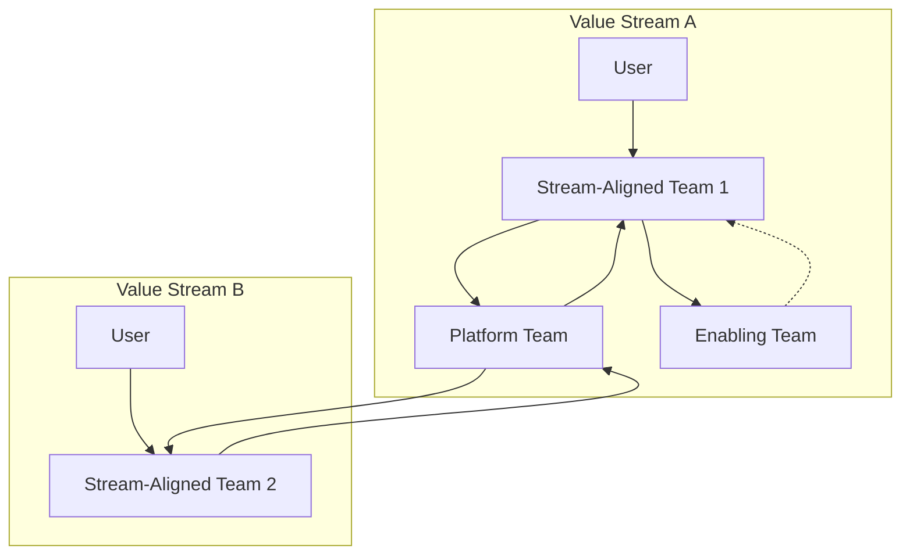

### 1. Context

Every organization, whether a startup, a multinational corporation, a government agency, or a community movement, has a structure. This structure dictates how information flows, how decisions are made, and ultimately, how work gets done. As the computer scientist Melvin Conway observed in 1968, organizations are destined to produce designs which are copies of their communication structures. This principle, now known as Conway's Law, highlights a critical reality: organizational structure is not a passive administrative detail but an active force that shapes outcomes. Yet, for many organizations, the existing structure is not a product of deliberate, strategic design. Instead, it is often the result of historical precedent, past acquisitions, political compromises, or incremental changes that have accumulated over time. This accidental architecture frequently creates friction, misalignments, and inefficiencies that hinder the organization’s ability to achieve its purpose and adapt to a changing environment. It becomes a brittle skeleton, lacking the living tissue required to sense and respond to reality.

### 2. Problem

> **The core conflict is Structural Efficiency vs. Adaptive Capacity.**

Designing an effective organization requires navigating a series of fundamental tensions between the need for predictable, efficient execution and the ability to learn, adapt, and innovate.

-   **Force 1: Specialization vs. Integration.** Deep functional expertise is crucial for quality and efficiency, representing the specialized cells of the organizational body. Grouping specialists together in functional departments (e.g., engineering, marketing, finance) creates centers of excellence and clear career paths. However, this specialization often leads to silos, where communication breaks down, handoffs are slow, and no one has a holistic view of the value being delivered to the end user. Cross-functional teams, on the other hand, promote integration and a shared focus on outcomes but can dilute specialized knowledge and create a sense of professional isolation.
-   **Force 2: Stability vs. Agility.** Stable structures, with clearly defined roles and reporting lines, provide clarity, reduce ambiguity, and enable efficient, repeatable processes. They create a predictable environment where work can be planned and executed with precision. However, this very stability can become a source of rigidity, making the organization slow to respond to market shifts, new technologies, or emerging opportunities. Fluid, dynamic structures can adapt quickly, like a system in constant flux, but often at the cost of stability, leading to confusion about roles, a lack of clear accountability, and a constant state of reorganization that exhausts the participants.
-   **Force 3: Local Autonomy vs. Global Coherence.** Empowering teams with high degrees of autonomy allows them to move quickly, make decisions close to the information, and tailor their approach to their specific context. This fosters ownership, motivation, and rapid learning. However, too much autonomy can lead to strategic drift, where different parts of the organization pull in different directions, standards diverge, and redundant efforts proliferate. Centralized coordination and control can ensure global coherence and alignment with overall strategy, acting as a central nervous system, but this often comes at the expense of local speed, initiative, and the ability to respond to unique local conditions, dampening the life at the edges.

### 3. Solution

> **Therefore, design the organizational structure as a dynamic function of its value streams and required capabilities, applying polycentric and fractal principles to balance autonomy with coherence.**

Instead of starting with a traditional, hierarchical org chart, this pattern begins with the flow of value to the customer or stakeholder. The primary principle is to structure the organization to support these value streams as directly as possible, a concept often called the "Inverse Conway Maneuver." The goal is to design the organization you *need* to produce the system architecture you *want*, creating a structure that breathes with the rhythm of its value streams.

This involves mapping out the key value streams and identifying the capabilities required to deliver them. The organization is then composed of teams that are aligned with these streams. This approach, popularized by models like Team Topologies, suggests different team types:

*   **Stream-Aligned Teams:** Cross-functional teams with end-to-end responsibility for a specific value stream (e.g., a product, a service, a user journey).
*   **Platform Teams:** Teams that provide a foundation of self-service tools and services (e.g., infrastructure, deployment pipelines, data platforms) that enable stream-aligned teams to work with high autonomy.
*   **Enabling Teams:** Teams of specialists that help stream-aligned teams acquire missing capabilities (e.g., a team of security experts who coach other teams on secure coding practices).

To balance autonomy and coherence, the solution employs polycentric governance, where there are multiple centers of decision-making authority, and fractal principles, where the same structural patterns repeat at different scales. This creates a network of interconnected, semi-autonomous teams that can sense and respond to their local environment while remaining aligned with the organization's overall purpose.

### 4. Implementation

1.  **Identify and Map Value Streams:** Begin by identifying the primary ways your organization creates, delivers, and captures value for its customers or stakeholders. For each stream, map the sequence of activities from trigger to fulfillment. This process often reveals how convoluted and fragmented the current workflow is.
2.  **Analyze Current Structure and Communication Paths:** Overlay your current organizational chart onto the value stream maps. Where do the value streams cross departmental boundaries? Where are the delays, handoffs, and communication bottlenecks? Use this analysis to pinpoint the key sources of friction.
3.  **Design Target Team Structures:** Based on the value stream analysis, design a new structure using team patterns like those from Team Topologies. Define the mission and domain for each stream-aligned team. Identify the need for platform teams to reduce the cognitive load on stream-aligned teams and enabling teams to fill capability gaps.
4.  **Define Interaction Modes:** Clearly define how the different teams will interact. Will an enabling team collaborate closely with a stream-aligned team for a period, or will they provide services as a consultant? Clarifying these interaction modes prevents confusion and ensures smooth collaboration.
5.  **Establish Polycentric Governance:** Design governance structures that balance local autonomy with global coherence. This might involve creating "guilds" or "chapters" for specialists from different teams to share best practices and maintain standards. It also involves establishing clear mandates and decision rights for each circle or team, allowing them to operate autonomously within their defined domain.
6.  **Iterate and Evolve:** Organizational design is not a one-time event. The structure must be treated as a living system that is continuously reviewed and adapted as the organization's strategy, capabilities, and environment change. Create feedback loops to regularly assess the effectiveness of the current design, allowing the organization to learn and metabolize its experiences.

**Common Pitfalls:**
*   **Big-Bang Reorganization:** Attempting to change the entire organizational structure overnight is highly disruptive and often fails. Instead, apply the changes iteratively, starting with a single, well-understood value stream.
*   **Ignoring the Informal Structure:** The formal org chart is only part of the story. The informal social networks and communities of practice are where much of the real work happens. A successful redesign must acknowledge and leverage these informal structures.
*   **Cargo Culting:** Blindly copying the organizational model of a successful company (like the "Spotify Model") without understanding the underlying principles and adapting them to your own context is a recipe for disaster.

### 5. Consequences

**Benefits:**
*   **Increased Flow and Speed:** By aligning teams with value streams, the number of handoffs and dependencies is dramatically reduced, leading to faster delivery cycles and quicker feedback.
*   **Clearer Accountability and Ownership:** End-to-end ownership of a value stream gives teams a clear sense of purpose and accountability for the outcomes they produce.
*   **ImImproved Adaptability: A modular, team-based structure allows the organization to more easily adapt to change by adding, removing, or reconfiguring teams as needed. The whole system begins to feel more alive and responsive, capable of healing and evolving.

**Liabilities:**
*   **Reorganization Costs:** The process of redesigning an organization is inherently disruptive and can lead to a temporary drop in productivity, anxiety among employees, and the loss of key talent.
*   **Power Structure Conflicts:** A shift from a functional hierarchy to a value stream-oriented network can threaten existing power structures and meet with resistance from middle managers whose roles may be significantly altered or eliminated.
*   **Risk of Fragmentation:** Without strong alignment mechanisms (like guilds and clear strategic direction), autonomous teams can become disconnected from the whole, leading to a fragmented user experience and duplicated effort.

**When NOT to use this pattern:**
*   In very small, early-stage startups where the informal communication structure is sufficient and the overhead of formal design is unnecessary.
*   In highly stable, predictable environments where the primary driver is efficiency and the need for adaptation is low. In such cases, a traditional functional hierarchy may be more efficient.
*   When the cost and disruption of the reorganization clearly outweigh the potential benefits of improved flow and adaptability.

### 6. Known Uses

*   **Spotify (Music Streaming):** The famous "Spotify Model" (though Spotify itself has moved on) is a well-known example of organizing in squads, tribes, chapters, and guilds. This polycentric structure was designed to foster autonomy and innovation in small, self-organizing "squads" (akin to stream-aligned teams) while maintaining alignment and knowledge sharing through "chapters" (for functional expertise) and "guilds" (for communities of interest). The outcome was a culture of high autonomy and rapid innovation, though the company later found it needed to introduce more structure to manage dependencies at scale.
*   **Buurtzorg (Healthcare):** This Dutch home-care organization revolutionized community nursing by replacing a traditional, bureaucratic management structure with a network of over 900 self-managing teams of 10-12 nurses. Each team operates with a high degree of autonomy within its own neighborhood, handling everything from patient care to administration. A small central office provides back-end support, and coaches help the teams with their internal processes. The result has been dramatically lower costs, higher patient satisfaction, and industry-leading employee engagement.
*   **Zappos (E-commerce):** In 2014, the online shoe retailer Zappos famously adopted Holacracy, a comprehensive system for self-management that replaces the traditional management hierarchy with a nested structure of "circles." Authority is distributed to roles rather than individuals, and governance is an explicit, iterative process within each circle. While the transition was challenging and led to significant employee turnover, the company embraced it as a way to combat bureaucracy and empower employees to take initiative, aiming to structure the company more like a city than a top-down bureaucracy, giving it a soul that top-down structures often lack.

### 7. Cognitive Era Considerations

The rise of AI and autonomous agents introduces a new and powerful set of forces that will fundamentally reshape organizational design. The principles of this pattern remain relevant, but their application must be extended to a hybrid workforce of humans and AI.

*   **Human-Agent Teaming:** The concept of a "team" will expand to include AI agents as core members. Organization design must explicitly model the interaction patterns between humans and agents. This includes defining roles and responsibilities for agents, establishing protocols for human-agent communication, and designing escalation paths for when an agent encounters a situation it cannot handle. Team Topologies can be extended to include "Agent-as-a-Service" teams or specialized "Centaur" (human-AI hybrid) teams.
*   **Automated Governance and Coordination:** AI can automate many of the coordination and governance functions that currently consume significant management overhead. Agents can monitor team performance against goals, allocate resources dynamically, identify dependencies between teams, and even facilitate governance meetings by proposing changes based on observed data. This allows the organization to become more fluid and responsive, adapting its structure in near real-time.
*   **New Risks and Failure Modes:** Integrating AI agents into the organizational structure introduces new risks. Algorithmic bias can become embedded in decision-making processes, accountability becomes complex when an autonomous agent causes an error, and the security of the organization depends on the robustness of its AI systems. The design must include new roles and processes for AI ethics, auditing, and safety.
*   **The Role of Human Judgment:** As AI automates routine tasks and decisions, the value of human contribution will shift towards tasks that require deep expertise, complex ethical reasoning, and creative problem-solving. The organizational structure must be designed to empower these uniquely human capabilities, creating spaces for deep work, creative collaboration, and strategic foresight, rather than optimizing for the efficiency of automatable processes. This ensures that the organization's heart remains human, even as its functions become increasingly automated.
_**

### 8. Vitality: The Quality Without a Name

When an organization’s design is truly vital, it feels less like a machine and more like a living ecosystem. There is a palpable sense of wholeness and flow. Practitioners feel a sense of agency and belonging, understanding how their work contributes to the larger purpose. Information moves freely, like nutrients through a healthy organism, reaching the places where it is most needed. When faced with the unexpected—a market shift, a new technology, a sudden crisis—the system doesn’t break; it adapts. New connections form, teams reconfigure, and novel solutions emerge from the creative interplay of autonomous parts. The organization breathes. There is a lightness to the structure, a feeling that it is enabling, not constraining, the life within it. You can sense this vitality in the quality of conversations, the speed of learning, and the capacity for renewal.

Decay, in contrast, manifests as a growing rigidity and fragmentation. The structure becomes a cage. Communication channels harden into bureaucratic procedures, and information flows become sluggish and distorted. Practitioners feel like cogs in a machine, their agency diminished, their work disconnected from any meaningful outcome. The organization develops a kind of institutional arthritis, where every change is painful and slow. Early warning signals include a rise in cynicism, an increase in cross-team friction, and a tendency to blame individuals for systemic failures. The organization loses its living memory, becoming a ghost in the machine, executing its programmed routines with no capacity for genuine response. It is a void where the system’s soul should be, a slow descent into irrelevance as the world changes around it.**_
