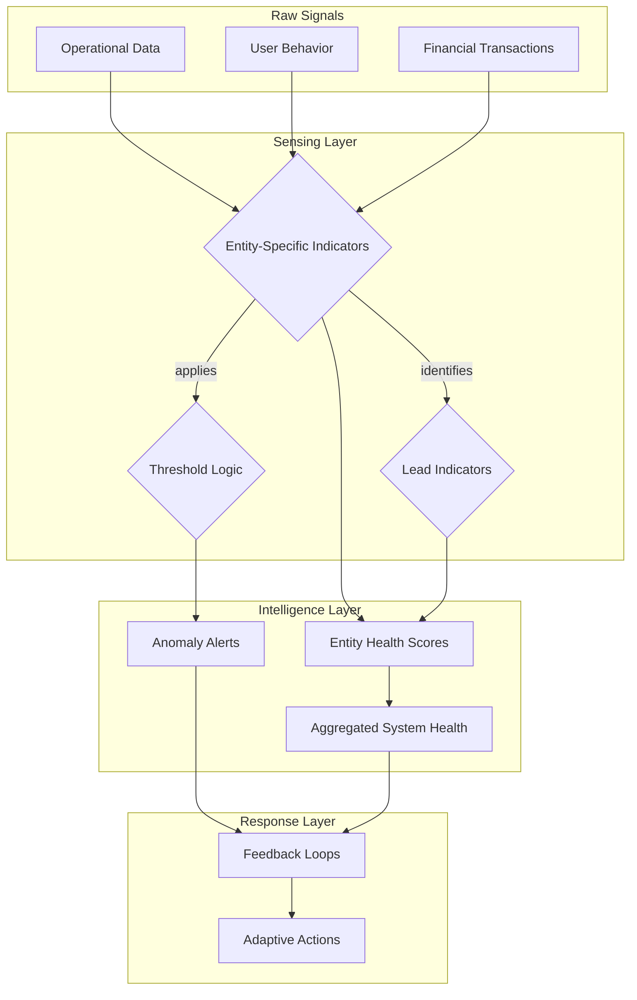

> A pattern for specifying what a living system must perceive about its own internal state: which metrics matter for each entity type, what are lead vs. lag indicators, what thresholds distinguish normal variation from signal, and how health scores are computed.

### 1. Context

Any living system, whether a business, a city, or a software application, is in a constant state of flux. Its components—capabilities, value streams, teams, and stakeholder relationships—are dynamic, their health and performance changing over time. In traditionally managed systems, sensing this state is often an informal, intuitive practice. An experienced manager 'feels' that a project is drifting off course; a community organizer notices a subtle drop in volunteer engagement. While valuable, this artisanal approach is not scalable, repeatable, or sufficient for the complexity of modern enterprises. It creates blind spots and delays recognition of critical issues. To effectively navigate complexity and adapt to change, a system requires a more deliberate and explicit method of self-perception. It needs to know, in near real-time, how it is performing against its own definition of success, not just as a whole, but in all its constituent parts. This need for systematic awareness is the foundational context for Performance Sensing.

### 2. Problem

> **The core conflict is Comprehensiveness vs. Signal Clarity.**

Without a structured approach to sensing, a system is flying blind, unable to distinguish between meaningful trends and random noise. This leads to reactive, crisis-driven management. However, the attempt to resolve this blindness creates a powerful set of tensions that must be carefully balanced.

1.  **Measure Everything vs. Dashboard Blindness:** The fear of missing a critical signal can lead to an impulse to measure everything possible. This creates a data deluge, where dozens or hundreds of metrics compete for attention. The result is dashboard blindness—a state of information overload where decision-makers, overwhelmed by noise, can no longer identify the true signals that require action. The most important indicators become needles in a haystack of irrelevant data.

2.  **Leading vs. Lagging Indicators:** Lagging indicators (e.g., quarterly revenue, customer churn, system downtime) are easy to measure but only confirm what has already happened. They are historical facts. Leading indicators (e.g., sales pipeline velocity, user engagement trends, rising code complexity) are predictive and offer a chance to act before problems fully manifest. However, they are often harder to define, more complex to measure, and represent hypotheses about the future rather than certainties about the past.

3.  **Local Optimization vs. Global Health:** Each part of the system has its own performance criteria. A development team might optimize for velocity, while a finance team optimizes for cost control. If these local metrics are not balanced within a holistic view, they can work at cross-purposes, leading to a situation where individual components appear healthy while the overall system's value delivery falters. The sensing framework must resolve the tension between optimizing the parts and ensuring the health of the whole.

### 3. Solution

> **Therefore, for each primary entity type in the system's architecture, define a balanced set of health indicators, lead indicators, and threshold logic, then specify how these metrics aggregate to provide a holistic view of system performance.**

This pattern establishes a formal, multi-layered sensing capability that treats system observability as a first-class design concern. It moves beyond informal monitoring to an explicit specification of what the system needs to know about itself to survive and thrive. The core of the solution is to create a specific, curated set of metrics for each key entity, resisting the temptation to create a uniform, one-size-fits-all dashboard.

The mechanism involves several layers:

*   **Entity-Specific Health Indicators:** For each core entity type (e.g., Value Streams, Capabilities, Stakeholders, Solutions), define the minimum set of 5-7 metrics that collectively describe its operational health. This curated set acts as a filter against noise.
    *   *Value Streams:* Measure flow—throughput, cycle time, quality/rework rate, and cost per transaction.
    *   *Capabilities:* Measure readiness—maturity level, utilization rate, skill gap index, and technology currency.
    *   *Stakeholders:* Measure engagement—satisfaction scores (NPS/CSAT), journey completion rates, and churn/retention indicators.
*   **Lead Indicator Identification:** For each entity, identify 1-2 forward-looking metrics that serve as early warning signals. This requires deep domain expertise to hypothesize what predicts future outcomes (e.g., a decline in developer-to-code-review ratio might predict a future rise in bugs).
*   **Threshold Logic and Anomaly Detection:** For each indicator, define what constitutes normal variation versus a significant signal. This involves setting clear green, amber, and red thresholds that, when crossed, trigger specific feedback loops or alerts. This logic is what allows agents and humans to separate noise from actionable information.
*   **Health Score Computation & Aggregation:** Specify how the individual indicators for an entity combine into a single, computable health score (e.g., via a weighted average or a 'weakest link' model). Then, define rules for how these entity-level scores roll up into higher-level views, providing a fractal understanding of health from the smallest component to the entire system.

### 4. Implementation

Implementing a Performance Sensing strategy is an iterative process of discovery and refinement. It should not be a one-time, big-bang project. Follow these steps to build a robust sensing capability.

1.  **Identify Core Entities:** Begin by identifying the most critical entity types in your system's architecture. Don't try to model everything at once. Start with one or two key Value Streams and the Capabilities that support them.

2.  **Workshop Health Indicators:** For each selected entity, run a workshop with domain experts. Ask the question: "If we could only look at 5-7 metrics to know if this entity is healthy and effective, what would they be?" Force prioritization to distill the essence of performance. This is the most critical step for achieving signal clarity.

3.  **Define Indicator Specifications:** For each chosen indicator, create a detailed specification. This must include:
    *   **Data Source:** The precise system, database, or API where the raw data originates.
    *   **Measurement Frequency:** How often the metric is calculated (e.g., real-time, hourly, daily).
    *   **Thresholds:** The specific values that define Green (healthy), Amber (warning), and Red (critical) states.
    *   **Owner:** The team or role responsible for the accuracy and availability of the metric.

4.  **Hypothesize Lead Indicators:** This is more art than science. Based on the health indicators, ask "What observable events or trends precede a negative change in this health metric?" For example, if customer satisfaction is a health indicator, a rise in customer support ticket volume might be a lead indicator. Document these as hypotheses to be validated.

5.  **Design Health Score Logic:** Determine how the set of indicators will combine into a single health score for an entity. A weighted average is simple, but a "worst-of" model (where the score is determined by the worst-performing indicator) can be more effective at highlighting immediate problems.

6.  **Instrument and Automate:** Implement the data pipelines and dashboards to automate the collection, calculation, and visualization of the specified metrics and health scores. This is where tools like Datadog, New Relic, or custom BI dashboards come into play.

7.  **Connect to Feedback Loops:** The purpose of sensing is to trigger action. Connect the threshold crossings (especially Amber and Red states) to specific feedback loops. An Amber alert might trigger a team-level review, while a Red alert could trigger an automated rollback or a senior management incident response.

**Common Pitfalls:**
*   **Vanity Metrics:** Avoid metrics that look good but don't reflect the underlying value being created (e.g., 'number of registered users' instead of 'number of weekly active users').
*   **Analysis Paralysis:** Don't wait for the perfect set of metrics. Start with a good-enough set and refine it based on real-world experience. The map is not the territory.
*   **Ignoring Goodhart's Law:** Remember that when a measure becomes a target, it ceases to be a good measure. People will optimize for the metric itself, potentially gaming the system. Periodically review and evolve your indicators to ensure they still reflect true performance.

### 5. Consequences

**Benefits:**
*   **Early Warning System:** A well-designed sensing system, especially its lead indicators, provides an early warning of impending problems, allowing for proactive intervention rather than reactive firefighting.
*   **Objective Decision-Making:** It replaces subjective opinion and political debate with objective, shared data, leading to faster and more effective decision-making about where to invest resources and attention.
*   **Scalable Governance:** It enables governance at scale. Instead of micro-managing teams, leaders can manage by exception, focusing only on the parts of the system that are showing signs of distress, as indicated by their health scores.
*   **Enhanced Adaptability:** By providing continuous feedback on the system's state, performance sensing is a prerequisite for organizational agility and resilience, allowing the system to adapt to a changing environment.

**Liabilities:**
*   **The Illusion of Control:** A sophisticated dashboard can create a false sense of certainty and control. Metrics are a simplified model of reality, not reality itself. Over-reliance on the numbers can lead to a failure to see qualitative, contextual shifts that are not yet captured in the data.
*   **Maintenance Overhead:** A sensing system is not static. As the underlying business or system evolves, the metrics must be reviewed and updated. Neglecting this leads to 'metric debt,' where the organization is tracking and responding to obsolete signals.

**When NOT to use this pattern:**
*   In a very early-stage, pre-product-market-fit startup or project. In this phase, the system is so fluid that a formal sensing architecture is premature. The focus should be on qualitative feedback and rapid iteration, not stable metrics. First, discover what works, then build the system to measure and scale it.

### 6. Known Uses

1.  **Software & IT Operations (Observability):** The modern tech industry has heavily adopted this pattern under the name "Observability." Platforms like **Datadog, New Relic, and Honeycomb** are built entirely around this concept. They integrate the "three pillars"—metrics, logs, and traces—to provide a comprehensive view of application and infrastructure performance. For example, a company like **Netflix** uses sophisticated, real-time observability to monitor thousands of microservices. When a user experiences a streaming issue, engineers can trace the request through the entire system, pinpointing the exact service causing the bottleneck by analyzing its health indicators (latency, error rate, etc.). This allows them to resolve issues before they become widespread outages.

2.  **Corporate Strategy (Balanced Scorecard):** The Balanced Scorecard, developed by Kaplan and Norton, is a direct application of this pattern to corporate governance. Instead of focusing solely on financial metrics (lagging indicators), it specifies a balanced set of indicators across four perspectives: Financial, Customer, Internal Business Processes, and Learning & Growth. A company like **Apple** uses a form of this, not just tracking iPhone sales (financial) but also customer satisfaction via NPS (customer), supply chain efficiency (process), and employee skills in new technologies (learning). This gives them a holistic view of their long-term health, not just their quarterly profits.

3.  **Activist & Non-Profit Sector (Impact Assessment):** Non-profits and advocacy groups use this pattern to measure their progress toward a social mission, often called a "Theory of Change." An organization like **350.org**, which campaigns for climate action, doesn't just track donations. They sense their performance through lead indicators like the number of local volunteer groups established, social media engagement on their campaigns, and mentions in policy debates. These metrics provide an early signal of whether their strategies are gaining traction and influencing the public conversation, long before they can measure the ultimate lagging indicator of a reduction in global carbon emissions.

### 7. Cognitive Era Considerations

The arrival of AI and autonomous agents fundamentally transforms the scope and power of the Performance Sensing pattern. What was once a human-centric process of review and analysis becomes a continuous, machine-driven cycle of sensing, interpretation, and action.

*   **Hyper-dimensional Sensing:** Human teams are limited to tracking a few dozen key indicators. An AI-powered sensing system can monitor thousands of metrics in real-time. It can see beyond pre-defined dashboards and detect complex, multi-variate correlations that are invisible to humans. For example, an AI could discover that a slight increase in API latency in one microservice, combined with a specific user behavior pattern in a mobile app, is a powerful lead indicator for future customer churn.

*   **Automated Root Cause Analysis:** When a problem is detected, AI agents can automatically perform the initial root cause analysis. By correlating the anomaly with concurrent events, code deployments, and configuration changes across the entire system, the agent can present human operators not just with an alert, but with a high-confidence hypothesis about the cause, complete with all the supporting data. This dramatically reduces the mean time to resolution (MTTR).

*   **From Sensing to Action:** The most significant shift is the closing of the loop. In traditional systems, sensing leads to a human decision. In the cognitive era, sensing can trigger autonomous action. For example, if an AI-driven performance sensing system detects that a new feature deployment is degrading system health (e.g., increasing error rates), it could automatically initiate a rollback to the previous stable version without human intervention. The human role shifts from being in the loop to being on the loop—governing the rules and goals of the autonomous system.

*   **New Risks:** This power introduces new risks. An AI optimizing for a flawed set of metrics could take autonomous actions that are detrimental to the overall system's purpose (a more advanced form of Goodhart's Law). The specification of what to sense, and especially the goals and constraints given to the AI agents that act on those senses, becomes a point of extreme leverage and critical risk. Human judgment is still required for the highest-level task of defining what 'good performance' actually means. The specification is no longer just a guide for humans; it is the instruction set for the machine.
