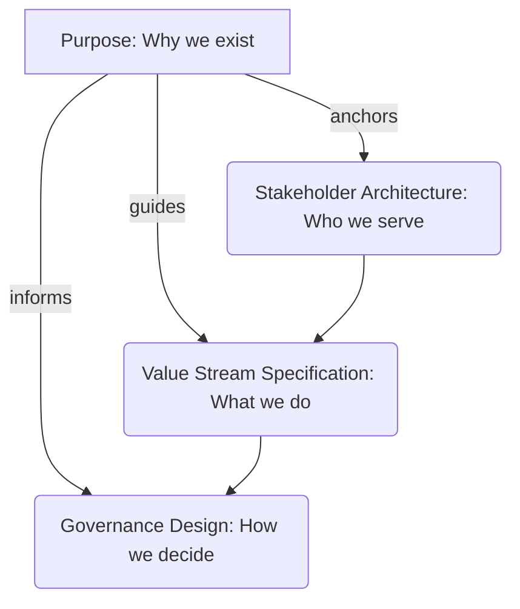

### 1. Context

Every value creation system, whether a multinational corporation, a city government, or a grassroots community project, exists for a reason. It is designed to serve a specific set of stakeholders by creating particular forms of value. However, as organizations grow and evolve, this foundational purpose often becomes obscured. The clarity of the original mission is diluted by operational complexity, competing departmental priorities, institutional inertia, and the simple passage of time. Strategy documents proliferate, but the core \'why\' gets buried under layers of \'what\' and \'how.\' This isn\'t merely a branding or messaging issue. When the fundamental purpose is unclear, every significant architectural decision—which capabilities to invest in, which value streams to prioritize, which stakeholders to serve first, how to structure governance—becomes a political negotiation rather than a principled choice. The system loses its anchor, making it susceptible to drift, internal conflict, and a gradual loss of relevance. The absence of a clear, shared purpose creates a vacuum that is often filled by proxy goals, such as maximizing profit or simply maintaining bureaucratic stability, which may not align with the system\'s original intent or the needs of its stakeholders.

### 2. Problem

> **The core conflict is Organizational Drift vs. Existential Clarity.**

An organization without a sharply defined and actively used purpose is like a ship without a rudder, vulnerable to the prevailing winds of market trends, internal politics, and short-term pressures. This leads to a set of fundamental tensions that undermine long-term value creation and resilience.

1.  **Force 1: Simplicity vs. Completeness.** A purpose must be simple enough to be remembered, repeated, and used as a daily mantra. It needs to be a cognitive shortcut that guides immediate action. However, it must also be complete enough to offer meaningful guidance for complex strategic trade-offs. A purpose like \"maximize shareholder value\" is simple but provides no architectural direction and fails to address the multi-stakeholder reality of any commons. Conversely, a 20-page purpose document might be comprehensive but is too unwieldy to be a practical tool for decision-making.

2.  **Force 2: Stability vs. Evolution.** The purpose should serve as a stable anchor, providing a consistent identity and direction over the long term. It must be resilient to leadership changes and market fluctuations. Yet, the purpose cannot be so rigid that it prevents the organization from adapting to a changing world. The environment, stakeholder needs, and technological possibilities all evolve. A purpose defined in 1980 may be dangerously out of touch by 2030 if it hasn\'t been allowed to breathe and evolve with the context.

3.  **Force 3: Aspiration vs. Reality.** A powerful purpose is aspirational; it inspires people to strive for something more and stretches the organization\'s capabilities. It paints a picture of a better future that the system is helping to create. However, if this aspiration is completely disconnected from the organization\'s actual operations, capabilities, and culture, it breeds cynicism and disillusionment. Employees and stakeholders quickly spot the hypocrisy when a lofty stated purpose is consistently contradicted by daily actions and resource allocation.

4.  **Force 4: Internal Focus vs. External Relevance.** The purpose must resonate internally, creating a shared identity and fostering cohesion. But it must also be externally focused, defining the system\'s unique value proposition to the wider world. An overly inward-looking purpose can lead to a self-referential organization that is disconnected from the needs of its users, customers, and the broader ecosystem it is part of.

### 3. Solution

> **Therefore, define purpose as the intersection of what the system uniquely enables, who it serves, and why that matters—then embed it as the root node of all architectural and strategic decisions.**

Purpose Definition is not a one-time exercise in crafting a clever mission statement for the lobby wall. It is the continuous practice of maintaining existential clarity and using that clarity as the primary design principle for the entire value creation system. The purpose statement itself is merely the artifact; the real solution is the process of using it to drive coherence and alignment.

A well-defined purpose acts as the ultimate arbiter in decision-making. It becomes the root entity in the system\'s architecture, meaning every capability, every value stream, every governance rule, and every stakeholder relationship should be able to trace its lineage directly back to the purpose. If a proposed project or existing component cannot demonstrate its contribution to the purpose, it is a candidate for elimination or redesign. This creates a powerful filter for complexity and a defense against strategic drift.

A well-defined purpose must have three key properties:

*   **Falsifiable:** You must be able to determine whether a given action or decision serves the purpose or detracts from it. It must create clear constraints. A purpose like \"to be the best\" is not falsifiable. A purpose like \"to provide affordable, renewable energy to off-grid communities\" is.
*   **Stakeholder-Referenced:** It must explicitly or implicitly name the key stakeholders the system exists to serve. This moves beyond abstract goals and grounds the purpose in the real-world needs of specific groups of people or entities.
*   **Value-Explicit:** It must be clear about the primary forms of value the system intends to create. This provides the basis for defining and measuring success beyond purely financial metrics.

This diagram illustrates how Purpose serves as the foundational element from which all other primary architectural components of a commons are derived. It is the ultimate source of truth for the system\'s design.

### 4. Implementation

Implementing Purpose Definition as a living architectural practice requires a structured and iterative approach. It is not a linear process but a cycle of articulation, testing, and embedding.

1.  **Convene the Core Stakeholders:** Begin by identifying and bringing together a representative group of the system\'s core stakeholders. This must include not just founders or executives, but also users, partners, community members, and even critics. The goal is to capture the full spectrum of perspectives on the system\'s role and impact.

2.  **Articulate Stakeholder Value:** For each stakeholder group, facilitate a deep inquiry into the value they receive from or contribute to the system. Use appreciative inquiry methods, asking questions like: \"When has this organization been at its absolute best for you? What was happening?\" and \"What is the most important need that this system helps you meet?\" Capture the answers as specific value statements.

3.  **Synthesize the Unique Intersection (The \'Why\'):** Analyze the collected value statements to find the common thread. The goal is to identify the unique, core contribution that only this system, with its specific configuration of people, resources, and capabilities, can make. This synthesis is the heart of the purpose. It should answer three questions: What do we do? Who do we do it for? Why does it matter?

4.  **Draft the Purpose Statement:** Based on the synthesis, draft a concise and powerful purpose statement. It should be memorable, inspiring, and, most importantly, actionable. Test several variations. Avoid jargon and corporate-speak. The language should be clear, direct, and authentic to the organization\'s culture.

5.  **Stress-Test the Purpose:** Do not publish the purpose yet. First, test it against reality. Apply it to 3-5 significant strategic decisions from the past year. Would the drafted purpose have clarified the decision-making process? Would it have led to a different, better outcome? Also, test it against 2-3 future scenarios. Does it provide a useful guide for navigating potential challenges and opportunities? Refine the statement based on these tests.

6.  **Embed as the Architectural Root:** Once finalized, the purpose must be formally integrated into the system\'s architecture. Make it the root object in your knowledge base or system model (like the Commons Blueprint). Explicitly link all major components—value propositions, capabilities, governance structures—back to it. Every new proposal must include a section explaining how it serves the purpose.

7.  **Establish a Review Cadence:** Purpose is not static. It needs to be revisited and reaffirmed regularly. Establish a formal cadence for review—typically annually, or whenever the system undergoes a fundamental change (e.g., a merger, a major market shift, a change in core technology). This is not an opportunity to rewrite it on a whim, but to ensure it remains a relevant and living guide.

**Common Pitfalls:**
*   **Confusing Purpose with Vision or Mission:** A mission is *what* you do, a vision is *where* you are going, but a purpose is *why* you exist. They are related but distinct. Purpose is the most foundational.
*   **Purpose by Committee:** While the process should be inclusive, the final wordsmithing should not be done by a large committee, which often leads to a bland, lowest-common-denominator statement.
*   **Treating it as a Marketing Slogan:** If the purpose is not used to make hard decisions about resources, strategy, and personnel, it is not an architectural element; it is just decoration.

### 5. Consequences

**Benefits:**
*   **Strategic Coherence:** When all decisions are anchored to a single, stable purpose, the entire system gains coherence. Actions across different departments and teams become naturally aligned, reducing internal friction and wasted effort.
*   **Enhanced Resilience:** A strong sense of purpose allows a system to navigate crises and external shocks without losing its identity. It provides a clear filter for distinguishing between critical threats and mere distractions.
*   **Increased Stakeholder Engagement:** A purpose that resonates with stakeholders (employees, customers, partners) fosters a deeper level of commitment than purely transactional relationships. People are more likely to contribute their best work and remain loyal to an organization they believe in.
*   **Simplified Governance:** A clear purpose reduces the need for an exhaustive book of rules. It empowers individuals and teams to make autonomous, decentralized decisions that are aligned with the collective intent.

**Liabilities:**
*   **Constraining Innovation:** If interpreted too rigidly, a purpose can blind an organization to emergent opportunities that fall outside its current definition. The review process is critical to prevent the purpose from becoming a golden cage.
*   **The Risk of a \'Bad\' Purpose:** A poorly defined purpose—one that is too broad, too narrow, or not authentic—is worse than none at all. It can actively mislead the organization, justify harmful actions, or create a veneer of legitimacy for a dysfunctional system.
*   **Weaponization of Purpose:** In a toxic culture, a purpose statement can be weaponized by leadership to demand sacrifices from employees or justify unethical decisions, all under the guise of serving a higher cause.

**When NOT to use this pattern:**
*   **Early-Stage Discovery:** For a brand-new startup or project that is still in the process of finding its product-market fit or reason for being. In this phase, the primary goal is exploration and learning, and a prematurely defined purpose can be a hindrance. Use patterns like Lean Startup or Customer Discovery first.
*   **Deeply Contested Systems:** In situations where fundamental political or ideological conflicts exist among core stakeholders, attempting to define a single purpose can be impossible and counterproductive. In such cases, it may be more effective to focus on defining clear rules of engagement and negotiation rather than a shared purpose.

### 6. Known Uses

1.  **Patagonia, Inc.:** The outdoor apparel company famously updated its purpose to \"We\\'re in business to save our home planet.\" This is not just a slogan. It directly drives their business architecture. It led to the creation of their Worn Wear program (a value stream focused on repair and reuse), their investment in regenerative organic agriculture (a capability to build a more sustainable supply chain), and their decision to donate 1% of sales to environmental nonprofits. In 2022, the founder transferred ownership of the company to a trust and a nonprofit organization, ensuring that all future profits are used to combat climate change, making the purpose legally and structurally permanent.

2.  **The B-Corp Movement:** The entire B-Corp certification framework is a manifestation of the Purpose Definition pattern. To become a certified B-Corporation, a company must legally amend its articles of incorporation to state that it exists to create a material positive impact on society and the environment, alongside generating profit. This legally requires directors to consider the impact of their decisions on all stakeholders, not just shareholders. Companies like Kickstarter, a Public Benefit Corporation, have a purpose of \"helping bring creative projects to life,\" which guides their platform rules, fee structures, and refusal to maximize revenue through advertising.

3.  **Wikipedia / Wikimedia Foundation:** The purpose of Wikipedia is to \"build a free, multilingual encyclopedia, to which everyone can contribute.\" This purpose is the root of its entire architecture. It dictates the choice of a wiki platform (technology), the Creative Commons license (governance), the neutral point-of-view policy (content governance), and the global community of volunteer editors (stakeholder architecture). Every decision, from server infrastructure to fundraising campaigns, is tested against this core purpose of providing free access to knowledge.

4.  **Mondragon Corporation:** This federation of worker cooperatives in Spain operates under a purpose rooted in Basque Catholic social teaching, emphasizing the primacy of labor over capital and democratic self-governance. Their purpose is not just to produce goods and services but to create sustainable, dignified employment for its member-owners. This purpose directly shapes their governance (one worker, one vote), their compensation structures (a collectively agreed-upon ratio between the highest and lowest paid), and their commitment to regional development. The purpose has enabled Mondragon to survive and thrive for over 60 years, navigating economic crises while maintaining its social mission.

### 7. Cognitive Era Considerations

The rise of AI and autonomous agents profoundly impacts the Purpose Definition pattern, transforming it from a purely human-centric process into a human-machine collaborative one. It introduces new capabilities for diagnostics, alignment, and risk management.

*   **AI for Purpose Diagnostics:** AI agents can be tasked with analyzing an organization\'s entire digital exhaust—internal communications (Slack, email), public statements, financial reports, and operational data. By using natural language processing and machine learning, these agents can infer the *revealed purpose*—what the organization actually optimizes for—versus its *stated purpose*. Presenting this gap analysis to leadership can be a powerful catalyst for a more honest and effective purpose definition process. An agent could report, \"While our stated purpose is customer-centricity, 87% of our resource allocation decisions in the last quarter prioritized short-term revenue targets over customer experience improvements.\"

*   **Purpose as the Alignment Target for AI:** As AI agents become more integrated into operations, the organization\'s purpose becomes the ultimate alignment target. An AI agent tasked with optimizing a supply chain, if not properly aligned, might do so by cutting corners on quality or exploiting suppliers. However, if its core objective function includes the organization\'s full purpose (e.g., \"to deliver high-quality, ethically sourced products\"), its optimization strategies will be constrained by those values. The purpose becomes a programmable and enforceable set of ethics for the organization\'s non-human workforce.

*   **Automated Alignment Monitoring:** Agents can continuously monitor the organization\'s actions and decisions for drift from the core purpose. They can flag projects that are not contributing, alert leaders to misaligned resource allocations, and even predict potential purpose-conflicts in future strategic scenarios. This transforms the annual purpose review from a static, manual process into a dynamic, real-time feedback loop.

*   **New Risks: Algorithmic Misinterpretation and Value Lock-in:** The primary new risk is algorithmic misinterpretation. An AI might interpret a nuanced purpose in a literal and brittle way, leading to unintended negative consequences. For example, a purpose of \"connecting people\" could be optimized by an AI creating an addictive but socially isolating application. Furthermore, embedding a purpose too rigidly into autonomous systems could lead to \"value lock-in,\" making it extremely difficult for the organization to evolve its purpose as the context changes. The AI systems would resist any deviation from their original, hard-coded instructions. Therefore, human oversight and the ability to update and refine the purpose for both human and machine agents remain critically important.
