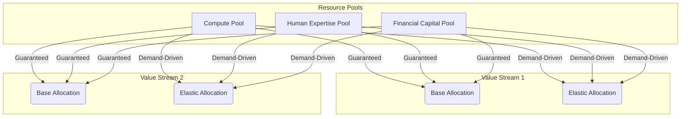

### 1. Context

In any system striving to create value, from a bustling city government to a distributed software application, the fundamental challenge of resource scarcity is ever-present. Multiple initiatives, projects, and operational streams all compete for a finite pool of essential resources. These can range from tangible assets like financial capital, machinery, and physical space to intangible ones like specialized human expertise, computational power, and even collective attention. In traditional, hierarchical organizations, resource allocation is often a slow, political process, a kind of institutional arthritis that stifles movement. Decisions are made based on annual budgets, departmental power dynamics, or the persuasive ability of managers. This static approach creates stability but is ill-suited for a world of constant change, lacking the living memory to handle novelty. A sudden market opportunity, an unexpected system failure, or a shift in community priorities requires a far more fluid and responsive method of directing resources to where they are most needed. The lack of an explicit, dynamic system for orchestration leads to waste, delays, and the misapplication of critical assets, ultimately hindering the organization's ability to adapt and thrive, leaving a void where the system's soul should be.

### 2. Problem

> **The core conflict is Static Allocation vs. Dynamic Reallocation.**

At the heart of this challenge lies a set of competing forces that pull the system in opposing directions. A successful orchestration strategy must find a balance between these tensions, rather than sacrificing one for the other. A living system does not eliminate tension, but holds it creatively.

1.  **Stability vs. Responsiveness:** Teams and value streams require a predictable level of resourcing to plan their work and operate effectively. Constant, reactive shifts in resource availability create chaos and make long-term planning impossible. However, the environment is not static; market demands, user needs, and operational incidents fluctuate. A system that cannot reallocate resources in response to these changes will be slow, inefficient, and unable to seize emergent opportunities or mitigate unexpected threats. It becomes a brittle skeleton, rather than a responsive, living body.

2.  **Local Optimization vs. Global Optimization:** Each individual value stream or department naturally seeks to maximize its own resources to ensure it can meet its specific goals. This local optimization is rational from the perspective of a single team. However, when every team hoards resources "just in case," the overall system becomes starved. Assets are underutilized, bottlenecks form elsewhere, and the collective capacity to create value is diminished. The global optimum requires sharing and reallocating resources, which can feel threatening to local managers who are disconnected from the whole.

3.  **Efficiency vs. Resilience:** A relentless focus on maximizing resource utilization—running every server at 99% capacity or scheduling every employee for 100% of their time—can appear highly efficient on a spreadsheet. However, this leaves no slack in the system, no room for it to breathe. When an unexpected demand spike occurs or a critical component fails, there is no reserve capacity to absorb the shock. The entire system can become brittle and fragile. Conversely, maintaining significant slack or redundancy can seem wasteful during periods of normal operation, tying up valuable resources that could be used elsewhere. True resilience is not waste; it is the stored potential for life.

### 3. Solution

> **Therefore, establish explicit resource pools with defined allocation policies that combine guaranteed minimums with dynamic, demand-driven sharing, governed by clear rules for priority, reallocation, and authority.**

This pattern moves resource management from an implicit, political art to an explicit, observable science, allowing the system's intelligence to become visible to itself. It involves creating a system where resources are not owned by silos but are managed as a collective asset, flowing like blood to the organs that need them most. The core mechanism involves several key components:

*   **Resource Pools:** Group similar resources into pools. Instead of a department "owning" ten servers, those servers go into a shared compute pool. Instead of a project "owning" a data scientist, their time is part of a shared expertise pool. This fosters a sense of collective ownership and shared fate.
*   **Base & Elastic Allocation:** For each value stream, define a **base allocation**—the guaranteed minimum resource level required for stable, predictable operation. The remaining resources form an **elastic pool** that can be allocated dynamically based on real-time demand, strategic priority, or other defined triggers. This combination provides both stability and the capacity for adaptive bursts of energy.
*   **Explicit Policies:** Define the logic for how the elastic pool is managed. This is where the system's ethics and priorities are encoded.
    *   **Priority Rules:** When contention occurs, which value stream gets the resources? Is it the one serving the highest-value customer? The one with the tightest deadline? The one experiencing a critical failure?
    *   **Reallocation Triggers:** What specific events or thresholds trigger a reallocation? This could be a queue depth exceeding a certain limit, a CPU utilization metric crossing a threshold, or a manual request from a high-authority user.
    *   **Authority Levels:** Who (or what) can authorize reallocations? Small, frequent adjustments might be fully automated, while large-scale shifts of capital or personnel may require human approval at a specific level.

This model can be visualized as a system of reservoirs and channels:

### 4. Implementation

Implementing Resource Orchestration requires a systematic approach, moving from inventory to dynamic control. This is not just a technical change, but a shift in the organization's metabolism.

1.  **Inventory and Model Resources:** Begin by identifying all critical resource types across the entire system. For each type (e.g., senior developers, GPU compute, marketing budget), quantify the total available capacity. This step is crucial for understanding the finite limits you are working within, creating a map of the system's body.

2.  **Identify Contention Points:** Analyze your value streams to pinpoint where they compete for the same limited resources. This often occurs where specialized, high-cost assets are required by multiple teams. Map these contention points, as they are the primary areas that will benefit from orchestration, like identifying blockages in a circulatory system.

3.  **Define Service Tiers and Priorities:** Not all work is created equal. Classify different types of work or value streams into service tiers (e.g., "Premium Customer Support," "Standard Batch Processing," "Internal Analytics"). These tiers will inform the priority rules. A request from a premium tier should always get resources before a request from a standard tier when contention occurs. This ensures that the system's energy flows towards its most vital functions.

4.  **Establish Base and Elastic Pools:** For each value stream and resource type, negotiate the **base allocation**. This is the non-negotiable, guaranteed minimum required for the stream to function. All remaining capacity goes into the **elastic pool**. This negotiation can be politically challenging but is essential for creating the foundation for sharing and collective resilience.

5.  **Codify Allocation Logic:** This is the core of the implementation. Define the rules for the elastic pool as code or configuration. This is where the system's intelligence is made explicit.
    *   **For Compute:** Use autoscaling policies in your cloud provider (e.g., "If average CPU utilization across the fleet exceeds 70% for 5 minutes, add two more instances").
    *   **For Human Attention:** Implement an on-call rotation system with clear escalation paths (e.g., PagerDuty). A Level 1 issue is handled by the on-call engineer; if not resolved in 15 minutes, it automatically escalates to the Level 2 lead.
    *   **For Finance:** Use a system of committed vs. discretionary budgets. Reallocating funds below a certain threshold (e.g., $10,000) can be approved by a team lead, while larger amounts require director-level approval.

6.  **Implement Monitoring and Feedback Loops:** You cannot orchestrate what you cannot see. Deploy comprehensive monitoring to track resource utilization, queue lengths, and response times in real time. This data is not just for dashboards; it is the sensory input for your automated allocation triggers, the nervous system of the organization. Feed this data back into regular performance reviews to adjust base allocations and priority rules.

**Common Pitfalls:**
*   **Ignoring the Political Reality:** The shift from "owning" to "sharing" resources is a cultural one. Failing to get buy-in from managers and clearly communicating the benefits of global optimization will lead to resistance and sabotage from the system's antibodies.
*   **Over-Automating Too Quickly:** Start with automating small, low-risk reallocations. A system that automatically shifts millions in budget based on a faulty metric can cause massive disruption. Keep humans in the loop for high-impact decisions initially, allowing the system to learn and build trust.
*   **Setting and Forgetting:** The optimal allocation rules will change as the business evolves. The allocation system must be treated as a living product that is continuously reviewed and refined, constantly adapting to its environment.

### 5. Consequences

**Benefits:**
*   **Increased Efficiency and Throughput:** By dynamically moving resources to bottlenecks, the overall system can process more work with the same amount of resources. Underutilized assets are put to productive use, and the whole system feels more alive and responsive.
*   **Enhanced Resilience and Adaptability:** The presence of elastic pools provides the slack needed to absorb unexpected shocks and respond to new opportunities without derailing existing commitments. The system can heal itself and even grow stronger from stress.
*   **Transparent and Auditable Decisions:** Resource allocation becomes a matter of explicit, observable rules rather than backroom deals. This reduces political infighting and builds trust, as everyone can see why a decision was made. Practitioners feel a greater sense of agency and fairness.

**Liabilities:**
*   **Complexity of Rule Definition:** Defining "fair" and effective allocation policies is a significant analytical and political challenge. Poorly designed rules can lead to unintended consequences, such as resource starvation for lower-priority but still important tasks, creating withered limbs in the organizational body.
*   **Risk of Centralized Control:** If not designed carefully, the orchestration mechanism can become a new form of centralized control, a single point of failure that stifles local autonomy. The intelligence must be distributed, not concentrated.

**When NOT to use this pattern:**
This pattern is overkill for very small, simple systems where a single person or a small, tightly-knit team can manage resource allocation intuitively. If all stakeholders can fit in one room and make decisions based on direct conversation, the overhead of creating explicit pools and policies is unnecessary. It is also less applicable in environments that are extremely stable and predictable, where static allocation is sufficient to meet unchanging demand and the system has no need to learn or adapt.

### 6. Known Uses

*   **Cloud Computing (AWS, Google Cloud, Azure):** This is the canonical example. Services like Kubernetes and cloud-native autoscaling groups are pure Resource Orchestration. Users define container resource requests and limits (base allocation), and the orchestrator (like the Kubernetes scheduler) places them on nodes. Autoscaling policies (reallocation triggers) add or remove instances from a resource pool based on real-time metrics like CPU utilization or request count, perfectly balancing efficiency and responsiveness. The infrastructure itself becomes a living, breathing organism.

*   **Ride-Sharing Platforms (Uber, Lyft):** These platforms orchestrate a massive, distributed pool of driver-partners. Their dynamic pricing ("surge pricing") is a powerful reallocation trigger. By increasing the financial incentive in a high-demand area, it pulls drivers (the resource) from low-demand areas to where they are most needed, balancing supply and demand in real time across a city. The city's transportation network behaves like a complex adaptive system.

*   **Toyota Production System (Kanban):** The Kanban system is a physical and visual form of resource orchestration. A Kanban card represents the capacity to do a piece of work. A team can only pull a new task when it has a free Kanban card, effectively limiting work-in-progress. This prevents one part of the production line from overwhelming the next and makes bottlenecks immediately visible. The "cards" are the resource, and their flow is orchestrated to match the capacity of the system, creating a smooth, rhythmic pulse of production.

### 7. Cognitive Era Considerations

The rise of AI and autonomous agents dramatically enhances the power and precision of Resource Orchestration. While humans create the strategic framework, agents can execute it at a speed and scale that is impossible for manual management, acting as the system's autonomic nervous system.

*   **Predictive Allocation:** AI agents can move beyond reactive allocation. By analyzing historical data and real-time trends, they can predict future demand spikes and pre-position resources before they are even needed. For example, an e-commerce platform's AI could analyze social media trends and news events to predict a surge in demand for a specific product, scaling up the necessary backend services and alerting the logistics network in advance. The system anticipates the future rather than just reacting to the present.

*   **Multi-Objective Optimization:** Human-defined rules are often simplistic (e.g., "minimize cost"). AI agents can perform complex, multi-objective optimization in real time. They can be tasked to simultaneously minimize cost, maximize throughput, maintain a certain level of resilience, and ensure fairness across different user groups, constantly calculating the optimal trade-offs based on the current state of the system. This allows for a more holistic and wise form of optimization.

*   **Human-in-the-Loop Governance:** The role of humans shifts from direct control to governance and exception handling. Humans define the objectives, constraints, and ethical boundaries for the AI orchestrator. The agent handles the millisecond-by-millisecond decisions, but it escalates to a human when it encounters a novel situation not covered by its training or when a decision exceeds a certain impact threshold. This creates a powerful human-agent team, combining machine speed with human judgment and ethical oversight.

*   **New Risks:** The primary new risk is that of entrusting complex optimization to a "black box" AI. If the agent's goals are not perfectly aligned with the organization's true intent, it could take actions that are technically optimal but strategically disastrous (e.g., shutting down a low-revenue but high-reputation service to save costs). Therefore, the observability and auditability of the AI's decisions become even more critical than in a human-managed system. We must be able to understand the ghost in the machine.

### 8. Vitality: The Quality Without a Name

When Resource Orchestration is working well, the system feels alive. There is a palpable sense of flow and responsiveness. Practitioners don't feel like cogs in a machine, but like cells in a living body, able to draw upon the energy they need to meet challenges and create value. Information flows freely, and resources are not hoarded but shared, creating a sense of collective purpose and trust. When the unexpected happens—a sudden surge in demand, a critical server failure—the system doesn't break; it adapts. Resources are re-routed, new capacity is brought online, and human experts are summoned, all with a fluid grace that feels natural and intelligent. There is a rhythm to the organization, a pulse of activity that is both stable and dynamic, predictable in its principles but flexible in its execution. This is the feeling of a system that can learn, heal, and grow.

Decay, in contrast, feels like stagnation. Resources are locked in silos, and the process for getting anything new is a bureaucratic nightmare of forms and political maneuvering. The system feels rigid and brittle, unable to respond to even minor changes in its environment. Teams are starved of the resources they need, leading to burnout and cynicism. Bottlenecks are everywhere, but no one has the authority or the visibility to fix them. The organization develops a kind of institutional arthritis, where every movement is slow and painful. The early warning signs are a growing sense of frustration among practitioners, an increase in "shadow IT" as teams try to work around the official systems, and a general feeling that the organization is always fighting fires rather than building for the future. This is the slow death of a system that has lost its capacity for life.

[1]: https://medium.com/@simardeep.oberoi/kubernetes-dynamic-resource-allocation-a-leap-in-resource-management-c39fdca6b99e
[2]: https://www.linkedin.com/pulse/ai-driven-dynamic-resource-allocation-sharing-economy-pavel-uncuta-i5vle
[3]: https://www.pqforce.com/blog-news/dynamic-resource-allocation/
