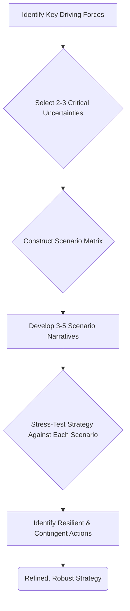

> A pattern for systematically exploring multiple plausible futures to stress-test strategies, reveal hidden risks and opportunities, and build organizational resilience against deep uncertainty.

### 1. Context

In any strategic endeavor, from launching a startup to governing a city or managing an ecosystem, decision-makers face a fundamental dilemma: they must commit resources in the present based on an inherently unknowable future. Traditional forecasting methods, which often rely on extrapolating historical data, are notoriously fragile. They work best when the world is stable, but they break down precisely when they are needed most—during periods of structural shift, high volatility, or deep uncertainty. This leaves organizations vulnerable to being blindsided by unforeseen events, whether it's a disruptive technology, a sudden market collapse, a political upheaval, or an ecological crisis. The pressure to act decisively clashes with the reality that the ground beneath our feet is constantly shifting. Leaders require a more robust method than simple prediction; they need a systematic way to think about, prepare for, and even shape the range of possible futures they might face.

### 2. Problem

> **The core conflict is Desire for Predictive Certainty vs. Fundamental Uncertainty.**

This tension manifests through several competing forces that paralyze effective long-term action:

1.  **The Illusion of Control vs. The Reality of Complexity.** Stakeholders, investors, and team members crave confident, single-point forecasts. They want a definitive answer to "What will happen?" This creates immense pressure on leaders to project an aura of certainty. However, in complex adaptive systems (like markets, societies, or ecosystems), the future is not a destination to be predicted but an emergent property of countless interacting variables. Acting on a single, confident forecast creates extreme fragility; if that one forecast is wrong, the entire strategy can fail catastrophically.

2.  **Strategic Focus vs. Peripheral Vision.** To execute effectively, an organization must focus its resources on a clear strategic direction. Yet, this necessary focus can create tunnel vision, causing leaders to ignore or dismiss weak signals from the periphery that may herald significant change. The urgent demands of the present often crowd out the important work of scanning the horizon for disruptive threats and opportunities, leaving the organization unprepared for shifts that were, in hindsight, foreseeable.

3.  **Analysis Paralysis vs. Decisive Action.** Faced with overwhelming uncertainty, one common failure mode is to get stuck in an endless loop of information gathering and analysis, hoping to find enough data to make the "perfect" decision. The opposite failure mode is to act impulsively, driven by bias or anxiety, without a structured consideration of the possibilities. Neither approach is effective. The challenge is to find a middle path that combines rigorous thinking about the future with the courage to make commitments in the present.

### 3. Solution

> **Therefore, develop a set of 3-5 distinct, plausible, and internally consistent future scenarios, use them to stress-test the current strategy, and identify resilient actions and contingent plans that are robust across multiple futures.**

This pattern shifts the goal from *predicting the future* to *rehearsing multiple futures*. Scenarios are not forecasts; they are carefully constructed narratives about how the world might evolve. By creating a small set of challenging and divergent stories, an organization can explore the boundaries of possibility and prepare for a wider range of outcomes. The power of this approach lies in changing the strategic conversation from "What *will* happen?" to "What would we do *if* this happened?"

The process works by first identifying the most critical and uncertain driving forces that will shape the future environment. These are typically combined into a matrix or framework that defines the "scenario logic." For example, a technology company might pivot its scenarios around the axes of "Regulation" (from lax to stringent) and "AI Adoption" (from slow to rapid). The quadrants of this matrix then form the basis for four distinct future worlds. For each world, a rich narrative is developed, describing the key events, market conditions, and stakeholder behaviors that would exist. The current strategy is then rigorously tested against each scenario, revealing its strengths, weaknesses, and hidden assumptions. This process uncovers which parts of the strategy are fragile (i.e., only work in one preferred future) and which are resilient (i.e., are valuable across multiple futures).

### 4. Implementation

Implementing Scenario Specification is a structured process that moves from broad uncertainty to concrete action. It requires a dedicated team, stakeholder buy-in, and a commitment to honest self-assessment.

1.  **Define the Scope and Time Horizon.** Begin by clarifying the central strategic question you are trying to address (e.g., "How can our city achieve carbon neutrality by 2050?"). Define the time horizon for the scenarios—typically 10-20 years, long enough for significant structural changes to occur but still relevant to current decisions.

2.  **Identify Driving Forces.** Brainstorm a comprehensive list of trends and potential disruptions that could affect your strategic question. Use frameworks like PESTLE (Political, Economic, Social, Technological, Legal, Environmental) to ensure broad coverage. Sources for this step include market analysis, expert interviews, and Environment Sensing.

3.  **Prioritize Critical Uncertainties.** From your list of driving forces, distinguish between those that are relatively predictable (e.g., demographic shifts) and those that are highly uncertain but potentially high-impact (e.g., the outcome of a specific geopolitical conflict, the pace of a technological breakthrough). The goal is to select the top 2-3 "critical uncertainties" that will form the foundation of your scenarios.

4.  **Construct the Scenario Framework.** Arrange the selected critical uncertainties as axes to form a matrix. The endpoints of each axis should represent plausible extremes. For example, an axis for "Global Economic Integration" could range from "Hyper-Globalization" to "De-Globalized Blocs." The intersections of these axes define the core logic of your scenarios.

5.  **Flesh out the Scenarios.** For each quadrant or combination in your framework, write a compelling and internally consistent narrative. Give each scenario a memorable name (e.g., "Global Garden," "Digital Fortress"). Describe what the world looks like in that future, including headlines, key challenges, and the dominant behaviors of customers, competitors, and regulators. The story should be rich enough for participants to immerse themselves in it.

6.  **Analyze Implications and Stress-Test the Strategy.** Rehearse your current strategy within each scenario. Ask probing questions: Does our value proposition still hold? Do our key capabilities remain relevant? How does our financial model fare? Who wins and who loses? This analysis will reveal vulnerabilities and unexamined assumptions.

7.  **Develop Strategic Options and Signposts.** Based on the stress test, identify three types of strategic actions: 
    *   **Core Resilient Actions:** Moves that are valuable across most or all scenarios. These should be prioritized and implemented immediately.
    *   **Contingent Actions:** Specific moves that would only be triggered if a particular scenario starts to unfold. 
    *   **Signposts:** Key leading indicators to monitor that will signal which scenario is becoming more likely. This links the scenarios back to your ongoing Environment Sensing efforts.

**Common Pitfalls:**
*   **Treating Scenarios as Forecasts:** The most common mistake. Constantly remind participants that the goal is to prepare, not to predict.
*   **Creating Unbelievable or Unchallenging Scenarios:** Scenarios must be plausible and push the organization out of its comfort zone to be effective.
*   **Failure to Connect to Action:** The process can become a purely academic exercise if it doesn't result in a clear set of core actions, contingent plans, and signposts.
*   **Lack of Diverse Perspectives:** The process is greatly enriched by including voices from across and outside the organization to challenge dominant thinking.

### 5. Consequences

Applying the Scenario Specification pattern fundamentally changes an organization's posture towards the future, with significant benefits but also potential liabilities.

**Benefits:**
*   **Enhanced Resilience:** By rehearsing multiple futures, the organization is better prepared to adapt and even thrive when unexpected events occur. It avoids placing all its bets on a single, fragile forecast.
*   **Improved Strategy:** The process reveals hidden assumptions and vulnerabilities in the current strategy, leading to more robust and well-considered plans. It helps identify investments that are sound regardless of how the future unfolds.
*   **Shared Strategic Language:** Scenario planning creates a common framework and vocabulary for leadership teams to discuss complex and uncertain issues, fostering alignment and more effective strategic conversations.
*   **Proactive Opportunity Discovery:** The process isn't just about mitigating risk; it's also a powerful tool for identifying novel opportunities that may only become apparent in specific future contexts.

**Liabilities:**
*   **Resource Intensity:** A proper scenario planning exercise requires significant time, effort, and intellectual engagement from senior leaders, which can be a barrier for smaller or resource-constrained organizations.
*   **Potential for Indecision:** If not managed well, exploring multiple futures can lead to a sense of being overwhelmed and can paralyze decision-making rather than enabling it. The focus must remain on identifying actionable insights.
*   **Confirmation Bias:** There is a risk that teams will unconsciously favor the scenario that most closely aligns with their pre-existing beliefs or the official corporate strategy, thereby defeating the purpose of the exercise.

**When NOT to use this pattern:**
*   For short-term, tactical decisions where the key variables are well-understood and reasonably predictable. In such cases, traditional forecasting and analysis are more efficient.
*   In highly stable environments where the rate of change is slow and the fundamental drivers are not in question. However, such environments are increasingly rare.
*   If the organization's leadership is unwilling to engage in open, honest discussion or challenge sacred cows. The pattern's success depends on a culture of psychological safety and intellectual curiosity.

### 6. Known Uses

Scenario Specification has been a cornerstone of strategic planning in leading organizations for decades, proving its value across diverse domains.

1.  **Royal Dutch Shell (Energy/Corporate):** Shell is the canonical example, having pioneered corporate scenario planning in the early 1970s. Their internal team, led by Pierre Wack, developed scenarios exploring the possibility of a major oil price shock. While competitors relied on linear forecasts of stable prices, Shell's leadership had already rehearsed a future of scarcity. When the OPEC oil embargo hit in 1973, Shell was culturally and strategically prepared. They had already considered the implications for refinery investments and supply chains, allowing them to adapt far more quickly than their rivals and ascend from being one of the weaker "seven sisters" to one of the strongest.

2.  **Singapore's Government (Government/National Strategy):** The nation-state of Singapore has institutionalized scenario planning at the highest levels of government since the 1990s. Lacking natural resources and situated in a volatile region, Singapore uses scenarios to navigate long-term uncertainties related to geopolitics, trade, climate change, and social cohesion. This practice has directly influenced major policy decisions, including large-scale infrastructure investments like water desalination (to counter the risk of supply disruption) and the development of a world-class education system to prepare its workforce for a changing global economy. It is a core part of how the nation maintains its long-term viability.

3.  **The Mont Fleur Scenarios (Social/Political Transition):** In the early 1990s, as South Africa was navigating the perilous transition away from apartheid, a diverse group of 22 leaders from across the political spectrum (including the ANC, the National Party, and business) came together. Facilitated by Adam Kahane, they built a set of four scenarios for the country's future, with memorable names like "Ostrich" (a non-negotiated settlement), "Lame Duck" (a weak and indecisive government), "Icarus" (reckless populist spending), and "Flight of the Flamingos" (a successful, inclusive transition). These stories provided a shared language that helped build consensus and steer the nation away from the disastrous paths, contributing significantly to the relatively peaceful transition to democracy.

### 7. Cognitive Era Considerations

The rise of AI and autonomous agents dramatically transforms the potential and practice of Scenario Specification, moving it from a periodic, high-effort exercise to a continuous, dynamic capability.

*   **Automated Signal Detection and Scenario Updating:** AI agents can continuously scan vast amounts of unstructured data—news, research papers, social media, market data—for the "signposts" identified in the planning process. Instead of humans manually tracking indicators, agents can provide a real-time dashboard showing which scenarios are gaining or losing likelihood. This allows for dynamic scenario weighting and can trigger alerts when a contingent strategy needs to be activated, making the entire system more responsive.

*   **Generative AI for Scenario Creation:** Large Language Models (LLMs) can serve as powerful brainstorming partners in the scenario creation process. They can rapidly generate initial drafts of scenario narratives based on the chosen uncertainties, suggest non-obvious implications, and even create synthetic data or news articles from a given future to make the scenario more immersive for participants. This can significantly reduce the manual effort required to flesh out the worlds.

*   **Agent-Based Modeling for Scenario Simulation:** Beyond narrative scenarios, agent-based models (ABMs) can be used to simulate the interactions of millions of individual actors (consumers, firms, voters) within the constraints of a given scenario. This allows for a more rigorous exploration of emergent, second-order consequences that are difficult to anticipate through purely qualitative reasoning. For example, one could simulate how a new carbon tax policy (a strategic choice) would play out differently in a "high-growth" vs. a "stagnation" scenario.

*   **New Risks and Human Judgment:** The primary new risk is over-reliance on the AI's outputs without critical human judgment. An AI might generate plausible-sounding but nonsensical scenarios if not properly guided. It might also inherit and amplify the biases present in its training data, leading to a narrowing of imagination. The role of the human facilitator becomes even more critical: to guide the AI, to challenge its outputs, and to lead the uniquely human process of making meaning and strategic choices from the scenarios. The ultimate decisions—the weighing of risks, the commitment of resources, the alignment with values—remain firmly in the human domain.
