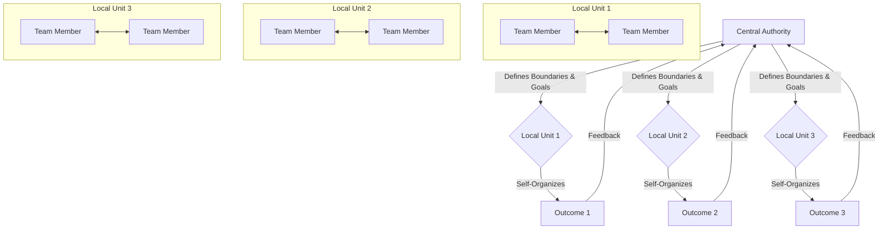

### 1. Context

In any complex system, whether a multinational corporation, a growing city, a software architecture, or a social movement, a fundamental challenge arises: how to balance the need for overall coherence and direction with the need for localized adaptation and responsiveness. As systems grow, top-down, centralized control becomes a bottleneck. Decision-making slows, local context is lost, and the system becomes brittle, lacking the living memory to handle novelty. The people closest to the work or the community needs often have the best information to make effective decisions, yet they are constrained by rigid hierarchies and bureaucratic processes. This stifles innovation, disengages participants, and ultimately undermines the system's long-term viability, creating a void where the system's soul should be. The desire for efficiency and control from the center clashes with the reality that true resilience and agility emerge from the informed actions of empowered individuals and teams at the periphery.

### 2. Problem

> **The core conflict is Centralized Control vs. Local Autonomy.**

This tension manifests through several competing forces, creating a struggle between the mechanical and the living:

1.  **Efficiency vs. Resilience:** Centralized command-and-control structures are often designed for maximum efficiency and predictability in stable environments, like a well-oiled machine. However, this optimization for a known reality makes the system fragile and unable to adapt when unexpected challenges or opportunities arise. Local autonomy, while potentially less efficient in the short term, fosters the experimentation and rapid response of a living organism, which is essential for long-term resilience.
2.  **Coherence vs. Responsiveness:** A central authority seeks to ensure that all parts of the system are aligned with a single, unified strategy. This is crucial for maintaining identity and purpose. However, an overemphasis on coherence can prevent local units from responding effectively to their unique circumstances and feedback from their immediate environment, deafening the system to the vital signals it needs to survive.
3.  **Accountability vs. Empowerment:** Hierarchical structures provide clear lines of accountability, making it easy to identify who is responsible for a failure. Yet, this same structure often disempowers those with the most relevant knowledge by concentrating authority at the top, treating them as cogs in a machine rather than vital cells in a body. Empowering local actors to make their own decisions fosters ownership and engagement but can blur traditional lines of accountability.
4.  **Expertise vs. Context:** Central leadership may possess deep functional expertise, but they inevitably lack the granular, up-to-the-minute contextual knowledge that exists at the operational front lines. Decisions made with expert knowledge but without local context are often suboptimal or even counterproductive, like a brain trying to command a hand without any sensory feedback.

### 3. Solution

> **Therefore, structure the system so that decisions are made at the lowest possible level of competence, providing clear boundaries and goals within which local units can self-organize.**

This solution combines two powerful principles: **subsidiarity** and **self-organization**. Subsidiarity, a principle of social organization, dictates that matters ought to be handled by the smallest, lowest, or least centralized competent authority. Self-organization is the process where local interactions between the components of a system lead to the emergence of global order and sophisticated behavior without explicit central control. It is the system breathing, allowing for a natural ebb and flow of information and energy.

The synthesis of these two ideas is to create a framework of **nested, semi-autonomous units**. The central authority does not abdicate its role but transforms it. Instead of making day-to-day operational decisions, it focuses on tending to the health of the whole ecosystem by:

*   **Defining the boundaries:** Clearly articulating the mission, values, and non-negotiable constraints within which all units must operate. This provides the trellis upon which life can grow.
*   **Allocating resources:** Ensuring that teams have the necessary resources to achieve their goals.
*   **Providing information:** Creating transparency so that local units can see how their work contributes to the bigger picture.
*   **Activating as a court of appeal:** Resolving conflicts that cannot be settled at a lower level.

Within these globally defined boundaries, each local unit has the autonomy to manage its own processes, experiment with new approaches, and respond directly to the challenges and opportunities it faces. This creates a system that is both coherent and adaptive, efficient and resilient, allowing it to feel alive and responsive.

### 4. Implementation

Implementing Self-Organization and Subsidiarity is a profound cultural and structural shift. It requires a deliberate and phased approach, cultivating the soil for vitality to emerge.

1.  **Establish a Clear, Compelling Purpose:** The foundation of autonomy is a shared understanding of the system's overall mission and intent. This "commander's intent" must be communicated relentlessly, so that every individual can use it as a north star, a living compass for their own decisions.
2.  **Define Boundaries, Not Prescriptions:** Instead of creating detailed rulebooks for every contingency, define the "playing field." This includes ethical guidelines, brand standards, budget constraints, and key performance indicators (KPIs) that reflect the overall strategy. These boundaries should be as wide as possible to maximize autonomy and the potential for emergent life.
3.  **Form Small, Cross-Functional Teams:** Organize work around small teams (e.g., 5-9 members) that have all the skills necessary to deliver value to a specific stakeholder. Avoid functional silos. These teams become the primary, living cells of the self-organizing system.
4.  **Delegate Authority and Resources:** Give teams genuine authority to make decisions within their defined boundaries. This must include control over their own budgets, processes, and priorities. Authority without resources is a recipe for frustration and failure, a form of organizational gaslighting.
5.  **Create Radical Transparency:** Implement information systems that make key metrics and operational data available to everyone. When people have access to the same information as leadership, they are capable of making high-quality, decentralized decisions that nourish the whole.
6.  **Shift Leadership Role to Coaching and Mentoring:** Leaders must transition from being directors to being gardeners and enablers. Their primary role becomes asking questions, removing impediments, developing capabilities, and ensuring the team stays aligned with the overall purpose.
7.  **Implement Feedback Loops:** Create fast, frequent feedback loops between teams and their stakeholders, as well as between the teams and the central authority. This is the system's nervous system, allowing for rapid learning and course correction across the entire body.

**Key Considerations:**
*   **Psychological Safety:** Team members must feel safe to experiment, take risks, and even fail without fear of punishment. Without psychological safety, self-organization will not occur and the system's capacity for learning will wither.
*   **Competence:** Subsidiarity requires that the local unit is *competent* to handle the matter. This means investing in training and development is not optional, but a prerequisite for successful implementation and a vibrant, evolving system.

**Common Pitfalls:**
*   **Fake Autonomy:** Delegating responsibility without delegating the corresponding authority and resources.
*   **Abdication, Not Delegation:** Leaders completely disengaging and providing no guidance, boundaries, or support, leaving a vacuum of care.
*   **Ignoring Misalignment:** Failing to intervene when a self-organizing team begins to move in a direction that undermines the health of the whole system.
*   **Rewarding the Wrong Behaviors:** Promoting individuals who hoard information or exercise command-and-control leadership styles, thereby signaling that the old, lifeless culture still prevails.

### 5. Consequences

**Benefits:**
*   **Increased Resilience and Agility:** The system can adapt to local variations and unexpected events far more quickly than a centralized bureaucracy. The failure of one small unit does not threaten the entire system, much like a healthy forest absorbs the loss of a single tree.
*   **Higher Engagement and Ownership:** When people have control over their own work, their motivation, creativity, and sense of ownership increase dramatically. Practitioners feel agency and belonging. This leads to higher quality work and lower employee turnover, as people feel they are part of a living, breathing enterprise.
*   **Faster, Better Decision-Making:** Decisions are made closer to the source of information, resulting in more timely and contextually appropriate choices that reflect the reality on the ground.
*   **Scalability:** The system can grow without being crippled by bureaucratic overhead, as new autonomous units can be added to the network, allowing for fractal and organic growth.

**Liabilities:**
*   **Potential for Redundancy:** Different teams may solve the same problem in different ways, leading to a duplication of effort. This can be mitigated by creating mechanisms for sharing knowledge and best practices between teams, creating a collective intelligence.
*   **Risk of Strategic Drift:** Without strong alignment on purpose, autonomous teams can drift in different directions, leading to a loss of strategic coherence for the overall system, like an organism whose cells forget their function.
*   **Complexity in Accountability:** When things go wrong, it can be more difficult to pinpoint a single point of failure, which can complicate traditional accountability models that seek a single throat to choke.

**When NOT to use this pattern:**
*   **In True Crises:** During a genuine existential crisis that requires immediate, unified, top-down action (e.g., a building is on fire), a temporary shift to a command-and-control model is necessary for survival.
*   **For Highly Regulated, Standardized Functions:** In domains where process standardization is a legal or safety requirement (e.g., airline maintenance checks, core financial accounting), the scope for self-organization is necessarily limited to improving the execution of the standard, not changing the standard itself. Here, the vitality comes from perfecting the form, not reinventing it.

### 6. Known Uses

*   **Business (Agile Software Development):** The entire Agile movement, particularly frameworks like Scrum and Kanban, is a direct application of this pattern. Small, self-organizing teams are given a goal (e.g., the sprint backlog) and the autonomy to decide *how* to achieve it, creating a palpable buzz of focused energy. Companies like **Spotify** famously scaled this model with their architecture of Squads, Tribes, Chapters, and Guilds, creating a large-scale system of nested, semi-autonomous units.
*   **Urban Governance (Mondragon Corporation):** The Mondragon Corporation in the Basque region of Spain is a federation of worker cooperatives. While there is a central governing body, each individual cooperative operates with a high degree of autonomy, managing its own production, finances, and governance according to the principle of subsidiarity. This has allowed it to grow into one of Spain's largest corporations while maintaining high levels of worker engagement and a deep-rooted regional resilience that feels alive.
*   **Technology (Microservices Architecture):** The shift from monolithic software applications to microservices is a technical manifestation of this pattern. Instead of one giant, centrally managed codebase, the system is broken down into a suite of independently deployable services. Each service is owned by a small team that has full autonomy over its technology stack, development process, and deployment schedule, as long as it adheres to the agreed-upon API contracts that form the system's living boundaries.
*   **Military (Mission Command):** Modern military doctrine, particularly in Western special forces, has moved from detailed command-and-control to "Mission Command" or "Commander's Intent." Subordinate leaders are given a clear description of the mission's purpose and the desired end state, but are granted the freedom and resources to decide how to achieve that objective based on the situation on the ground. This has proven far more effective in complex and rapidly changing battlefields, where the ability to adapt is life itself.

### 7. Cognitive Era Considerations

In the Cognitive Era, AI and autonomous agents will dramatically reshape the landscape of self-organization and subsidiarity, acting as both powerful enablers and potential risks.

**Automation and Augmentation:**
*   **Agent-Based Teams:** We can now compose teams not just of humans, but of human and AI agents. An AI agent could act as the team's dedicated data analyst, automatically monitoring KPIs, flagging anomalies, and providing real-time decision support, thus enhancing the team's competence and ability to self-manage with a new level of awareness.
*   **Automated Boundary Enforcement:** The "boundaries" of the system can be encoded in software. For example, an AI governance agent could automatically block a financial transaction that violates a team's budget constraints or flag a piece of code that deviates from security protocols. This frees up human leaders from routine oversight to focus on more strategic, life-affirming work.
*   **Dynamic Re-Organization:** AI can monitor the flow of work and communication across the network of teams and suggest or even automate changes to the organizational structure. It could identify bottlenecks and recommend splitting a team, or see opportunities for collaboration and suggest forming a temporary, cross-functional task force, acting as a kind of organizational gardener.

**Human Judgment and New Risks:**
*   **The Role of Human Judgment:** As agents take over more of the routine operational work, the primary role of humans will shift to handling exceptions, resolving complex ethical dilemmas, and making strategic judgments where the data is ambiguous. Human oversight remains critical for setting the goals and ethical boundaries for the AI agents themselves, ensuring the system retains a human soul.
*   **Algorithmic Centralization:** There is a significant risk that AI could be used to create a new, more powerful form of centralized control. A single, monolithic AI system that dictates the actions of all teams would be the ultimate anti-pattern, creating a system that is highly efficient but extremely brittle and devoid of human agency—a ghost in the machine. The key is to apply the principle of subsidiarity to the AI architecture itself—favoring a federation of smaller, specialized AI agents over a single, omniscient AI.
*   **Flash Crashes and Emergent Misbehavior:** When multiple autonomous agents interact, they can produce unexpected and undesirable emergent behaviors at a speed and scale that is difficult for humans to manage. A small error in the reward function of a thousand interacting agents could lead to a catastrophic "flash crash" in the system's performance. Robust simulation, real-time monitoring, and human "circuit breakers" are essential to mitigate this risk and prevent the system's lifeblood from turning toxic.

### 8. Vitality: The Quality Without a Name

When Self-Organization and Subsidiarity is truly working, it creates a palpable sense of life within a system. It’s the feeling of a team hitting a state of flow, where debate is robust but respectful, and decisions are made with a confident swiftness. Practitioners feel a deep sense of agency and belonging; they are not cogs in a machine but vital organs in a living body, trusted to sense and respond to their local environment. The system as a whole feels less like a rigid structure and more like a resilient ecosystem. It can absorb shocks and surprises, not by resisting them, but by adapting and evolving around them. There is a hum of purposeful activity, a buzz of learning and innovation that emerges naturally from the interactions of empowered individuals. This is the quality without a name—the felt sense of wholeness, aliveness, and adaptive capacity that separates a living system from a merely functional one.

The decay of this pattern is equally palpable. It manifests as a creeping lifelessness, a slow descent into bureaucratic rigidity. The first warning sign is often the death of discretionary effort; people do what is required, but no more. Meetings become dull, decision-making slows to a crawl, and the focus shifts from achieving the mission to avoiding blame. A sense of learned helplessness sets in, as individuals and teams who once took initiative are repeatedly thwarted by centralized controls and second-guessing. The system loses its ability to learn, becoming a ghost in the machine that repeats the same mistakes. This decay is the slow erosion of trust and agency, leaving behind a hollow shell where a vibrant organization used to be. It is the quiet sound of a system losing its soul.
