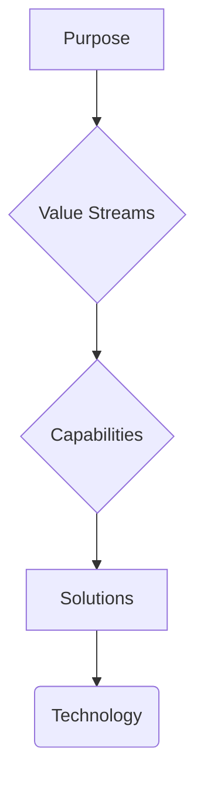

### 1. Context

In any enduring organization, technology is not a green field. It is a dense, layered, and often chaotic archeological site. Over years and decades, solutions are accumulated: massive ERP systems from the 90s, sprawling CRM platforms from the 2000s, a patchwork of custom-built applications, and now a Cambrian explosion of cloud services, microservices, and AI-powered tools. This technological sediment builds up, project by project, crisis by crisis. Without a coherent map, this landscape becomes a significant liability. At the Berlin transport authority BVG, this manifested as a portfolio of over 10,000 distinct applications. In such an environment, no single person understands which solutions support which business capabilities, where critical dependencies lie, where redundant systems perform the same function, or which technologies could be retired without impacting the organization's ability to create value. This lack of clarity makes every technology decision a high-stakes gamble, risking wasted investment, operational disruption, and an inability to adapt to future needs.

### 2. Problem

> **The core conflict is Technical Possibility vs. Value Alignment.**

This tension manifests through several competing forces that pull technology decisions in opposing directions, creating a complex and challenging environment for any organization.

-   **Force 1: Innovation vs. Rationalization.** The relentless pace of technological innovation presents a constant stream of new solutions promising transformation, efficiency, and competitive advantage. Simultaneously, the existing, often convoluted, technology landscape demands rationalization, simplification, and cost reduction. Chasing every new innovation without a clear framework leads to a bloated, unmanageable, and expensive portfolio. Conversely, focusing solely on rationalization can lead to stagnation and a failure to leverage new technologies that could genuinely create value.

-   **Force 2: Best-of-Breed vs. Integration.** For any given business capability, there are often highly specialized, 
best-of-breed solutions that excel in their specific domain. However, adopting a multitude of these specialized tools creates significant integration challenges, data silos, and a fragmented user experience. On the other hand, standardized platforms simplify integration and offer a more unified experience, but often at the cost of specialized functionality, forcing compromises on capability.

-   **Force 3: Current Investment vs. Future Need.** Significant financial and human capital is often tied up in existing legacy systems. This sunk cost creates powerful inertia, making it difficult to justify investment in new solutions, even when the legacy systems are clearly hindering future growth and adaptation. Clinging to outdated technology due to past investments can block the evolution of essential business capabilities and leave the organization vulnerable to more agile competitors.

### 3. Solution

> **Therefore, model solutions as enablers of capabilities, not as standalone assets, and evaluate every solution by its contribution to value creation through the capability layer.**

This approach shifts the focus from the technology itself to the value it delivers. Instead of managing a simple inventory of applications, the Solution Architecture pattern creates a dynamic, value-traceable model of the entire technology landscape. Each solution entity in this model is explicitly linked to the business capabilities it enables. This creates a clear line of sight from every technology investment to its impact on the organization's ability to create and deliver value. The model also captures critical metadata for each solution, including its lifecycle state (e.g., Now, Next, Horizon), its total cost of ownership, and its integration points with other solutions. This creates a rich, multi-dimensional view of the technology portfolio that can be used to inform a wide range of strategic decisions.

This value-traceable model ensures that every technology decision is grounded in a clear understanding of its contribution to the organization's purpose. It provides a rational basis for prioritizing investments, managing complexity, and evolving the technology landscape in a way that is directly aligned with the organization's strategic goals.

### 4. Implementation

1.  **Inventory All Solutions:** The first step is to create a comprehensive inventory of all solutions currently in use across the organization. This includes not only the officially sanctioned enterprise systems but also the so-called "shadow IT" – the departmental databases, spreadsheets, and cloud services that have been adopted without central oversight. This process can be time-consuming but is essential for creating a complete and accurate picture of the technology landscape.

2.  **Map Solutions to Capabilities:** Once the inventory is complete, each solution must be mapped to the specific business capabilities it supports. This requires a clear and well-defined capability model that has been agreed upon by both business and IT stakeholders. This mapping process is often a collaborative effort, involving workshops and interviews with subject matter experts from across the organization.

3.  **Identify Redundancy and Gaps:** With the solution-to-capability mapping in place, it becomes possible to identify areas of redundancy, where multiple solutions are being used to support the same capability. It also highlights capability gaps, where there is no adequate technology support for a critical business function. This analysis provides a clear basis for portfolio rationalization and targeted investment.

4.  **Assess Lifecycle and Cost:** Each solution should be assessed to determine its current lifecycle stage (e.g., active, retiring, planned) and its total cost of ownership. This information is critical for making informed decisions about which solutions to maintain, which to retire, and which to replace.

5.  **Model Integrations and Dependencies:** The relationships between solutions should be modeled to understand the flow of data and the dependencies between systems. This is essential for managing the complexity of the technology landscape and for planning any changes to the portfolio.

**Common Pitfalls:**

*   **Treating the solution inventory as the final product:** The inventory is just the starting point. The real value of the Solution Architecture pattern comes from the analysis and modeling that follows.
*   **Making technology decisions in isolation:** All technology decisions should be made in the context of the overall Solution Architecture and its alignment with business capabilities and value streams.
*   **Ignoring shadow IT:** Failing to account for the full range of solutions in use across the organization will lead to an incomplete and inaccurate model.

### 5. Consequences

**Benefits:**

*   **Value-Based Investment:** By linking technology to business capabilities, the Solution Architecture pattern enables organizations to make investment decisions based on a clear understanding of their value contribution.
*   **Visible Redundancy and Gaps:** The pattern makes it easy to see where there are redundant solutions, creating opportunities for cost savings and simplification. It also highlights capability gaps, enabling targeted investments to address unmet needs.
*   **Clear Retirement Candidates:** The lifecycle assessment of solutions provides a rational basis for identifying and planning the retirement of outdated and low-value technologies.
*   **Coherent Integration Architecture:** By modeling the relationships between solutions, the pattern provides a blueprint for creating a more coherent and efficient integration architecture.

**Liabilities:**

*   **Significant Upfront Effort:** Creating a comprehensive solution inventory and capability map can be a massive undertaking, especially in large and complex organizations.
*   **Pace of Change:** The rapid pace of technological change can make it challenging to keep the Solution Architecture model up-to-date and relevant.

**When NOT to use this pattern:**

*   **Early-Stage Startups:** In the early stages of a startup, the technology landscape is often simple and fluid, and the overhead of creating a formal Solution Architecture may not be justified.
*   **Organizations with Minimal Technology:** In organizations where technology is not a significant factor in value creation, a less formal approach to technology management may be sufficient.

### 6. Known Uses

*   **Ameren:** This American energy company embarked on a multi-year journey to establish a formal solution architecture practice. Starting in 2017, they developed a consistent approach to solution design and asset management, creating standard documentation and focusing on key diagrams to communicate their vision. By integrating their ServiceNow CMDB with the Bizzdesign Horizzon platform, they were able to create a data-driven and continuously improving solution architecture process that provided a clear line of sight from technology to business value.

*   **U.S. Office of Personnel Management (OPM):** As part of its Human Resources Line of Business (HR LOB) initiative, the OPM used enterprise architecture to transform HR management across the entire U.S. federal government. They created a blueprint for a standardized and interoperable HR service delivery model, moving from an agency-centric approach to a more efficient model based on shared service centers. This involved developing a comprehensive enterprise architecture that included a Business Reference Model, a Performance Model, and a Service Component Model to guide the redesign of HR processes and systems across the federal government.

*   **Smart City Initiatives:** The principles of solution architecture are being widely applied in the development of smart cities around the world. By creating a comprehensive blueprint that includes technical, system, and business architecture, as well as integrations, planning, and operations, cities are able to manage the complexity of their technology landscape and ensure that their investments in smart city technologies are aligned with their strategic goals. This approach enables them to create a more coherent and efficient urban environment, with integrated services and a better quality of life for their citizens.

### 7. Cognitive Era Considerations

In the cognitive era, the Solution Architecture pattern is becoming even more critical. AI and automation are adding a new layer of complexity to the technology landscape, and a clear and coherent architecture is essential for managing this complexity and harnessing the power of these new technologies. AI-powered agents can play a significant role in automating the discovery and mapping of solutions, scanning infrastructure, analyzing API calls, and identifying actual usage patterns. This bottom-up, data-driven approach can complement the top-down, model-driven approach of traditional solution architecture, creating a more accurate and dynamic picture of the technology landscape.

Furthermore, AI solutions themselves are becoming first-class citizens in the solution architecture. They need to be managed with the same rigor as traditional applications, with a clear understanding of their capabilities, costs, and lifecycle. The Solution Architecture pattern provides a framework for doing this, ensuring that AI solutions are not just added to the portfolio in an ad-hoc manner, but are integrated into a coherent and value-driven technology landscape. The new risks that arise include the potential for algorithmic bias, the need for new forms of governance, and the challenge of ensuring the explainability and transparency of AI-powered decisions. The Solution Architecture pattern can help to mitigate these risks by providing a framework for the responsible and ethical design and deployment of AI solutions.
