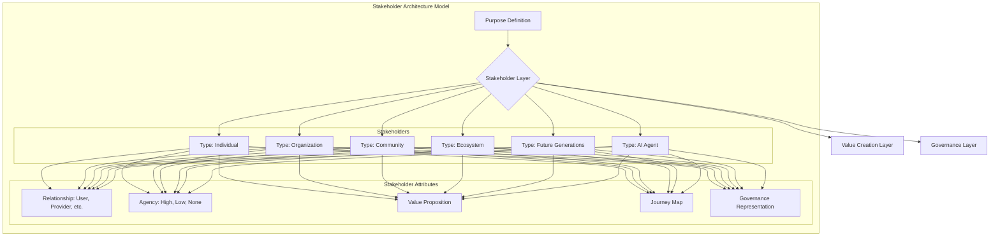

### 1. Context

In any system designed to create value—be it a business, a city, a digital platform, or an ecosystem—the question of “for whom?” is paramount. It is a question that defines the system's soul. Historically, many design and strategic frameworks have implicitly or explicitly prioritized a narrow set of stakeholders, typically those with direct financial investment or measurable power. Corporate strategic planning often revolves around customers, shareholders, and competitors, while urban planning might focus on developers, landowners, and municipal governments. This narrow lens simplifies decision-making but often ignores a vast web of interconnected parties who are deeply affected by the system’s operations but lack a formal voice or direct control. These invisible stakeholders can include the natural environment, future generations, dependent communities, and even non-human agents. As we build increasingly complex and autonomous systems, from global supply chains to AI-driven public services, the limitations of this narrow view become a critical liability, leading to unintended consequences, systemic risk, and a failure to create durable, equitable value. A system that cannot see its full body cannot be truly alive.

### 2. Problem

> **The core conflict is Stakeholder Invisibility vs. Systemic Inclusion.**

At the heart of designing any commons is a fundamental tension, a choice between a mechanical, fragmented view and a living, whole one. On one hand, to make a system tractable and efficient, we are pushed toward a simplified model of the world, focusing only on the most visible, powerful, or financially relevant actors. On the other hand, the promise of a true commons is to create value for all participants and to ensure the long-term health of the system, which requires a deep and comprehensive understanding of every party that is affected, regardless of their power or visibility. Ignoring this complexity doesn't make it disappear; it simply pushes the costs onto the shoulders of the invisible, creating a ghost in the machine that will eventually haunt the system's integrity.

-   **Force 1: Simplicity vs. Completeness.** A truly comprehensive map of all affected parties—employees, customers, suppliers, local communities, the environment, future generations, data subjects, AI agents—can become overwhelmingly complex. The pressure to launch, iterate quickly, and maintain focus pushes teams to draw a tight boundary around a few key stakeholder groups. Yet, every stakeholder excluded from this architectural core represents a potential systemic risk, an unmeasured externality, and a source of value left unrealized. The system creates value for some by implicitly extracting it from others, slowly draining its own vitality.

-   **Force 2: Present Power vs. Future Legitimacy.** Stakeholders with immediate power—investors with capital, customers with purchasing power, regulators with legal authority—can advocate for their interests and demand a seat at the table. Their needs are legible and urgent. In contrast, stakeholders like future generations, the local watershed, or an open-source community that depends on the project’s code have legitimate claims but no direct voice or power. A system optimized only for the powerful of today mortgages its future legitimacy and resilience, lacking the living memory to handle novelty.

-   **Force 3: Direct Value vs. Systemic Health.** It is far easier to measure and optimize for direct, transactional value: a product sold, a service delivered, a user acquired. It is much harder to measure and invest in the systemic health of the entire ecosystem, which includes the well-being of employees, the vitality of the surrounding community, and the sustainability of the natural resources it depends on. The relentless pursuit of direct value can erode the very foundations on which the system stands, creating a vibrant-looking facade that conceals a dying core.

### 3. Solution

> **Therefore, architect the system around a multi-layered stakeholder model that explicitly identifies, classifies, and represents the interests of all affected parties—including non-traditional, non-human, and future stakeholders—and embeds this model as a foundational layer of the system’s design, second only to its core purpose.**

This pattern moves beyond simple stakeholder lists or power/interest grids. It treats stakeholder architecture as a core structural element of the commons, not just an input to a communications plan. The solution is to build a formal model that classifies stakeholders across several dimensions, ensuring that no critical party remains invisible. This model becomes the living blueprint for value creation, governance, and system evolution, allowing the system to breathe.

The key is to create a rich, multi-faceted classification system. Stakeholders are categorized by their fundamental **type** (e.g., Individual, Organization, Community, Ecosystem, Future Generation, AI Agent), their **relationship** to the commons (e.g., User, Provider, Governor, Investor, Beneficiary, Affected Bystander), and their level of **agency** (i.e., their capacity to advocate for their own interests). This classification immediately highlights those who have a legitimate stake but no voice, such as the environment or future users, revealing where the system's lifeblood is being blocked.

Crucially, each stakeholder entity in this model is linked to specific value propositions (what value they should receive), journeys (how they interact with and experience the system), and governance structures (how their interests are represented in decision-making). For stakeholders without natural agency, the architecture demands the creation of **proxy representatives**—such as a designated “Guardian for the River” on a governance board, or a digital twin that models the resource consumption of a future generation—to ensure their needs are actively considered. These proxies act as the system's sensory organs, detecting needs that would otherwise go unnoticed.

This approach transforms stakeholders from a list of external forces to be managed into the very fabric of the system’s anatomy. It provides a stable yet evolvable structure for ensuring that the pursuit of value for one group does not inadvertently create harm for another.

### 4. Implementation

Implementing a stakeholder architecture is a dynamic, multi-stage process, an act of tending to a garden rather than erecting a building. It begins with a **comprehensive inventory** that casts a wide net beyond obvious actors like customers and investors, using techniques like dependency mapping, impact analysis, community interviews, and futures workshops to identify all affected parties, including non-human and future stakeholders. The next stage, **classification and modeling**, involves structuring this inventory into a formal model. Each stakeholder is defined by their type (e.g., Individual, Ecosystem), relationship (e.g., User, Beneficiary), agency level, needs, and contributions. This model then informs the **value proposition and journey mapping** stage, where the intended value for each stakeholder is explicitly defined and their interaction journey is mapped, quickly revealing gaps in the system’s design. The most critical stage is designing **governance representation**. For every stakeholder, especially those with low or no agency, a mechanism for their voice to be heard in decision-making must be created. This can range from direct board representation to appointing proxy representatives with fiduciary duties (e.g., a “Guardian for the River”) or using algorithmic representations like digital twins to model impacts. Finally, the architecture is integrated into core processes and becomes a **living model** that is continuously iterated upon as the ecosystem evolves, ensuring the system has the capacity for renewal.

**Common Pitfalls:**
*   **Confusing a list with an architecture:** A simple list of stakeholders is not an architecture. The architecture is the living model of relationships, value flows, and governance mechanisms that allows the system to adapt and thrive.
*   **The “Empty Chair” Fallacy:** Simply having an empty chair at a meeting “for the customer” is not representation. Representation requires a formal role, a clear mandate, and real power to give the system genuine feeling and feedback.
*   **Static Modeling:** The stakeholder ecosystem is dynamic. Failing to update the model is a failure to see reality, leaving the system brittle and unable to respond to change.
*   **Ignoring Power Dynamics:** A model that doesn't acknowledge and actively counterbalance existing power imbalances will simply reinforce the status quo, creating a monoculture that is vulnerable to collapse.

### 5. Consequences

Adopting a formal stakeholder architecture fundamentally changes how an organization or commons operates, shifting its focus from narrow optimization to systemic health. This transformation touches every part of the organism. This has profound consequences, both positive and negative.

**Benefits:**

*   **Increased Resilience:** By making the needs of all stakeholders visible and explicit, the system becomes more resilient to shocks. When the well-being of employees, the environment, and the community are treated as core architectural concerns, the organization is less likely to be blindsided by supply chain disruptions, employee burnout, or regulatory backlash. It builds a deeper foundation of support, like a tree with a strong root system.
*   **More Innovative Value Creation:** By explicitly mapping the needs of a wider range of stakeholders, the organization uncovers new opportunities for creating value. Designing for the needs of a marginalized community, considering the lifecycle of a product’s environmental impact, or planning for the needs of future users can spark innovations that would never arise from a narrow focus on the immediate customer. This diversity of perspective is a wellspring of creativity and adaptation.

**Liabilities:**

*   **Increased Complexity and Slower Decision-Making:** The most immediate consequence is an increase in complexity. Actively considering the needs of a dozen stakeholder groups instead of two will inevitably slow down decision-making processes. It requires more communication, more negotiation, and more sophisticated governance mechanisms, which can be a disadvantage in fast-moving, competitive environments. The system must learn to breathe at a different, more deliberate rhythm.
*   **The Challenge of Proxy Representation:** Representing the interests of non-human or future stakeholders is inherently imperfect. The designated “Guardian for the River” is still a human, subject to their own biases and interpretations. These proxy mechanisms can become tokenistic if not given real power and resources, leading to a false sense of security and a void where the system's soul should be.
*   **Potential for Conflict and Gridlock:** Giving voice to previously voiceless stakeholders can bring latent conflicts to the surface. When the needs of the local community are in direct opposition to the desires of global investors, the governance structure can become deadlocked if it lacks effective mechanisms for conflict resolution and negotiation. The system must develop the capacity to hold this tension creatively.

**When NOT to use this pattern:**

This pattern is not well-suited for early-stage, highly experimental ventures where speed and simplicity are paramount for survival. In the earliest phases of a startup, a lightweight “lean startup” approach focused on a single customer segment is often more appropriate. A deep stakeholder architecture can be prematurely complex. However, as soon as the venture achieves product-market fit and begins to scale, the lack of a stakeholder architecture becomes a significant risk. The pattern is also less critical for systems with a very small and clearly defined footprint of impact, although such systems are increasingly rare.

### 6. Known Uses

This pattern is visible in a growing number of organizations that are consciously moving beyond a shareholder-centric model, seeking a more generative and life-affirming way of being. The principles of a deliberate, multi-stakeholder architecture are a defining feature of the benefit corporation movement, steward-ownership models, and platform cooperatives.

1.  **Patagonia (Benefit Corporation):** The outdoor apparel company Patagonia has long been a pioneer in corporate responsibility. Its stakeholder architecture was made radically explicit in 2022 when the founding Chouinard family transferred 100% of the company’s voting stock to the **Patagonia Purpose Trust** and 100% of the non-voting stock to the **Holdfast Collective**. The Trust’s legal mandate is to protect the company's values and mission, while the Collective, a 501(c)(4) nonprofit, is dedicated to fighting the environmental crisis. In this model, the **Earth is explicitly named as the company’s primary stakeholder**, and the governance and financial structures are legally bound to serve that stakeholder. All profits not reinvested in the business are distributed as a dividend to the Holdfast Collective to fund environmental work. This is a formal, legally-binding stakeholder architecture where the environment’s representation is not just a token but the primary beneficiary of the company’s financial success, allowing the company to act as a regenerative force.

2.  **Weaver Street Market (Multi-stakeholder Cooperative):** This North Carolina-based grocery store is a prime example of a multi-stakeholder cooperative. Its ownership and governance are formally shared between three distinct stakeholder groups: the **consumers** who shop there, the **workers** who run the store, and the **producers** who supply its goods. Each group has representation on the board of directors, ensuring that decisions about pricing, wages, product sourcing, and community investment are made with the balanced interests of all three parties in mind. This structure prevents the classic tension where a retailer might squeeze producers on price to lower costs for consumers, or cut worker benefits to boost profits. By giving all three groups a formal role in governance, the architecture forces a more holistic and sustainable approach to managing the enterprise, creating a vibrant, interconnected economic ecosystem.

3.  **Stocksy United (Platform Cooperative):** Stocksy is a platform cooperative that provides high-quality, royalty-free stock photography and video. It was created by artists in response to the extractive models of traditional stock photo agencies. The platform is co-owned by its contributing photographers and artists. This means the very people who create the value are the ones who own and govern the platform. This stakeholder architecture directly addresses the problem of platform capitalism, where the platform owner extracts a disproportionate share of the value created by its users. At Stocksy, a significant portion of revenue is returned to the artists, and the artists themselves have a democratic voice in the platform’s strategy, pricing, and policies. This aligns the interests of the platform with the interests of its most critical stakeholders—the creators, fostering a sense of shared purpose and agency.

### 7. Cognitive Era Considerations

The principles of Stakeholder Architecture become even more critical and complex in an era defined by artificial intelligence and autonomous agents. Cognitive technologies can both radically enhance our ability to implement this pattern and introduce entirely new classes of stakeholders and risks that must be architected for. This new era challenges us to expand our conception of life and participation.

**Automation and Augmentation:**
AI agents can serve as powerful tools for implementing a stakeholder architecture. They can perform continuous, large-scale stakeholder identification by scanning public data, news, social media, and internal communications to identify emerging stakeholder groups and shifts in sentiment or influence. Natural Language Processing (NLP) models can analyze vast amounts of unstructured text to distill the core needs, interests, and grievances of different stakeholder groups, making the inventory and classification process more dynamic and comprehensive. During decision-making, AI-powered simulation models can act as sophisticated proxies, forecasting the second and third-order effects of a decision on various stakeholders, including non-human ones like ecosystems, by modeling resource flows and environmental impacts. These tools can function as the nervous system of the commons.

**AI Agents as a New Stakeholder Class:**
As AI agents become more autonomous and integral to the operation of a commons, they themselves become a new and critical class of stakeholder. An AI that manages a city’s power grid or a platform’s content moderation system is not merely a tool; it is an operational participant with its own needs (e.g., data, computational resources, clear objectives) and impacts. A robust stakeholder architecture must explicitly model these AI agents. This includes defining their rights, responsibilities, and operational boundaries. What value are they entitled to receive (e.g., maintenance, upgrades)? What are their obligations to other stakeholders? How are their “interests”—which are ultimately a reflection of their programmed objectives—represented in governance? Failing to architect for AI agents as stakeholders leads to brittle systems where their behavior is misaligned with the broader commons, creating a new form of alienated life.

**New Risks and Ethical Considerations:**
The use of AI also introduces new risks. The data used to train AI models for stakeholder analysis may contain biases that render certain groups invisible or misrepresent their needs, thereby reinforcing existing inequalities. The very act of classifying stakeholders using algorithmic means can create new forms of social sorting and exclusion. Furthermore, the question of accountability becomes more complex. If an autonomous agent, designed to optimize for a set of stakeholder interests, causes harm, where does the responsibility lie? The stakeholder architecture must be paired with a clear framework for algorithmic accountability, transparency, and human oversight to ensure it doesn't create technological ghosts in the machine.

**Human-AI Collaboration:**
The most effective use of this pattern in the cognitive era will involve a partnership between human judgment and machine intelligence. AI can provide the data, analysis, and simulations to help humans see the complex web of stakeholder relationships more clearly. However, the final, ethically-weighted decisions about how to balance competing interests, especially when they involve deep-seated values, must remain a human responsibility. The role of governance in this new era is to design the structures where humans can effectively use the insights from AI to make wiser, more inclusive decisions, ensuring the architecture serves the full spectrum of life it affects.

### 8. Vitality: The Quality Without a Name

When a stakeholder architecture is truly alive, the system feels coherent and whole. Practitioners experience a sense of rightness and belonging, knowing their work contributes to a larger, healthier ecosystem. Decisions, even difficult ones, are made with a clarity that comes from seeing the entire field of impact. The system breathes; it can absorb shocks and surprises not because it is rigid, but because it is resilient, with deep feedback loops that allow for rapid learning and adaptation. There is a palpable sense of agency among all participants, as their voices, even when represented by proxies, have tangible effects. The organization doesn't just serve its stakeholders; it co-evolves with them, creating a shared future that is more vibrant and generative than what any single party could achieve alone. The air is thick with potential.

Decay sets in when this architecture becomes a hollow formality. The first sign is the language: terms like "stakeholder engagement" become corporate jargon, disconnected from any real power or influence. The "Guardian for the River" becomes a line item in a report, their warnings ignored in favor of short-term financial targets. Practitioners feel a growing cynicism, a sense that the system’s stated values are a lie. The organization becomes brittle, unable to sense changes in its environment. It is haunted by the ghosts of the stakeholders it has ignored—the community it displaced, the ecosystem it poisoned, the future it sold. There is a void where the system’s soul should be, a quiet hum of extraction that slowly drains the life out of everything it touches, and everyone it, touches. The machine still runs, but it no longer feels alive.
