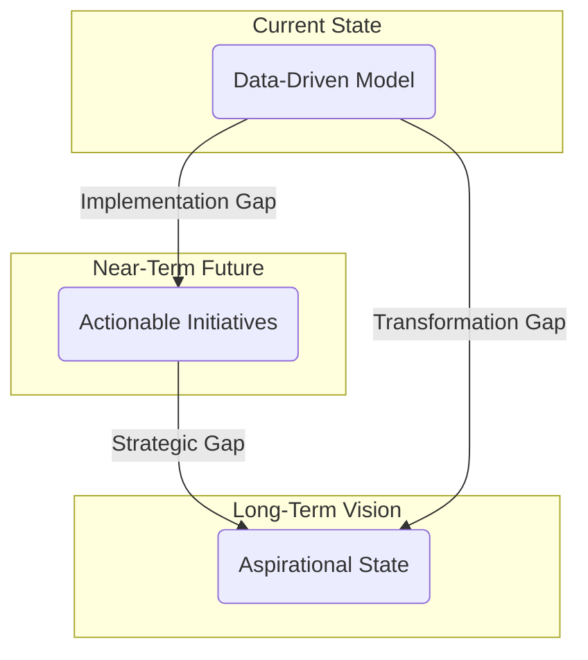

### 1. Context

Practitioners in any complex endeavor, from corporate strategists to urban planners and software architects, constantly face the challenge of reconciling long-term vision with immediate operational demands. Organizations often operate in a state of temporal dissonance, where the five-year strategic plan feels disconnected from the urgent realities of the current quarter or sprint. The long-term vision provides direction but lacks immediate actionability, while short-term plans are concrete but risk becoming myopic, optimizing for local efficiencies at the expense of the overall strategic trajectory. This disconnect creates a significant gap in understanding and execution; the path from the current state to the desired future remains an unmapped territory, discussed in abstract terms but rarely modeled with rigor. Traditional annual planning cycles attempt to bridge this divide, but their output is typically a static document that quickly becomes obsolete in a volatile environment. Conversely, purely agile methods, while excellent at adapting to change, can lead to a random walk, where the organization drifts without a coherent, long-term narrative. The fundamental challenge is to create a living model of strategy that is both grounded in present reality and dynamically steering toward a desired future.

### 2. Problem

> **The core conflict is Present Urgency vs. Future Relevance.**

This tension manifests through several competing forces that pull an organization in different directions, making it difficult to maintain strategic coherence over time.

1.  **Force 1: Actionability vs. Vision.** Near-term plans, such as quarterly objectives or sprint backlogs, are tangible and immediately actionable. They provide clear direction for teams and create a sense of progress. However, an exclusive focus on these immediate tasks can lead to strategic drift, where the organization loses sight of its long-term vision. Conversely, a compelling long-term vision is inspiring and provides a North Star, but it often feels abstract and disconnected from the day-to-day work, making it difficult to translate into concrete actions.

2.  **Force 2: Certainty vs. Possibility.** The present is characterized by a high degree of certainty; we have data, metrics, and direct experience of the current state. Planning based on this known reality feels safe and reliable. The future, however, is inherently uncertain and filled with a spectrum of possibilities. Engaging with this uncertainty is essential for innovation and long-term resilience, but it requires a speculative mindset that can feel uncomfortable and risky compared to the solid ground of the present.

3.  **Force 3: Stability vs. Adaptability.** Stakeholders, including investors, employees, and customers, require a degree of stability and predictability. They need to know what to expect from the organization in the near term. However, the external environment is in constant flux, demanding that the organization be highly adaptable to survive and thrive. The need to provide stable commitments often conflicts with the need to pivot in response to new information, creating a tension between being reliable and being responsive.

4.  **Force 4: Resource Allocation: Exploitation vs. Exploration.** Organizations must allocate finite resources—time, money, and talent—between exploiting existing, proven business models and exploring new, uncertain opportunities. The pressure for short-term returns often prioritizes investment in exploitation, which is more predictable and has a clearer ROI. This can starve the exploration of new ideas that are critical for future relevance and long-term growth, a classic dilemma known as the “innovator’s dilemma.”

### 3. Solution

> **Therefore, maintain three co-existing, structurally identical temporal models of the same system—Now, Next, and Horizon—to make strategic gaps explicit and actionable.**

The solution is to move from a linear, static planning process to a dynamic, multi-layered view of the system over time. Instead of a single plan, you maintain three distinct but interconnected specifications, each representing the system at a different temporal horizon. The critical principle is that all three models share the exact same underlying ontology and structure, allowing for direct, systematic comparison.

1.  **The Now Slice (The Baseline):** This is a high-fidelity, data-driven model of the system as it exists today. It is the verifiable "ground truth," continuously updated with real operational data. This is not a static snapshot but a living representation, ideally maintained through automated data feeds. It answers the question: "Where are we, really?"

2.  **The Next Slice (The Bridge):** This model describes the intended state of the system in the near-term future, typically 6 to 24 months out. It is concrete and actionable, containing defined initiatives, allocated resources, and clear responsibilities. The Next slice serves as the crucial bridge between today's reality and long-term aspiration, translating strategic goals into a tangible plan of execution. It answers the question: "Where are we going next?"

3.  **The Horizon Slice (The Vision):** This is a model of the aspirational, desired future state of the system, typically 5 to 10 years out. It is more speculative and directional, shaped by long-term vision, scenario analysis, and first principles. It is not a prediction but a guiding star, providing a coherent direction for the system's evolution. It answers the question: "Where do we ultimately want to be?"

The true power of this pattern emerges from the systematic comparison between the slices, which turns abstract strategic discussions into concrete gap analyses.

By comparing **Now vs. Next**, the organization identifies immediate implementation gaps—the precise work needed to move from the current state to the planned future. Comparing **Next vs. Horizon** reveals strategic gaps, highlighting where the near-term plan may be misaligned with the long-term vision, prompting course correction. Finally, comparing **Now vs. Horizon** makes the full magnitude of the required transformation visible, providing a powerful tool for communicating the strategic journey to all stakeholders. This continuous process of modeling and comparison resolves the core tension by creating a direct, traceable link between present actions and future relevance.

### 4. Implementation

Implementing Time-Sliced Specification is a structured process that requires discipline and a commitment to maintaining the integrity of the three distinct temporal models.

1.  **Step 1: Establish the "Now" Slice (The Baseline).** This is the most critical step. The "Now" slice must be an objective, data-driven representation of the current system. This involves cataloging all relevant components of the system and populating the model with current, accurate data. The key is to create a foundational layer of "ground truth" that is trusted by all stakeholders. This model must reflect reality, not aspirations.

2.  **Step 2: Define the "Horizon" Slice (The Vision).** With a clear baseline, the next step is to define the long-term aspirational future. This is a directional model of the desired state in 5-10+ years, informed by methods like scenario analysis and trend forecasting. The Horizon slice should model the same entities as the Now slice but with their desired future attributes.

3.  **Step 3: Derive the "Next" Slice (The Bridge).** The "Next" slice is derived by working backward from the Horizon and forward from the Now. It answers the question: "What must we achieve in the next 6-24 months to be on a viable path toward our Horizon?" This slice is concrete and actionable, detailing specific initiatives and projects. This is where strategic choices are made and resources are allocated.

4.  **Step 4: Systematically Compare Slices and Identify Gaps.** With all three slices populated, the core of the pattern is the systematic comparison of the models:
    *   **Now vs. Next:** Reveals the **Implementation Gap**. These are the immediate projects, process changes, and capability uplifts required. This comparison drives the operational plan.
    *   **Next vs. Horizon:** Reveals the **Strategic Gap**. This highlights where the near-term plan may be insufficient or misaligned with the long-term vision, prompting a re-evaluation of the Next slice.
    *   **Now vs. Horizon:** Reveals the **Transformation Gap**. This provides a powerful visualization of the total journey the organization must undertake, which is invaluable for communication and stakeholder alignment.

5.  **Step 5: Plan and Prioritize Initiatives.** The identified gaps are the raw material for the strategic and operational plan. Each gap should be converted into a well-defined initiative with an owner, budget, and timeline.

6.  **Step 6: Institute a Rolling Cadence.** The slices are not static. A regular cadence for updating and rolling the models forward is essential:
    *   **Now:** Updated continuously or near-continuously as new data becomes available.
    *   **Next:** Reviewed and updated on a quarterly basis, with completed initiatives being absorbed into the Now slice.
    *   **Horizon:** Revisited annually or in response to significant external disruptions to ensure it remains a relevant and inspiring guide.

**Common Pitfalls:**
*   **Treating Slices as Predictions:** The Next and Horizon slices are models, not forecasts. They are tools for thinking and alignment, not attempts to predict the future.
*   **Letting the "Now" Slice Go Stale:** An out-of-date baseline makes all comparisons meaningless. The integrity of the Now slice is paramount.
*   **The "Hollow Middle":** A common failure mode is to have a strong Now and an inspiring Horizon but a weak or non-existent Next slice, creating a vision without a bridge to reality.
*   **Inconsistent Models:** If the three slices do not use the same underlying structure and entities, comparison becomes impossible. The discipline of structural consistency is non-negotiable.

### 5. Consequences

Adopting the Time-Sliced Specification pattern fundamentally changes how an organization perceives and interacts with time, strategy, and execution. While powerful, the approach comes with its own set of benefits and liabilities that must be carefully managed.

**Benefits:**

*   **Strategic Coherence:** It creates a direct, traceable link between long-term vision and day-to-day execution. The work being done today (closing the Now-Next gap) is explicitly framed as a step toward the Horizon, eliminating the common disconnect between strategy and operations.
*   **Makes Gaps Explicit:** The pattern transforms vague strategic challenges into a concrete, prioritized list of gaps. This clarity is a powerful catalyst for action, focusing resources on the most critical areas needing change or innovation.
*   **Enables Evolutionary Change:** By breaking down a massive transformation (Now vs. Horizon) into manageable near-term steps (Now vs. Next), the pattern allows for a continuous, evolutionary approach to change, which is often more successful and less disruptive than large, infrequent "big bang" reorganizations.
*   **Creates a Shared Language:** The Now, Next, and Horizon concepts provide a simple, powerful vocabulary for all stakeholders to discuss the future. This shared language aligns teams and leadership, ensuring that everyone is working from the same mental model of the organization's trajectory.

**Liabilities:**

*   **Maintenance Overhead:** Without a high degree of automation, maintaining three distinct, structurally identical models can be resource-intensive. The primary challenge is keeping the "Now" slice continuously updated and ensuring the integrity of all three models over time.
*   **Potential for "Analysis Paralysis":** The systematic comparison of slices can generate an overwhelming number of identified gaps. Without a ruthless prioritization process, organizations can become paralyzed, endlessly analyzing gaps instead of acting to close them.
*   **Risk of Oversimplification:** The clean, structured nature of the models can mask the messy, complex reality of organizational dynamics. It is a tool for thinking and should not be mistaken for a perfect, deterministic simulation of the future.

**When NOT to use this pattern:**

*   **Early-Stage Survival:** For a startup or an organization in a deep crisis, the only relevant timeslice is "Now." The focus must be entirely on immediate survival, and the overhead of maintaining Next and Horizon models would be a wasteful distraction.
*   **Highly Stable Environments:** If an organization operates in an extremely stable and predictable environment where the future is a simple extrapolation of the past, this pattern is likely overkill. A traditional, linear strategic plan may be sufficient.
*   **Lack of Disciplinary Commitment:** The pattern's success hinges on the organization's commitment to maintaining the models with rigor. If the culture does not support data-driven decision-making or the discipline to keep the "Now" slice accurate, the entire framework will quickly collapse and produce misleading results.

### 6. Known Uses

This pattern, in various forms, is widely applied across different domains, demonstrating its versatility in bridging strategy and execution.

1.  **Corporate Strategy (McKinsey & Company):** The most famous application is McKinsey's Three Horizons of Growth model, which advises companies to manage a portfolio of initiatives across three horizons to ensure long-term viability. **Horizon 1** focuses on defending and extending the core business. **Horizon 2** involves building out emerging businesses that could be future growth engines. **Horizon 3** is dedicated to creating genuinely new, disruptive ventures. Companies like **Google (Alphabet)** implicitly use this model, with their core search business in Horizon 1, ventures like Waymo and Verily in Horizon 2/3, and speculative "moonshots" in Horizon 3. The outcome is a balanced portfolio that simultaneously exploits current strengths and explores future possibilities.

2.  **Agile Software Development (Scaled Agile Framework - SAFe):** The SAFe methodology incorporates the concept of "Investment Horizons" directly into its Lean Portfolio Management competency. The framework guides enterprises to allocate their budget across four horizons to balance near-term feature delivery with long-term innovation. **Horizon 1 (Investing and Extracting)** represents solutions that are profitable and have a significant market share. **Horizon 2 (Emerging)** includes promising new solutions that are gaining traction. **Horizon 3 (Evaluating)** is for exploring new ideas with small investments, and **Horizon 0 (Retiring)** is for decommissioning old systems. This approach helps large enterprises like **LEGO** and **American Express**, which use SAFe, to ensure that their agile development efforts are aligned with a long-term strategic perspective, preventing their many agile teams from pulling in different directions.

3.  **Public Policy and Urban Planning (UK Government & Tactical Urbanism):** Governments and urban planners use multi-horizon thinking to connect long-term societal visions with short-term, actionable policies. The **UK Government's Policy Lab** explicitly uses the Three Horizons framework to help policymakers design for the future. They define a desired future state (Horizon 3), analyze the current system (Horizon 1), and then design a portfolio of experiments and transitional initiatives (Horizon 2) to navigate the path between them. In a more grassroots example, the **Tactical Urbanism** movement embodies this pattern by using short-term, low-cost interventions (e.g., pop-up bike lanes, temporary public plazas) as a form of rapid prototyping for long-term urban change. These small-scale "Now" experiments provide immediate value and serve as probes to test and refine the "Next" and "Horizon" plans for a city's evolution.

### 7. Cognitive Era Considerations

The cognitive era dramatically enhances the Time-Sliced Specification pattern. What was a manual process can now become a highly automated and intelligent function.

**Automation of the "Now" Slice:** AI's most significant impact is automating the "Now" slice. Autonomous agents can continuously monitor and integrate data from various sources, transforming the "Now" slice into a live, real-time model. This increases the reliability of all comparisons and strategic conversations.

**Enhanced Modeling and Simulation:** AI can create more sophisticated "Next" and "Horizon" slices. These can be probabilistic simulations, using techniques like Monte Carlo simulations to assess outcomes and risks. Generative AI can help visualize future scenarios, clarifying the long-term vision.

**Intelligent Gap Analysis and Anomaly Detection:** AI can augment the comparison of slices. Agents can identify, categorize, and prioritize gaps, and even suggest initiatives. They can also monitor the system's trajectory against the "Next" slice, alerting stakeholders to deviations for rapid course correction.

**New Risks and Human Judgment:** This automation introduces new risks. Over-reliance on AI models can reduce critical thinking. Human judgment remains essential for setting ethical boundaries, making strategic choices, and interpreting model outputs. Leadership's role shifts to stewarding an intelligent, automated system.
