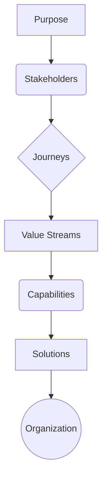

### 1. Context

In many established organizations, the architecture of both their technology and their teams is a product of history, not strategy. They build from the outside in: they start with the solutions they have (e.g., SAP, Salesforce, custom platforms), organize teams around those solutions, and then attempt to connect everything back to business goals as an afterthought. This approach produces technology-driven, rather than value-driven, systems. The result is often a massive, complex, and expensive IT landscape that no one can fully explain in terms of value creation. Decisions are made based on the constraints of existing tools rather than the needs of the mission. This creates a powerful inertia, where the organization's structure and capabilities are defined by past technology choices, making it difficult to adapt to new challenges or opportunities. The focus remains on optimizing the existing machine, rather than questioning if the machine is still fit for purpose.

### 2. Problem

> **The core conflict is Technology-First vs. Purpose-First Design.**

This tension manifests through several competing forces that pull organizations toward a reactive, technology-centric approach, even when they aspire to be purpose-driven.

1.  **Existing Investment vs. Ideal Architecture.** Organizations have massive sunk costs in current solutions, licenses, and the training invested in their workforce. Starting from purpose is a strategic threat because it may reveal that these significant investments are misaligned with the organization's actual goals, forcing a costly and politically difficult re-evaluation.

2.  **Concrete vs. Abstract.** Technology is tangible. You can see it, touch it, and measure its performance in clear metrics. Purpose, on the other hand, is often abstract, ambiguous, and subject to debate. Teams, especially technical ones, naturally gravitate toward the concrete, finding comfort in building and fixing what is clearly defined, rather than wrestling with the ambiguity of strategic intent.

3.  **Bottom-Up Reality vs. Top-Down Aspiration.** A purpose-first approach is inherently top-down, starting from the highest strategic level. However, real systems are often built and evolved bottom-up, driven by the daily operational needs and immediate problems faced by teams on the ground. This creates a disconnect where the grand strategy fails to connect with the practical realities of implementation, leading to cynicism and a lack of buy-in.

### 3. Solution

> **Therefore, structure all architectural and organizational modeling in a fixed, outward-flowing sequence: Purpose → Stakeholders → Journeys → Value Streams → Capabilities → Solutions → Organization.**

This sequence acts as a golden thread, ensuring that every element of the system justifies its existence by tracing its lineage directly back to the core purpose. It forces a logical and transparent cascade of decisions, making the architecture an explicit expression of the strategy.

-   **Solutions** (e.g., software, tools) exist only to enable **Capabilities**.
-   **Capabilities** (e.g., 'customer relationship management') exist only to power **Value Streams**.
-   **Value Streams** (e.g., 'order to cash') exist only to fulfill stakeholder **Journeys**.
-   **Journeys** (e.g., 'a customer purchasing a product') exist only to deliver value to **Stakeholders**.
-   **Stakeholders** are served because the **Purpose** dictates it.

Any entity within the architecture that cannot complete this chain back to the purpose is immediately flagged as a candidate for investigation. It is either misplaced, redundant, a sign of 'shadow IT', or it reveals an incomplete or inaccurate purpose definition that needs to be revisited. This rigorous, sequential logic transforms architecture from a technical exercise into a strategic one.

### 4. Implementation

Implementing Transformation Sequencing requires discipline and a shift in mindset away from solution-first thinking. It is an iterative process, but the sequence must be respected in each iteration.

1.  **Start with Purpose.** Begin every architectural or design session by reviewing and affirming the core purpose. This grounds the conversation and resists the powerful urge to immediately jump into discussing solutions or mapping existing systems. This step is non-negotiable.

2.  **Cascade Through Layers.** For each subsequent layer in the sequence (Stakeholders, Journeys, etc.), constantly ask the question: "What does this serve in the layer above?" and "What does this require from the layer below?" For example, when defining capabilities, you must be able to state which value stream they support.

3.  **Map Solutions Last.** The outermost layer, Solutions, should only be considered after the inner layers are well-defined. When mapping solutions, it is critical to link every single application, platform, or tool to the specific business capabilities it enables. If a solution does not support a required capability, its existence must be questioned.

4.  **Conduct Traceability Audits.** Regularly test the architecture's integrity. Pick any random solution or team and trace it back to the purpose. Can you connect it in 5-6 logical hops through the sequence? If the chain is broken or convoluted, it signals a misalignment that needs to be addressed.

5.  **Structure Narrative and Navigation.** Use this sequence as the default narrative structure for documenting and communicating the architecture. This creates a natural, logical flow that is easy for all stakeholders, technical and non-technical, to understand. Part I of a blueprint should always be the Purpose.

**Common Pitfalls:**
*   **Skipping Layers:** The most common mistake is skipping straight to Capabilities or Solutions because they feel more concrete and actionable. This breaks the chain of justification and leads back to a technology-first approach.
*   **Waterfall Misinterpretation:** Viewing the sequence as a rigid, one-way waterfall process. It is iterative. You may learn something at the Solutions layer that requires you to revisit and refine the Purpose, but you must always start the next iteration from the inside out.
*   **Ignoring the Human Element:** The final layer, Organization, is crucial. The architecture of the technology and the architecture of the teams that build and run it must be aligned. A perfectly sequenced technical architecture can fail if the organizational structure creates silos and friction.

### 5. Consequences

Adopting Transformation Sequencing has profound effects on an organization's clarity, efficiency, and adaptability.

**Benefits:**
*   **Strategic Alignment:** Every element of the system, from a single microservice to an entire department, has a clear and explicit justification that ties back to the organization's purpose. This eliminates orphaned projects and legacy systems that drain resources with no clear value.
*   **Improved Decision-Making:** It provides a clear framework for evaluating new ideas and technologies. The first question is no longer "What can we do with this new tool?" but "How does this help us better fulfill our purpose?"
*   **Enhanced Transparency and Communication:** The sequence creates a natural narrative structure that makes the entire system understandable to a wide range of stakeholders, fostering a shared understanding and breaking down silos between business and IT.

**Liabilities:**
*   **Initial Slowness:** The process can feel slow and frustrating for teams accustomed to rapid, technology-first development cycles. It requires patience and a commitment to strategic rigor over short-term wins.
*   **Surfacing Uncomfortable Truths:** The process will inevitably surface misaligned investments, pet projects, and organizational silos. This can create political resistance from those who have ownership over these legacy structures.

**When NOT to use this pattern:**
*   **Emergency Remediation:** In a crisis, such as a critical security vulnerability or system outage, the immediate priority is to fix the problem. A deep, purpose-driven analysis can wait until after the immediate fire is extinguished.
*   **Pure Technology Migration:** If the task is a pure like-for-like technology upgrade (e.g., migrating a database from one version to another) where the purpose and capabilities are not in question, a full sequencing exercise may be overkill. However, these migrations are often opportunities to ask if the system is still needed at all.

### 6. Known Uses

1.  **Philips Healthcare's Agile Transformation:** In 2022, the Philips EMR & CM informatics business unit was struggling with a traditional waterfall approach, leading to project delays and quality issues. By adopting the Scaled Agile Framework (SAFe), they shifted from a project-centric to a product-centric model. This transformation embodies the Transformation Sequencing pattern by forcing the organization to define value streams and connect their work back to the strategic purpose of improving patient and clinician outcomes. The implementation of Lean Portfolio Management was a key enabler, ensuring that investment decisions were aligned with strategic goals. The result was a significant improvement in financial performance, quality, and customer trust, demonstrating how a clear sequence from strategy to execution can drive success in a complex, regulated industry. [1]

2.  **Strategic Domain-Driven Design (DDD):** The principles of Domain-Driven Design, particularly strategic DDD, are a direct application of Transformation Sequencing in software engineering. Instead of letting the database schema or technical frameworks dictate the architecture, DDD insists that the software's structure should be derived from the business domain itself. A "Bounded Context," a core concept in DDD, is a clear boundary around a specific business capability (e.g., "Billing" or "Shipping"). By modeling these contexts first, based on the business's purpose and value streams, the resulting software architecture becomes a direct reflection of the business it serves. This prevents the common problem of technology-first design, where the business is forced to adapt to the constraints of the software. [2]

3.  **Simon Sinek's "Start With Why":** While not a technical framework, Simon Sinek's "Golden Circle" is a widely adopted mental model that perfectly captures the essence of Transformation Sequencing for leadership and communication. Sinek argues that the most influential leaders and organizations communicate from the inside out: starting with their "Why" (their purpose or belief), then moving to "How" (their unique process or value proposition), and finally to "What" (their products or services). This narrative structure ensures that every action and communication is grounded in a clear purpose, creating a much stronger connection with customers and employees than a "What"-first approach. It is a powerful example of applying the sequencing pattern to the domain of organizational culture and marketing.

### 7. Cognitive Era Considerations

The advent of AI and autonomous agents dramatically enhances the power and feasibility of applying Transformation Sequencing at scale.

-   **Automated Auditing:** Human-led traceability audits are time-consuming and often impractical in large, complex organizations. An AI agent, however, can be trained on the organization's architectural data and documentation. It can continuously and automatically trace every entity—every application, microservice, server, and even team—back through the sequence to test its connection to the core purpose. The agent can flag orphaned entities, broken links in the chain, and misalignments in real-time, presenting them on a dashboard for human review. This turns a periodic, manual audit into a continuous, automated process.

-   **Generative Architecture:** Agents can assist in the creative process of the sequence itself. Given a well-defined purpose and a set of stakeholders, an AI could propose potential value streams, capabilities, and even solution architectures that are inherently aligned. This moves the role of the human architect from a creator of detailed designs to a curator and refiner of AI-generated options, ensuring they are strategically sound and contextually appropriate.

-   **New Risks:** The primary new risk is the potential for 
flawed or biased data in the purpose definition being amplified at scale. If the initial purpose is poorly defined or reflects unconscious biases, an army of agents will diligently and efficiently build a perfectly aligned, but fundamentally flawed, system. Human judgment and ethical oversight at the Purpose layer become more critical than ever.

-   **Human-AI Collaboration:** In this new model, human architects focus on the 'why'—defining purpose, negotiating stakeholder needs, and making nuanced value judgments. AI agents focus on the 'how'—managing the complexity of the lower layers, ensuring alignment, and executing the implementation. This frees up human cognitive capacity for higher-level strategic thinking, but requires new skills in prompting, guiding, and supervising autonomous agents.

### References

[1] "Philips Healthcare Achieves Digital Excellence with SAFe," Scaled Agile. [https://scaledagile.com/case_study/philips/](https://scaledagile.com/case_study/philips/)

[2] "Domain-Driven Design Explained: A Real World Example," DEV Community. [https://dev.to/leapcell/domain-driven-design-explained-a-real-world-example-581j](https://dev.to/leapcell/domain-driven-design-explained-a-real-world-example-581j)
