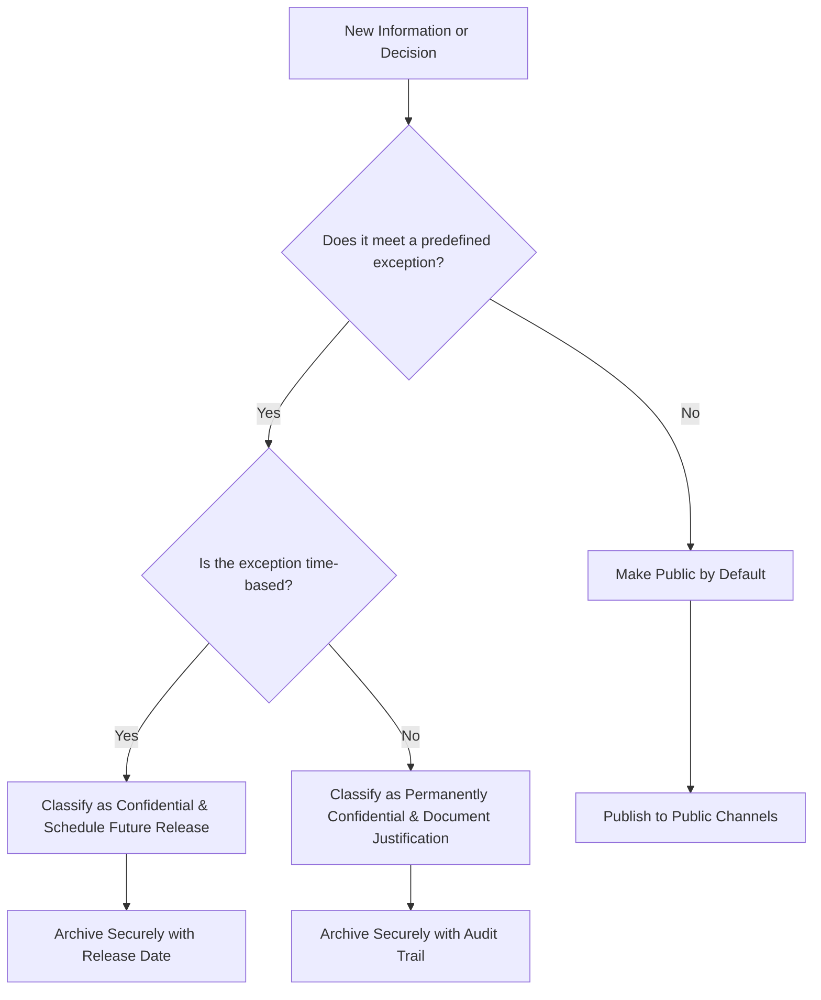

### 1. Context

In any collaborative endeavor, from a startup team to a multinational corporation, a city government to a distributed open-source project, the flow of information is the lifeblood of effective action and collective trust. Stakeholders—employees, citizens, users, investors, and partners—increasingly expect to understand the decisions that affect them. They demand a level of insight into operations, finances, and strategic direction that was once considered radical. This demand is not merely a desire for information; it is a fundamental requirement for establishing legitimacy and fostering a shared sense of purpose. However, organizations simultaneously face real pressures to maintain confidentiality. They must protect sensitive intellectual property, navigate delicate negotiations, ensure customer privacy, and maintain a competitive edge. This creates a natural and persistent tension. The default in most organizations, inherited from hierarchical and industrial-era models, is to operate with a closed posture, where information is shared only on a “need-to-know” basis. This opacity can breed mistrust, stifle innovation, and disengage the very people whose contributions are most needed for the commons to thrive. The problem is not a lack of desire for transparency, but the absence of a clear, principled framework for navigating the complex trade-offs between openness and the legitimate need for discretion.
### 2. Problem

> **The core conflict is Need for Secrecy vs. Demand for Accountability.**

This tension manifests as a set of competing forces that pull the organization in opposite directions. On one hand, there is a legitimate need for confidentiality in certain areas. On the other, there is a growing demand from stakeholders for transparency as a prerequisite for trust and participation. Navigating these forces is a critical challenge for any commons.

1.  **Force 1: Competitive Advantage vs. Community Collaboration.** Organizations often believe that proprietary information, secret roadmaps, and confidential data are key to maintaining a competitive edge. Releasing this information could expose them to rivals. However, this secrecy directly conflicts with the need to foster a collaborative ecosystem where partners, developers, and users can contribute meaningfully, which requires open access to information and plans.

2.  **Force 2: Risk Aversion vs. Trust Building.** Leaders may fear that transparency will expose mistakes, reveal internal disagreements, or lead to public relations crises. The instinct is to control the narrative by limiting information flow. This, however, undermines the very foundation of trust. Stakeholders are more likely to trust an organization that is open about its challenges and failures than one that projects an unrealistic image of perfection.

3.  **Force 3: Decision-Making Efficiency vs. Inclusive Governance.** A small, closed group can often make decisions more quickly. The process of consulting a wide range of stakeholders, sharing detailed information, and debating options in the open can be slow and cumbersome. Yet, this efficiency comes at the cost of legitimacy and buy-in. Decisions made in secret, even if they are sound, are often met with suspicion and resistance from those who were excluded from the process.
### 3. Solution

> **Therefore, establish a protocol of assumed openness, where all information is public by default unless it falls under a clear, predefined, and publicly documented exception.**

This pattern resolves the tension between secrecy and accountability by shifting the organizational default from closed to open. Instead of asking, "What should we make public?" the guiding question becomes, "Is there a compelling, predefined reason to keep this private?" This simple reversal has profound effects on culture and operations. The solution is not absolute transparency, but principled transparency.

The core mechanism is the creation and adoption of a formal **Transparency and Openness Protocol**. This is a living document, co-created and ratified by the commons stakeholders, that explicitly defines the categories of information that are exempt from immediate public disclosure. These exceptions are narrowly defined and typically include:

*   **Personal Privacy:** Information that would violate the privacy of individuals (e.g., personal contact details, health records).
*   **Security:** Information that, if disclosed, would create a direct and verifiable security risk to the organization or its members (e.g., server passwords, unpatched vulnerabilities).
*   **Legal and Contractual Obligations:** Information protected under non-disclosure agreements (NDAs), attorney-client privilege, or other legal constraints.
*   **Imminent Competitive Harm:** Highly sensitive strategic information where immediate disclosure would cause direct and significant harm, often with a specified embargo period after which it will be released.

For this protocol to function, it must be coupled with a clear process for information classification. Every document, decision, and significant data set is evaluated against the protocol. This process itself must be transparent; the justification for classifying information as confidential must be recorded and auditable.

Here is a diagram illustrating the decision flow:

By making the rules of transparency explicit, the protocol provides a predictable and fair framework. It builds trust not by revealing everything, but by being honest and accountable about what is kept private and why. It transforms the debate from an emotional tug-of-war into a rational process of applying shared principles.
### 4. Implementation

Adopting a Transparency & Openness Protocol is a significant cultural shift that requires careful planning and execution. It is not a one-time event but an ongoing practice. The following steps provide a roadmap for implementation.

1.  **Form a Cross-Functional Working Group:** The protocol cannot be imposed from the top down. Assemble a team with representatives from all key stakeholder groups: leadership, legal, engineering, marketing, community, etc. This group will be responsible for drafting, promoting, and iterating on the protocol.

2.  **Draft the Initial Protocol (Version 0.1):** Start by defining the core principles and the default-to-open stance. Then, collaboratively draft the specific, narrowly-defined exceptions. Use the categories in the Solution section as a starting point (Personal Privacy, Security, Legal, Imminent Harm). For each exception, provide clear examples of what is and is not covered.

3.  **Public Consultation and Ratification:** Share the draft protocol with the entire commons for feedback. Host open meetings, use online forums, and actively solicit input. This process is crucial for building buy-in and ensuring the protocol reflects the collective will. Revise the draft based on feedback and then hold a formal ratification process (e.g., a vote) to adopt it as official policy.

4.  **Develop Tooling and Processes:** The protocol needs to be embedded in the daily workflow. This may involve:
    *   **Information Classification Tools:** Simple tools (e.g., document templates with a classification field, tags in a project management system) that prompt authors to classify information at the moment of creation.
    *   **Public Channels:** Designate official channels for public information (e.g., a public blog, a specific section of the website, a public Discord server). Make it easy for everyone to know where to find public information.
    *   **Secure Archives:** Establish a secure, access-controlled system for storing information classified as confidential. This system must have a clear audit trail.

5.  **Train and Educate:** Conduct workshops and training sessions to ensure everyone understands the protocol and how to apply it. This is not just about rules; it's about teaching a new way of thinking about information. Share success stories of how transparency has led to positive outcomes.

**Key Considerations:**

*   **Start Small:** You don't need to be perfectly transparent overnight. Start with one department or one type of information (e.g., making all product roadmaps public) and expand from there.
*   **Leadership Buy-in:** The leadership team must not only support the protocol but actively model the desired behavior. When leaders are transparent about their own decisions and mistakes, it sends a powerful signal.
*   **The Right to be Wrong:** A culture of transparency requires psychological safety. People must feel safe to share work in progress, admit mistakes, and engage in open debate without fear of punishment.

**Common Pitfalls:**

*   **Malicious Compliance:** People may follow the letter of the protocol but not the spirit, finding loopholes to keep information private. This is a sign of a lack of trust and needs to be addressed at a cultural level.
*   **Transparency Theater:** The act of making large amounts of low-value data public while keeping the most important information secret. This erodes trust more than being honestly closed.
*   **Ignoring the Exceptions:** Failing to have clear, well-defined exceptions can be just as damaging as being too secretive. It can lead to legal liabilities, security breaches, or the loss of competitive advantage.
### 5. Consequences

Implementing a Transparency & Openness Protocol fundamentally alters the social and operational dynamics of a commons. The consequences are far-reaching, offering significant benefits but also introducing new challenges and liabilities.

**Benefits:**

*   **Increased Trust and Legitimacy:** By operating in the open and being accountable for what is kept private, the organization builds a deep and resilient foundation of trust with its stakeholders. This legitimacy is a critical asset, especially in times of crisis.
*   **Improved Decision-Making:** Publicly documenting decisions forces a higher degree of rigor and clarity. The need to justify choices to a broad audience often leads to better, more well-reasoned outcomes and surfaces flaws that would be missed in a closed process.
*   **Enhanced Innovation and Resilience:** When information flows freely, new connections are made, and opportunities for innovation emerge from unexpected places. A transparent organization can also tap into the collective intelligence of its community to solve problems and adapt to change more quickly.

**Liabilities:**

*   **Overhead and Reduced Velocity:** The process of classifying information, documenting decisions, and engaging in public consultation requires time and effort. This can slow down decision-making, especially in the short term, compared to a top-down, closed model.
*   **Risk of Misinterpretation:** Information released into the open can be taken out of context, misinterpreted, or used maliciously by competitors or critics. This requires a proactive communication strategy to frame information and address misunderstandings.
*   **Vulnerability to Bad Actors:** While transparency builds trust with good-faith actors, it can also be exploited by those who wish to harm the organization. A commitment to openness must be paired with robust security and a clear understanding of the threat landscape.

**When NOT to use this pattern:**

*   **Early-Stage Stealth Ventures:** A startup in a highly competitive market that is still developing its core innovation may need to operate in stealth mode for a period to avoid having its ideas stolen before it can establish a foothold. In this case, the protocol should be planned for, but its implementation delayed.
*   **Highly Regulated Environments with Strict Secrecy Mandates:** In fields like national security or certain types of financial trading, the legal and regulatory requirements for secrecy may be so extensive that a default-to-open protocol is simply not viable.
*   **Organizations with a Deeply Entrenched Culture of Secrecy:** If the leadership and culture are fundamentally opposed to transparency, a sudden attempt to impose this pattern will likely fail and may create significant internal conflict. In such cases, a more gradual, incremental approach to building trust is needed first.
### 6. Known Uses

This pattern, in various forms, has been successfully applied across different domains, demonstrating its power to build trust and foster collaboration. The core principle of "open by default" is a recurring theme in many successful modern organizations and governance structures.

*   **GitLab's Public Handbook:** The software company GitLab is a radical and well-documented example of this pattern in action. Their entire company handbook, which details everything from high-level strategy to minute operational processes, is public on the internet. Team meetings are often recorded and uploaded to a public YouTube channel. By making their operations transparent by default, GitLab has built a massive global community of contributors and a culture of extreme trust and accountability. Their success demonstrates that transparency can be a powerful competitive advantage in the tech industry, attracting top talent and fostering rapid innovation.

*   **Buffer's Transparent Salaries:** The social media management platform Buffer is famous for its policy of transparent salaries. The formula for calculating salaries and the actual salary of every employee, including the CEO, are publicly available. This was a bold move that challenged conventional corporate wisdom. The outcome was a significant increase in trust both internally among the team and externally with their customers and the wider tech community. It has become a cornerstone of their brand and a powerful tool for attracting talent that values fairness and openness.

*   **Estonia's e-Residency Program:** On a national scale, the Republic of Estonia has implemented a form of this pattern through its e-Residency program and its broader commitment to digital governance. By providing a secure digital identity and making government data and services transparently accessible online, Estonia has created a "digital nation" built on trust and efficiency. This openness has attracted thousands of entrepreneurs from around the world to start and run businesses in a highly transparent and low-bureaucracy environment. It shows that the principles of transparency and openness can be applied to the governance of a nation-state, fostering economic growth and a global community.
### 7. Cognitive Era Considerations

In an era increasingly shaped by artificial intelligence and autonomous agents, the Transparency & Openness Protocol takes on new dimensions of complexity and importance. The presence of non-human actors in the commons requires a fundamental rethinking of how information is shared, classified, and audited. AI can be both a powerful tool for implementing this pattern and a significant new source of opacity.

On one hand, AI agents can dramatically enhance the implementation of this protocol. Autonomous agents can be tasked with the continuous and real-time classification of information. An AI could automatically scan every new document, code commit, or dataset, flag it against the predefined exceptions in the protocol, and route it to the appropriate public channel or secure archive. This automates the most labor-intensive part of the process, reducing human overhead and ensuring consistent application of the rules. Furthermore, AI-powered auditing tools can constantly monitor information flows, detect anomalies, and provide real-time assurance that the protocol is being followed, creating a level of accountability that is difficult to achieve with manual processes alone.

However, the cognitive era also introduces new risks. The very models that power these agents can be opaque black boxes. If an AI agent makes a decision to classify a piece of information as confidential, the reasoning behind that decision may not be easily understandable by humans. This creates a new form of opacity, where the rules are public, but their application by a machine is inscrutable. This risk necessitates the development of “explainable AI” (XAI) for governance tasks and the establishment of human-in-the-loop oversight mechanisms for all automated classification decisions.

This pattern becomes crucial for governing the AI agents themselves. For a commons to trust an autonomous agent, the agent's decision-making processes, its training data, and its operational history must be subject to the Transparency & Openness Protocol. The protocol must be adapted to require transparency not just of human actions, but of machine actions as well. This might include making the agent's source code open, publishing its training datasets, and maintaining a public, immutable log of its decisions. In the cognitive era, the protocol is not just about human-to-human trust; it is about establishing the foundation for human-machine and machine-to-machine trust within the commons.
