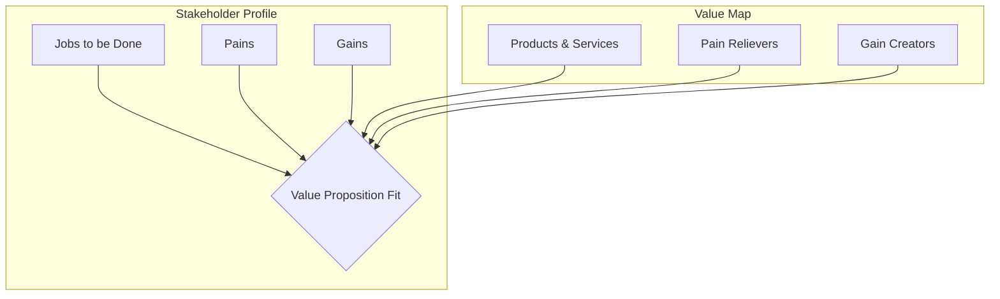

### 1. Context

In any system designed to serve people—be it a multinational corporation, a city government, a grassroots activist movement, or a decentralized software protocol—there exists a fundamental exchange of value. The system provides something, and its stakeholders receive something in return. The problem is that this exchange is often implicit, assumed, or poorly understood. Organizations, especially as they scale, tend to develop an internal focus. They become experts on their own activities, capabilities, products, and services. They celebrate their technical achievements and operational efficiencies, but in doing so, they can lose sight of a fundamental question: why does any of it matter to the people they exist to serve? This creates a growing chasm between the system's stated purpose and the actual, lived experience of its diverse stakeholders. Without a clear, shared, and explicit understanding of the value being offered, its creation becomes a matter of chance. Some stakeholders might find immense value, while others are underserved, ignored, or even actively exploited. This pattern provides a crucial bridge, a structured and repeatable method for ensuring that a system is not just busy, but busy creating meaningful, intentional value for all the stakeholders it depends on.

### 2. Problem

> **The core conflict is Provider Capability vs. Stakeholder Need.**

This central tension is not a simple disagreement but a deep-seated conflict that manifests through several powerful and competing forces:

1.  **Provider-centricity vs. Stakeholder-centricity:** The gravitational pull of an organization is inward. Teams are organized around internal functions (engineering, marketing, finance), and success is often measured by internal metrics (features shipped, campaigns launched, revenue booked). This "inside-out" perspective inevitably shapes how value is perceived and communicated. The result is a value proposition that reads like a technical specification sheet—a list of features, capabilities, and processes. It describes what the organization *does*, not what the stakeholder *gets*. The language is that of the provider, forcing the user to do the cognitive work of translating features into benefits.

2.  **Economic Tunnel Vision vs. Multi-dimensional Value:** The legacy of industrial-era business thinking has left us with a default definition of value that is overwhelmingly economic. Value is seen as money, efficiency, or transactional benefit. Yet, especially within the context of a commons, stakeholders experience a much richer tapestry of value. They seek social connection, the acquisition of knowledge and skills, the preservation of ecological health, a sense of personal agency and autonomy, and the resilience that comes from being part of a strong community. A myopic focus on purely economic value not only misses these crucial dimensions but can actively undermine them, leading to systems that are financially profitable but socially and ecologically extractive.

3.  **The Promise-Delivery Gap:** A value proposition is, at its heart, a promise. When crafted well, it can be a powerful force for aligning teams, attracting users, and building momentum. However, if this promise is not deeply and structurally connected to the underlying mechanisms of delivery, it becomes hollow—nothing more than marketing rhetoric. An inspiring statement about "empowering communities" is rendered meaningless if the system lacks the value streams, operational capabilities, and governance processes to make that empowerment a tangible reality. This gap between the declared promise and the delivered experience is a primary source of stakeholder disillusionment and system failure.

### 3. Solution

> **Therefore, for each stakeholder group, articulate explicit value propositions across multiple value dimensions, and link each proposition to the delivery mechanisms that fulfill it.**

This solution is not about crafting a clever tagline; it is a rigorous design process. It involves systematically deconstructing the world of the stakeholder and then reconstructing the system's offerings to align with that world. The most effective tool for this is the **Value Proposition Canvas**, which forces a disciplined shift in perspective. It is composed of two sides: the Stakeholder Profile and the Value Map.

The **Stakeholder Profile** demands a deep, empathetic understanding of the user. It moves beyond simple demographics to map their core functional, social, and emotional **"Jobs to be Done."** It requires cataloging their **"Pains"**—the frustrations, obstacles, risks, and negative emotions they encounter. And it pushes for an articulation of their **"Gains"**—the desired outcomes, benefits, and aspirations they hold.

Only after this deep dive into the stakeholder's reality does the focus turn to the **Value Map**. Here, the system's **"Products & Services"** are listed. Then, in direct response to the stakeholder's profile, the team designs **"Pain Relievers"** that explicitly address the identified pains, and **"Gain Creators"** that specifically enable the desired gains. The magic of the process is in achieving a clear "fit" between these two sides. This forces a crucial shift from a provider-centric monologue to a stakeholder-centric dialogue. It moves beyond a simple description of what a service *is* to a nuanced, compelling story about what it *does* for the user. By explicitly considering multiple dimensions of value—economic, social, ecological, knowledge, and resilience—the resulting value propositions become far richer, more authentic, and more deeply aligned with the holistic needs of the commons.

### 4. Implementation

Implementing Value Proposition Design is a structured process that requires empathy, research, and collaboration. The following steps provide a practical guide:

1.  **Select and Prioritize Stakeholder Groups:** Begin by referencing your Stakeholder Architecture. You cannot design for everyone at once. Select a primary stakeholder group to focus on first. This might be your most critical user, a neglected community member, or a key partner. Create a separate Value Proposition Canvas for each group you analyze.

2.  **Conduct Empathetic Research to Build the Profile:** This is the most critical step. Go beyond assumptions and engage directly with the chosen stakeholder group. Conduct interviews, run surveys, observe them in their natural environment. Your goal is to uncover:
    *   **Jobs to be Done:** What are the fundamental tasks they are trying to accomplish? What functional, social, and emotional goals are they pursuing?
    *   **Pains:** What are the biggest frustrations, obstacles, and risks they face before, during, and after getting their jobs done? What makes them feel bad?
    *   **Gains:** What are the outcomes and benefits they are seeking? What would make them happy? This includes required gains (the basics), expected gains (what they've come to expect), desired gains (what they'd love to have), and unexpected gains (brand new possibilities).

3.  **Map Your System's Value Proposition:** With a clear stakeholder profile, turn your focus inward. Be brutally honest.
    *   **Products & Services:** List all the offerings you provide that are relevant to this stakeholder group.
    *   **Pain Relievers:** For each pain you identified, explicitly describe how your offerings alleviate it. Don't just list a feature; explain the mechanism of relief.
    *   **Gain Creators:** For each gain, describe how your offerings produce that outcome. How do you help them achieve their aspirations?

4.  **Find the Fit and Test It:** The moment of truth is achieving a clear "fit" between the profile and the map. Do your pain relievers and gain creators address the most significant pains and gains of your stakeholders? Are you creating value where it matters most? Formulate your value proposition as a clear, concise statement and then get out of the building to test it. Present it to stakeholders. Does it resonate? Is it believable? Is it compelling?

5.  **Expand to Multi-dimensional Value:** Intentionally push beyond the purely economic. Ask how your system creates:
    *   **Social Value:** Fostering connections, building community, enhancing reputation.
    *   **Knowledge Value:** Facilitating learning, providing data and insights, enabling new skills.
    *   **Ecological Value:** Reducing negative impacts, regenerating resources, promoting sustainability.
    *   **Resilience Value:** Increasing adaptability, providing stability, reducing risk.

6.  **Connect to Delivery Mechanisms:** A value proposition is only as good as its delivery. For each element of your value proposition, map it to the specific **Value Streams** and **Journeys** that bring it to life. If you promise "effortless collaboration," you must be able to point to the exact features, processes, and user flows that make it so. This step grounds your promises in operational reality.

7.  **Establish a Rhythm of Iteration:** Value propositions are not static artifacts to be framed on a wall. They are living hypotheses that must be continuously tested, refined, and adapted as stakeholder needs evolve and the market environment changes. Establish a regular cadence for reviewing and updating your Value Proposition Canvases.

### 5. Consequences

**Benefits:**
-   **Profound Clarity and Strategic Alignment:** The process forces difficult conversations and creates a single, shared understanding of who the system serves and why it matters. This clarity becomes the bedrock for strategic decision-making, aligning everything from product development to marketing communications.
-   **Radical Stakeholder-centricity:** It systematically shifts the organization's focus from its own navel to the world of its stakeholders. This fosters a culture of empathy and responsiveness, leading to products and services that are not just technically proficient but genuinely useful and desirable.
-   **De-risked Innovation and Prioritization:** By grounding decisions in the validated needs of stakeholders, the pattern provides a powerful framework for prioritizing new initiatives. It helps teams focus their limited resources on building things that people actually want, dramatically reducing the risk of building products and services that fail in the market.

**Liabilities:**
-   **The Illusion of Simplicity:** The canvas is a beautifully simple tool, but this simplicity can be deceptive. There is a significant risk of treating it as a superficial box-ticking exercise, filling it out with unvalidated assumptions rather than deep research. A poorly researched canvas is worse than none at all, as it creates a false sense of confidence.
-   **The Burden of Expectation:** Crafting and communicating an explicit value proposition is a powerful act. It sets clear expectations with stakeholders. If the organization cannot consistently deliver on this promise, it can lead to significant disillusionment, loss of trust, and reputational damage. The promise must be backed by delivery.

**When NOT to use this pattern:**
-   This pattern is less suitable for ventures in the earliest, most chaotic stages of discovery, where the core problem and even the target stakeholder are still highly uncertain. In these pre-product/market fit scenarios, a more exploratory, experimental approach like the Lean Startup methodology's "problem/solution interview" cycle is more appropriate. Value Proposition Design is most powerful once a specific problem area and stakeholder group have been identified, and the goal is to refine and formalize the solution.

### 6. Known Uses

-   **Stripe:** The global financial technology company provides a masterclass in a clear, developer-focused value proposition. For its core audience of software developers and online businesses, the promise is simple: powerful, flexible, and easy-to-use APIs for accepting payments and managing financial infrastructure. Stripe relentlessly relieves the immense pain of dealing with traditional banking systems, complex payment gateway integrations, and global compliance. The gain they create is not just about processing transactions, but about enabling developers to build new business models and scale globally with ease. Their documentation, developer support, and product design are all in service of this core promise.

-   **Fairphone:** This Dutch social enterprise designs and produces smartphones with a radically different value proposition. While most phone manufacturers compete on camera quality or processing speed, Fairphone competes on ethics and sustainability. Their value proposition addresses the growing pain points of consumers concerned about electronic waste, opaque supply chains, and labor exploitation. They create the gain of owning a high-quality, modular, and easily repairable device that is made with fairer, more sustainable materials. This value proposition appeals to a specific segment of the market for whom the ethical and ecological dimensions of their purchase are as important as the technical specifications.

-   **The Food Assembly (La Ruche qui dit Oui!):** This European network of local food communities provides a powerful two-sided value proposition. For consumers, it relieves the pain of not knowing where their food comes from and the inconvenience of finding high-quality, local produce. It creates the gain of direct access to fresh, seasonal food and a tangible connection to the people who grow it. For farmers and food producers, it relieves the pain of low margins and lack of power when dealing with large supermarket chains. It creates the gain of a fair price for their products, a predictable sales channel, and a direct, appreciative relationship with their customers. The entire platform is designed to facilitate this multi-dimensional value exchange.

### 7. Cognitive Era Considerations

In the cognitive era, the Value Proposition Design pattern is not becoming obsolete; it is being supercharged. The rise of AI and autonomous agents provides powerful new tools for every stage of the process, while also introducing new challenges and ethical considerations.

**Augmented Research and Insight:** AI can dramatically accelerate and deepen the research phase. Machine learning models can be trained to analyze vast, unstructured datasets—from customer support tickets and call transcripts to social media conversations and product reviews—to identify emergent stakeholder jobs, pains, and gains at a scale and speed unattainable by human researchers. This allows for a more continuous and data-rich understanding of the stakeholder's world.

**Generative Ideation and Prototyping:** Generative AI can act as a powerful brainstorming partner. Once a stakeholder profile is established, large language models can be prompted to generate a wide array of potential pain relievers, gain creators, and even draft value proposition statements tailored to different segments. This can help teams break free from their own biases and explore a wider solution space.

**Real-time Monitoring and Adaptation:** In the cognitive era, the value proposition is no longer a static statement but a dynamic one. AI agents can be deployed to monitor the fulfillment of the value proposition in real-time. By tracking key performance indicators, analyzing user behavior, and processing sentiment data, these agents can provide a continuous feedback loop, alerting the system to any gaps that emerge between the promised value and the delivered experience. This enables a much more agile and responsive approach to value management.

**New Risks and Human Judgment:** However, this increased reliance on AI is not without risk. An over-reliance on AI-generated insights could lead to a loss of genuine human empathy, the subtle understanding that comes from direct, personal interaction. There is also a significant ethical risk in using AI to micro-target and manipulate stakeholder perceptions of value. The ultimate judgment of what constitutes meaningful, ethical, and sustainable value must remain a fundamentally human-centric decision. The role of the designer shifts from being the sole source of insight to being the curator of AI-generated possibilities and the guardian of the stakeholder's true interests. AI augments, but does not replace, the need for human wisdom and ethical oversight. The most powerful application of this pattern in the cognitive era will be in creating human-AI systems that work together to create more value for all stakeholders. 
