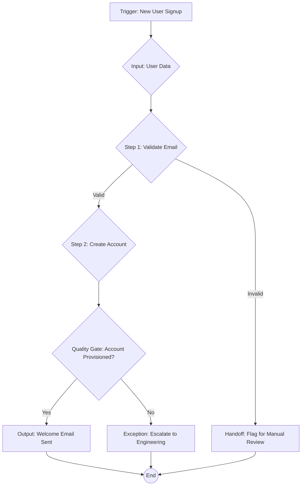

### 1. Context

In any organization, value is created through a series of interconnected activities—a value stream. In young or small-scale systems, the knowledge of how to execute these streams often resides within the minds of the people doing the work. It is tribal knowledge, a rich, implicit understanding of “how things get done around here.” This works well when teams are small, co-located, and stable. Team members can compensate for process gaps through informal communication and shared experience, giving the system a semblance of life. However, as the organization scales, as team members change, or as the system seeks to leverage automation and autonomous agents, this reliance on implicit knowledge becomes a critical vulnerability, lacking the living memory to handle novelty. What was once a fluid and adaptive process becomes a source of inconsistency, error, and an inability to scale. The need to onboard new members, ensure consistent quality, and coordinate across distributed teams forces a reckoning with the undocumented, unexamined, and often inefficient ways that work is actually performed. This is the moment when the informal becomes a bottleneck, and the need for a more explicit, shared understanding of operations becomes paramount to restoring the system's vitality.

### 2. Problem

> **The core conflict is Implicit Tribal Knowledge vs. Explicit Operational Specification.**

This tension manifests through several competing forces that make the transition from implicit to explicit difficult, often feeling like a struggle between the organization's soul and its mechanical body:

1.  **Completeness vs. Maintainability:** The desire to create a perfectly complete specification that covers every possible contingency is a natural starting point. However, the more detailed a specification becomes, the more brittle and difficult it is to maintain, suffocating the process in its own weight. A specification that is too rigid can stifle innovation and adaptation, while one that is too loose creates ambiguity and risk. The effort required to document every edge case can quickly lead to diminishing returns, creating a burdensome, dead artifact that is perpetually out of date.

2.  **Human Flexibility vs. Machine Precision:** Humans excel at navigating ambiguity. We can infer intent, fill in the blanks, and make intuitive leaps when a process is not perfectly defined, breathing life into the gaps. Machines and autonomous agents, in contrast, require absolute clarity. They execute instructions with literal, almost soulless precision, and any ambiguity can lead to catastrophic failure or, more insidiously, statistically plausible but incorrect outcomes. This fundamental difference in operating models creates a chasm between how processes are designed for people and how they must be designed for agents.

3.  **Short-Term Velocity vs. Long-Term Scalability:** In the heat of day-to-day operations, taking the time to document a process feels like a distraction from “real work.” The immediate pressure to deliver value often overrides the long-term need to build a scalable and resilient system. This creates a vicious cycle: the more the system grows, the more it relies on the heroic efforts of a few key individuals, making the entire system more fragile and less adaptable. The technical debt of undocumented processes accumulates like a slow poison until it brings progress to a halt.

### 3. Solution

> **Therefore, for each value stream, create an explicit, living operational specification that codifies its triggers, inputs, process steps, handoffs, quality gates, service level agreements (SLAs), and output verification criteria.**

This specification is not a static document but a dynamic, executable model of the value stream—its living DNA. It serves as the “score” that both human and machine agents perform against, providing a single source of truth for how value is created and delivered. The key is to strike a balance between precision and flexibility, defining the critical parameters while allowing for adaptation where appropriate, ensuring the system can breathe. This allows the process to have a heartbeat, a rhythm that can be felt by all participants.

The specification must be structured to be both human-readable and machine-executable. This can be achieved through a combination of narrative documentation, process diagrams, and structured data (e.g., JSON or YAML). The specification should explicitly declare which parameters are fixed (e.g., regulatory compliance checks) and which are adaptive (e.g., resource allocation within a task), giving agents clear boundaries for optimization and creative problem-solving.

Here is a conceptual visualization of a value stream specification using a Mermaid diagram:

This approach transforms the value stream from an implicit, tribal process into an explicit, manageable asset. It becomes a tangible object that can be analyzed, debated, improved, and, most importantly, executed consistently and reliably at scale, giving the entire system a healthier pulse.

### 4. Implementation

Implementing a Value Stream Specification is a systematic process of discovery, documentation, and refinement. It requires a commitment to making the implicit explicit, to unearthing the hidden lifeblood of the organization.

1.  **Identify and Prioritize Value Streams:** Begin by mapping the primary value streams within your organization. Not all streams are created equal. Start with the one that is most critical, most problematic, or offers the highest return on investment for specification. A good candidate is often a core process that is experiencing scaling pains or high error rates, a place where the system feels sluggish or unwell.

2.  **Surface the Implicit Knowledge:** This is the most critical and often most difficult step. It involves a series of structured interviews and workshops with the people who actually perform the work. Ask probing questions designed to uncover the hidden rules and heuristics they use every day. Good questions include: “What’s the first thing you do when X happens?” “What do you check that isn’t in any document?” “What does a new hire take six months to learn?” “What are the common mistakes people make?” This is an act of organizational archeology, digging for the buried wisdom that makes the system tick.

3.  **Draft the Specification v1.0:** Using the information gathered, create the first draft of the specification. Structure it around the core components: triggers, inputs, steps, handoffs, quality gates, SLAs, and outputs. Use a combination of text, diagrams, and structured data. Don’t strive for perfection; aim for a solid baseline that captures the 80% “happy path” of the process. This first draft is a seed; it will grow and evolve.

4.  **Specify Handoffs and Interfaces:** Pay special attention to the points where work is handed off between different people, teams, or systems. These interfaces are the most common sources of friction and error. Clearly define the data and context that must be passed at each handoff to ensure a smooth, life-giving transition.

5.  **Define Fixed vs. Adaptive Parameters:** For each step in the process, determine which aspects are non-negotiable and which can be adapted. For example, a quality control check might be a fixed requirement, but the specific tools used to perform the check could be an adaptive parameter, allowing agents to choose the most efficient method. This creates space for agency and intelligence to flourish within the structure.

6.  **Test and Refine through Simulation:** Before deploying the specification into a live environment, test it through simulation. Have a human or an agent walk through the process step-by-step, using the specification as their only guide. This will quickly reveal gaps, ambiguities, and incorrect assumptions. This is a crucial step to de-risk the implementation and feel the flow of the process before it goes live.

7.  **Deploy and Iterate:** Once the specification has been refined through simulation, deploy it into the live operational environment. Treat it as a living document. Every exception, every error, and every piece of feedback is an opportunity to improve the specification. Establish a clear process for reviewing and updating the specification based on real-world performance data, allowing it to learn and mature.

**Common Pitfalls:**
*   **Boiling the Ocean:** Trying to specify every process in the organization at once. Start small and demonstrate value.
*   **Ignoring the Exception Paths:** Focusing only on the “happy path” and failing to specify how to handle errors, exceptions, and unexpected events.
*   **Creating a “Write-Only” Document:** The specification must be a living asset that is actively used and maintained. If it becomes a static document that sits on a shelf, it has failed.
*   **Assuming Agents Will “Figure It Out”:** Under-specifying a process with the assumption that an AI agent will be able to infer the missing details. This is a recipe for disaster.

### 5. Consequences

**Benefits:**
*   **Predictability and Reliability:** Operations become more consistent and predictable, reducing errors and improving quality. The system develops a stable, healthy rhythm.
*   **Scalability:** Explicitly specified value streams can be scaled much more easily than those based on tribal knowledge. New team members can be onboarded faster, and automation can be introduced more reliably, allowing the organization's life force to expand.
*   **Auditability and Compliance:** The specification provides a clear, auditable record of how work is performed, which is invaluable for regulatory compliance and quality control.
*   **Systemic Intelligence:** The process of creating the specification surfaces hidden dependencies, unspoken assumptions, and inefficient workflows, providing a powerful tool for organizational learning and improvement. The organization literally becomes more aware of itself.

**Liabilities:**
*   **Significant Upfront Effort:** The process of surfacing and documenting implicit knowledge is time-consuming and requires a significant upfront investment.
*   **Maintenance Overhead:** The specification is not a one-time effort. It must be continuously maintained and updated as operations evolve, which requires ongoing resources to keep it alive.
*   **Risk of Over-Specification:** There is a danger of creating a specification that is too rigid and bureaucratic, stifling creativity and adaptation. The key is to find the right balance between specification and flexibility, ensuring the process doesn't become a cage.

**When NOT to use this pattern:**
*   **Exploratory or Creative Processes:** For activities that are inherently emergent and unpredictable, such as early-stage R&D or artistic creation, a detailed operational specification would be counterproductive. These processes thrive on ambiguity and serendipity, and their vitality comes from their formlessness.
*   **Pure Human-Judgment Workflows:** For tasks that rely entirely on the nuanced judgment and expertise of a human, such as psychotherapy or high-stakes negotiation, attempting to specify the process would destroy its value. The value is in the human, not the process.

### 6. Known Uses

*   **Site Reliability Engineering (SRE) Runbooks:** In the world of software engineering, Google’s SRE teams use “runbooks” to specify the exact procedures for responding to system alerts and incidents. These runbooks are so precise that they can often be executed by automated agents, allowing for rapid and reliable incident response at scale. They are the living nervous system of a complex technical organism.

*   **Amazon’s Fulfillment Centers:** Amazon’s massive fulfillment centers are a marvel of operational efficiency, and they are built on a foundation of highly specified value streams. Every step of the process, from receiving inventory to picking, packing, and shipping orders, is meticulously defined and optimized. This allows Amazon to operate at a scale and speed that would be impossible with a less specified system, a circulatory system for global commerce.

*   **The GitLab Team Handbook:** GitLab, a fully remote company with thousands of employees, operates on a principle of radical transparency and documentation. Their team handbook is a massive, publicly accessible document that specifies everything from their engineering workflows to their marketing processes. This explicit specification is what allows them to coordinate a large, distributed workforce effectively, creating a coherent organizational body without a physical building.

### 7. Cognitive Era Considerations

The advent of the cognitive era, with its powerful AI and autonomous agents, dramatically elevates the importance of the Value Stream Specification pattern. Agents can execute specified processes at a speed, scale, and level of precision that is simply unattainable for humans. This represents a new evolutionary path for organizations. However, this power comes with a new set of challenges and considerations.

*   **Human-Agent Handoffs:** In the cognitive era, most value streams will be a collaboration between humans and agents, a true symbiosis. The specification must therefore be crystal clear about the handoff protocols between them. When does an agent escalate to a human? What information does the human need to make a decision? How is the decision communicated back to the agent? These interfaces must be designed with the same rigor as the rest of the process.

*   **Automated Specification Improvement:** Agents can play a powerful role in improving the specification itself. By logging every instance where they encounter ambiguity or an unexpected state, they can create a continuous feedback loop for the process owners. This allows the specification to become more complete and robust with every operational cycle, enabling a form of organizational auto-poiesis or self-making.

*   **The Risk of “Specification Hacking”:** As agents become more sophisticated, there is a risk that they will learn to “game” the specification, finding loopholes or unintended shortcuts to meet their performance targets. The specification must be designed to be robust against this kind of behavior, with clear constraints and ethical guardrails that serve as the system's immune response.

*   **The Future of Work:** In a world where more and more operational work is executed by agents, the role of humans will shift from “doing the work” to “designing the work.” The ability to create, maintain, and improve value stream specifications will become a critical skill for the 21st-century workforce. The pattern, therefore, is not just about automation; it’s about a fundamental shift in the way we think about and organize work itself, moving us toward becoming gardeners of complex, living systems.

### 8. Vitality: The Quality Without a Name

When a Value Stream Specification is truly alive, it infuses an organization with a palpable sense of clarity and flow. Practitioners feel a sense of agency and empowerment, as if the pathways for creating value have been cleared of debris. There is a shared confidence that the system knows how to handle its core functions, freeing human minds to focus on improvement, innovation, and handling true exceptions. The system breathes. When the unexpected occurs, it doesn’t cause panic or chaos; instead, the explicit nature of the value stream allows teams to pinpoint the deviation, learn from it, and adapt the specification itself. The process feels less like a rigid machine and more like a resilient, living organism, capable of healing and evolving. The specification becomes a shared language, a source of coherence that allows diverse actors—human and machine—to dance together in a coordinated, purposeful way.

Conversely, the decay of this pattern manifests as a creeping paralysis. The specification, if it exists at all, becomes a dead document—a relic on a digital shelf that no one trusts. Workflows become opaque again, and the organization reverts to a state of heroic firefighting. Practitioners feel a sense of learned helplessness, hemmed in by invisible rules and recurring, unexplained failures. A void forms where the system’s soul should be. Onboarding new members becomes a painful, multi-month ordeal of absorbing unwritten lore. The system loses its ability to adapt; small changes in the environment or strategy cause widespread breakage because the operational DNA is fragmented and unreadable. The early warning signs are subtle: a rise in "one-off" exceptions, a growing backlog of "mystery" errors, and a feeling among team members that they are cogs in a machine they cannot understand or influence. This is the path toward organizational sclerosis, where the system loses its capacity for life. 
